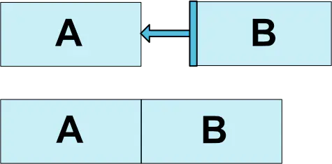
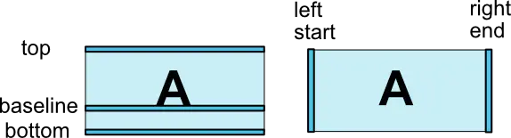
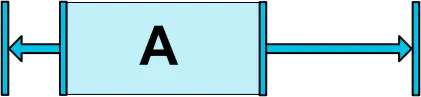
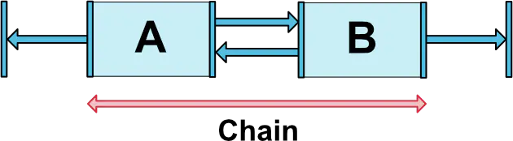
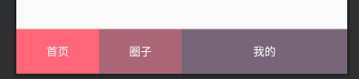
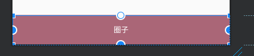
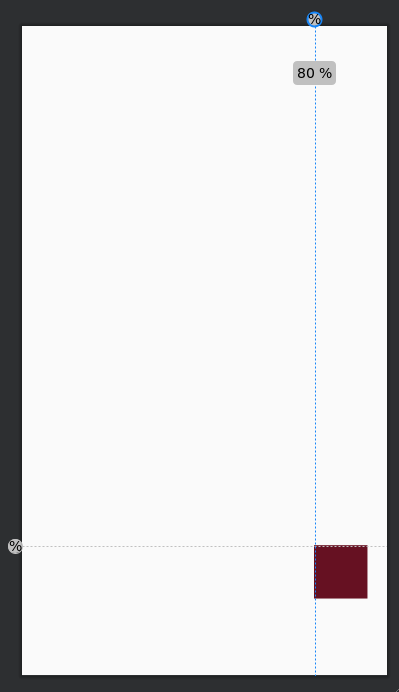
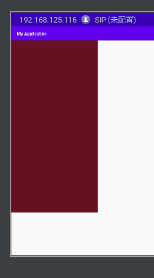

ConstraintLayout 使用

[官方文档](https://developer.android.google.cn/reference/androidx/constraintlayout/widget/ConstraintLayout?hl=zh)

1. layout_constraintDimensionRatio使用
> 指定宽高比或者高宽比`dimensionRatio`，具体是什么比例看`layout_width`或者`layout_height`哪个为0，其中一个为0，另一个是x,那么那个为0 的值为dimensionRatio*x；
> H,16:9  dimensionRatio=9/16
> w,16:9  dimensionRatio=16/9
> 例如：
> ```
> android:layout_width="0dp"
> android:layout_height="60dp"
> app:layout_constraintDimensionRatio="16:9"
> ```
> 不加w或者h，默认为w，所以dimensionRatio=16/9；因为width=0,height=60，所以width=dimensionRatio=height*dimensionRatio
> 
> `layout_width`或者`layout_height`都为0时，如果是layout_constraintTop_toBottomOf和layout_constraintTop_toTopOf标明了，那比例就是layout_constraintDimensionRatio的值，如果layout_constraintLeft_toLeftOf与layout_constraintRight_toRightOf标明了，那比列是layout_constraintDimensionRatio倒数。最后再根据已知的值（如果左右标记了，那width是知道的，如果上下标记了，那height的值是已知的。），算出另一个值。


```
<?xml version="1.0" encoding="utf-8"?>
<androidx.constraintlayout.widget.ConstraintLayout xmlns:android="http://schemas.android.com/apk/res/android"
    xmlns:app="http://schemas.android.com/apk/res-auto"
    xmlns:tools="http://schemas.android.com/tools"
    android:layout_width="match_parent"
    android:layout_height="match_parent"
    tools:context=".MainActivity">


    <!--指定高度，宽度随着宽高比自适应 -->
    <!--app:layout_constraintDimensionRatio="16:9"  W: 默认，表示宽高比-->
    <TextView
        android:id="@+id/text_01"
        android:layout_width="0dp"
        android:layout_height="60dp"
        android:background="#B0E46E"
        android:text="text_01"
        app:layout_constraintDimensionRatio="16:9"
        app:layout_constraintLeft_toLeftOf="parent" />

    <!--指定高度，宽度随着宽高比自适应 -->
    <!--app:layout_constraintDimensionRatio="H,16:9"  H: 表示高宽比-->
    <TextView
        android:id="@+id/text_02"
        android:layout_width="0dp"
        android:layout_height="60dp"
        android:background="#AA4727"
        android:text="text_02"
        app:layout_constraintDimensionRatio="H,16:9"
        app:layout_constraintLeft_toLeftOf="parent"
        app:layout_constraintTop_toBottomOf="@+id/text_01" />

    <!--指定宽度，按照宽度来计算高宽比，默认是宽高比 -->
    <TextView
        android:id="@+id/text_03"
        android:layout_width="60dp"
        android:layout_height="0dp"
        android:background="#F6BE4F"
        android:text="text_03"
        app:layout_constraintDimensionRatio="16:9"
        app:layout_constraintLeft_toLeftOf="parent"
        app:layout_constraintTop_toBottomOf="@+id/text_02" />

    <!--指定宽度，按照宽度来计算高宽比  W:表示高宽比 -->
    <TextView
        android:id="@+id/text_04"
        android:layout_width="60dp"
        android:layout_height="0dp"
        android:background="#CA4B45"
        android:text="text_04"
        app:layout_constraintDimensionRatio="W,16:9"
        app:layout_constraintLeft_toLeftOf="parent"
        app:layout_constraintTop_toBottomOf="@+id/text_03" />

    <!--android:layout_width="0dp"  0dp表示充满父控件或说是充满其余空间-->
    <TextView
        android:layout_width="0dp"
        android:layout_height="0dp"
        android:background="#CFDEF9"
        android:text="text_05"
        app:layout_constraintDimensionRatio="3"
        app:layout_constraintLeft_toLeftOf="parent"
        app:layout_constraintRight_toRightOf="parent"
        app:layout_constraintTop_toBottomOf="@+id/text_04" />


</androidx.constraintlayout.widget.ConstraintLayout>
```
2. 相对位置属性使用
> layout_constraint[自身控件位置]_[目标控件位置]="[目标控件ID]"，如果id是父布局的id，可以使用parent





```
//使用 
app:layout_constraintLeft_toRightOf="@+id/buttonA"
该View的左侧在target(buttonA)的右侧。经测试layout_constraintRight_toRightOf与layout_constraintLeft_toRightOf效果一样。
//其他
layout_constraintLeft_toLeftOf: 
layout_constraintLeft_toRightOf
layout_constraintRight_toLeftOf
layout_constraintRight_toRightOf
layout_constraintTop_toTopOf
layout_constraintTop_toBottomOf
layout_constraintBottom_toTopOf
layout_constraintBottom_toBottomOf
layout_constraintBaseline_toBaselineOf
layout_constraintStart_toEndOf
layout_constraintStart_toStartOf
layout_constraintEnd_toStartOf
layout_constraintEnd_toEndOf
```

3. goneMargin 属性

> goneMargin属性是指目标控件GONE掉之后，自身控件可以设置个margin值。不过margin的方向需要和控件的相对位置的方向保持一致。
> 假设我们有这样一个需求：A设置为gone后，B需要距离父布局的左侧200dp，怎么办？这时候，goneMargin属性就派上用场啦，只要设置B的layout_goneMarginLeft=200dp即可。这样，A为gone时，B距离父布局左侧200dp。

```
layout_goneMarginStart
layout_goneMarginEnd
layout_goneMarginLeft
layout_goneMarginTop
layout_goneMarginRight
layout_goneMarginBottom
```

3. layout_constraintHorizontal_bias使用

> bias属性是指在对齐父容器后，设置水平与竖直的比例。bias支持的属性如下：
> layout_constraintHorizontal_bias
> layout_constraintVertical_bias

举例：
前提在左右方向都设置约束时 左右相对的间距百分比，默认为0.5
app:layout_constraintHorizontal_bias="0.3"则左边间距占0.3 右边间距0.7，设置layout_constraintVertical_bias不起作用。如下图：



4. Chains 链状结构



**要想Chain Style生效，必须设置当前链方向的边为wrap_content，比如上面的水平链，宽设为wrap_content。还有就是控件要相互引用，比如A的右边依赖B的左边，B的左边依赖A的右边。**

> CHAIN_SPREAD(spread)：均匀分布控件。
> CHAIN_SPREAD_INSIDE(spread_inside)：同上，但是边上的控件不均匀分布
> CHAIN_PACKED(packed)：控件紧挨在一起，还可以通过bias属性设置偏移量


举例：
```
<?xml version="1.0" encoding="utf-8"?>
<androidx.constraintlayout.widget.ConstraintLayout
    xmlns:android="http://schemas.android.com/apk/res/android"
    xmlns:app="http://schemas.android.com/apk/res-auto"
    android:layout_width="match_parent"
    android:layout_height="match_parent">

    <TextView
        android:id="@+id/tv_bottom_01"
        android:layout_width="0dp"
        android:layout_height="56dp"
        android:background="#F67"
        android:gravity="center"
        android:text="首页"
        android:textColor="#FFFFFF"
        app:layout_constraintBottom_toBottomOf="parent"
        app:layout_constraintHorizontal_chainStyle="spread"
        app:layout_constraintHorizontal_weight="1"
        app:layout_constraintLeft_toLeftOf="parent"
        app:layout_constraintRight_toLeftOf="@+id/tv_bottom_02" />

    <TextView
        android:id="@+id/tv_bottom_02"
        android:layout_width="0dp"
        android:layout_height="56dp"
        android:background="#A67"
        android:gravity="center"
        android:text="圈子"
        android:textColor="#FFFFFF"
        app:layout_constraintBottom_toBottomOf="parent"
        app:layout_constraintHorizontal_weight="1"
        app:layout_constraintLeft_toRightOf="@+id/tv_bottom_01"
        app:layout_constraintRight_toLeftOf="@+id/tv_bottom_03" />

    <TextView
        android:id="@+id/tv_bottom_03"
        android:layout_width="0dp"
        android:layout_height="56dp"
        android:background="#767"
        android:gravity="center"
        android:text="我的"
        android:textColor="#FFFFFF"
        app:layout_constraintBottom_toBottomOf="parent"
        app:layout_constraintHorizontal_weight="2"
        app:layout_constraintLeft_toRightOf="@id/tv_bottom_02"
        app:layout_constraintRight_toRightOf="parent" />

</androidx.constraintlayout.widget.ConstraintLayout>
```


**注意最后一个View：`app:layout_constraintHorizontal_weight="2"`**


**上面的代码中，修改为android:layout_width="wrap_content"**


**上面的代码中，修改为android:layout_width="match_parent"**


5. Guideline

`android.support.constraint.Guideline`该类比较简单，主要用于辅助布局，即类似为辅助线，横向的、纵向的。该布局是不会显示到界面上的。`android:orientation`指定横向、纵向。
以下属性决定该辅助线的位置。
```
layout_constraintGuide_begin
layout_constraintGuide_end
layout_constraintGuide_percent
```
> begin=30dp，即可认为距离顶部30dp的地方有个辅助线，根据orientation来决定是横向还是纵向。
> end=30dp，即为距离底部。
> percent=0.8即为距离顶部80%。

比如：有个按钮，决定通过两根辅助线来定位，一根横向距离底部80%，一个纵向距离顶部80%，按钮就定位在他们交叉的地方

```
<?xml version="1.0" encoding="utf-8"?>
<androidx.constraintlayout.widget.ConstraintLayout
    xmlns:android="http://schemas.android.com/apk/res/android"
    xmlns:app="http://schemas.android.com/apk/res-auto"
    android:layout_width="match_parent"
    android:layout_height="match_parent">

        <androidx.constraintlayout.widget.Guideline
            android:id="@+id/guideline_h"
            android:layout_width="wrap_content"
            android:layout_height="wrap_content"
            android:orientation="horizontal"
            app:layout_constraintGuide_percent="0.8" />

        <androidx.constraintlayout.widget.Guideline
            android:id="@+id/guideline_w"
            android:layout_width="wrap_content"
            android:layout_height="wrap_content"
            android:orientation="vertical"
            app:layout_constraintGuide_percent="0.8" />

        <TextView
            android:layout_width="60dp"
            android:layout_height="60dp"
            android:background="#612"
            app:layout_constraintLeft_toRightOf="@id/guideline_w"
            app:layout_constraintTop_toBottomOf="@id/guideline_h" />
</androidx.constraintlayout.widget.ConstraintLayout>
```


`layout_constraintGuide_percent`父布局的比例，例如：
```
android:orientation="horizontal"
app:layout_constraintGuide_percent="0.8"
```
指水平辅助线，距离上端占总高度0.8
```
android:orientation="vertical"
app:layout_constraintGuide_percent="0.8"
```
指竖直辅助线，距离左端占总高度0.8

6. 百分比约束

`layout_constraintHeight_percent`、`layout_constraintWidth_percent`分别对宽高进行百分比约束。

```
        <TextView
            android:layout_width="0dp"
            android:layout_height="0dp"
            android:background="#612"
            app:layout_constraintHeight_percent="0.8"
            app:layout_constraintWidth_percent="0.2"
            app:layout_constraintLeft_toLeftOf="parent"
            app:layout_constraintTop_toTopOf="parent"/>
```


百分比约束相对很实用，但是比较少用，很类似之前LinearLayout的weight权重。


