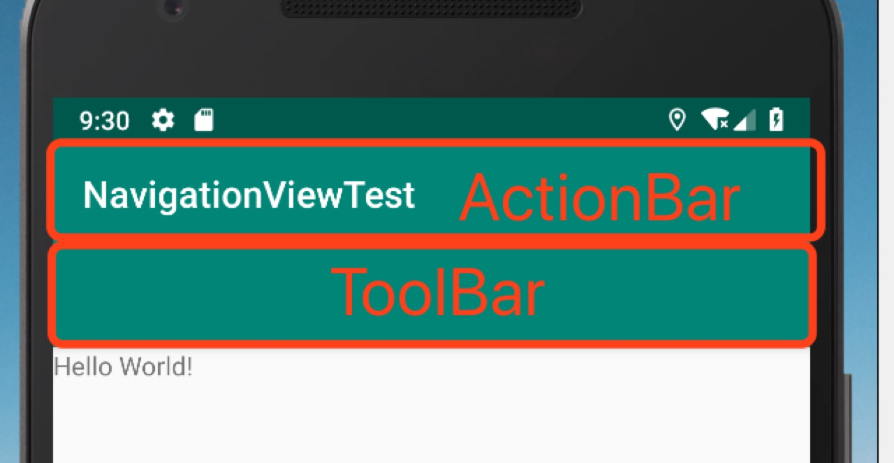
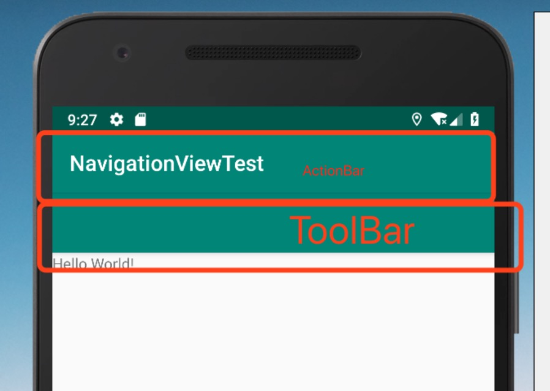

ToolBar, Drawerlayout, NavigationView

- [Toolbar]()
    - [使用]()
    - [说明]()
    - [依次讲解]()
        - [Navigation]()
            - [注意：]()
        - [Logo和Title]()
        - [Menu]()
            - [注意]()
            - [注意：]()
        - [Navigation和Menu的关系]()
        - [OverFlow按钮显示图标]()
- [DrawerLayout]()
- [Navigation]()

# Toolbar

[参考Demo](https://github.com/lazysunshinesmile/AndroidExample/tree/master/NavigationViewTest)

## 使用

1. 按照支持库设置中所述向您的项目添加 v7 appcompat 支持库。
2. 确保 Activity 可以扩展 AppCompatActivity

	public class MyActivity extends AppCompatActivity {
	*// ...*
	}

1. 在应用清单中，将`<application>` 元素设置为使用 appcompat 的其中一个 NoActionBar 主题。使用这些主题中的一个可以防止应用使用原生 ActionBar 类提供应用栏。

	<application
	  android:theme="@style/Theme.AppCompat.Light.NoActionBar"
	/>

1. 向 Activity 的布局添加一个 Toolbar。例如，以下布局代码可以添加一个 Toolbar 并赋予其浮动在 Activity 之上的外观：

	< android.support.v7.widget.Toolbar
	    android:id="@+id/my_toolbar"
	    android:layout_width="match_parent"
	    android:layout_height="?attr/actionBarSize"
	    android:background="?attr/colorPrimary"
	    android:elevation="4dp"
	    android:theme="@style/AppTheme"
	    app:popupTheme="@style/AppTheme"/>

1. 在 Activity 的 onCreate() 方法中，调用 Activity 的 setSupportActionBar() 方法，然后传递 Activity 的工具栏。该方法会将工具栏设置为 Activity 的应用栏。

	@Override
	protected void onCreate(Bundle savedInstanceState) {
	    super.onCreate(savedInstanceState);
	    setContentView(R.layout.activity_my);
	    Toolbar myToolbar = (Toolbar) findViewById(R.id.my_toolbar);
	    *//setSupportActionBar(myToolbar);*
	}

***上述代码将ActionBar隐藏了，并展示了ToolBar***

***默认主题下，放开上述代码中的注释，会出现如下错误： `Caused by: java.lang.IllegalStateException: This Activity already has an action bar supplied by the window decor. Do not request Window.FEATURE_SUPPORT_ACTION_BAR and set windowActionBar to false in your theme to use a Toolbar instead.`***

***解决办法：修改`styles.xml`如下,注意修改`parent`那一行***

	

***可以看出来，`ToolBar`可以作为一个UI单元，可以很方便的对每个`Activity`进行单独设定管理，不再像`ActionBar`一样，只能通过主题来管理。当然，如果对工具栏要求不高，仍然可以使用主题来指定`ActionBar`，但是要注意，如果你的`Activity`继承自`AppCompatActivity`，使用的主题应该是`Theme.AppCompat.`，如果直接继承自`Activity`，用`Theme.AppCompat`.是不起作用的！Android studio 创建项目默认就是对的主题，无需修改***

## 说明

[ActionBar 最终视图说明]

## 依次讲解

### Navigation

这是工具栏的层级导航功能，类似于按下Back键，但是，与Back键不同，这里需要我们指定返回的Activity。在Manifest文件里设置：

	<activity
	    android:name=".model.fragment.LandViewActivity"//包含ToolBar的当前Activity
	    android:parentActivityName=".SplashActivity"//按下导航键返回的目标Activity
	>
	    <meta-data
	        android:name="android.support.PARENT_ACTIVITY"
	        android:value=".SplashActivity" />
	</activity>

***这样，层级导航的功能设置就完成了。当然还需要设置`Navigation`，如果不想使用默认的导航图标，也可以自己在`layout`文件中指定：***

	app:navigationIcon="@drawable/ic_action_nav"

#### 注意：

***使用`ToolBar`的时候，如果在`Layout`文件中没有设置`NavigationIcon`，工具栏是不会显示`Navigation`按键的。如果不想自定义图标，可以在获取到`ActionBar`对象之后，设置`actionBar.setDisplayHomeAsUpEnabled(true)`来启用`Navigation`功能，这样就可以使用系统自带的图标了。如果我们使用是`ActionBar`主题，`Navigation`功能默认是启用的***

***`Navigation`返回的`Activity`并不是返回栈里存在的实例，而是重新创建的Activity，也就是说，之前Activity存在的状态，从`Navigation`返回之后，并不会保存下来***

### Logo和Title

这两项的设置非常简单，可以在layout文件中设置，也可以在代码中对ActionBar对象进行设置，就不再介绍了。

### Menu

在工具栏上可以设置多个按钮，Menu就是由这些按钮组成的。
要在工具栏上添加按键，需要先指定Menu文件，menu文件需要定义在`res/menu`文件夹下(toolbar_menu.xml)：

	<?xml version="1.0" encoding="utf-8"?>
	<menu xmlns:android="http://schemas.android.com/apk/res/android"
	xmlns:app="http://schemas.android.com/apk/res-auto">
	    <item
	        android:id="@+id/add_item"
	        android:icon="@drawable/ic_action_new"
	        android:title="Add"
	        app:showAsAction="ifRoom|withText"
	    />
	    <item
	        android:id="@+id/remo_item"
	        android:icon="@drawable/ic_action_remove"
	        android:title="Remove"
	        app:showAsAction="ifRoom|withText"
	    />
	    <item
	        android:id="@+id/more_item"
	        android:icon="@drawable/ic_action_more"
	        android:title="Remove"
	        app:showAsAction="never"
	    />
	</menu>

#### 注意

***注意，因为例子中使用是v7支持库，需要使用app命名空间。如果不使用支持库可以直接使用android。app:showAsAction指定了按键的显示方式。因为工具栏空间相对有限，我们可指定按键的显示方式，never表示总在overflow menu中显示，always表示总在工具栏显示，ifRoom表示空间足够则显示在工具栏上，withText表示空间足够的时候显示Title，也可以用组合的方式：ifRoom|withText***

Menu定义好之后，在Activity中添加并引用它：

	@Override
	public boolean onCreateOptionsMenu(Menu menu) {
	    MenuInflater inflater = getMenuInflater();
	    inflater.inflate(R.menu.toobar_menu,menu);
	    return super.onCreateOptionsMenu(menu);
	}
	@Override
	public boolean onOptionsItemSelected(MenuItem item) {
	    switch (item.getItemId()){
	      case R.id.add_item:
	        Toast.makeText(this,"Add button clicked",Toast.LENGTH_SHORT).show();
	        break;
	      case R.id.remo_item:
	        Toast.makeText(this,"Add button clicked",Toast.LENGTH_SHORT).show();
	        break;
	      case R.id.more_item:
	        Toast.makeText(this,"Add button clicked",Toast.LENGTH_SHORT).show();
	        break;
	      default:
	        break;
	    }
	    return super.onOptionsItemSelected(item);
	}

#### 注意：

***这里是在Activity中直接加载menu，如果是Fragment中使用，会有所不同。Fragment中必须设置setHasOptionsMenu(true)，它用来通知FragmentManager，当前Fragment需要调用onCreateOptionsMenu方法。***

### Navigation和Menu的关系

实际上`Navigation`也属于`menu`，它的id是`android.R.id.home`，可以在`onOptionsItemSelected`中对它进行监听

	public boolean onOptionsItemSelected(MenuItem item) {
	    switch (item.getItemId()) {
	      case android.R.id.home:
	        Intent upIntent = NavUtils.getParentActivityIntent(this);
	        if (NavUtils.shouldUpRecreateTask(this, upIntent)) {
	            TaskStackBuilder.create(this)
	            .addNextIntentWithParentStack(upIntent)
	            .startActivities();
	        } else {
	            upIntent.addFlags(Intent.FLAG_ACTIVITY_CLEAR_TOP);
	            NavUtils.navigateUpTo(this, upIntent);
	        }
	        return true;
	    ......
	    }
	}

*调用`NavUtils.getParentActivityIntent()`方法可以获取到跳转至父`Activity`的`Intent`，然后如果父`Activity`和当前`Activity`是在同一个`Task`中的，则直接调用`navigateUpTo()`方法进行跳转，如果不是在同一个`Task`中的，则需要借助`TaskStackBuilder`来创建一个新的`Task`。*

### OverFlow按钮显示图标

`overflow`中的按钮默认是不显示图标的，它由`MenuBuilder`这个类的`setOptionalIconsVisible`方法来决定，如果我们在`overflow`被展开的时候给这个方法传入`true`，那么里面的每一个`Action`按钮对应的图标就都会显示出来了。

	@Override
	public boolean onMenuOpened(int featureId, Menu menu) {
	    if (featureId == Window.FEATURE_ACTION_BAR && menu != null) {
	        if (menu.getClass().getSimpleName().equals("MenuBuilder")) {
	            try {
	                Method m = menu.getClass().getDeclaredMethod("setOptionalIconsVisible", Boolean.TYPE);
	                m.setAccessible(true);
	                m.invoke(menu, true);
	            } catch (Exception e) {
	            }
	        }
	    }
	    return super.onMenuOpened(featureId, menu);
	}

# DrawerLayout

# Navigation

%5BTOC%5D%0A%0A%23%20Toolbar%0A%5B%E5%8F%82%E8%80%83Demo%5D(https%3A%2F%2Fgithub.com%2Flazysunshinesmile%2FAndroidExample%2Ftree%2Fmaster%2FNavigationViewTest)%0A%23%23%20%E4%BD%BF%E7%94%A8%0A1.%20%20%E6%8C%89%E7%85%A7%E6%94%AF%E6%8C%81%E5%BA%93%E8%AE%BE%E7%BD%AE%E4%B8%AD%E6%89%80%E8%BF%B0%E5%90%91%E6%82%A8%E7%9A%84%E9%A1%B9%E7%9B%AE%E6%B7%BB%E5%8A%A0%20v7%20appcompat%20%E6%94%AF%E6%8C%81%E5%BA%93%E3%80%82%0A2.%20%20%E7%A1%AE%E4%BF%9D%20Activity%20%E5%8F%AF%E4%BB%A5%E6%89%A9%E5%B1%95%20AppCompatActivity%20%0A%60%60%60%20java%0Apublic%20class%20MyActivity%20extends%20AppCompatActivity%20%7B%0A%2F%2F%20...%0A%7D%0A%60%60%60%0A3.%20%E5%9C%A8%E5%BA%94%E7%94%A8%E6%B8%85%E5%8D%95%E4%B8%AD%EF%BC%8C%E5%B0%86%60%60%60%3Capplication%3E%60%60%60%20%E5%85%83%E7%B4%A0%E8%AE%BE%E7%BD%AE%E4%B8%BA%E4%BD%BF%E7%94%A8%20appcompat%20%E7%9A%84%E5%85%B6%E4%B8%AD%E4%B8%80%E4%B8%AA%20NoActionBar%20%E4%B8%BB%E9%A2%98%E3%80%82%E4%BD%BF%E7%94%A8%E8%BF%99%E4%BA%9B%E4%B8%BB%E9%A2%98%E4%B8%AD%E7%9A%84%E4%B8%80%E4%B8%AA%E5%8F%AF%E4%BB%A5%E9%98%B2%E6%AD%A2%E5%BA%94%E7%94%A8%E4%BD%BF%E7%94%A8%E5%8E%9F%E7%94%9F%20ActionBar%20%E7%B1%BB%E6%8F%90%E4%BE%9B%E5%BA%94%E7%94%A8%E6%A0%8F%E3%80%82%0A%60%60%60xml%0A%3Capplication%0A%20%20android%3Atheme%3D%22%40style%2FTheme.AppCompat.Light.NoActionBar%22%0A%2F%3E%0A%60%60%60%0A4.%20%E5%90%91%20Activity%20%E7%9A%84%E5%B8%83%E5%B1%80%E6%B7%BB%E5%8A%A0%E4%B8%80%E4%B8%AA%20Toolbar%E3%80%82%E4%BE%8B%E5%A6%82%EF%BC%8C%E4%BB%A5%E4%B8%8B%E5%B8%83%E5%B1%80%E4%BB%A3%E7%A0%81%E5%8F%AF%E4%BB%A5%E6%B7%BB%E5%8A%A0%E4%B8%80%E4%B8%AA%20Toolbar%20%E5%B9%B6%E8%B5%8B%E4%BA%88%E5%85%B6%E6%B5%AE%E5%8A%A8%E5%9C%A8%20Activity%20%E4%B9%8B%E4%B8%8A%E7%9A%84%E5%A4%96%E8%A7%82%EF%BC%9A%0A%60%60%60xml%0A%3C%20android.support.v7.widget.Toolbar%0A%20%20%20%20android%3Aid%3D%22%40%2Bid%2Fmy_toolbar%22%0A%20%20%20%20android%3Alayout_width%3D%22match_parent%22%0A%20%20%20%20android%3Alayout_height%3D%22%3Fattr%2FactionBarSize%22%0A%20%20%20%20android%3Abackground%3D%22%3Fattr%2FcolorPrimary%22%0A%20%20%20%20android%3Aelevation%3D%224dp%22%0A%20%20%20%20android%3Atheme%3D%22%40style%2FAppTheme%22%0A%20%20%20%20app%3ApopupTheme%3D%22%40style%2FAppTheme%22%2F%3E%0A%60%60%60%0A%0A5.%20%E5%9C%A8%20Activity%20%E7%9A%84%20onCreate()%20%E6%96%B9%E6%B3%95%E4%B8%AD%EF%BC%8C%E8%B0%83%E7%94%A8%20Activity%20%E7%9A%84%20setSupportActionBar()%20%E6%96%B9%E6%B3%95%EF%BC%8C%E7%84%B6%E5%90%8E%E4%BC%A0%E9%80%92%20Activity%20%E7%9A%84%E5%B7%A5%E5%85%B7%E6%A0%8F%E3%80%82%E8%AF%A5%E6%96%B9%E6%B3%95%E4%BC%9A%E5%B0%86%E5%B7%A5%E5%85%B7%E6%A0%8F%E8%AE%BE%E7%BD%AE%E4%B8%BA%20Activity%20%E7%9A%84%E5%BA%94%E7%94%A8%E6%A0%8F%E3%80%82%0A%60%60%60java%0A%40Override%0Aprotected%20void%20onCreate(Bundle%20savedInstanceState)%20%7B%0A%20%20%20%20super.onCreate(savedInstanceState)%3B%0A%20%20%20%20setContentView(R.layout.activity_my)%3B%0A%20%20%20%20Toolbar%20myToolbar%20%3D%20(Toolbar)%20findViewById(R.id.my_toolbar)%3B%0A%20%20%20%20%2F%2FsetSupportActionBar(myToolbar)%3B%0A%7D%0A%60%60%60%0A!%5B6da850553bf84fb3b134442be3ae6d07.jpeg%5D(evernotecid%3A%2F%2FB0FB2A1B-C5B0-45DA-B28A-2CE65DD8A498%2Fappyinxiangcom%2F20992873%2FENResource%2Fp131)%0A%0A***%E4%B8%8A%E8%BF%B0%E4%BB%A3%E7%A0%81%E5%B0%86ActionBar%E9%9A%90%E8%97%8F%E4%BA%86%EF%BC%8C%E5%B9%B6%E5%B1%95%E7%A4%BA%E4%BA%86ToolBar***%0A***%E9%BB%98%E8%AE%A4%E4%B8%BB%E9%A2%98%E4%B8%8B%EF%BC%8C%E6%94%BE%E5%BC%80%E4%B8%8A%E8%BF%B0%E4%BB%A3%E7%A0%81%E4%B8%AD%E7%9A%84%E6%B3%A8%E9%87%8A%EF%BC%8C%E4%BC%9A%E5%87%BA%E7%8E%B0%E5%A6%82%E4%B8%8B%E9%94%99%E8%AF%AF%EF%BC%9A%20%20%20%20%20%60Caused%20by%3A%20java.lang.IllegalStateException%3A%20This%20Activity%20already%20has%20an%20action%20bar%20supplied%20by%20the%20window%20decor.%20Do%20not%20request%20Window.FEATURE_SUPPORT_ACTION_BAR%20and%20set%20windowActionBar%20to%20false%20in%20your%20theme%20to%20use%20a%20Toolbar%20instead.%60***%0A***%E8%A7%A3%E5%86%B3%E5%8A%9E%E6%B3%95%EF%BC%9A%E4%BF%AE%E6%94%B9%60styles.xml%60%E5%A6%82%E4%B8%8B%2C%E6%B3%A8%E6%84%8F%E4%BF%AE%E6%94%B9%60parent%60%E9%82%A3%E4%B8%80%E8%A1%8C***%0A%60%60%60xml%0A%3Cstyle%20name%3D%22AppTheme%22%20parent%3D%22Theme.AppCompat.Light.NoActionBar%22%3E%0A%20%20%20%20%20%20%20%20%3C!--%20Customize%20your%20theme%20here.%20--%3E%0A%20%20%20%20%20%20%20%20%3Citem%20name%3D%22colorPrimary%22%3E%40color%2FcolorPrimary%3C%2Fitem%3E%0A%20%20%20%20%20%20%20%20%3Citem%20name%3D%22colorPrimaryDark%22%3E%40color%2FcolorPrimaryDark%3C%2Fitem%3E%0A%20%20%20%20%20%20%20%20%3Citem%20name%3D%22colorAccent%22%3E%40color%2FcolorAccent%3C%2Fitem%3E%0A%20%20%20%20%3C%2Fstyle%3E%0A%60%60%60%0A%0A%0A%0A***%E5%8F%AF%E4%BB%A5%E7%9C%8B%E5%87%BA%E6%9D%A5%EF%BC%8C%60ToolBar%60%E5%8F%AF%E4%BB%A5%E4%BD%9C%E4%B8%BA%E4%B8%80%E4%B8%AAUI%E5%8D%95%E5%85%83%EF%BC%8C%E5%8F%AF%E4%BB%A5%E5%BE%88%E6%96%B9%E4%BE%BF%E7%9A%84%E5%AF%B9%E6%AF%8F%E4%B8%AA%60Activity%60%E8%BF%9B%E8%A1%8C%E5%8D%95%E7%8B%AC%E8%AE%BE%E5%AE%9A%E7%AE%A1%E7%90%86%EF%BC%8C%E4%B8%8D%E5%86%8D%E5%83%8F%60ActionBar%60%E4%B8%80%E6%A0%B7%EF%BC%8C%E5%8F%AA%E8%83%BD%E9%80%9A%E8%BF%87%E4%B8%BB%E9%A2%98%E6%9D%A5%E7%AE%A1%E7%90%86%E3%80%82%E5%BD%93%E7%84%B6%EF%BC%8C%E5%A6%82%E6%9E%9C%E5%AF%B9%E5%B7%A5%E5%85%B7%E6%A0%8F%E8%A6%81%E6%B1%82%E4%B8%8D%E9%AB%98%EF%BC%8C%E4%BB%8D%E7%84%B6%E5%8F%AF%E4%BB%A5%E4%BD%BF%E7%94%A8%E4%B8%BB%E9%A2%98%E6%9D%A5%E6%8C%87%E5%AE%9A%60ActionBar%60%EF%BC%8C%E4%BD%86%E6%98%AF%E8%A6%81%E6%B3%A8%E6%84%8F%EF%BC%8C%E5%A6%82%E6%9E%9C%E4%BD%A0%E7%9A%84%60Activity%60%E7%BB%A7%E6%89%BF%E8%87%AA%60AppCompatActivity%60%EF%BC%8C%E4%BD%BF%E7%94%A8%E7%9A%84%E4%B8%BB%E9%A2%98%E5%BA%94%E8%AF%A5%E6%98%AF%60Theme.AppCompat.%60%EF%BC%8C%E5%A6%82%E6%9E%9C%E7%9B%B4%E6%8E%A5%E7%BB%A7%E6%89%BF%E8%87%AA%60Activity%60%EF%BC%8C%E7%94%A8%60Theme.AppCompat%60.%E6%98%AF%E4%B8%8D%E8%B5%B7%E4%BD%9C%E7%94%A8%E7%9A%84%EF%BC%81Android%20studio%20%E5%88%9B%E5%BB%BA%E9%A1%B9%E7%9B%AE%E9%BB%98%E8%AE%A4%E5%B0%B1%E6%98%AF%E5%AF%B9%E7%9A%84%E4%B8%BB%E9%A2%98%EF%BC%8C%E6%97%A0%E9%9C%80%E4%BF%AE%E6%94%B9***%0A%0A%0A%23%23%20%E8%AF%B4%E6%98%8E%0A%5BActionBar%20%E6%9C%80%E7%BB%88%E8%A7%86%E5%9B%BE%E8%AF%B4%E6%98%8E%5D%0A!%5B1e72254972824649b32c8d271b352ba2.png%5D(evernotecid%3A%2F%2FB0FB2A1B-C5B0-45DA-B28A-2CE65DD8A498%2Fappyinxiangcom%2F20992873%2FENResource%2Fp129)%0A%0A%23%23%20%E4%BE%9D%E6%AC%A1%E8%AE%B2%E8%A7%A3%0A%23%23%23%20Navigation%0A%E8%BF%99%E6%98%AF%E5%B7%A5%E5%85%B7%E6%A0%8F%E7%9A%84%E5%B1%82%E7%BA%A7%E5%AF%BC%E8%88%AA%E5%8A%9F%E8%83%BD%EF%BC%8C%E7%B1%BB%E4%BC%BC%E4%BA%8E%E6%8C%89%E4%B8%8BBack%E9%94%AE%EF%BC%8C%E4%BD%86%E6%98%AF%EF%BC%8C%E4%B8%8EBack%E9%94%AE%E4%B8%8D%E5%90%8C%EF%BC%8C%E8%BF%99%E9%87%8C%E9%9C%80%E8%A6%81%E6%88%91%E4%BB%AC%E6%8C%87%E5%AE%9A%E8%BF%94%E5%9B%9E%E7%9A%84Activity%E3%80%82%E5%9C%A8Manifest%E6%96%87%E4%BB%B6%E9%87%8C%E8%AE%BE%E7%BD%AE%EF%BC%9A%0A%0A%60%60%60xml%0A%3Cactivity%0A%20%20%20%20android%3Aname%3D%22.model.fragment.LandViewActivity%22%2F%2F%E5%8C%85%E5%90%ABToolBar%E7%9A%84%E5%BD%93%E5%89%8DActivity%0A%20%20%20%20android%3AparentActivityName%3D%22.SplashActivity%22%2F%2F%E6%8C%89%E4%B8%8B%E5%AF%BC%E8%88%AA%E9%94%AE%E8%BF%94%E5%9B%9E%E7%9A%84%E7%9B%AE%E6%A0%87Activity%0A%3E%0A%20%20%20%20%3Cmeta-data%0A%20%20%20%20%20%20%20%20android%3Aname%3D%22android.support.PARENT_ACTIVITY%22%0A%20%20%20%20%20%20%20%20android%3Avalue%3D%22.SplashActivity%22%20%2F%3E%0A%3C%2Factivity%3E%0A%60%60%60%0A%0A***%E8%BF%99%E6%A0%B7%EF%BC%8C%E5%B1%82%E7%BA%A7%E5%AF%BC%E8%88%AA%E7%9A%84%E5%8A%9F%E8%83%BD%E8%AE%BE%E7%BD%AE%E5%B0%B1%E5%AE%8C%E6%88%90%E4%BA%86%E3%80%82%E5%BD%93%E7%84%B6%E8%BF%98%E9%9C%80%E8%A6%81%E8%AE%BE%E7%BD%AE%60Navigation%60%EF%BC%8C%E5%A6%82%E6%9E%9C%E4%B8%8D%E6%83%B3%E4%BD%BF%E7%94%A8%E9%BB%98%E8%AE%A4%E7%9A%84%E5%AF%BC%E8%88%AA%E5%9B%BE%E6%A0%87%EF%BC%8C%E4%B9%9F%E5%8F%AF%E4%BB%A5%E8%87%AA%E5%B7%B1%E5%9C%A8%60layout%60%E6%96%87%E4%BB%B6%E4%B8%AD%E6%8C%87%E5%AE%9A%EF%BC%9A***%0A%60%60%60xml%0Aapp%3AnavigationIcon%3D%22%40drawable%2Fic_action_nav%22%0A%60%60%60%0A%23%23%23%23%20%E6%B3%A8%E6%84%8F%EF%BC%9A%0A***%E4%BD%BF%E7%94%A8%60ToolBar%60%E7%9A%84%E6%97%B6%E5%80%99%EF%BC%8C%E5%A6%82%E6%9E%9C%E5%9C%A8%60Layout%60%E6%96%87%E4%BB%B6%E4%B8%AD%E6%B2%A1%E6%9C%89%E8%AE%BE%E7%BD%AE%60NavigationIcon%60%EF%BC%8C%E5%B7%A5%E5%85%B7%E6%A0%8F%E6%98%AF%E4%B8%8D%E4%BC%9A%E6%98%BE%E7%A4%BA%60Navigation%60%E6%8C%89%E9%94%AE%E7%9A%84%E3%80%82%E5%A6%82%E6%9E%9C%E4%B8%8D%E6%83%B3%E8%87%AA%E5%AE%9A%E4%B9%89%E5%9B%BE%E6%A0%87%EF%BC%8C%E5%8F%AF%E4%BB%A5%E5%9C%A8%E8%8E%B7%E5%8F%96%E5%88%B0%60ActionBar%60%E5%AF%B9%E8%B1%A1%E4%B9%8B%E5%90%8E%EF%BC%8C%E8%AE%BE%E7%BD%AE%60actionBar.setDisplayHomeAsUpEnabled(true)%60%E6%9D%A5%E5%90%AF%E7%94%A8%60Navigation%60%E5%8A%9F%E8%83%BD%EF%BC%8C%E8%BF%99%E6%A0%B7%E5%B0%B1%E5%8F%AF%E4%BB%A5%E4%BD%BF%E7%94%A8%E7%B3%BB%E7%BB%9F%E8%87%AA%E5%B8%A6%E7%9A%84%E5%9B%BE%E6%A0%87%E4%BA%86%E3%80%82%E5%A6%82%E6%9E%9C%E6%88%91%E4%BB%AC%E4%BD%BF%E7%94%A8%E6%98%AF%60ActionBar%60%E4%B8%BB%E9%A2%98%EF%BC%8C%60Navigation%60%E5%8A%9F%E8%83%BD%E9%BB%98%E8%AE%A4%E6%98%AF%E5%90%AF%E7%94%A8%E7%9A%84***%0A%0A***%60Navigation%60%E8%BF%94%E5%9B%9E%E7%9A%84%60Activity%60%E5%B9%B6%E4%B8%8D%E6%98%AF%E8%BF%94%E5%9B%9E%E6%A0%88%E9%87%8C%E5%AD%98%E5%9C%A8%E7%9A%84%E5%AE%9E%E4%BE%8B%EF%BC%8C%E8%80%8C%E6%98%AF%E9%87%8D%E6%96%B0%E5%88%9B%E5%BB%BA%E7%9A%84Activity%EF%BC%8C%E4%B9%9F%E5%B0%B1%E6%98%AF%E8%AF%B4%EF%BC%8C%E4%B9%8B%E5%89%8DActivity%E5%AD%98%E5%9C%A8%E7%9A%84%E7%8A%B6%E6%80%81%EF%BC%8C%E4%BB%8E%60Navigation%60%E8%BF%94%E5%9B%9E%E4%B9%8B%E5%90%8E%EF%BC%8C%E5%B9%B6%E4%B8%8D%E4%BC%9A%E4%BF%9D%E5%AD%98%E4%B8%8B%E6%9D%A5***%0A%0A%23%23%23%20Logo%E5%92%8CTitle%0A%E8%BF%99%E4%B8%A4%E9%A1%B9%E7%9A%84%E8%AE%BE%E7%BD%AE%E9%9D%9E%E5%B8%B8%E7%AE%80%E5%8D%95%EF%BC%8C%E5%8F%AF%E4%BB%A5%E5%9C%A8layout%E6%96%87%E4%BB%B6%E4%B8%AD%E8%AE%BE%E7%BD%AE%EF%BC%8C%E4%B9%9F%E5%8F%AF%E4%BB%A5%E5%9C%A8%E4%BB%A3%E7%A0%81%E4%B8%AD%E5%AF%B9ActionBar%E5%AF%B9%E8%B1%A1%E8%BF%9B%E8%A1%8C%E8%AE%BE%E7%BD%AE%EF%BC%8C%E5%B0%B1%E4%B8%8D%E5%86%8D%E4%BB%8B%E7%BB%8D%E4%BA%86%E3%80%82%0A%0A%23%23%23%20Menu%0A%E5%9C%A8%E5%B7%A5%E5%85%B7%E6%A0%8F%E4%B8%8A%E5%8F%AF%E4%BB%A5%E8%AE%BE%E7%BD%AE%E5%A4%9A%E4%B8%AA%E6%8C%89%E9%92%AE%EF%BC%8CMenu%E5%B0%B1%E6%98%AF%E7%94%B1%E8%BF%99%E4%BA%9B%E6%8C%89%E9%92%AE%E7%BB%84%E6%88%90%E7%9A%84%E3%80%82%0A%E8%A6%81%E5%9C%A8%E5%B7%A5%E5%85%B7%E6%A0%8F%E4%B8%8A%E6%B7%BB%E5%8A%A0%E6%8C%89%E9%94%AE%EF%BC%8C%E9%9C%80%E8%A6%81%E5%85%88%E6%8C%87%E5%AE%9AMenu%E6%96%87%E4%BB%B6%EF%BC%8Cmenu%E6%96%87%E4%BB%B6%E9%9C%80%E8%A6%81%E5%AE%9A%E4%B9%89%E5%9C%A8%60%60%60res%2Fmenu%60%60%60%E6%96%87%E4%BB%B6%E5%A4%B9%E4%B8%8B(toolbar_menu.xml)%EF%BC%9A%0A%0A%60%60%60xml%0A%3C%3Fxml%20version%3D%221.0%22%20encoding%3D%22utf-8%22%3F%3E%0A%3Cmenu%20xmlns%3Aandroid%3D%22http%3A%2F%2Fschemas.android.com%2Fapk%2Fres%2Fandroid%22%0Axmlns%3Aapp%3D%22http%3A%2F%2Fschemas.android.com%2Fapk%2Fres-auto%22%3E%0A%20%20%20%20%3Citem%0A%20%20%20%20%20%20%20%20android%3Aid%3D%22%40%2Bid%2Fadd_item%22%0A%20%20%20%20%20%20%20%20android%3Aicon%3D%22%40drawable%2Fic_action_new%22%0A%20%20%20%20%20%20%20%20android%3Atitle%3D%22Add%22%0A%20%20%20%20%20%20%20%20app%3AshowAsAction%3D%22ifRoom%7CwithText%22%0A%20%20%20%20%2F%3E%0A%20%20%20%20%3Citem%0A%20%20%20%20%20%20%20%20android%3Aid%3D%22%40%2Bid%2Fremo_item%22%0A%20%20%20%20%20%20%20%20android%3Aicon%3D%22%40drawable%2Fic_action_remove%22%0A%20%20%20%20%20%20%20%20android%3Atitle%3D%22Remove%22%0A%20%20%20%20%20%20%20%20app%3AshowAsAction%3D%22ifRoom%7CwithText%22%0A%20%20%20%20%2F%3E%0A%20%20%20%20%3Citem%0A%20%20%20%20%20%20%20%20android%3Aid%3D%22%40%2Bid%2Fmore_item%22%0A%20%20%20%20%20%20%20%20android%3Aicon%3D%22%40drawable%2Fic_action_more%22%0A%20%20%20%20%20%20%20%20android%3Atitle%3D%22Remove%22%0A%20%20%20%20%20%20%20%20app%3AshowAsAction%3D%22never%22%0A%20%20%20%20%2F%3E%0A%3C%2Fmenu%3E%0A%60%60%60%0A%0A%23%23%23%23%20%E6%B3%A8%E6%84%8F%0A***%E6%B3%A8%E6%84%8F%EF%BC%8C%E5%9B%A0%E4%B8%BA%E4%BE%8B%E5%AD%90%E4%B8%AD%E4%BD%BF%E7%94%A8%E6%98%AFv7%E6%94%AF%E6%8C%81%E5%BA%93%EF%BC%8C%E9%9C%80%E8%A6%81%E4%BD%BF%E7%94%A8app%E5%91%BD%E5%90%8D%E7%A9%BA%E9%97%B4%E3%80%82%E5%A6%82%E6%9E%9C%E4%B8%8D%E4%BD%BF%E7%94%A8%E6%94%AF%E6%8C%81%E5%BA%93%E5%8F%AF%E4%BB%A5%E7%9B%B4%E6%8E%A5%E4%BD%BF%E7%94%A8android%E3%80%82app%3AshowAsAction%E6%8C%87%E5%AE%9A%E4%BA%86%E6%8C%89%E9%94%AE%E7%9A%84%E6%98%BE%E7%A4%BA%E6%96%B9%E5%BC%8F%E3%80%82%E5%9B%A0%E4%B8%BA%E5%B7%A5%E5%85%B7%E6%A0%8F%E7%A9%BA%E9%97%B4%E7%9B%B8%E5%AF%B9%E6%9C%89%E9%99%90%EF%BC%8C%E6%88%91%E4%BB%AC%E5%8F%AF%E6%8C%87%E5%AE%9A%E6%8C%89%E9%94%AE%E7%9A%84%E6%98%BE%E7%A4%BA%E6%96%B9%E5%BC%8F%EF%BC%8Cnever%E8%A1%A8%E7%A4%BA%E6%80%BB%E5%9C%A8overflow%20menu%E4%B8%AD%E6%98%BE%E7%A4%BA%EF%BC%8Calways%E8%A1%A8%E7%A4%BA%E6%80%BB%E5%9C%A8%E5%B7%A5%E5%85%B7%E6%A0%8F%E6%98%BE%E7%A4%BA%EF%BC%8CifRoom%E8%A1%A8%E7%A4%BA%E7%A9%BA%E9%97%B4%E8%B6%B3%E5%A4%9F%E5%88%99%E6%98%BE%E7%A4%BA%E5%9C%A8%E5%B7%A5%E5%85%B7%E6%A0%8F%E4%B8%8A%EF%BC%8CwithText%E8%A1%A8%E7%A4%BA%E7%A9%BA%E9%97%B4%E8%B6%B3%E5%A4%9F%E7%9A%84%E6%97%B6%E5%80%99%E6%98%BE%E7%A4%BATitle%EF%BC%8C%E4%B9%9F%E5%8F%AF%E4%BB%A5%E7%94%A8%E7%BB%84%E5%90%88%E7%9A%84%E6%96%B9%E5%BC%8F%EF%BC%9AifRoom%7CwithText***%0A%0AMenu%E5%AE%9A%E4%B9%89%E5%A5%BD%E4%B9%8B%E5%90%8E%EF%BC%8C%E5%9C%A8Activity%E4%B8%AD%E6%B7%BB%E5%8A%A0%E5%B9%B6%E5%BC%95%E7%94%A8%E5%AE%83%EF%BC%9A%0A%60%60%60java%0A%40Override%0Apublic%20boolean%20onCreateOptionsMenu(Menu%20menu)%20%7B%0A%20%20%20%20MenuInflater%20inflater%20%3D%20getMenuInflater()%3B%0A%20%20%20%20inflater.inflate(R.menu.toobar_menu%2Cmenu)%3B%0A%20%20%20%20return%20super.onCreateOptionsMenu(menu)%3B%0A%7D%0A%40Override%0Apublic%20boolean%20onOptionsItemSelected(MenuItem%20item)%20%7B%0A%20%20%20%20switch%20(item.getItemId())%7B%0A%20%20%20%20%20%20case%20R.id.add_item%3A%0A%20%20%20%20%20%20%20%20Toast.makeText(this%2C%22Add%20button%20clicked%22%2CToast.LENGTH_SHORT).show()%3B%0A%20%20%20%20%20%20%20%20break%3B%0A%20%20%20%20%20%20case%20R.id.remo_item%3A%0A%20%20%20%20%20%20%20%20Toast.makeText(this%2C%22Add%20button%20clicked%22%2CToast.LENGTH_SHORT).show()%3B%0A%20%20%20%20%20%20%20%20break%3B%0A%20%20%20%20%20%20case%20R.id.more_item%3A%0A%20%20%20%20%20%20%20%20Toast.makeText(this%2C%22Add%20button%20clicked%22%2CToast.LENGTH_SHORT).show()%3B%0A%20%20%20%20%20%20%20%20break%3B%0A%20%20%20%20%20%20default%3A%0A%20%20%20%20%20%20%20%20break%3B%0A%20%20%20%20%7D%0A%20%20%20%20return%20super.onOptionsItemSelected(item)%3B%0A%7D%0A%60%60%60%0A%0A%23%23%23%23%20%E6%B3%A8%E6%84%8F%EF%BC%9A%0A***%E8%BF%99%E9%87%8C%E6%98%AF%E5%9C%A8Activity%E4%B8%AD%E7%9B%B4%E6%8E%A5%E5%8A%A0%E8%BD%BDmenu%EF%BC%8C%E5%A6%82%E6%9E%9C%E6%98%AFFragment%E4%B8%AD%E4%BD%BF%E7%94%A8%EF%BC%8C%E4%BC%9A%E6%9C%89%E6%89%80%E4%B8%8D%E5%90%8C%E3%80%82Fragment%E4%B8%AD%E5%BF%85%E9%A1%BB%E8%AE%BE%E7%BD%AEsetHasOptionsMenu(true)%EF%BC%8C%E5%AE%83%E7%94%A8%E6%9D%A5%E9%80%9A%E7%9F%A5FragmentManager%EF%BC%8C%E5%BD%93%E5%89%8DFragment%E9%9C%80%E8%A6%81%E8%B0%83%E7%94%A8onCreateOptionsMenu%E6%96%B9%E6%B3%95%E3%80%82***%0A%0A%23%23%23%20Navigation%E5%92%8CMenu%E7%9A%84%E5%85%B3%E7%B3%BB%0A%E5%AE%9E%E9%99%85%E4%B8%8A%60Navigation%60%E4%B9%9F%E5%B1%9E%E4%BA%8E%60menu%60%EF%BC%8C%E5%AE%83%E7%9A%84id%E6%98%AF%60android.R.id.home%60%EF%BC%8C%E5%8F%AF%E4%BB%A5%E5%9C%A8%60onOptionsItemSelected%60%E4%B8%AD%E5%AF%B9%E5%AE%83%E8%BF%9B%E8%A1%8C%E7%9B%91%E5%90%AC%0A%60%60%60java%0Apublic%20boolean%20onOptionsItemSelected(MenuItem%20item)%20%7B%0A%20%20%20%20switch%20(item.getItemId())%20%7B%0A%20%20%20%20%20%20case%20android.R.id.home%3A%0A%20%20%20%20%20%20%20%20Intent%20upIntent%20%3D%20NavUtils.getParentActivityIntent(this)%3B%0A%20%20%20%20%20%20%20%20if%20(NavUtils.shouldUpRecreateTask(this%2C%20upIntent))%20%7B%0A%20%20%20%20%20%20%20%20%20%20%20%20TaskStackBuilder.create(this)%0A%20%20%20%20%20%20%20%20%20%20%20%20.addNextIntentWithParentStack(upIntent)%0A%20%20%20%20%20%20%20%20%20%20%20%20.startActivities()%3B%0A%20%20%20%20%20%20%20%20%7D%20else%20%7B%20%20%20%20%20%20%20%20%20%20%20%20%20%20%0A%20%20%20%20%20%20%20%20%20%20%20%20upIntent.addFlags(Intent.FLAG_ACTIVITY_CLEAR_TOP)%3B%0A%20%20%20%20%20%20%20%20%20%20%20%20NavUtils.navigateUpTo(this%2C%20upIntent)%3B%0A%20%20%20%20%20%20%20%20%7D%0A%20%20%20%20%20%20%20%20return%20true%3B%0A%20%20%20%20......%0A%20%20%20%20%7D%0A%7D%0A%60%60%60%0A*%E8%B0%83%E7%94%A8%60NavUtils.getParentActivityIntent()%60%E6%96%B9%E6%B3%95%E5%8F%AF%E4%BB%A5%E8%8E%B7%E5%8F%96%E5%88%B0%E8%B7%B3%E8%BD%AC%E8%87%B3%E7%88%B6%60Activity%60%E7%9A%84%60Intent%60%EF%BC%8C%E7%84%B6%E5%90%8E%E5%A6%82%E6%9E%9C%E7%88%B6%60Activity%60%E5%92%8C%E5%BD%93%E5%89%8D%60Activity%60%E6%98%AF%E5%9C%A8%E5%90%8C%E4%B8%80%E4%B8%AA%60Task%60%E4%B8%AD%E7%9A%84%EF%BC%8C%E5%88%99%E7%9B%B4%E6%8E%A5%E8%B0%83%E7%94%A8%60navigateUpTo()%60%E6%96%B9%E6%B3%95%E8%BF%9B%E8%A1%8C%E8%B7%B3%E8%BD%AC%EF%BC%8C%E5%A6%82%E6%9E%9C%E4%B8%8D%E6%98%AF%E5%9C%A8%E5%90%8C%E4%B8%80%E4%B8%AA%60Task%60%E4%B8%AD%E7%9A%84%EF%BC%8C%E5%88%99%E9%9C%80%E8%A6%81%E5%80%9F%E5%8A%A9%60TaskStackBuilder%60%E6%9D%A5%E5%88%9B%E5%BB%BA%E4%B8%80%E4%B8%AA%E6%96%B0%E7%9A%84%60Task%60%E3%80%82*%0A%0A%0A%23%23%23%20OverFlow%E6%8C%89%E9%92%AE%E6%98%BE%E7%A4%BA%E5%9B%BE%E6%A0%87%20%0A%60overflow%60%E4%B8%AD%E7%9A%84%E6%8C%89%E9%92%AE%E9%BB%98%E8%AE%A4%E6%98%AF%E4%B8%8D%E6%98%BE%E7%A4%BA%E5%9B%BE%E6%A0%87%E7%9A%84%EF%BC%8C%E5%AE%83%E7%94%B1%60MenuBuilder%60%E8%BF%99%E4%B8%AA%E7%B1%BB%E7%9A%84%60setOptionalIconsVisible%60%E6%96%B9%E6%B3%95%E6%9D%A5%E5%86%B3%E5%AE%9A%EF%BC%8C%E5%A6%82%E6%9E%9C%E6%88%91%E4%BB%AC%E5%9C%A8%60overflow%60%E8%A2%AB%E5%B1%95%E5%BC%80%E7%9A%84%E6%97%B6%E5%80%99%E7%BB%99%E8%BF%99%E4%B8%AA%E6%96%B9%E6%B3%95%E4%BC%A0%E5%85%A5%60true%60%EF%BC%8C%E9%82%A3%E4%B9%88%E9%87%8C%E9%9D%A2%E7%9A%84%E6%AF%8F%E4%B8%80%E4%B8%AA%60Action%60%E6%8C%89%E9%92%AE%E5%AF%B9%E5%BA%94%E7%9A%84%E5%9B%BE%E6%A0%87%E5%B0%B1%E9%83%BD%E4%BC%9A%E6%98%BE%E7%A4%BA%E5%87%BA%E6%9D%A5%E4%BA%86%E3%80%82%0A%60%60%60java%0A%40Override%0Apublic%20boolean%20onMenuOpened(int%20featureId%2C%20Menu%20menu)%20%7B%0A%20%20%20%20if%20(featureId%20%3D%3D%20Window.FEATURE_ACTION_BAR%20%26%26%20menu%20!%3D%20null)%20%7B%0A%20%20%20%20%20%20%20%20if%20(menu.getClass().getSimpleName().equals(%22MenuBuilder%22))%20%7B%0A%20%20%20%20%20%20%20%20%20%20%20%20try%20%7B%0A%20%20%20%20%20%20%20%20%20%20%20%20%20%20%20%20Method%20m%20%3D%20menu.getClass().getDeclaredMethod(%22setOptionalIconsVisible%22%2C%20Boolean.TYPE)%3B%0A%20%20%20%20%20%20%20%20%20%20%20%20%20%20%20%20m.setAccessible(true)%3B%0A%20%20%20%20%20%20%20%20%20%20%20%20%20%20%20%20m.invoke(menu%2C%20true)%3B%0A%20%20%20%20%20%20%20%20%20%20%20%20%7D%20catch%20(Exception%20e)%20%7B%0A%20%20%20%20%20%20%20%20%20%20%20%20%7D%0A%20%20%20%20%20%20%20%20%7D%0A%20%20%20%20%7D%0A%20%20%20%20return%20super.onMenuOpened(featureId%2C%20menu)%3B%0A%7D%0A%60%60%60%0A%0A%0A%0A%23%20DrawerLayout%0A%0A%23%20NavigationView%0A%0A

