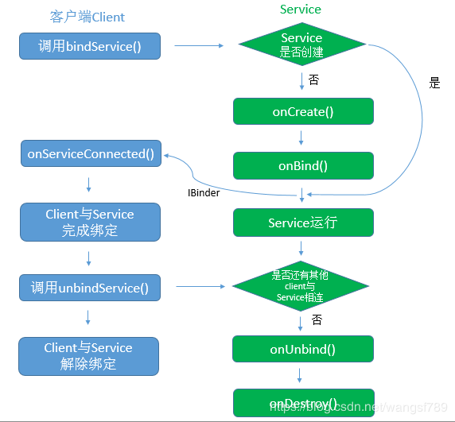

service 生命周期

service 生命周期

startService

onCreate -> onStartCommand -> ... -> onDestroy

bindService

onCreate -> onBind -> ... ->unBind -> onDestroy

bindService启动服务的生命周期与其绑定的client息息相关。当client销毁时，client会自动与Service解除绑定。当然，client也可以明确调用Context的unbindService()方法与Service解除绑定。当没有任何client与Service绑定时，Service会自行销毁(onDestroy)。
多次调用bindService,不会多次调用onBind



启动一个Service：
```
    public void bindService(ServiceConnection mConn){
        Intent intent = new Intent("android.intent.action.SITE_NAME_SERVICE");
        List<ResolveInfo> available =
                this.getPackageManager().queryIntentServicesAsUser(
                        new Intent("android.intent.action.SITE_NAME_SERVICE"), 0, UserHandle.myUserId());
        int numAvailable = available.size();
        Log.d(TAG,"resolve numAvailable >> = "+numAvailable);

        if(numAvailable>0){
            ServiceInfo cur = available.get(0).serviceInfo;
            ComponentName comp = new ComponentName(cur.packageName, cur.name);
            intent.setComponent(comp);
        }
        try {
            bindService(intent, mConn, Context.BIND_AUTO_CREATE);
        } catch (Exception e) {
            e.printStackTrace();
        }
    }
```
停止一个Service
```
        Intent intent = new Intent(mContext, UploadService.class);
        boolean stopSuccess = mContext.stopService(intent);
```