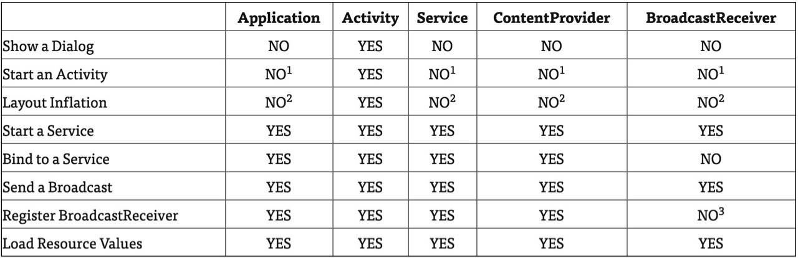

各个Context的使用

Context 能实现哪些功能，主要还是取决于 Context 从何而来，下表列出了不同 Context 的一些不同点：

>application context 可以启动 Activity， 但是前提是需要创建一个新任务。在某些情况下，我们可以使用这种方式实现某种特殊目的，这种方式会创建一个非标准的回退栈，一般不推荐使用，至少不是一个好的实践。
这个是合法的调用，但是 inflation 获得的 View 只会应用系统的主题，而不是当前 app 的自定义主题。
在 4.2 及以上系统版本中， 允许注册 receiver 为 null 的广播监听，主要目的是为了获取 sticky broadcast 的当前值。

Context的继承结构还是稍微有点复杂的，可以看到，直系子类有两个，一个是ContextWrapper，一个是ContextImpl。那么从名字上就可以看出，ContextWrapper是上下文功能的封装类，而ContextImpl则是上下文功能的实现类。而ContextWrapper又有三个直接的子类，ContextThemeWrapper、Service和Application。其中，ContextThemeWrapper是一个带主题的封装类，而它有一个直接子类就是Activity。
那么在这里我们至少看到了几个所比较熟悉的面孔，Activity、Service、还有Application。由此，其实我们就已经可以得出结论了，Context一共有三种类型，分别是Application、Activity和Service。这三个类虽然分别各种承担着不同的作用，但它们都属于Context的一种，而它们具体Context的功能则是由ContextImpl类去实现的。
那么Context到底可以实现哪些功能呢？这个就实在是太多了，弹出Toast、启动Activity、启动Service、发送广播、操作数据库等等等等都需要用到Context。由于Context的具体能力是由ContextImpl类去实现的，因此在绝大多数场景下，Activity、Service和Application这三种类型的Context都是可以通用的。不过有几种场景比较特殊，比如启动Activity，还有弹出Dialog。出于安全原因的考虑，Android是不允许Activity或Dialog凭空出现的，一个Activity的启动必须要建立在另一个Activity的基础之上，也就是以此形成的返回栈。而Dialog则必须在一个Activity上面弹出（除非是System Alert类型的Dialog），因此在这种场景下，我们只能使用Activity类型的Context，否则将会出错。