性能优化（界面响应速度）

一、界面卡顿
（一）界面卡顿原理
Android系统每隔16ms会发出信号去刷新界面。如下图：
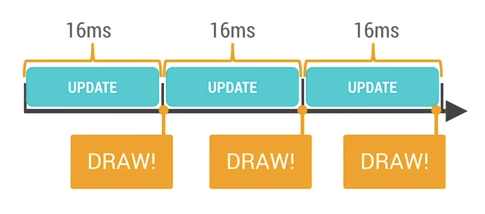
如果一切正常，也就是你update的操作没有超过16ms,在下一个16ms刷新的时候，也能正常刷新。这样界面就不会卡顿。流畅画面是60fps

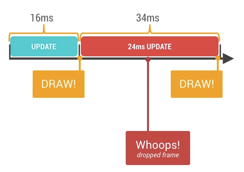
如上图，如果你的update操作耗时24ms，那么第二个16ms之后就没有正常的刷新界面，在用户看来就是界面卡顿了。

这样也就带来了，解决界面卡顿的基本思路：加快界面响应速度。主要原因有：  视图相关、内存与GC、线程相关、其它逻辑处理。下面就这几个原因分别做阐述。

（二）视图相关
视图框架：
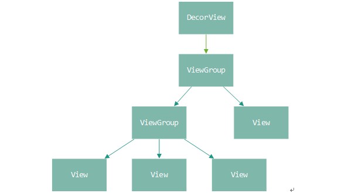

视图框架采用的是组合模式，一个ViewGroup的视图容器同样也是一个普通的View。可以采用递归的调用方法处理所有的View。例如对于绘制动作，就从顶部的ViewGroup一直递归调用所有的View的绘制方法。

视图绘制的入口在ViewRootImpl类中的performTraversals方法中进行。通过DecorView这个代理类调用真正的视图的绘制相关的处理逻辑。处理的逻辑可以简单概括为以下流程。

1、measure过程：根据业务逻辑确定当前视图的宽和高，如果当前视图需要依赖子视图的大小，需要递归先计算子视图的大小。

2、layout过程：对每一个子视图进行布局，指定了明确的位置。在该函数中执行对界面元素的定位。

3、draw过程：顾名思义，这个方法就是用于执行真正的绘制逻辑。

系统提供了invalidate方法触发重绘，提供了requestLayout方法触发重新布局。
以上就是对Android系统的视图模块进行一个简单地回顾和总结，就不详细讲解与性能无关的细节了。

视图方面引起界面卡顿的原因：
1、布局过于复杂。布局逻辑本身就超过了16ms
2、过度绘制。意思是对于同一帧内容重复绘制了很多次。也就是一些不可见的UI也进行了绘制。
3、多余的重新绘制和布局。这个主要是自己设计的View当中会遇到这样的情况。自己控制不当。
4、动画过多，这个就会造成UI线程执行时间过长。

（三）逻辑处理
主线程逻辑时间过长，导致了页面刷新不及时。降低主线程业务逻辑处理时间。

（四）内存与GC
在低版本中GC是在主线程中执行的，所以很容易造成卡顿。在高版本中GC是在其他线程中做的，但是，也会占用CPU资源。也会有界面卡顿的风险。

（五）线程调度

这个其实和逻辑处理类似，也是卡住了主线程。这里是由于其他线程使用了某个资源，导致主线程等待锁的时间过长。其他的线程的优先级不应该超过主线程，要不然会造成主线程分配的时间片过少。线程状态的分析： **《1-1-01.线程状态分析.mp4》**

（六）卡顿检测工具
为了分析界面卡顿的问题，我们需要使用一些工具。
1.    显示过度绘制
    通过在每个视图上显示不同的色块表示绘制的层级，用于发现界面中的过度绘制。
2.    GPU呈现模式分析
    通过柱状图的方式显示GPU绘制图形信息，用于发现异常的绘制。
3.    获取视图层次
    获取到视图结构树，用于发现视图层次的问题。
4.    获取线程状态
    获取应用中的线程状态，用于查看线程运行状态是否异常。
5.    TraceView
    搜集一段时间内的函数耗时信息，用于分析执行过程中的耗时原因。

下面我们依次讲解每个工具的使用，帮助大家使用这些工具进行分析问题。

1、显示过度绘制（开发者选项）
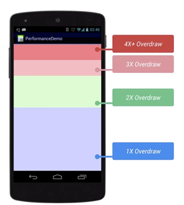
蓝色，淡绿，淡红，深红代表了4种不同程度的过度绘制情况，我们的目标就是尽量减少红色区域，看到更多的蓝色区域。

过度绘制有时候是因为你的界面布局存在大量重叠的部分，还有的时候是因为非必须的重叠背景。例如某个Activity有一个背景，然后里面的Layout又有自己的背景，同时子View又分别有自己的背景。仅仅是通过移除非必须的背景图片，这就能够减少大量的红色区域，增加蓝色区域的占比。

2、GPU呈现模式分析（开发者选项）

随着界面的刷新，界面上会滚动显示垂直的柱状图来表示每帧画面所需要渲染的时间，柱状图越高表示花费的渲染时间越长。中间有一根绿色的横线，代表16ms，我们需要确保每一帧花费的总时间都低于这条横线，这样才能够避免出现卡顿的问题。每一条柱状线都包含三部分，蓝色代表测量绘制Display List的时间，红色代表OpenGL渲染Display List所需要的时间，黄色代表CPU等待GPU处理的时间。我们可以通过这个工具，并配合对界面的测试，能够比较方便的发现哪些场景存在问题，以便后续深入分析并解决。

3、获取视图层次（UI Automator Viewer）
当前我测试过，并使用的是：

可以在DDMS或Android Studio直接dump某个进程的界面结构。
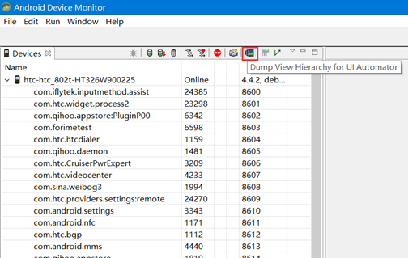
也可以直接使用Android SDK中tools/bin目录下的uiautomatorviewer.bat，能够得到如下结果。
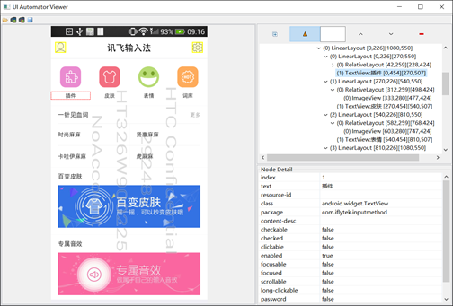
左边是截图，右边是视图的层次结构，这样就可以进行问题的分析。

当然，也可以通过adb命令行来dump出界面的布局信息，命令格式如下：
adb shell uiautomator dump /sdcard/iflytek.xml
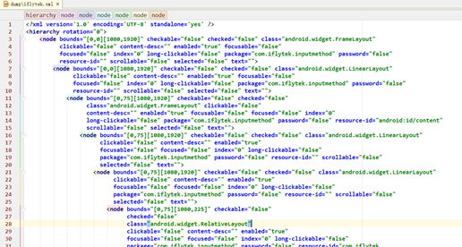
文件的格式就是普通的xml，可以比较方便地利用脚本进行分析。

在Android Studio中，提供了一个功能更加强大的dump视图的工具Layout Inspector，在AndroidMonitor选项卡的左侧，它可以dump指定的activity、dialog、PopupWindow、输入法视图等。

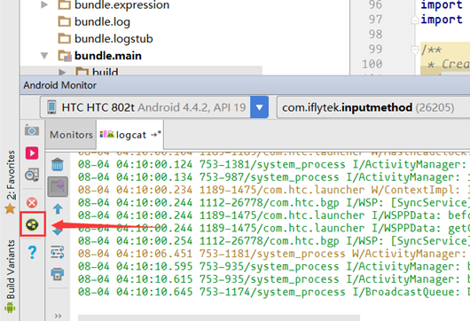

4、获取线程状态
当应用卡顿时，也需要确认是否是线程存在问题，是否存在死锁。因此，我们就需要知道当前应用的所有线程堆栈的信息。获取线程堆栈的信息有以下几种方式。
通过DDMS界面查看线程运行状态
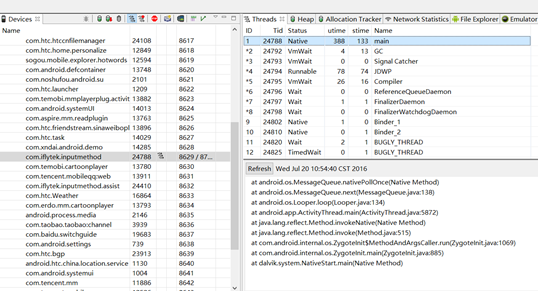
在DDMS界面上，先选择需要查看的线程，然后点击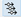按钮就能在右侧查看线程堆栈信息。

5、查看ANR时的traces文件
当系统出现ANR时，会在/data/anr的目录生成traces.txt文件，文件中会有所有进程的所有线程的堆栈信息。
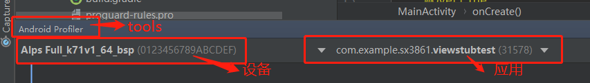

6、调用系统接口

在代码中，我们有的时候可能也需要获取线程的状态，如一些崩溃收集系统中，崩溃的时候也会获取到所有的线程堆栈并上传到服务器端，方便问题分析。在代码中获取线程堆栈的接口如下：

Map<Thread, StackTraceElement[]> map = Thread.getAllStackTraces();

7、Trace View的使用
**《1-1-02.TraceView工具使用.mp4》**
*使用代码Debug.*startMethodTracing(defaultpath)。如果不使用参数defaultpath，就会使用下面的默认路径。**

*默认路径：/data/media/0/Android/data/com.example.sx3861.viewstubtest/files/dmtrace.trace*

**DDMS 使用，D:/SDK/tools/monitor.bat**
加载dmtrace.trace
(1)启动DDMS：D:\SDK\tools\monitor.bat 报错就进去改代码。
(2)加载文件

（七）响应速度优化
1、视图优化
(1) include：<include layout="@layout/includedlayout" />

(2) merge：在使用了include标签之后，可能会重复嵌套ViewGroup（LinearLayout等），如果被包裹的那个layout(上面那个includedlayout)，在最外层套用了merge标签，就会去除重复的ViewGroup嵌套。这个标签不会自动去除，他相当于代替一个viewgroup的作用，只不过真实显示的时候，他不出现。所以还是需要代码中去除重复的layout.

(3) ViewStub：
<viewstub
....
id = "@+id/viewstub"
layout = "@layout/otherview"
>
ViewStub viewStub = findViewByID("viewstub");
viewStub.inflate()或者viewStub.setVisibility(View.VISIBLE);

以上两种方式都会让otherview 显示出来，上面两个显示方式都只能调用一次，setVisibility()实际调用的就是inflate()。inflate方法会去找寻viewstub的parent Group,当调用了一次inflate之后，viewstub就会从现有的界面布局中去除。所以找不到他的parent，所以调用第二次会出错。java.lang.IllegalStateException: ViewStub must have a non-null ViewGroup viewParent。

ViewStub不支持merge：Caused by: android.view.InflateException: <merge /> can be used only with a valid ViewGroup root and attachToRoot=true

(4) 移除Activity的背景，减少绘制。

(5) 在自定义视图时，可以通过在调用invalidate方法只刷新必要的区域。在绘制元素时，可以使用clipRect方法指定一块矩形区域，只有在这个区域内才会被绘制，其他的区域会被忽视。还可以 使用quickreject()方法来判断是否没和某个矩形相交，从而跳过那些非矩形区域内的绘制操作

2、内存优化（参考笔记中的内存优化）

3、合理的数据结构和算法

4、使用数据缓存：比如图片加载什么的。

5、一些计算密集型的处理逻辑，最好使用native 打包成so库

6、减少反射的使用

7、使用系统库函数

8、合理使用线程

合理使用线程，采用线程池，而不是到处创建野线程；后台用于文件读写、网络请求的线程，优先级可以设置为低优先级；采用系统提供的线程同步数据结构，效率更高，如java.util.concurrent包下的数据结构；根据代码逻辑的合理性，可以采用CAS锁、读写锁等。

视图优化视频（**《1-1-03.视图优化案例.mp4》**）