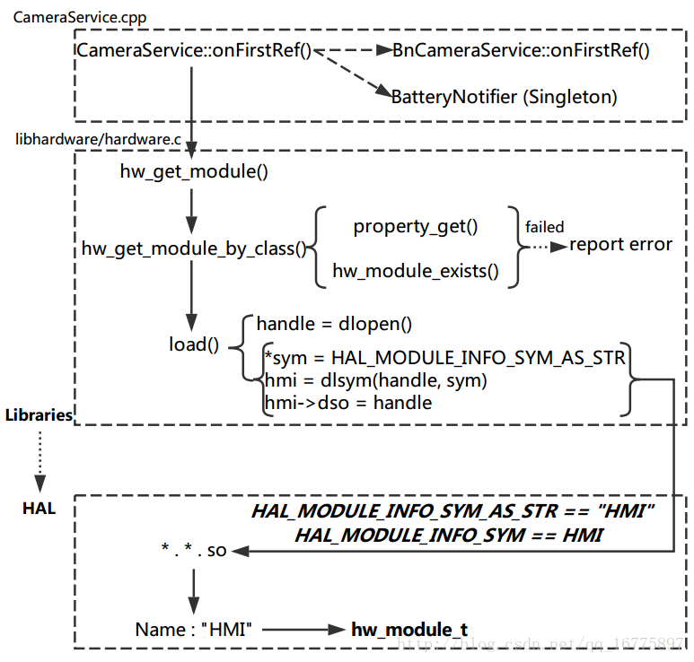

Android Camera 流程学习记录（三）—— Camera hw_get_module() 相关逻辑 - 天王盖地虎626的个人空间 - OSCHINA

简介  
这一篇笔记，我们将从 hw\_get\_module() 函数入手，去探究 Libraries 层是如何调用 HAL 层的库中的函数的。  
CameraService 是在开机时就会启动的，而当它第一次启动时，就会调用一个名为 onFirstRef() 的成员函数，我们所要探究的内容就是从这里开始的。  
NOTE：   
这一部分主要参考：   
Android–hw\_get\_module解析  
本来想一天内应该能搞定这篇记录，结果公司这边正好有个项目要做，于是只能在闲暇时间慢慢写出来了。  
hw\_get\_module()  
1\. CameraService  
1.1 CameraService.cpp  
位置：framework/av/services/camera/libcameraservice/CameraService.cpp  
CameraService::onFirstRef()：   
首先调用其基类的 onFirstRef 函数。  
更新 notifier （这个 BatteryNotifier 好像是个单例，看类名好像和电池有关）。  
通过 hw\_get\_module 函数获取 rawModule。  
注意 rawModule 是 camera\_module\_t 类型。  
利用 rawModule 创建 mModule 的实例，mModule 是 CameraModule 类。  
    BnCameraService::onFirstRef();

    // Update battery life tracking if service is restarting  
    BatteryNotifier& notifier(BatteryNotifier::getInstance());  
    notifier.noteResetCamera();  
    notifier.noteResetFlashlight();

    camera\_module\_t *rawModule;  
    /\*\*\* NOTE THIS ***/  
    int err = hw\_get\_module(CAMERA\_HARDWARE\_MODULE_ID,  
            (const hw\_module\_t **)&rawModule);  
    if (err < 0) {  
        ALOGE("Could not load camera HAL module: %d (%s)", err, strerror(-err));  
        logServiceError("Could not load camera HAL module", err);  
        return;  
    }

    /\*\*\* NOTE THIS ***/  
    mModule = new CameraModule(rawModule);  
    err = mModule->init();

2\. hardware  
2.1 hardware.h  
位置：hardware/libhardware/include/hardware/hardware.h  
注意两个宏定义：  
/**  
 \* Name of the hal\_module\_info  
 */  
#define HAL\_MODULE\_INFO_SYM         HMI

/**  
 \* Name of the hal\_module\_info as a string  
 */  
#define HAL\_MODULE\_INFO\_SYM\_AS_STR  "HMI"

声明了这两个函数：   
hw\_get\_module()：   
作用是通过传入的 id 来获取模块相关的信息。  
成功则返回 0，出错则返回值小于 0 且 *module == NULL。  
hw\_get\_module\_by\_class()：   
作用是通过 class_id 获取与模块实例相关的信息。  
提供模块信息的库文件应该是带有这样命名规范的：   
\- audio.primary.&lt;variant&gt;.so   
\- audio.a2dp.&lt;variant&gt;.so  
/**  
 \* Get the module info associated with a module by id.  
 *  
 \* [@return](https://my.oschina.net/u/556800): 0 == success, <0 == error and *module == NULL  
 */  
int hw\_get\_module(const char \*id, const struct hw\_module\_t \*\*module);

/**  
 \* Get the module info associated with a module instance by class 'class_id'  
 \* and instance 'inst'.  
 *  
 \* Some modules types necessitate multiple instances. For example audio supports  
 \* multiple concurrent interfaces and thus 'audio' is the module class  
 \* and 'primary' or 'a2dp' are module interfaces. This implies that the files  
 \* providing these modules would be named audio.primary.&lt;variant&gt;.so and  
 \* audio.a2dp.&lt;variant&gt;.so  
 *  
 \* [@return](https://my.oschina.net/u/556800): 0 == success, <0 == error and *module == NULL  
 */  
int hw\_get\_module\_by\_class(const char \*class_id, const char \*inst,  
                           const struct hw\_module\_t **module);

2.2 hardware.c  
位置：hardware/libhardware/hardware.c  
注意这个数组：  
static const char *variant_keys\[\] = {  
    "ro.hardware",  /* This goes first so that it can pick up a different  
                       file on the emulator. */  
    "ro.product.board",  
    "ro.board.platform",  
    "ro.arch"  
};

hw\_get\_module()：   
这是我们重点追踪的函数。  
它直接返回调用另一个函数。  
int hw\_get\_module(const char \*id, const struct hw\_module\_t \*\*module)  
{  
    return hw\_get\_module\_by\_class(id, NULL, module);  
}

hw\_get\_module\_by\_class()：   
读取库文件，尝试的顺序是：   
ro.hardware  
ro.product.board  
ro.board.platform  
ro.arch  
default  
通过 load 函数加载模块。  
    /\* First try a property specific to the class and possibly instance */  
    snprintf(prop\_name, sizeof(prop\_name), "ro.hardware.%s", name);  
    if (property\_get(prop\_name, prop, NULL) > 0) {  
        if (hw\_module\_exists(path, sizeof(path), name, prop) == 0) {  
            goto found;  
        }  
    }

    /\* Loop through the configuration variants looking for a module */  
    for (i=0 ; i<HAL\_VARIANT\_KEYS_COUNT; i++) {  
        if (property\_get(variant\_keys\[i\], prop, NULL) == 0) {  
            continue;  
        }  
        if (hw\_module\_exists(path, sizeof(path), name, prop) == 0) {  
            goto found;  
        }  
    }

    /\* Nothing found, try the default */  
    if (hw\_module\_exists(path, sizeof(path), name, "default") == 0) {  
        goto found;  
    }

    return -ENOENT;

found:  
    /\* load the module, if this fails, we're doomed, and we should not try  
     \* to load a different variant. */  
    /\*\*\* NOTE THIS ***/  
    return load(class_id, path, module);

load()：   
调用 dlopen() 函数获取一个 handle。  
调用 dlsym() 函数从动态链接库中获取 hw\_module\_t 类型的 hmi。  
NOTE：   
为了获取动态链接库中的结构体，我们需要用到一个字符串 sym。  
sym 对应宏 HAL\_MODULE\_INFO\_SYM\_AS_STR，即 “HMI”。  
我们的动态链接库 .so 文件，是一个 ELF 文件。  
ELF：Executable and Linkable Format，可执行链接格式。  
ELF 文件头保存了一个路线图，用于描述文件的组织结构。  
通过 readelf -s 命令，我们可以查看对应的 .so 文件描述，可以看到其中有一个 Name 属性为 HMI ，其对应的位置就是我们所需要的结构体 hw\_module\_t。  
于是我们通过 HMI 字段，就可以从动态链接库中读取出相应的结构体，从而得以在 Libraries 层中调用 HAL 层的库函数。  
至此，我们就获得了最终的 rawModule，然后我们回到 onFirstRef() 中继续分析。  
static int load(const char *id,  
        const char *path,  
        const struct hw\_module\_t **pHmi)  
{  
    int status = -EINVAL;  
    void *handle = NULL;  
    struct hw\_module\_t *hmi = NULL;

    /*  
     \* load the symbols resolving undefined symbols before  
     \* dlopen returns. Since RTLD_GLOBAL is not or'd in with  
     \* RTLD_NOW the external symbols will not be global  
     */  
    /\*\*\* NOTE THIS ***/  
    handle = dlopen(path, RTLD_NOW);  
    if (handle == NULL) {  
        char const *err_str = dlerror();  
        ALOGE("load: module=%s\
%s", path, err\_str?err\_str:"unknown");  
        status = -EINVAL;  
        goto done;  
    }

    /\* Get the address of the struct hal\_module\_info. */  
    /\*\*\* NOTE THIS ***/  
    const char *sym = HAL\_MODULE\_INFO\_SYM\_AS_STR;  
    hmi = (struct hw\_module\_t *)dlsym(handle, sym);  
    if (hmi == NULL) {  
        ALOGE("load: couldn't find symbol %s", sym);  
        status = -EINVAL;  
        goto done;  
    }

    /\* Check that the id matches */  
    if (strcmp(id, hmi->id) != 0) {  
        ALOGE("load: id=%s != hmi->id=%s", id, hmi->id);  
        status = -EINVAL;  
        goto done;  
    }

    hmi->dso = handle;  
        /\* success */  
    status = 0;

/\*\*\* NOTE THIS ***/  
done:  
    if (status != 0) {  
        hmi = NULL;  
        if (handle != NULL) {  
            dlclose(handle);  
            handle = NULL;  
        }  
    } else {  
        ALOGV("loaded HAL id=%s path=%s hmi=%p handle=%p",  
                id, path, *pHmi, handle);  
    }

    *pHmi = hmi;

    return status;  
}

3\. CameraModule  
3.1 CameraModule.cpp  
位置：frameworks/av/services/camera/libcameraservice/common/CameraModule.cpp  
构造函数：   
注意，这里的 mModule 是 camera\_module\_t 类型。  
CameraModule::CameraModule(camera\_module\_t *module) {  
    if (module == NULL) {  
        ALOGE("%s: camera hardware module must not be null",   
                \_\_FUNCTION\_\_);  
        assert(0);  
    }  
    mModule = module;  
}

init()：   
调用 mModule 的 init() 函数。  
如果没有指定的 init() 函数，则 init 流程到这里就可以结束了。  
int CameraModule::init() {  
    ATRACE_CALL();  
    int res = OK;  
    if (getModuleApiVersion() >= CAMERA\_MODULE\_API\_VERSION\_2_4 &&  
            mModule->init != NULL) {  
        ATRACE\_BEGIN("camera\_module->init");  
        res = mModule->init();  
        ATRACE_END();  
    }  
    mCameraInfoMap.setCapacity(getNumberOfCameras());  
    return res;  
}

3.2 camera_common.h  
位置：hardware/libhardware/include/hardware/camera_common.h  
声明了 camera\_module\_t：   
结构体中声明了许多函数指针。  
其中就有 init 函数指针。  
这个指针指向的具体函数，是根据具体的 Camera 设备确定的，其中我查看了 QCamera2Factory.cpp ，这里就实现了对应的函数。  
到这里暂时就没必要再深入下去了，因为业务关系现在优先把 Framework 到 Libraries 的部分搞清楚。  
    /**  
     \* init:  
     *  
     \* This method is called by the camera service before any other methods  
     \* are invoked, right after the camera HAL library has been successfully  
     \* loaded. It may be left as NULL by the HAL module, if no initialization  
     \* in needed.  
     *  
     \* It can be used by HAL implementations to perform initialization and  
     \* other one-time operations.  
     *  
     \* Version information (based on camera\_module\_t.common.module\_api\_version):  
     *  
     \* CAMERA\_MODULE\_API\_VERSION\_1\_x/2\_0/2\_1/2\_2/2_3:  
     \*   Not provided by HAL module. Framework will not call this function.  
     *  
     \* CAMERA\_MODULE\_API\_VERSION\_2_4:  
     \*   If not NULL, will always be called by the framework once after the HAL  
     \*   module is loaded, before any other HAL module method is called.  
     *  
     \* Return values:  
     *  
     \* 0:           On a successful operation.  
     *  
     \* -ENODEV:     Initialization cannot be completed due to an internal  
     \*              error. The HAL must be assumed to be in a nonfunctional  
     \*              state.  
     *  
     */  
    int (*init)();

3.3* QCamera2Factory  
看路径，这几个文件应该是和高通平台有关的。  
3.3.1* QCamera2Factory.h  
位置：hardware/qcom/camera/QCamera2/QCamera2Factory.h  
3.3.2* QCamera2Factory.cpp  
位置：hardware/qcom/camera/QCamera2/QCamera2Factory.cpp  
3.3.3* QCamera2Hal.cpp  
位置：hardware/qcom/camera/QCamera2/QCamera2Hal.cpp  
这个文件中有如下定义：   
详细描述了 camera_common。  
确定了函数指针的指向。  
static hw\_module\_t camera_common = {  
    .tag                    = HARDWARE\_MODULE\_TAG,  
    .module\_api\_version     = CAMERA\_MODULE\_API\_VERSION\_2_4,  
    .hal\_api\_version        = HARDWARE\_HAL\_API_VERSION,  
    .id                     = CAMERA\_HARDWARE\_MODULE_ID,  
    .name                   = "QCamera Module",  
    .author                 = "Qualcomm Innovation Center Inc",  
    .methods                = &qcamera::QCamera2Factory::mModuleMethods,  
    .dso                    = NULL,  
    .reserved               = {0}  
};

camera\_module\_t HAL\_MODULE\_INFO_SYM = {  
    .common                 = camera_common,  
    .get\_number\_of\_cameras  = qcamera::QCamera2Factory::get\_number\_of\_cameras,  
    .get\_camera\_info        = qcamera::QCamera2Factory::get\_camera\_info,  
    .set\_callbacks          = qcamera::QCamera2Factory::set\_callbacks,  
    .get\_vendor\_tag\_ops     = qcamera::QCamera3VendorTags::get\_vendor\_tag\_ops,  
    .open\_legacy            = qcamera::QCamera2Factory::open\_legacy,  
    .set\_torch\_mode         = qcamera::QCamera2Factory::set\_torch\_mode,  
    .init                   = NULL,  
    .reserved               = {0}  
};

4\. 流程简图

小结  
这篇笔记中，我们从 CameraService::onFirstRef() 入手，逐渐理顺了以 hw\_get\_module() 为中心的一个调用逻辑。  
实际上，Android HAL 层有一个通用的入口，即宏 HAL\_MODULE\_INFO_SYM，通过它，我们获取 HAL 层中的模块实例，从而使得我们可以调用 HAL 层所提供的函数。  
理解了 HAL 层的入口，接下来我们可以去对 Camera.startPreview() 的控制流程进行分析，从而再次加深我们对 Camera 控制流的理解。