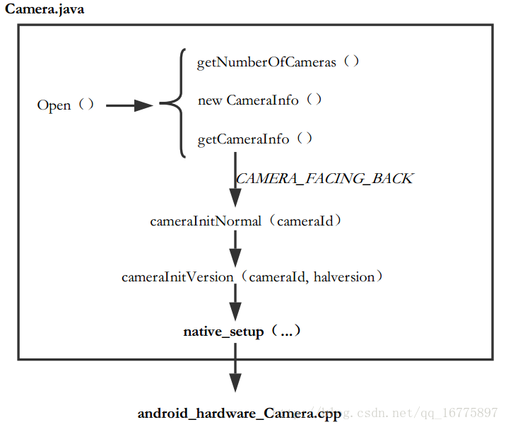
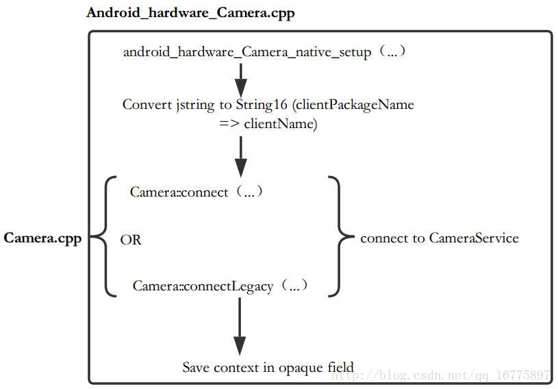
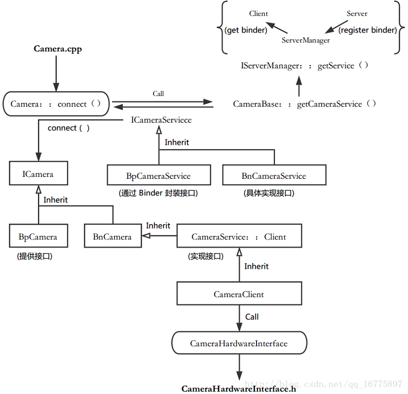

Android Camera 流程学习记录（二）—— Camera Open 调用流程 - 天王盖地虎626的个人空间 - OSCHINA

- 这一章里，我们将 `Camera.java` 中的 `open()` 方法作为切入点。作为打开摄像头的方法，无论哪种 Camera 应用都需要调用到它。
- 从 `Camera.open()` 被调用开始，这一指令是如何通过 Framework 层走到 C/C++ 层，又是如何进入 HAL 层从而使得指令能够到达设备端。
- 通过追踪源码，我们可以比较清晰地了解整个过程。
- 接下来按照 `Framework -> Android Runtime -> C/C++ Libraries -> HAL` 的顺序去分析整个调用流程。
- NOTE： 
    - 这一部分主要参考的资料： 
        - [Android Camera 系统架构源码分析(1)—->Camera的初始化](http://blog.csdn.net/shell812/article/details/49424857)
    - 看源码的初始阶段真的是会很烦躁……

## 1. Frameworkz
### 1.1 Camera.java

- 路径：`frameworks/base/core/java/android/hardware/Camera.java`
- 首先从 `Open()` 方法开始： 
    - 获取 `Camera` 设备的个数。
    - 依次获取设备信息，如果是获取到后置摄像头（默认），则调用 `new Camera(int)` 构造对应的摄像头实例。
- 注释翻译： 
    - 构造一个新的摄像头对象，以获取第一个后置摄像头。
    - 若设备中没有后置摄像头，则返回 `null` 。
- NOTE：还有一个方法 `open(int)` ，它可以直接指定打开的摄像头。
```c++

/***
    
* Creates a new Camera object to access
    
* the first back-facing camera on the
    
* device. If the device does not have a back-facing camera,
    
* this returns null.
    
* [@see](https://my.oschina.net/weimingwei) #open(int)
    
*/
    
public static Camera open() {
    
int numberOfCameras = getNumberOfCameras();
    
CameraInfo cameraInfo = new CameraInfo();
    
for (int i = 0; i < numberOfCameras; i++) {
    
getCameraInfo(i, cameraInfo);
    
if (cameraInfo.facing == CameraInfo.CAMERA_FACING_BACK) {
    
return new Camera(i);
    
}
    
}
    
return null;
    
}
```

- `Camera(int cameraId)`： 
    - 通过调用 `cameraInitNormal(Id)` 方法对指定摄像头进行初始化。
```c++
/** used by Camera#open, Camera#open(int) */
    
Camera(int cameraId) {
    
int err = cameraInitNormal(cameraId);
    
if (checkInitErrors(err)) {
    
if (err == -EACCES) {
    
throw new RuntimeException("Fail to connect to camera service");
    
} else if (err == -ENODEV) {
    
throw new RuntimeException("Camera initialization failed");
    
}
    
// Should never hit this.
    
throw new RuntimeException("Unknown camera error");
    
}
    
}
```    

- `cameraInitNormal(int cameraId)`： 
    - 指定 `halVersion` 参数。
    - 调用 `cameraInitVersion(int cameraId, int halVersion)`。
```c++
private int cameraInitNormal(int cameraId) {
    
return cameraInitVersion(cameraId,
    
CAMERA_HAL_API_VERSION_NORMAL_CONNECT);
    
}
```    

- `cameraInitVersion(int cameraId, int halVersion)`： 
    - 将各个回调函数置空。
    - `Looper` 的作用没有仔细研究，从代码逻辑上看，可能与事件的监听（需要循环操作）有关。
    - 通过 `Looper` 对事件处理对象进行实例化后，就调用 `native_setup` 方法进入 `JNI（Java Native Interface）` 库中调用对应的函数。
    - 至此，`open()` 方法开始进入 `Android Runtime` 层。
```c++
private int cameraInitVersion(int cameraId,
    
int halVersion) {
    
mShutterCallback = null;
    
mRawImageCallback = null;
    
mJpegCallback = null;
    
mPreviewCallback = null;
    
mPostviewCallback = null;
    
mUsingPreviewAllocation = false;
    
mZoomListener = null;
    
Looper looper;
    
if ((looper = Looper.myLooper()) != null) {
    
mEventHandler = new EventHandler(this, looper);
    
} else if ((looper = Looper.getMainLooper()) != null) {
    
mEventHandler = new EventHandler(this, looper);
    
} else {
    
mEventHandler = null;
    
}
    
return native_setup(new WeakReference<Camera>(this),
    
cameraId, halVersion,
    
ActivityThread.currentOpPackageName());
    
}
    
```
* * *

### 1.2 Framework 中流程简图




## 2. Android Runtime
### 2.1 android\_hardware\_Camera.cpp

- 路径：`frameworks/base/core/jni/android_hardware_Camera.cpp`
- `native_setup()`： 
    - 刚开始要先把 `clientPackageName` 做一个类型转换，变成 `clientName`。
    - 建立一个 `Camera` 类型的 `StrongPointer(sp)`。
    - 通过函数 `Camera::connect()` 或 `Camera::connectLegacy()`，让客户端与服务端进行连接，并返回相应的 `Camera` 实例。
    - 最后对返回的实例进行一些基本的检查，并保存上下文。
    - 在 `connect()` 的时候，就进入了 `C/C++ Libraries` 的 C/S 结构中，而 `Camera` 则属于 `Client`。
```c++
// connect to camera service
    
static jint android_hardware_Camera_native_setup(JNIEnv *env,
    
jobject thiz, jobject weak_this,
    
jint cameraId, jint halVersion,
    
jstring clientPackageName)
    
{
    
// convert jstring to String16(clientPackageName -> clientName)
......
    
......
    
sp<Camera> camera;
    
if (halVersion == CAMERA_HAL_API_VERSION_NORMAL_CONNECT) {
    
/***** NOTE THIS *****/
    
// Default path: hal version is don't care, do normal camera connect.
    
camera = Camera::connect(cameraId, clientName,
    
Camera::USE_CALLING_UID,
    
Camera::USE_CALLING_PID);
    
} else {
    
jint status = Camera::connectLegacy(cameraId,
    
halVersion, clientName,
    
Camera::USE_CALLING_UID, camera);
    
if (status != NO_ERROR) {
    
return status;
    
}
    
}
    
if (camera == NULL) {
    
return -EACCES;
    
}
    

// make sure camera hardware is alive
    
if (camera->getStatus() != NO_ERROR) {
    
return NO_INIT;
    
}
    

// save context in opaque field
    
......
    
......
    
}
```    

* * *

### 2.2 Runtime 中流程简图



* * *

* * *

## 3. C/C++ Libraries

* * *

### 3.1 Camera

#### 3.1.1 Camera.h

- 位置：`frameworks/av/include/camera/Camera.h`
- 注意 `CameraTraits<Camera>` 的结构体：
```c++
template <>
    
struct CameraTraits<Camera>
    
{
    
typedef CameraListener TCamListener;
    
typedef ::android::hardware::ICamera TCamUser;
    
typedef ::android::hardware::ICameraClient TCamCallbacks;
    
typedef ::android::binder::Status(::android::hardware::ICameraService::*TCamConnectService)
    
(const sp<::android::hardware::ICameraClient>&,
    
int, const String16&, int, int,
    
/*out*/
    
sp<::android::hardware::ICamera>*);
    
static TCamConnectService fnConnectService;
    
};
    
```
#### 3.1.2 Camera.cpp

- 位置：`framework/av/camera/Camera.cpp`
- 注意 `fnConnectService` 是对应到 `ICameraService::connect` 函数的。
```c++
CameraTraits<Camera>::TCamConnectService CameraTraits<Camera>::fnConnectService =
    
&::android::hardware::ICameraService::connect;
    
```

- `Camera::connect` ： 
    - 这里直接调用了 `CameraBaseT::connect()` 这是定义在 `CameraBase.cpp` 中的函数。
```c++
sp<Camera> Camera::connect(int cameraId,
    
const String16& clientPackageName,
    
int clientUid, int clientPid)
    
{
    
return CameraBaseT::connect(cameraId,
    
clientPackageName, clientUid, clientPid);
    
}
```    

* * *

### 3.2 CameraBase

#### 3.2.1 CameraBase.h

- 位置：`frameworks/av/include/camera/CameraBase.h`
- 注意模板信息： 
    - `TCam` 对应 `Camera`。
    - `TCamTraits` 对应 `CameraTraits<Camera>`。

```
template <typename TCam, typename TCamTraits = CameraTraits<TCam> >
```

- 1

- 注意类成员变量声明部分： 
    - 即可知道 `CameraBaseT` 对应 `CameraBase<Camera>`。
```c++
sp<TCamUser> mCamera;
    
status_t mStatus;
    
sp<TCamListener> mListener;
    
const int mCameraId;
    

/***** NOTE THIS *****/
    
typedef CameraBase<TCam> CameraBaseT;
    
```
#### 3.2.2 CameraBase.cpp

- 位置：`framework/av/camera/CameraBase.cpp`
- `connect()`： 
    - 实例化一个 `Camera`
    - 通过 `Camera` 获取 `ICameraClient` 指针。
    - 通过 `getCameraService()` 函数获取 `ICameraService`。
    - 通过 `ICameraService::connect()` 函数获得一个 `mCamera`， 即 `ICamera` 实例。
    - 将 `ICamera` 实例与 `Binder` 建立联系。
```c++
template <typename TCam, typename TCamTraits>
    
sp<TCam> CameraBase<TCam, TCamTraits>::connect(int cameraId,
    
const String16& clientPackageName,
    
int clientUid, int clientPid)
    
{
    
ALOGV("%s: connect", __FUNCTION__);
    
/***** NOTE THIS *****/
    
sp<TCam> c = new TCam(cameraId);
    
sp<TCamCallbacks> cl = c;
    
const sp<::android::hardware::ICameraService> cs = getCameraService();
    

binder::Status ret;
    
if (cs != nullptr) {
    
/***** NOTE THIS *****/
    
TCamConnectService fnConnectService = TCamTraits::fnConnectService;
    
ret = (cs.get()->*fnConnectService)(cl, cameraId,
    
clientPackageName, clientUid,
    
clientPid, /*out*/ &c->mCamera);
    
}
    
if (ret.isOk() && c->mCamera != nullptr) {
    
/***** NOTE THIS *****/
    
IInterface::asBinder(c->mCamera)->linkToDeath(c);
    
c->mStatus = NO_ERROR;
    
} else {
    
ALOGW("An error occurred while connecting to camera %d: %s", cameraId,
    
(cs != nullptr) ? "Service not available" : ret.toString8().string());
    
c.clear();
    
}
    
return c;
    
}
```    

- `getCameraService()`： 
    - 注意，`gCameraService` 是一个 `ICameraService`。
    - 首先调用 `ICameraService` 的 `get` 函数，如果能获取到 `ICameraService` 则返回。
    - 若没有返回，则通过 `IServiceManager` 来获取一个 `ICameraService`，这个过程中主要是通过 `IBinder` 来进行数据的获取的，其中机制暂时忽略，只要知道通过 `Binder` 我们获取了一个 `ICameraService` 就好。
```c++
// establish binder interface to camera service
    
template <typename TCam, typename TCamTraits>
    
const sp<::android::hardware::ICameraService> CameraBase<TCam, TCamTraits>::getCameraService()
    
{
    
Mutex::Autolock _l(gLock);
    

/***** NOTE THIS *****/
    
if (gCameraService.get() == 0) {
    
char value[PROPERTY_VALUE_MAX];
    
property_get("config.disable_cameraservice", value, "0");
    
if (strncmp(value, "0", 2) != 0 && strncasecmp(value, "false", 6) != 0) {
    
return gCameraService;
    
}
    

/***** NOTE THIS *****/
    
sp<IServiceManager> sm = defaultServiceManager();
    
sp<IBinder> binder;
    
do {
    
binder = sm->getService(String16(kCameraServiceName));
    
if (binder != 0) {
    
break;
    
}
    
ALOGW("CameraService not published, waiting...");
    
usleep(kCameraServicePollDelay);
    
} while(true);
    

if (gDeathNotifier == NULL) {
    
gDeathNotifier = new DeathNotifier();
    
}
    
binder->linkToDeath(gDeathNotifier);
    
/***** NOTE THIS *****/
    
gCameraService = interface_cast<::android::hardware::ICameraService>(binder);
    
}
    
ALOGE_IF(gCameraService == 0, "no CameraService!?");
    
return gCameraService;
    
}
    
```
* * *

### 3.3 ICameraService

- NOTE： 
    - 这一节主要是了解一下关于 Binder 通讯中的一些内部逻辑。
    - 实际上在 `CameraBase` 中，所调用的 `connect` 对应的是 `CameraService::connect()` ，在下一节中再进行分析。

#### 3.3.1 ICameraService.aidl

- 位置：`frameworks/av/camera/aidl/android/hardware/ICameraService.aidl`
- `aidl` 是一种内部进程通讯的描述语言，通过它我们可以定义通讯的接口。
- 注释： 
    - 这里定义了运行在媒体服务端的，本地摄像头服务的 Binder 接口
```c++
/**
    
* Binder interface for the native camera service running in mediaserver.
    
*
    
* [@hide](https://my.oschina.net/u/1429664)
    
*/
    

- `connect` 接口： 
    - 这里的注释说明了，这个方法调用的是旧的 `Camera API`，即 `API 1`。

/**
    
* Open a camera device through the old camera API
    
*/
    
ICamera connect(ICameraClient client,
    
int cameraId,
    
String opPackageName,
    
int clientUid, int clientPid);
    
```
#### 3.3.2 ICameraService.cpp

- 位置：`out/target/product/generic/obj/SHARED_LIBRARIES/libcamera_client_intermediates/aidl-generated/src/aidl/android/hardware/ICameraService.cpp`
- `out` 文件夹是源码编译后才生成的.
- 这个 `ICameraService.cpp` 以及其头文件 `ICameraService.h` 都是根据其对应的 `aidl` 文件自动生成的。
- `BpCameraService::connect()`： 
    - 注意，这里是 `BpCameraservice`，它继承了 `ICameraService`，同时也继承了 `BpInterface`。
    - `Parcel` 可以看成是 `Binder` 通讯中的信息传递中介。
    - 首先把相应的数据写入 `Parcel`。
    - 然后调用远程接口 `remote()` 中的处理函数 `transact()`。
    - 最后通过返回的 `reply` 数据判断是否有 `error`。
```c++
::android::binder::Status BpCameraService::connect(const ::android::sp<::android::hardware::ICameraClient>& client,
    
int32_t cameraId, const ::android::String16& opPackageName,
    
int32_t clientUid, int32_t clientPid,
    
::android::sp<::android::hardware::ICamera>* _aidl_return)
    
{
    
::android::Parcel _aidl_data;
    
::android::Parcel _aidl_reply;
    
::android::status_t _aidl_ret_status = ::android::OK;
    
::android::binder::Status _aidl_status;
    
_aidl_ret_status = _aidl_data.writeInterfaceToken(getInterfaceDescriptor());
    

/***** NOTE THIS *****/
    
if (((_aidl_ret_status) != (::android::OK))) {
    
goto _aidl_error;
    
}
    
_aidl_ret_status = _aidl_data.writeStrongBinder(::android::hardware::ICameraClient::asBinder(client));
    
if (((_aidl_ret_status) != (::android::OK))) {
    
goto _aidl_error;
    
}
    
_aidl_ret_status = _aidl_data.writeInt32(cameraId);
    
if (((_aidl_ret_status) != (::android::OK))) {
    
goto _aidl_error;
    
}
    
_aidl_ret_status = _aidl_data.writeString16(opPackageName);
    
if (((_aidl_ret_status) != (::android::OK))) {
    
goto _aidl_error;
    
}
    
_aidl_ret_status = _aidl_data.writeInt32(clientUid);
    
if (((_aidl_ret_status) != (::android::OK))) {
    
goto _aidl_error;
    
}
    
_aidl_ret_status = _aidl_data.writeInt32(clientPid);
    
if (((_aidl_ret_status) != (::android::OK))) {
    
goto _aidl_error;
    
}
    

/***** NOTE THIS *****/
    
_aidl_ret_status = remote()->transact(ICameraService::CONNECT, _aidl_data, &_aidl_reply);
    
if (((_aidl_ret_status) != (::android::OK))) {
    
goto _aidl_error;
    
}
    
_aidl_ret_status = _aidl_status.readFromParcel(_aidl_reply);
    
if (((_aidl_ret_status) != (::android::OK))) {
    
goto _aidl_error;
    
}
    
if (!_aidl_status.isOk()) {
    
return _aidl_status;
    
}
    
_aidl_ret_status = _aidl_reply.readStrongBinder(_aidl_return);
    
if (((_aidl_ret_status) != (::android::OK))) {
    
goto _aidl_error;
    
}
    
_aidl_error:
    
_aidl_status.setFromStatusT(_aidl_ret_status);
    
return _aidl_status;
    
}
```    

- `BnCameraService::onTransact()`： 
    - 消息处理函数。
    - 这个函数太长，只截取 `CONNECT` 相关的一段。
    - `BpCameraService` 通过 `Binder` 封装了接口，而 `BnCameraService` 则具体实现接口。
    - 注意到这里一一接收了 `Bp` 传来的数据，然后调用了具体的 `connect` 函数获取 `ICamera` 并且返回。
```c++
case Call::CONNECT:
    
{
    
::android::sp<::android::hardware::ICameraClient> in_client;
    
int32_t in_cameraId;
    
::android::String16 in_opPackageName;
    
int32_t in_clientUid;
    
int32_t in_clientPid;
    
/***** NOTE THIS *****/
    
::android::sp<::android::hardware::ICamera> _aidl_return;
    

if (!(_aidl_data.checkInterface(this))) {
    
_aidl_ret_status = ::android::BAD_TYPE;
    
break;
    
}
    
_aidl_ret_status = _aidl_data.readStrongBinder(&in_client);
    
if (((_aidl_ret_status) != (::android::OK))) {
    
break;
    
}
    
_aidl_ret_status = _aidl_data.readInt32(&in_cameraId);
    
if (((_aidl_ret_status) != (::android::OK))) {
    
break;
    
}
    
_aidl_ret_status = _aidl_data.readString16(&in_opPackageName);
    
if (((_aidl_ret_status) != (::android::OK))) {
    
break;
    
}
    
_aidl_ret_status = _aidl_data.readInt32(&in_clientUid);
    
if (((_aidl_ret_status) != (::android::OK))) {
    
break;
    
}
    
_aidl_ret_status = _aidl_data.readInt32(&in_clientPid);
    
if (((_aidl_ret_status) != (::android::OK))) {
    
break;
    
}
    

/***** NOTE THIS *****/
    
::android::binder::Status _aidl_status(connect(in_client, in_cameraId, in_opPackageName, in_clientUid, in_clientPid, &_aidl_return));
    
_aidl_ret_status = _aidl_status.writeToParcel(_aidl_reply);
    
if (((_aidl_ret_status) != (::android::OK))) {
    
break;
    
}
    
if (!_aidl_status.isOk()) {
    
break;
    
}
    

/***** NOTE THIS *****/
    
_aidl_ret_status = _aidl_reply->writeStrongBinder(::android::hardware::ICamera::asBinder(_aidl_return));
    
if (((_aidl_ret_status) != (::android::OK))) {
    
break;
    
}
    
}
    
break;
```    

* * *

### 3.4 ICamera

- 这一节我们回到 `CameraBase` 关于 `connect()` 函数的调用中。

#### 3.4.1 ICamera.cpp

- 位置：`frameworks/av/camera/ICamera.cpp`
- `BpCamera` 类只提供给 `Client` 调用的接口。
- 在 `BpCamera` 类中，有 `connect()` 函数：
```c++
virtual status_t connect(const sp<ICameraClient>& cameraClient)
    
{
    
Parcel data, reply;
    
data.writeInterfaceToken(ICamera::getInterfaceDescriptor());
    
data.writeStrongBinder(IInterface::asBinder(cameraClient));
    
remote()->transact(CONNECT, data, &reply);
    
return reply.readInt32();
    
}
```    

- 而 `BnCamera` 类应负责实现接口，但这里有一点特殊，它是通过 `CameraService::Client` 来实现具体接口的。
- 在 `BnCamera` 类中，`onTransact` 函数则有相应的处理：
```c++
case CONNECT: {
    
CHECK_INTERFACE(ICamera, data, reply);
    
sp<ICameraClient> cameraClient = interface_cast<ICameraClient>(data.readStrongBinder());
    
reply->writeInt32(connect(cameraClient));
    
return NO_ERROR;
    
} break;
```    

#### 3.4.2 CameraService.cpp

- 位置：`frameworks/av/services/camera/libcameraservice/CameraService.cpp`
- `connect()`： 
    - 注意这里真正实现逻辑是在 `connectHelper()` 函数中。
    - 获得一个客户端实例并且通过 `*device` 返回。
```c++
Status CameraService::connect(
    
const sp<ICameraClient>& cameraClient,
    
int cameraId,
    
const String16& clientPackageName,
    
int clientUid,
    
int clientPid,
    
/*out*/
    
sp<ICamera>* device) {
    

ATRACE_CALL();
    
Status ret = Status::ok();
    
String8 id = String8::format("%d", cameraId);
    
sp<Client> client = nullptr;
    
ret = connectHelper<ICameraClient,Client>(cameraClient, id,
    
CAMERA_HAL_API_VERSION_UNSPECIFIED, clientPackageName, clientUid, clientPid, API_1,
    
/*legacyMode*/ false, /*shimUpdateOnly*/ false,
    
/*out*/client);
    

if(!ret.isOk()) {
    
logRejected(id, getCallingPid(), String8(clientPackageName),
    
ret.toString8());
    
return ret;
    
}
    

*device = client;
    
return ret;
    
}
```    

#### 3.4.3 CameraService.h

- 位置：`frameworks/av/services/camera/libcameraservice/CameraService.h`
- 注意这个文件中定义了 CameraService::Client 类，这个类通过它的子类 CameraClient 真正实现了 ICamera 的接口。
- `connectHelper()`： 
    - 这个函数实现比较长，截取其中的一段。
    - 首先，如果客户端实例已经存在于 `MediaRecorder` ，则直接将其取出返回。
    - 若不存在，则先获取 `deviceVersion`，然后再调用 `makeClient()` 函数创建一个客户端。
    - 创建客户端后，需要调用其 `initialize()` 函数进行初始化，注意其传入的参数是 `mModule`，这个参数是连接 `Libraries` 与 `HAL`的关键参数。
```c++
sp<BasicClient> clientTmp = nullptr;
    
std::shared_ptr<resource_policy::ClientDescriptor<String8, sp<BasicClient>>> partial;
    
if ((err = handleEvictionsLocked(cameraId,
    
originalClientPid, effectiveApiLevel,
    
IInterface::asBinder(cameraCb), clientName8,
    
/*out*/&clientTmp,
    
/*out*/&partial)) != NO_ERROR) {
    
/***** do something *****/
    
}
    

/***** NOTE THIS *****/
    
if (clientTmp.get() != nullptr) {
    
// Handle special case for API1 MediaRecorder where the existing client is returned
    
device = static_cast<CLIENT*>(clientTmp.get());
    
return ret;
    
}
    

// give flashlight a chance to close devices if necessary.
    
mFlashlight->prepareDeviceOpen(cameraId);
    

// TODO: Update getDeviceVersion + HAL interface to use strings for Camera IDs
    
int id = cameraIdToInt(cameraId);
    
if (id == -1) {
    
ALOGE("%s: Invalid camera ID %s, cannot get device version from HAL.", __FUNCTION__,
    
cameraId.string());
    
return STATUS_ERROR_FMT(ERROR_ILLEGAL_ARGUMENT,
    
"Bad camera ID \"%s\" passed to camera open", cameraId.string());
    
}
    

int facing = -1;
    
/***** NOTE THIS *****/
    
int deviceVersion = getDeviceVersion(id, /*out*/&facing);
    
sp<BasicClient> tmp = nullptr;
    
if(!(ret = makeClient(this, cameraCb,
    
clientPackageName, id, facing, clientPid,
    
clientUid, getpid(), legacyMode, halVersion,
    
deviceVersion, effectiveApiLevel,
    
/*out*/&tmp)).isOk()) {
    
return ret;
    
}
    
client = static_cast<CLIENT*>(tmp.get());
    

LOG_ALWAYS_FATAL_IF(client.get() == nullptr, "%s: CameraService in invalid state",
    
__FUNCTION__);
    

/***** NOTE THIS *****/
    
if ((err = client->initialize(mModule)) != OK) {
    
/***** do somthing *****/
    
}
    

// Update shim paremeters for legacy clients
    
if (effectiveApiLevel == API_1) {
    
// Assume we have always received a Client subclass for API1
    
sp<Client> shimClient = reinterpret_cast<Client*>(client.get());
    
String8 rawParams = shimClient->getParameters();
    
CameraParameters params(rawParams);
    

auto cameraState = getCameraState(cameraId);
    
if (cameraState != nullptr) {
    
cameraState->setShimParams(params);
    
} else {
    
ALOGE("%s: Cannot update shim parameters for camera %s, no such device exists.",
    
__FUNCTION__, cameraId.string());
    
}
    
}
    

if (shimUpdateOnly) {
    
// If only updating legacy shim parameters, immediately disconnect client
    
mServiceLock.unlock();
    
client->disconnect();
    
mServiceLock.lock();
    
} else {
    
// Otherwise, add client to active clients list
    
finishConnectLocked(client, partial);
    
}
    
} // lock is destroyed, allow further connect calls
    

// Important: release the mutex here so the client can call back into the service from its
    
// destructor (can be at the end of the call)
    
device = client;
```    

#### 3.4.4 CameraClient.cpp

- 位置：`frameworks/av/services/camera/libcameraservice/api1/CameraClient.cpp`
- 从文件位置也可以看得出，我们现在走的都是 `Camera API 1` 的流程。
- `CameraClient` 继承了 `CameraService::Client`。
- `CameraClient::initialize()`： 
    - 获取 `CameraHardwareInterface` 实例。
    - 对 `mHardware` 进行初始化。
    - 设置三个回调函数（这里与数据流密切相关）
```c++
status_t CameraClient::initialize(CameraModule *module) {
    
int callingPid = getCallingPid();
    
status_t res;
    

LOG1("CameraClient::initialize E (pid %d, id %d)", callingPid, mCameraId);
    

// Verify ops permissions
    
res = startCameraOps();
    
if (res != OK) {
    
return res;
    
}
    

char camera_device_name[10];
    
snprintf(camera_device_name, sizeof(camera_device_name), "%d", mCameraId);
    

/***** NOTE THIS *****/
    
mHardware = new CameraHardwareInterface(camera_device_name);
    
res = mHardware->initialize(module);
    
if (res != OK) {
    
ALOGE("%s: Camera %d: unable to initialize device: %s (%d)",
    
__FUNCTION__, mCameraId, strerror(-res), res);
    
mHardware.clear();
    
return res;
    
}
    

mHardware->setCallbacks(notifyCallback,
    
dataCallback,
    
dataCallbackTimestamp,
    
(void *)(uintptr_t)mCameraId);
    

// Enable zoom, error, focus, and metadata messages by default
    
enableMsgType(CAMERA_MSG_ERROR | CAMERA_MSG_ZOOM | CAMERA_MSG_FOCUS |
    
CAMERA_MSG_PREVIEW_METADATA | CAMERA_MSG_FOCUS_MOVE);
    

LOG1("CameraClient::initialize X (pid %d, id %d)", callingPid, mCameraId);
    
return OK;
    
}
```    

- 至此，整个 `Libraries` 层的 `open` 流程就结束了，接下来进入到 `HAL` 层。

### 3.5 Libraries 中流程简图



* * *

## 4. HAL

### 4.1 CameraHardwareInterface.h

- 位置：`frameworks/av/services/camera/libcameraservice/device1/CameraHardwareInterface.h`
- `initialize()`： 
    - 通过 `module`，从 `HAL` 层的库中调用相关的函数获取 `Camera` 设备信息。
    - 根据模块 `API` 的版本，判断是用 `open` 函数还是用 `openLegacy`。
    - 调用 `open` 后，通过 `HAL` 中的库，我们的指令就能传递到 `Linux Kernel`，从而下达到具体的设备上。（与具体的驱动相关，暂时不去分析）
    - 最后初始化预览窗口。
```c++
status_t initialize(CameraModule *module)
    
{
    
ALOGI("Opening camera %s", mName.string());
    
camera_info info;
    
status_t res = module->getCameraInfo(atoi(mName.string()), &info);
    
if (res != OK) {
    
return res;
    
}
    

int rc = OK;
    
if (module->getModuleApiVersion() >= CAMERA_MODULE_API_VERSION_2_3 &&
    
info.device_version > CAMERA_DEVICE_API_VERSION_1_0) {
    
// Open higher version camera device as HAL1.0 device.
    
rc = module->openLegacy(mName.string(),
    
CAMERA_DEVICE_API_VERSION_1_0,
    
(hw_device_t **)&mDevice);
    
} else {
    
rc = module->open(mName.string(), (hw_device_t **)&mDevice);
    
}
    
if (rc != OK) {
    
ALOGE("Could not open camera %s: %d", mName.string(), rc);
    
return rc;
    
}
    
initHalPreviewWindow();
    
return rc;
    
}
```

- 至此，我们所研究的 `Camera Open` 整个调用流程就已经比较清晰了。

* * *

* * *

- 在这篇笔记中，我们主要是从 `Camera.open()` 方法被调用开始，对源码进行追溯，从而一层层地了解了它的一个调用的过程，与过程中比较重要的一些逻辑。
- 通过这一轮追溯，我们就可以对 `Camera` 架构有一个更深刻的认识，但是其中可能还有一些知识点没有理清，不过我认为不会影响对于整个架构的了解。

* * *

- 我认为比较难去理解的就是 `Libraries` 中，关于客户端与服务端交互的部分。这一部分我在阅读源码的时候花了很多时间去理解，实际上目前为止，也只是有比较基础的概念。对这部分，还有很多更深入的内容需要去探究，在系统源码分析[1](https://blog.csdn.net/weixin_34348174/article/details/93458607#fn:book_0)一书中，有关于 `Binder`的很详细的解析，通过深入了解 `Binder` 机制，我认为应该能更清楚 `C/S` 相关的内容。

* * *

- 实际上，在与 `HAL` 层接触的这一部分，`mModule` 这个变量非常关键，但是我认为它的相关内容单独放在一篇笔记中分析，会比较清晰，所以下一篇笔记就先探究 `module` 相关的内容。