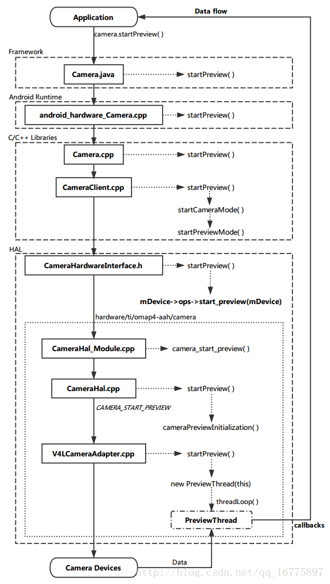

Android Camera 流程学习记录（四）—— Camera.startPreview() flow - 天王盖地虎626的个人空间 - OSCHINA

简介  
通过整理前几篇笔记，我已经对整个 Camera 的框架有比较清晰的认识，并且也已经渐渐摸清楚了整个控制流的逻辑。  
这次，我打算通过追踪 Camera.startPreview() 方法，以加深对控制流的理解。同时尝试结合上一篇关于 module 的认识，将这个流程走到尽可能底部的位置。  
Camera.startPreview() flow  
1\. Frameworks  
1.1 Camera.java  
位置：frameworks/base/core/java/android/hardware/Camera.java  
startPreview()：   
给上层 application 提供一个接口。  
进入 Runtime 层。  
    /**  
     \* Starts capturing and drawing preview frames to the screen.  
     \* Preview will not actually start until a surface is supplied  
     \* with {[@link](https://my.oschina.net/u/393) #setPreviewDisplay(SurfaceHolder)} or  
     \* {[@link](https://my.oschina.net/u/393) #setPreviewTexture(SurfaceTexture)}.  
     *  
     \* &lt;p&gt;If {[@link](https://my.oschina.net/u/393) #setPreviewCallback(Camera.PreviewCallback)},  
     \* {[@link](https://my.oschina.net/u/393) #setOneShotPreviewCallback(Camera.PreviewCallback)}, or  
     \* {[@link](https://my.oschina.net/u/393) #setPreviewCallbackWithBuffer(Camera.PreviewCallback)} were  
     \* called, {@link Camera.PreviewCallback#onPreviewFrame(byte\[\], Camera)}  
     \* will be called when preview data becomes available.  
     */  
    public native final void startPreview();

2\. Android Runtime  
2.1 android\_hardware\_Camera.cpp  
位置：frameworks/base/core/jni/android\_hardware\_Camera.cpp  
android\_hardware\_Camera_startPreview()：   
调用 get\_native\_camera() 函数获取一个 Camera 实例。  
调用 Camera::startPreview()。  
static void android\_hardware\_Camera_startPreview(JNIEnv *env, jobject thiz)  
{  
    ALOGV("startPreview");  
    sp&lt;Camera&gt; camera = get\_native\_camera(env, thiz, NULL);  
    if (camera == 0) return;

    if (camera->startPreview() != NO_ERROR) {  
        jniThrowRuntimeException(env, "startPreview failed");  
        return;  
    }  
}

get\_native\_camera()：   
从 DVM 中获取关于 Camera 的上下文。  
从上下文信息中获取 Camera 实例。  
sp&lt;Camera&gt; get\_native\_camera(JNIEnv \*env, jobject thiz, JNICameraContext\*\* pContext)  
{  
    sp&lt;Camera&gt; camera;  
    Mutex::Autolock _l(sLock);  
    JNICameraContext* context = reinterpret_cast&lt;JNICameraContext*&gt;(env->GetLongField(thiz, fields.context));  
    if (context != NULL) {  
        camera = context->getCamera();  
    }  
    ALOGV("get\_native\_camera: context=%p, camera=%p", context, camera.get());  
    if (camera == 0) {  
        jniThrowRuntimeException(env,  
                "Camera is being used after Camera.release() was called");  
    }

    if (pContext != NULL) *pContext = context;  
    return camera;  
}

3\. Libraries  
3.1 Camera.cpp  
位置：frameworks/av/camera/Camera.cpp  
startPreview()：   
mCamera 即是在 connect 过程中返回的 CameraClient，它具体实现了 startPreview() 接口。  
调用 CameraClient::startPreview()。  
// start preview mode  
status_t Camera::startPreview()  
{  
    ALOGV("startPreview");  
    sp &lt;::android::hardware::ICamera&gt; c = mCamera;  
    if (c == 0) return NO_INIT;  
    return c->startPreview();  
}

3.2 CameraClient.cpp  
位置：frameworks/av/services/camera/libcameraservice/api1/CameraClient.cpp  
startPreview()：   
通过 startCameraMode 函数进入具体的实现逻辑。  
// start preview mode  
status_t CameraClient::startPreview() {  
    LOG1("startPreview (pid %d)", getCallingPid());  
    return startCameraMode(CAMERA\_PREVIEW\_MODE);  
}

startCameraMode()：   
根据传入的参数 CAMERA\_PREVIEW\_MODE 确定进入的分支。  
调用 startPreviewMode() 。  
// start preview or recording  
status\_t CameraClient::startCameraMode(camera\_mode mode) {  
    LOG1("startCameraMode(%d)", mode);  
    Mutex::Autolock lock(mLock);  
    status_t result = checkPidAndHardware();  
    if (result != NO_ERROR) return result;

    switch(mode) {  
        case CAMERA\_PREVIEW\_MODE:  
            if (mSurface == 0 && mPreviewWindow == 0) {  
                LOG1("mSurface is not set yet.");  
                // still able to start preview in this case.  
            }  
            return startPreviewMode();  
        case CAMERA\_RECORDING\_MODE:  
            if (mSurface == 0 && mPreviewWindow == 0) {  
                ALOGE("mSurface or mPreviewWindow must be set before startRecordingMode.");  
                return INVALID_OPERATION;  
            }  
            return startRecordingMode();  
        default:  
            return UNKNOWN_ERROR;  
    }  
}

startPreviewMode()：   
如果预览已经存在，则直接返回成功信息。  
如果未存在，则继续往下走。  
mHardware 是 CameraHardwareInterface 的实例，在 connect 过程的最后被初始化。  
通过 mHardware 调用 setPreviewWindow() 和 startPreview() 接口。  
进入 HAL 层。  
status_t CameraClient::startPreviewMode() {  
    LOG1("startPreviewMode");  
    status\_t result = NO\_ERROR;

    // if preview has been enabled, nothing needs to be done  
    if (mHardware->previewEnabled()) {  
        return NO_ERROR;  
    }

    if (mPreviewWindow != 0) {  
        mHardware->setPreviewScalingMode(  
            NATIVE\_WINDOW\_SCALING\_MODE\_SCALE\_TO\_WINDOW);  
        mHardware->setPreviewTransform(mOrientation);  
    }  
    mHardware->setPreviewWindow(mPreviewWindow);  
    result = mHardware->startPreview();  
    if (result == NO_ERROR) {  
        mCameraService->updateProxyDeviceState(  
            ICameraServiceProxy::CAMERA\_STATE\_ACTIVE,  
            String8::format("%d", mCameraId));  
    }  
    return result;  
}

4\. HAL  
4.1 CameraHardwareInterface.h  
位置：frameworks/av/services/camera/libcameraservice/device1/CameraHardwareInterface.h  
previewEnable()：   
通过 mDevice->ops 继续向下调用（不是我们主要追踪的）。  
mDevice 即是通过 hw\_get\_module() 相关流程进行初始化的设备实例，它的类型是 camera\_device\_t 。  
如果 preview 存在，则返回 true 。  
    /**  
     \* Returns true if preview is enabled.  
     */  
    int previewEnabled()  
    {  
        ALOGV("%s(%s)", \_\_FUNCTION\_\_, mName.string());  
        if (mDevice->ops->preview_enabled)  
            return mDevice->ops->preview_enabled(mDevice);  
        return false;  
    }

setPreviewWindow()：   
如果 set\_preview\_window 函数指针为空，则返回失败信息。  
若否，通过 mDevice->ops 继续向下调用（不是我们主要追踪的）。  
    /\*\* Set the ANativeWindow to which preview frames are sent */  
    status_t setPreviewWindow(const sp&lt;ANativeWindow&gt;& buf)  
    {  
        ALOGV("%s(%s) buf %p", \_\_FUNCTION\_\_, mName.string(), buf.get());  
        if (mDevice->ops->set\_preview\_window) {  
            mPreviewWindow = buf;  
            if (buf != nullptr) {  
                if (mPreviewScalingMode != NOT_SET) {  
                    setPreviewScalingMode(mPreviewScalingMode);  
                }  
                if (mPreviewTransform != NOT_SET) {  
                    setPreviewTransform(mPreviewTransform);  
                }  
            }  
            mHalPreviewWindow.user = this;  
            ALOGV("%s &mHalPreviewWindow %p mHalPreviewWindow.user %p", \_\_FUNCTION\_\_,  
                    &mHalPreviewWindow, mHalPreviewWindow.user);  
            return mDevice->ops->set\_preview\_window(mDevice,  
                    buf.get() ? &mHalPreviewWindow.nw : 0);  
        }  
        return INVALID_OPERATION;  
    }

startPreview()：   
若 start_preview() 函数指针为空，则返回失败信息。  
若否，则通过 mDevice 进行下一步操作。  
关于 mDevice，我们结合 Camera.open() 流程与 hw\_get\_module() 相关逻辑，可以知道它的逻辑是这样的：   
在 CameraService 启动时，会调用 onFirstRef() 对 module 进行初始化，获取 module 实例。  
在 open 过程中，CameraClient 连接 CameraServer 成功时，会实例化 CameraHardwareInterface，并传入 module 实例对其初始化。  
在初始化过程中，通过 module 实例对应的 open 方法，我们获得一个 device 实例，即 mDevice，这对应了具体的摄像头设备。  
通过 mDevice，我们就可以将对应的指令传达到硬件设备。  
通过对 camera\_device\_t 类型进行追踪，可以找到函数指针的一个具体指向。  
    /**  
     \* Start preview mode.  
     */  
    status_t startPreview()  
    {  
        ALOGV("%s(%s)", \_\_FUNCTION\_\_, mName.string());  
        if (mDevice->ops->start_preview)  
            return mDevice->ops->start_preview(mDevice);  
        return INVALID_OPERATION;  
    }

4.2 camera.h  
位置：hardware/libhardware/include/hardware/camera.h  
struct camera_device：   
这里就声明了我们想要追踪的 camera\_device\_t 。  
ops 对应的类型是 camera\_device\_ops_t ，这个结构中声明了函数指针。  
typedef struct camera_device {  
    /**  
     \* camera_device.common.version must be in the range  
     \* HARDWARE\_DEVICE\_API\_VERSION(0,0)-(1,FF). CAMERA\_DEVICE\_API\_VERSION\_1\_0 is  
     \* recommended.  
     */  
    hw\_device\_t common;  
    camera\_device\_ops_t *ops;  
    void *priv;  
} camera\_device\_t;

struct camera\_device\_ops：   
由于注释过长，我把除了 start_preview 以外的注释都去掉了。  
可以看到，所有关于 Camera 设备的操作，对应的函数指针都在这里声明了。  
但是这里没法看出，函数指针具体指向哪里。  
在 Linux 下用 find . -name "*.cpp" | xargs grep "start_preview =" 可以找到一些对应的文件，这些文件所处的位置与具体的设备商有关。  
在这些文件中，就确定了函数指针的指向。  
typedef struct camera\_device\_ops {  
    int (\*set\_preview\_window)(struct camera_device \*,  
            struct preview\_stream\_ops *window);

    void (\*set\_callbacks)(struct camera\_device \*,  
            camera\_notify\_callback notify_cb,  
            camera\_data\_callback data_cb,  
            camera\_data\_timestamp\_callback data\_cb_timestamp,  
            camera\_request\_memory get_memory,  
            void *user);

    void (\*enable\_msg\_type)(struct camera\_device \*, int32\_t msg_type);

    void (\*disable\_msg\_type)(struct camera\_device \*, int32\_t msg_type);

    int (\*msg\_type\_enabled)(struct camera\_device \*, int32\_t msg_type);

    /**  
     \* Start preview mode.  
     */  
    int (\*start\_preview)(struct camera\_device \*);

    void (\*stop\_preview)(struct camera\_device \*);

    int (\*preview\_enabled)(struct camera\_device \*);

    int (\*store\_meta\_data\_in\_buffers)(struct camera_device \*, int enable);

    int (\*start\_recording)(struct camera\_device \*);

    void (\*stop\_recording)(struct camera\_device \*);

    int (\*recording\_enabled)(struct camera\_device \*);

    void (\*release\_recording\_frame)(struct camera_device \*,  
                    const void *opaque);

    int (\*auto\_focus)(struct camera\_device \*);

    int (\*cancel\_auto\_focus)(struct camera_device \*);

    int (\*take\_picture)(struct camera\_device \*);

    int (\*cancel\_picture)(struct camera\_device \*);

    int (\*set\_parameters)(struct camera\_device \*, const char *parms);

    char *(\*get\_parameters)(struct camera\_device \*);

    void (\*put\_parameters)(struct camera\_device \*, char *);

    int (\*send\_command)(struct camera\_device \*,  
                int32\_t cmd, int32\_t arg1, int32_t arg2);

    void (\*release)(struct camera_device \*);

    int (\*dump)(struct camera_device \*, int fd);  
} camera\_device\_ops_t;

4.3 hardware/ti/omap4-aah/camera  
通过 find 指令，我找到了一些与函数指针指向有关的文件。  
从这些文件的路径上看，它们与不同的设备供应商有关。  
我决定往 ti/omap4-aah 子文件夹去一探究竟。  
4.3.1 CameraHal_Module.cpp  
位置：hardware/ti/omap4-aah/camera/CameraHal_Module.cpp  
camera\_device\_open()：   
在 open 流程中，就指定了 ops 中指针的对应关系。  
        memset(camera\_device, 0, sizeof(*camera\_device));  
        memset(camera\_ops, 0, sizeof(*camera\_ops));

        camera\_device->base.common.tag = HARDWARE\_DEVICE_TAG;  
        camera_device->base.common.version = 0;  
        camera\_device->base.common.module = (hw\_module_t *)(module);  
        camera\_device->base.common.close = camera\_device_close;  
        camera\_device->base.ops = camera\_ops;

        camera\_ops->set\_preview\_window = camera\_set\_preview\_window;  
        camera\_ops->set\_callbacks = camera\_set\_callbacks;  
        camera\_ops->enable\_msg\_type = camera\_enable\_msg\_type;  
        camera\_ops->disable\_msg\_type = camera\_disable\_msg\_type;  
        camera\_ops->msg\_type\_enabled = camera\_msg\_type\_enabled;  
        camera\_ops->start\_preview = camera\_start\_preview;  
        camera\_ops->stop\_preview = camera\_stop\_preview;  
        camera\_ops->preview\_enabled = camera\_preview\_enabled;  
        camera\_ops->store\_meta\_data\_in\_buffers = camera\_store\_meta\_data\_in\_buffers;  
        camera\_ops->start\_recording = camera\_start\_recording;  
        camera\_ops->stop\_recording = camera\_stop\_recording;  
        camera\_ops->recording\_enabled = camera\_recording\_enabled;  
        camera\_ops->release\_recording\_frame = camera\_release\_recording\_frame;  
        camera\_ops->auto\_focus = camera\_auto\_focus;  
        camera\_ops->cancel\_auto\_focus = camera\_cancel\_auto\_focus;  
        camera\_ops->take\_picture = camera\_take\_picture;  
        camera\_ops->cancel\_picture = camera\_cancel\_picture;  
        camera\_ops->set\_parameters = camera\_set\_parameters;  
        camera\_ops->get\_parameters = camera\_get\_parameters;  
        camera\_ops->put\_parameters = camera\_put\_parameters;  
        camera\_ops->send\_command = camera\_send\_command;  
        camera\_ops->release = camera\_release;  
        camera\_ops->dump = camera\_dump;

        *device = &camera_device->base.common;

        // \-\-\-\-\-\-\-\- TI specific stuff --------

        camera_device->cameraid = cameraid;

camera\_start\_preview()：   
注意 gCameraHals 是 CameraHal * 。  
通过调用 CameraHal::startPreview() 完成业务逻辑。  
int camera\_start\_preview(struct camera_device * device)  
{  
    CAMHAL\_LOG\_MODULE\_FUNCTION\_NAME;

    int rv = -EINVAL;  
    ti\_camera\_device\_t* ti\_dev = NULL;

    if(!device)  
        return rv;

    ti\_dev = (ti\_camera\_device\_t*) device;

    rv = gCameraHals\[ti_dev->cameraid\]->startPreview();

    return rv;  
}

4.3.2 CameraHal.cpp  
位置：hardware/ti/omap4-aah/camera/CameraHal.cpp  
这个文件对应的功能是，将 Camera Hardware Interface 映射到 V4L2。  
注意两个声明：   
extern "C" CameraAdapter* OMXCameraAdapter\_Factory(size\_t);  
extern "C" CameraAdapter* V4LCameraAdapter\_Factory(size\_t);  
分别对应 OMX 与 V4L 的适配器工厂，这里可能是将 Adapter 模式与 Factory 模式结合使用。  
startPreview()：   
源代码中带有大量注释，在这里我将其去掉，只关注调用逻辑。  
首先调用了 cameraPreviewInitialization() 函数进行初始化。  
通过 CameraAdapter 发送 CAMERA\_START\_PREVIEW 指令，若成功执行，则完成流程。  
status_t CameraHal::startPreview() {  
    LOG\_FUNCTION\_NAME;

    status_t ret = cameraPreviewInitialization();

    if (!mPreviewInitializationDone) return ret;

    mPreviewInitializationDone = false;

    if(mDisplayAdapter.get() != NULL) {  
        CAMHAL_LOGDA("Enabling display");  
        int width, height;  
        mParameters.getPreviewSize(&width, &height);

#if PPM\_INSTRUMENTATION || PPM\_INSTRUMENTATION_ABS  
        ret = mDisplayAdapter->enableDisplay(width, height, &mStartPreview);  
#else  
        ret = mDisplayAdapter->enableDisplay(width, height, NULL);  
#endif

        if ( ret != NO_ERROR ) {  
            CAMHAL_LOGEA("Couldn't enable display");  
            CAMHAL\_ASSERT\_X(false,  
                "At this stage mCameraAdapter->mStateSwitchLock is still locked, "  
                "deadlock is guaranteed");

            goto error;  
        }  
    }

    CAMHAL_LOGDA("Starting CameraAdapter preview mode");

    ret = mCameraAdapter->sendCommand(CameraAdapter::CAMERA\_START\_PREVIEW);

    if(ret!=NO_ERROR) {  
        CAMHAL_LOGEA("Couldn't start preview w/ CameraAdapter");  
        goto error;  
    }  
    CAMHAL_LOGDA("Started preview");

    mPreviewEnabled = true;  
    mPreviewStartInProgress = false;  
    return ret;

    error:

        CAMHAL_LOGEA("Performing cleanup after error");

        //Do all the cleanup  
        freePreviewBufs();  
        mCameraAdapter->sendCommand(CameraAdapter::CAMERA\_STOP\_PREVIEW);  
        if(mDisplayAdapter.get() != NULL) {  
            mDisplayAdapter->disableDisplay(false);  
        }  
        mAppCallbackNotifier->stop();  
        mPreviewStartInProgress = false;  
        mPreviewEnabled = false;  
        LOG\_FUNCTION\_NAME_EXIT;

        return ret;  
}

cameraPreviewInitialization()：   
这段代码比较长，但从注释看，它主要做三件事：   
通过 Adapter 设置相关参数；  
申请 Buffers 空间；  
对 Buffers 进行相应设置以进行预览。  
了解了大体思路，再看看具体代码：   
mCameraAdapter->setParameters()：设置参数。  
allocPreviewBufs() ：申请 Buffers。  
desc：注意到这个变量对应着 CameraAdapter::BuffersDescriptor，在申请 Buffers 空间成功后，便对其进行相应的成员设置。  
mAppCallbackNotifier->start()：开启回调通知。  
mAppCallbackNotifier->startPreviewCallbacks()：将 Buffers 对应到相应的回调函数中，以供上层 APP 获取预览所需的数据。  
NOTE：   
代码中不断使用 mCameraAdapter->sendCommand() 来发送指令，并获取一些数据。  
指令发送到对应的 Adapter （如 V4L Adapter），就会调用相应的函数进行处理。  
////////////  
/**  
   @brief Set preview mode related initialization  
          -\> Camera Adapter set params  
          -\> Allocate buffers  
          -\> Set use buffers for preview  
   @param none  
   @return NO_ERROR  
   @todo Update function header with the different errors that are possible  
*/  
status_t CameraHal::cameraPreviewInitialization()  
{

    status\_t ret = NO\_ERROR;  
    CameraAdapter::BuffersDescriptor desc;  
    CameraFrame frame;  
    unsigned int required\_buffer\_count;  
    unsigned int max\_queueble\_buffers;

#if PPM\_INSTRUMENTATION || PPM\_INSTRUMENTATION_ABS  
        gettimeofday(&mStartPreview, NULL);  
#endif

    LOG\_FUNCTION\_NAME;

    if (mPreviewInitializationDone) {  
        return NO_ERROR;  
    }

    if ( mPreviewEnabled ){  
      CAMHAL_LOGDA("Preview already running");  
      LOG\_FUNCTION\_NAME_EXIT;  
      return ALREADY_EXISTS;  
    }

    if ( NULL != mCameraAdapter ) {  
      ret = mCameraAdapter->setParameters(mParameters);  
    }

    if ((mPreviewStartInProgress == false) && (mDisplayPaused == false)){  
      ret = mCameraAdapter->sendCommand(CameraAdapter::CAMERA\_QUERY\_RESOLUTION_PREVIEW,( int ) &frame);  
      if ( NO_ERROR != ret ){  
        CAMHAL\_LOGEB("Error: CAMERA\_QUERY\_RESOLUTION\_PREVIEW %d", ret);  
        return ret;  
      }

      ///Update the current preview width and height  
      mPreviewWidth = frame.mWidth;  
      mPreviewHeight = frame.mHeight;  
    }

    ///If we don't have the preview callback enabled and display adapter,  
    if(!mSetPreviewWindowCalled || (mDisplayAdapter.get() == NULL)){  
      CAMHAL_LOGD("Preview not started. Preview in progress flag set");  
      mPreviewStartInProgress = true;  
      ret = mCameraAdapter->sendCommand(CameraAdapter::CAMERA\_SWITCH\_TO_EXECUTING);  
      if ( NO_ERROR != ret ){  
        CAMHAL\_LOGEB("Error: CAMERA\_SWITCH\_TO\_EXECUTING %d", ret);  
        return ret;  
      }  
      return NO_ERROR;  
    }

    if( (mDisplayAdapter.get() != NULL) && ( !mPreviewEnabled ) && ( mDisplayPaused ) )  
        {  
        CAMHAL_LOGDA("Preview is in paused state");

        mDisplayPaused = false;  
        mPreviewEnabled = true;  
        if ( NO_ERROR == ret )  
            {  
            ret = mDisplayAdapter->pauseDisplay(mDisplayPaused);

            if ( NO_ERROR != ret )  
                {  
                CAMHAL_LOGEB("Display adapter resume failed %x", ret);  
                }  
            }  
        //restart preview callbacks  
        if(mMsgEnabled & CAMERA\_MSG\_PREVIEW_FRAME)  
        {  
            mAppCallbackNotifier->enableMsgType (CAMERA\_MSG\_PREVIEW_FRAME);  
        }

        signalEndImageCapture();  
        return ret;  
        }

    required\_buffer\_count = atoi(mCameraProperties->get(CameraProperties::REQUIRED\_PREVIEW\_BUFS));

    ///Allocate the preview buffers  
    ret = allocPreviewBufs(mPreviewWidth, mPreviewHeight, mParameters.getPreviewFormat(), required\_buffer\_count, max\_queueble\_buffers);

    if ( NO_ERROR != ret )  
        {  
        CAMHAL_LOGEA("Couldn't allocate buffers for Preview");  
        goto error;  
        }

    if ( mMeasurementEnabled )  
        {

        ret = mCameraAdapter->sendCommand(CameraAdapter::CAMERA\_QUERY\_BUFFER\_SIZE\_PREVIEW_DATA,  
                                          ( int ) &frame,  
                                          required\_buffer\_count);  
        if ( NO_ERROR != ret )  
            {  
            return ret;  
            }

         ///Allocate the preview data buffers  
        ret = allocPreviewDataBufs(frame.mLength, required\_buffer\_count);  
        if ( NO_ERROR != ret ) {  
            CAMHAL_LOGEA("Couldn't allocate preview data buffers");  
            goto error;  
           }

        if ( NO_ERROR == ret )  
            {  
            desc.mBuffers = mPreviewDataBuffers;  
            desc.mOffsets = mPreviewDataOffsets;  
            desc.mFd = mPreviewDataFd;  
            desc.mLength = mPreviewDataLength;  
            desc.mCount = ( size\_t ) required\_buffer_count;  
            desc.mMaxQueueable = (size\_t) required\_buffer_count;

            mCameraAdapter->sendCommand(CameraAdapter::CAMERA\_USE\_BUFFERS\_PREVIEW\_DATA,  
                                        ( int ) &desc);  
            }

        }

    ///Pass the buffers to Camera Adapter  
    desc.mBuffers = mPreviewBuffers;  
    desc.mOffsets = mPreviewOffsets;  
    desc.mFd = mPreviewFd;  
    desc.mLength = mPreviewLength;  
    desc.mCount = ( size\_t ) required\_buffer_count;  
    desc.mMaxQueueable = (size\_t) max\_queueble_buffers;

    ret = mCameraAdapter->sendCommand(CameraAdapter::CAMERA\_USE\_BUFFERS_PREVIEW,  
                                      ( int ) &desc);

    if ( NO_ERROR != ret )  
        {  
        CAMHAL_LOGEB("Failed to register preview buffers: 0x%x", ret);  
        freePreviewBufs();  
        return ret;  
        }

    ///Start the callback notifier  
    ret = mAppCallbackNotifier->start();

    if( ALREADY_EXISTS == ret )  
        {  
        //Already running, do nothing  
        CAMHAL_LOGDA("AppCallbackNotifier already running");  
        ret = NO_ERROR;  
        }  
    else if ( NO_ERROR == ret ) {  
        CAMHAL_LOGDA("Started AppCallbackNotifier..");  
        mAppCallbackNotifier->setMeasurements(mMeasurementEnabled);  
        }  
    else  
        {  
        CAMHAL_LOGDA("Couldn't start AppCallbackNotifier");  
        goto error;  
        }

    if (ret == NO_ERROR) mPreviewInitializationDone = true;

    mAppCallbackNotifier->startPreviewCallbacks(mParameters, mPreviewBuffers, mPreviewOffsets, mPreviewFd, mPreviewLength, required\_buffer\_count);

    return ret;

    error:

        CAMHAL_LOGEA("Performing cleanup after error");

        //Do all the cleanup  
        freePreviewBufs();  
        mCameraAdapter->sendCommand(CameraAdapter::CAMERA\_STOP\_PREVIEW);  
        if(mDisplayAdapter.get() != NULL)  
            {  
            mDisplayAdapter->disableDisplay(false);  
            }  
        mAppCallbackNotifier->stop();  
        mPreviewStartInProgress = false;  
        mPreviewEnabled = false;  
        LOG\_FUNCTION\_NAME_EXIT;

        return ret;  
}

4.3.3 BaseCameraAdapter.cpp  
位置：hardware/ti/omap4-aah/camera/BaseCameraAdapter.cpp  
注意到文件中定义的常量：   
分别对应不同的命令。  
const LUT cameraCommandsUserToHAL\[\] = {  
    { "CAMERA\_START\_PREVIEW",                   CameraAdapter::CAMERA\_START\_PREVIEW },  
    { "CAMERA\_STOP\_PREVIEW",                    CameraAdapter::CAMERA\_STOP\_PREVIEW },  
    { "CAMERA\_START\_VIDEO",                     CameraAdapter::CAMERA\_START\_VIDEO },  
    { "CAMERA\_STOP\_VIDEO",                      CameraAdapter::CAMERA\_STOP\_VIDEO },  
    { "CAMERA\_START\_IMAGE\_CAPTURE",             CameraAdapter::CAMERA\_START\_IMAGE\_CAPTURE },  
    { "CAMERA\_STOP\_IMAGE\_CAPTURE",              CameraAdapter::CAMERA\_STOP\_IMAGE\_CAPTURE },  
    { "CAMERA\_PERFORM\_AUTOFOCUS",               CameraAdapter::CAMERA\_PERFORM\_AUTOFOCUS },  
    { "CAMERA\_CANCEL\_AUTOFOCUS",                CameraAdapter::CAMERA\_CANCEL\_AUTOFOCUS },  
    { "CAMERA\_PREVIEW\_FLUSH\_BUFFERS",           CameraAdapter::CAMERA\_PREVIEW\_FLUSH\_BUFFERS },  
    { "CAMERA\_START\_SMOOTH\_ZOOM",               CameraAdapter::CAMERA\_START\_SMOOTH\_ZOOM },  
    { "CAMERA\_STOP\_SMOOTH\_ZOOM",                CameraAdapter::CAMERA\_STOP\_SMOOTH\_ZOOM },  
    { "CAMERA\_USE\_BUFFERS\_PREVIEW",             CameraAdapter::CAMERA\_USE\_BUFFERS\_PREVIEW },  
    { "CAMERA\_SET\_TIMEOUT",                     CameraAdapter::CAMERA\_SET\_TIMEOUT },  
    { "CAMERA\_CANCEL\_TIMEOUT",                  CameraAdapter::CAMERA\_CANCEL\_TIMEOUT },  
    { "CAMERA\_START\_BRACKET\_CAPTURE",           CameraAdapter::CAMERA\_START\_BRACKET\_CAPTURE },  
    { "CAMERA\_STOP\_BRACKET\_CAPTURE",            CameraAdapter::CAMERA\_STOP\_BRACKET\_CAPTURE },  
    { "CAMERA\_QUERY\_RESOLUTION\_PREVIEW",        CameraAdapter::CAMERA\_QUERY\_RESOLUTION\_PREVIEW },  
    { "CAMERA\_QUERY\_BUFFER\_SIZE\_IMAGE\_CAPTURE", CameraAdapter::CAMERA\_QUERY\_BUFFER\_SIZE\_IMAGE\_CAPTURE },  
    { "CAMERA\_QUERY\_BUFFER\_SIZE\_PREVIEW\_DATA",  CameraAdapter::CAMERA\_QUERY\_BUFFER\_SIZE\_PREVIEW\_DATA },  
    { "CAMERA\_USE\_BUFFERS\_IMAGE\_CAPTURE",       CameraAdapter::CAMERA\_USE\_BUFFERS\_IMAGE\_CAPTURE },  
    { "CAMERA\_USE\_BUFFERS\_PREVIEW\_DATA",        CameraAdapter::CAMERA\_USE\_BUFFERS\_PREVIEW\_DATA },  
    { "CAMERA\_TIMEOUT\_EXPIRED",                 CameraAdapter::CAMERA\_TIMEOUT\_EXPIRED },  
    { "CAMERA\_START\_FD",                        CameraAdapter::CAMERA\_START\_FD },  
    { "CAMERA\_STOP\_FD",                         CameraAdapter::CAMERA\_STOP\_FD },  
    { "CAMERA\_SWITCH\_TO\_EXECUTING",             CameraAdapter::CAMERA\_SWITCH\_TO\_EXECUTING },  
    { "CAMERA\_USE\_BUFFERS\_VIDEO\_CAPTURE",       CameraAdapter::CAMERA\_USE\_BUFFERS\_VIDEO\_CAPTURE },  
#ifdef OMAP\_ENHANCEMENT\_CPCAM  
    { "CAMERA\_USE\_BUFFERS\_REPROCESS",           CameraAdapter::CAMERA\_USE\_BUFFERS\_REPROCESS },  
    { "CAMERA\_START\_REPROCESS",                 CameraAdapter::CAMERA\_START\_REPROCESS },  
#endif  
};

BaseCameraAdapter::sendCommand()：   
利用 switch 将不同的命令对应到各自的逻辑中。  
此处的 BaseCameraAdapter::startPreview() 实际上做什么操作，具体的实现是在其子类中，接下来选取一个子类 V4LCameraAdapter 继续深入。  
    case CameraAdapter::CAMERA\_START\_PREVIEW:  
        {

            CAMHAL_LOGDA("Start Preview");

        if ( ret == NO_ERROR )  
            {  
            ret = setState(operation);  
            }

        if ( ret == NO_ERROR )  
            {  
            ret = startPreview();  
            }

        if ( ret == NO_ERROR )  
            {  
            ret = commitState();  
            }  
        else  
            {  
            ret |= rollbackState();  
            }

        break;

        }

4.3.4 V4LCameraAdapter.h  
位置：hardware/ti/omap4-aah/camera/inc/V4LCameraAdapter/V4LCameraAdapter.h  
类 V4LCameraAdapter 继承了 BaseCameraAdapter。  
注意它有一个内部私有类：   
threadLoop() 应该是与线程的循环执行有关。  
这个线程不断执行 Adapter 中的 previewThread() 函数。  
private:

    class PreviewThread : public android::Thread {  
            V4LCameraAdapter* mAdapter;  
        public:  
            PreviewThread(V4LCameraAdapter* hw) :  
                    Thread(false), mAdapter(hw) { }  
            virtual void onFirstRef() {  
                run("CameraPreviewThread", android::PRIORITY\_URGENT\_DISPLAY);  
            }  
            virtual bool threadLoop() {  
                mAdapter->previewThread();  
                // loop until we need to quit  
                return true;  
            }  
        };

    //Used for calculation of the average frame rate during preview  
    status_t recalculateFPS();

    char * GetFrame(int &index);

    int previewThread();

4.3.5 V4LCameraAdapter.cpp  
位置：hardware/ti/omap4-aah/camera/V4LCameraAdapter/V4LCameraAdapter.cpp  
startPreview()：   
通过 v4lIoctl() 函数从硬件获取需要的数据，并存入 Buffers。  
启动一个 PreviewThread，用于接收从 V4L 摄像头设备传回的数据。  
最后设置一些 flag 表明预览功能已开启，startPreview 的控制流程就结束了。  
status_t V4LCameraAdapter::startPreview()  
{  
    status\_t ret = NO\_ERROR;

    LOG\_FUNCTION\_NAME;  
    android::AutoMutex lock(mPreviewBufsLock);

    if(mPreviewing) {  
        ret = BAD_VALUE;  
        goto EXIT;  
    }

    for (int i = 0; i < mPreviewBufferCountQueueable; i++) {

        mVideoInfo->buf.index = i;  
        mVideoInfo->buf.type = V4L2\_BUF\_TYPE\_VIDEO\_CAPTURE;  
        mVideoInfo->buf.memory = V4L2\_MEMORY\_MMAP;

        ret = v4lIoctl(mCameraHandle, VIDIOC_QBUF, &mVideoInfo->buf);  
        if (ret < 0) {  
            CAMHAL\_LOGEA("VIDIOC\_QBUF Failed");  
            goto EXIT;  
        }  
        nQueued++;  
    }

    ret = v4lStartStreaming();

    // Create and start preview thread for receiving buffers from V4L Camera  
    if(!mCapturing) {  
        mPreviewThread = new PreviewThread(this);  
        CAMHAL_LOGDA("Created preview thread");  
    }

    //Update the flag to indicate we are previewing  
    mPreviewing = true;  
    mCapturing = false;

EXIT:  
    LOG\_FUNCTION\_NAME_EXIT;  
    return ret;  
}

previewThread()：   
在 PreviewThread 线程中不断被调用。  
获取设备传回的数据，并进行一些格式转换操作：   
convertYUV422ToNV12Tiler()  
给帧数据进行一些必要的参数设置，如帧大小、时间戳等。  
将帧数据发送给用户：   
sendFrameToSubscribers(&frame)  
int V4LCameraAdapter::previewThread()  
{  
    status\_t ret = NO\_ERROR;  
    int width, height;  
    CameraFrame frame;  
    void *y_uv\[2\];  
    int index = 0;  
    int stride = 4096;  
    char *fp = NULL;

    mParams.getPreviewSize(&width, &height);

    if (mPreviewing) {

        fp = this->GetFrame(index);  
        if(!fp) {  
            ret = BAD_VALUE;  
            goto EXIT;  
        }  
        CameraBuffer *buffer = mPreviewBufs.keyAt(index);  
        CameraFrame \*lframe = (CameraFrame \*)mFrameQueue.valueFor(buffer);  
        if (!lframe) {  
            ret = BAD_VALUE;  
            goto EXIT;  
        }

        debugShowFPS();

        if ( mFrameSubscribers.size() == 0 ) {  
            ret = BAD_VALUE;  
            goto EXIT;  
        }  
        y_uv\[0\] = (void*) lframe->mYuv\[0\];  
        //y_uv\[1\] = (void*) lframe->mYuv\[1\];  
        //y_uv\[1\] = (void*) (lframe->mYuv\[0\] + height*stride);  
        convertYUV422ToNV12Tiler ( (unsigned char*)fp, (unsigned char*)y_uv\[0\], width, height);  
        CAMHAL\_LOGVB("##...index= %d.;camera buffer= 0x%x; y= 0x%x; UV= 0x%x.",index, buffer, y\_uv\[0\], y_uv\[1\] );

#ifdef SAVE\_RAW\_FRAMES  
        unsigned char* nv12_buff = (unsigned char*) malloc(width\*height\*3/2);  
        //Convert yuv422i to yuv420sp(NV12) & dump the frame to a file  
        convertYUV422ToNV12 ( (unsigned char*)fp, nv12_buff, width, height);  
        saveFile( nv12_buff, ((width\*height)\*3/2) );  
        free (nv12_buff);  
#endif

        frame.mFrameType = CameraFrame::PREVIEW\_FRAME\_SYNC;  
        frame.mBuffer = buffer;  
        frame.mLength = width\*height\*3/2;  
        frame.mAlignment = stride;  
        frame.mOffset = 0;  
        frame.mTimestamp = systemTime(SYSTEM\_TIME\_MONOTONIC);  
        frame.mFrameMask = (unsigned int)CameraFrame::PREVIEW\_FRAME\_SYNC;

        if (mRecording)  
        {  
            frame.mFrameMask |= (unsigned int)CameraFrame::VIDEO\_FRAME\_SYNC;  
            mFramesWithEncoder++;  
        }

        ret = setInitFrameRefCount(frame.mBuffer, frame.mFrameMask);  
        if (ret != NO_ERROR) {  
            CAMHAL_LOGDB("Error in setInitFrameRefCount %d", ret);  
        } else {  
            ret = sendFrameToSubscribers(&frame);  
        }  
    }  
EXIT:

    return ret;  
}

4.3.6 * AppCallbackNotifier.cpp  
位置：hardware/ti/omap4-aah/camera/AppCallbackNotifier.cpp  
在 CameraHal.cpp 中，预览功能初始化的部分，调用到了 AppCallbackNotifier 类的函数。这个类应该是与各个回调函数有关，即与数据流有着密切的联系。  
在这里，我打算简单地了解一些对应的逻辑。  
startPreviewCallbacks()：   
对 previewBuffers 进行一些必要的设置。  
同步预览帧：   
mFrameProvider->enableFrameNotification(CameraFrame::PREVIEW\_FRAME\_SYNC)  
到这里以后，就不知道该往哪去深入了，但是回调函数在哪调用了？  
status\_t AppCallbackNotifier::startPreviewCallbacks(android::CameraParameters &params, CameraBuffer \*buffers, uint32\_t \*offsets, int fd, size\_t length, size\_t count)  
{  
    unsigned int *bufArr;  
    int size = 0;

    LOG\_FUNCTION\_NAME;

    android::AutoMutex lock(mLock);

    if ( NULL == mFrameProvider )  
        {  
        CAMHAL_LOGEA("Trying to start video recording without FrameProvider");  
        return -EINVAL;  
        }

    if ( mPreviewing )  
        {  
        CAMHAL_LOGDA("+Already previewing");  
        return NO_INIT;  
        }

    int w,h;  
    ///Get preview size  
    params.getPreviewSize(&w, &h);

    // save preview pixel format, size and stride  
    mPreviewWidth = w;  
    mPreviewHeight = h;  
    mPreviewStride = 4096;  
    mPreviewPixelFormat = CameraHal::getPixelFormatConstant(params.getPreviewFormat());  
    size = CameraHal::calculateBufferSize(mPreviewPixelFormat, w, h);

    mPreviewMemory = mRequestMemory(-1, size, AppCallbackNotifier::MAX_BUFFERS, NULL);  
    if (!mPreviewMemory) {  
        return NO_MEMORY;  
    }

    for (int i=0; i < AppCallbackNotifier::MAX_BUFFERS; i++) {  
        mPreviewBuffers\[i\].type = CAMERA\_BUFFER\_MEMORY;  
        mPreviewBuffers\[i\].opaque = (unsigned char*) mPreviewMemory->data + (i*size);  
        mPreviewBuffers\[i\].mapped = mPreviewBuffers\[i\].opaque;  
    }

    if ( mCameraHal->msgTypeEnabled(CAMERA\_MSG\_PREVIEW_FRAME ) ) {  
         mFrameProvider->enableFrameNotification(CameraFrame::PREVIEW\_FRAME\_SYNC);  
    }

    if ( mCameraHal->msgTypeEnabled(CAMERA\_MSG\_POSTVIEW_FRAME) ) {  
         mFrameProvider->enableFrameNotification(CameraFrame::SNAPSHOT_FRAME);  
    }

    mPreviewBufCount = 0;

    mPreviewing = true;

    LOG\_FUNCTION\_NAME_EXIT;

    return NO_ERROR;  
}

setCallbacks()：   
我想知道回调函数在哪调用，于是找到了这个设置回调的函数。  
数据回调名为 mDataCb，于是搜索 mDataCb。  
void AppCallbackNotifier::setCallbacks(CameraHal* cameraHal,  
                                        camera\_notify\_callback notify_cb,  
                                        camera\_data\_callback data_cb,  
                                        camera\_data\_timestamp\_callback data\_cb_timestamp,  
                                        camera\_request\_memory get_memory,  
                                        void *user)  
{  
    android::AutoMutex lock(mLock);

    LOG\_FUNCTION\_NAME;

    mCameraHal = cameraHal;  
    mNotifyCb = notify_cb;  
    mDataCb = data_cb;  
    mDataCbTimestamp = data\_cb\_timestamp;  
    mRequestMemory = get_memory;  
    mCallbackCookie = user;

    LOG\_FUNCTION\_NAME_EXIT;  
}

notifyEvent()：   
在这个函数中发现了对回调函数 mDataCb 的调用。  
下面选出的这个分支是与 PREVIEW_METADATA 有关，即预览元数据。  
元数据在 evt->mEventData 中，看命名应该是与 Event 有关。  
Event 相关的机制目前我还不太清楚，也还不会去深究，只需要知道它拿到了数据就行。  
申请一个 camera\_memory\_t 对应的 Buffers 空间后，就调用回调函数将元数据往上层进行传输了。  
case CameraHalEvent::EVENT_METADATA:

     metaEvtData = evt->mEventData->metadataEvent;

     if ( ( NULL != mCameraHal ) &&  
          ( NULL != mNotifyCb) &&  
          ( mCameraHal->msgTypeEnabled(CAMERA\_MSG\_PREVIEW_METADATA) ) )  
         {  
         // WA for an issue inside CameraService  
         camera\_memory\_t *tmpBuffer = mRequestMemory(-1, 1, 1, NULL);

         mDataCb(CAMERA\_MSG\_PREVIEW_METADATA,  
                 tmpBuffer,  
                 0,  
                 metaEvtData->getMetadataResult(),  
                 mCallbackCookie);

         metaEvtData.clear();

         if ( NULL != tmpBuffer ) {  
             tmpBuffer->release(tmpBuffer);  
         }

         }

     break;

流程简图  
图中标明了控制流程的主要调用顺序，对于数据流暂不考究。  
实际上，在 HAL 层与 Device 之间应该还有一层 Linux Kernel（drivers），但这目前已经超出我所需要了解的范围，所以就先忽略掉了。  
注意 HAL 层中，CameraHardwareInterface 是通用的入口，而真正实现与驱动层的对接是与平台相关的，不同平台有不同的实现方案。 

小结  
本篇笔记中，我们选定 Camera.startPreview() 方法作为切入点，结合 hw\_get\_module() 相关内容，对其整个流程进行追踪分析，从而对之前已有初步了解的 Camera 控制流逻辑有一个更全面的理解。  
在 HAL 层中，涉及到了不同平台的实现，而且这些具体实现还是有比较大的区别的。  
目前还不够清楚的地方，就是 Event 、Binder 等 Android 内部机制的实现。  
在下一篇，我开始整理 Camera 数据流的逻辑。由于目前所探究的数据流相对来说比较简单，主要就是几个 callback 函数的调用逻辑，所以我打算结合初始化与控制流的部分，将整个 Camera 流程整理、结合起来，作为这系列学习笔记的终结。