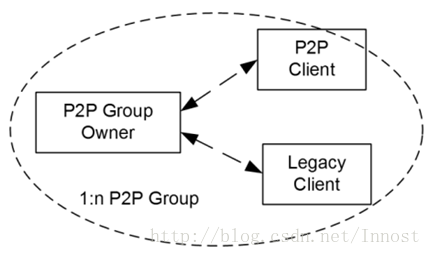
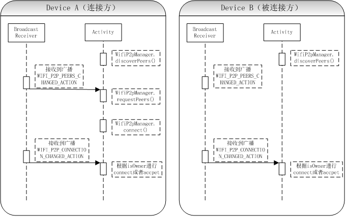

Android WifiDirect 学习（三） 一些基础知识和问题

### P2P架构介绍

P2P架构中定义了三个组件，一个设备，两种角色。这三个组件分别是：

- P2P Device：它是P2P架构中角色的实体，读者可把它当做一个Wi-Fi设备。
- P2P Group Owner(GO)：P2P网络建立时会产生一个Group。
- P2P Group Client(GC)：

- 在组建P2P Group（即P2P Network）之前，智能终端都是一个一个的P2P Device。
- 当这些P2P Device设备之间完成P2P协商后，那么其中将有一个并且只能有一个Device来扮演GO的角色，而其他Device来扮演GC的角色。

最终构成的这个P2P Group组织结构如图所示：

 P2P Group示意图

如图展示了一个典型P2P Group的构成，其中：

一个P2P Group中只能有一个GO。一个GO可以支持1个或多个（即图中的1:n）GC连接。

- 由于GO的功能类似于AP，所以周围那些不支持P2P功能的WIFI STA也能发现并关联到GO。这些WIFI STA被称之为Legacy Clients。

注意：“不支持P2P功能”更准确的定义是指不能处理P2P协议。在P2P网络中，GO等同于AP，所以Legacy Clients也能搜索到GO并关联上它。不过，由于Legacy Clients不能处理P2P协议，所以P2P一些特有功能在这些Legacy Clients中无法实现。

### Wifi_Direct的大致配对流程如下：

        a. WifiP2pManager.discoverPeers()开始扫描设备

        b. 获取扫描到的设备，选择其中一个设备进行连接配对WifiP2pManager.connect

        c. 配对成功后，根据WifiP2pInfo.isGroupOwner和WifiP2pInfo.groupOwnerAddress进行连接。

        流程图如下：

### 常见的问题

#### 问题1：WifiP2pManger.connect()时，如何确定谁是GO,谁是GC

答：调用WifiP2pManger.connect()进行连接时，GO还算GC的身份是随机的。开发者无法决定GroupOwner是哪台设备，但是可以通过WifiP2pConfig.groupOwnerIntent参数进行建议。

#### 问题2：如果一定要确定谁是GO，谁是GC，怎么办

答：第一步：GO端先调用WifiP2pManger.createGroup

第二步：GO端或者GC端调用WifiP2pManger.connect

即：先建立Group，再连接

#### 问题3：如何断开连接

答：WifiP2pManger.removeGroup

注意：WifiP2pManger.removeGroup是移除Group，断开连接。WifiP2pManger.cancelConnect()断开一个connecting的连接，即断开当前状态是Invited的连接。

#### 问题4： 我们已知配对成功的前提条件是：进行配对的两台设备都必须能够扫描到对方。那么如何保证本机一直处于搜索状态呢？

答：经过测试得知，一般情况下，本机Scan一次，能够保持在线状态3分钟，即能够搜索到其他设备/被其他设备搜索到的时间一般是3分钟。但是这个3分钟不是非常准确的，这跟手机性能或者WIFI芯片都有很大关系。因此我们能做的方案就是如果搜索结束，就重启一次搜索。

对于一般的Peer Discovery而言，如果搜索结束，会收到广播WifiP2pManager.WIFI\_P2P\_DISCOVERY\_CHANGED\_ACTION，这样再收到广播后重新搜索就可以。

对于Service Discovery而言（这其实是使用最广泛的），搜索结束后，系统不会发出广播通知，这样就给开发者带来一个难题：你无法知晓当前是否处于搜索（可见）状态。

**目前比较可行的做法是：每隔3分钟（或者更短）重启一次搜索，这样基本保证本机一直处于搜索状态。但是这仅能覆盖大多数的情况，建议再此基础上再加入手动搜索（搜不到可以让用户手动搜索）保证当前的可见状态。**

目前wifip2p依然不是很稳定，从测试的结果来说，Wifi_Direct的表现受具体设备的影响很大，配对的速度也有较大差异，从10秒到2分钟甚至更久。有可能出现

a.A机器处于搜索（可见）状态，但是B机器依然搜索不到；

b.还有可能出现A机器处于搜索（可见）状态，B机器也搜索到了，但是连接失败（此情况的主要原因还是因为A机器搜索结束后系统不发通知，而B机器当前搜索到的A机器是之前A机器的状态）

#### 问题5：如何把一个文件非常方便的发送给多个设备

答：

方法1：在一次一对一文件传输完毕后，直接断开连接进行搜索/连接/传输，这样就可以实现相同文件（夹）的多目标设备的发送。

方法2：使用问题2的答案，发送方做GO，接收方全部做GC，即可。

#### 问题6：

我们知道

1.在进行connect的时候，连接两端是GO还是GC是随机的。

2.GC可以知道GO的地址，而GO是不知道GC的地址的.

3.一般的Socket编程思路是，GO做Server端，GC做Client端。

那么问题来了，如何能够实现PeerA连接PeerB后，PeerA直接发送数据给PeerB呢？

答：方法一：使用问题2中的答案，先确定身份（谁是GO，谁是GC），再发送数据

方法二：步骤（假设PeerA是数据发送端，PeerB是数据接收端）

1.connect成功后，GO做server，GC做client

2.socket连接成功后，PeerA执行发送线程，PeerB执行接收线程

参考文章：

[Android平台Wifi_Direct使用](http://blog.csdn.net/a220315410/article/details/9114653)  http://blog.csdn.net/a220315410/article/details/9114653

《[深入理解Android：Wi-Fi，NFC和GPS》](http://blog.csdn.net/innost/article/details/21555957) http://blog.csdn.net/innost/article/details/21555957