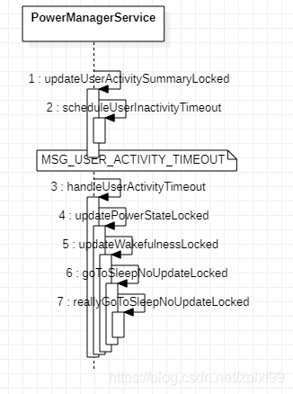

PowerManagerService第三讲之灭屏

先来讲灭屏，灭屏的方式一般有如下几种：

1.用户按Power键灭屏；  
2.手机自动放置一段时间后超时灭屏；  
3.Sensor灭屏。

灭屏的原因在PowerManager类中的sleepReasonToString方法有列出常见的：

```
    
    public static String sleepReasonToString(int sleepReason) {
        switch (sleepReason) {
            case GO_TO_SLEEP_REASON_APPLICATION: return "application";
            case GO_TO_SLEEP_REASON_DEVICE_ADMIN: return "device_admin";
            case GO_TO_SLEEP_REASON_TIMEOUT: return "timeout";
            case GO_TO_SLEEP_REASON_LID_SWITCH: return "lid_switch";
            case GO_TO_SLEEP_REASON_POWER_BUTTON: return "power_button";
            case GO_TO_SLEEP_REASON_HDMI: return "hdmi";
            case GO_TO_SLEEP_REASON_SLEEP_BUTTON: return "sleep_button";
            case GO_TO_SLEEP_REASON_ACCESSIBILITY: return "accessibility";
            case GO_TO_SLEEP_REASON_FORCE_SUSPEND: return "force_suspend";
            default: return Integer.toString(sleepReason);
        }
    }

```

当触发灭屏的时候，其实是调用的PowerManager中的goToSleep方法。  
这个方法共有两个：一个是只传参发出睡眠请求的时间time；另一是传三个参数：睡眠请求的时间time、灭屏原因reason、WakeLock的flag：

```
    public void goToSleep(long time) {
        goToSleep(time, GO_TO_SLEEP_REASON_APPLICATION, 0);
    }

    @UnsupportedAppUsage
    public void goToSleep(long time, int reason, int flags) {
        try {
            mService.goToSleep(time, reason, flags);
        } catch (RemoteException e) {
            throw e.rethrowFromSystemServer();
        }
    }

```

最终调用到PowerManagerSevice的goToSleep方法上：

```
        @Override 
        public void goToSleep(long eventTime, int reason, int flags) {
            if (eventTime > SystemClock.uptimeMillis()) {
                throw new IllegalArgumentException("event time must not be in the future");
            }

            
            mContext.enforceCallingOrSelfPermission(
                    android.Manifest.permission.DEVICE_POWER, null);

            
            final int uid = Binder.getCallingUid();
            final long ident = Binder.clearCallingIdentity();
            try {
                goToSleepInternal(eventTime, reason, flags, uid);
            } finally {
                Binder.restoreCallingIdentity(ident);
            }
        }

```

接着看goToSleepInternal的实现：

```
    private void goToSleepInternal(long eventTime, int reason, int flags, int uid) {
        
        synchronized (mLock) {
            
            if (goToSleepNoUpdateLocked(eventTime, reason, flags, uid)) {
                
                updatePowerStateLocked();
            }
        }
    }

```

先看goToSleepNoUpdateLocked：

```
    @SuppressWarnings("deprecation")
    private boolean goToSleepNoUpdateLocked(long eventTime, int reason, int flags, int uid) {
        if (DEBUG_SPEW) {
            Slog.d(TAG, "goToSleepNoUpdateLocked: eventTime=" + eventTime
                    + ", reason=" + reason + ", flags=" + flags + ", uid=" + uid);
        }

        if (eventTime < mLastWakeTime
                || mWakefulness == WAKEFULNESS_ASLEEP
                || mWakefulness == WAKEFULNESS_DOZING
                || !mBootCompleted || !mSystemReady) {
            return false;
        }

        Trace.traceBegin(Trace.TRACE_TAG_POWER, "goToSleep");
        try {
            
            reason = Math.min(PowerManager.GO_TO_SLEEP_REASON_MAX,
                    Math.max(reason, PowerManager.GO_TO_SLEEP_REASON_MIN));
            Slog.i(TAG, "Going to sleep due to " + PowerManager.sleepReasonToString(reason)
                    + " (uid " + uid + ")...");

            mLastSleepTime = eventTime;
            mLastSleepReason = reason;
            mSandmanSummoned = true;
            
            setWakefulnessLocked(WAKEFULNESS_DOZING, reason, eventTime);

            
            
            int numWakeLocksCleared = 0;
            final int numWakeLocks = mWakeLocks.size();
            for (int i = 0; i < numWakeLocks; i++) {
                final WakeLock wakeLock = mWakeLocks.get(i);
                switch (wakeLock.mFlags & PowerManager.WAKE_LOCK_LEVEL_MASK) {
                    case PowerManager.FULL_WAKE_LOCK:
                    case PowerManager.SCREEN_BRIGHT_WAKE_LOCK:
                    case PowerManager.SCREEN_DIM_WAKE_LOCK:
                        numWakeLocksCleared += 1;
                        break;
                }
            }
            EventLogTags.writePowerSleepRequested(numWakeLocksCleared);

            
            
            if ((flags & PowerManager.GO_TO_SLEEP_FLAG_NO_DOZE) != 0) {
                
                reallyGoToSleepNoUpdateLocked(eventTime, uid);
            }
        } finally {
            Trace.traceEnd(Trace.TRACE_TAG_POWER);
        }
        return true;
    }

```

最后来看PowerManagerService的核心方法updatePowerStateLocked方法，关键的地方Google都有注释说明了，来看源码实现：

```
    private void updatePowerStateLocked() {
        if (!mSystemReady || mDirty == 0) {
            return;
        }
        if (!Thread.holdsLock(mLock)) {
            Slog.wtf(TAG, "Power manager lock was not held when calling updatePowerStateLocked");
        }

        Trace.traceBegin(Trace.TRACE_TAG_POWER, "updatePowerState");
        try {
            
            
            
            updateIsPoweredLocked(mDirty);
            
            updateStayOnLocked(mDirty);
            
            updateScreenBrightnessBoostLocked(mDirty);

            
            
            
            
            final long now = SystemClock.uptimeMillis();
            int dirtyPhase2 = 0;
            
            for (;;) {
                int dirtyPhase1 = mDirty;
                dirtyPhase2 |= dirtyPhase1;
                mDirty = 0;

                
                updateWakeLockSummaryLocked(dirtyPhase1);
                
                updateUserActivitySummaryLocked(now, dirtyPhase1);
                
                if (!updateWakefulnessLocked(dirtyPhase1)) {
                    break;
                }
            }

            
            
            
            updateProfilesLocked(now);

            
            
            
            
            final boolean displayBecameReady = updateDisplayPowerStateLocked(dirtyPhase2);

            
            
            
            updateDreamLocked(dirtyPhase2, displayBecameReady);

            
            
            finishWakefulnessChangeIfNeededLocked();

            
            
            
            
            
            updateSuspendBlockerLocked();
        } finally {
            Trace.traceEnd(Trace.TRACE_TAG_POWER);
        }
    }

```

## <a id="t2"></a><a id="t2"></a><a id="1Power_224"></a>1.Power键灭屏

Power键的按键实现从native层到java层的整个流程我们后续会介绍。这里从java层之上开始看。

流程图如下：


具体的代码实现分析如下：

InputManagerService类中interceptKeyBeforeQueueing方法：

```
    
    private int interceptKeyBeforeQueueing(KeyEvent event, int policyFlags) {
        return mWindowManagerCallbacks.interceptKeyBeforeQueueing(event, policyFlags);
    }

```

调用WindowManagerCallbacks接口的interceptKeyBeforeQueueing方法，来看接口实现类InputMonitor：

```
    @Override
    public int interceptKeyBeforeQueueing(KeyEvent event, int policyFlags) {
        return mService.mPolicy.interceptKeyBeforeQueueing(event, policyFlags);
    }

```

调用的接口WindowManagerPolicy的interceptKeyBeforeQueueing方法，来看实现类是PhoneWindowManager类：

```
    @Override
    public int interceptKeyBeforeQueueing(KeyEvent event, int policyFlags) {
        if (!mSystemBooted) {
            
            return 0;
        }
        
        ......
        
        switch (keyCode) {
            case KeyEvent.KEYCODE_BACK: {
                if (down) {
                    interceptBackKeyDown();
                } else {
                    boolean handled = interceptBackKeyUp(event);

                    
                    if (handled) {
                        result &= ~ACTION_PASS_TO_USER;
                    }
                }
                break;
            }

            ......

            case KeyEvent.KEYCODE_POWER: {
                EventLogTags.writeInterceptPower(
                        KeyEvent.actionToString(event.getAction()),
                        mPowerKeyHandled ? 1 : 0, mPowerKeyPressCounter);
                
                cancelPendingAccessibilityShortcutAction();
                result &= ~ACTION_PASS_TO_USER;
                isWakeKey = false; 
                if (down) {
                    interceptPowerKeyDown(event, interactive);
                } else {
                    interceptPowerKeyUp(event, interactive, canceled);
                }
                break;
            }
            ......
        return result;
    }

```

根据按键的key值为KEYCODE_POWER ，调用到interceptPowerKeyUp方法：

```
    private void interceptPowerKeyUp(KeyEvent event, boolean interactive, boolean canceled) {
        ......

        if (!handled) {
            ......

            
            powerPress(eventTime, interactive, mPowerKeyPressCounter);
        }

        
        finishPowerKeyPress();
    }

```

这里会调用powerPress方法：

```
    private void powerPress(long eventTime, boolean interactive, int count) {
        if (mDefaultDisplayPolicy.isScreenOnEarly() && !mDefaultDisplayPolicy.isScreenOnFully()) {
            Slog.i(TAG, "Suppressed redundant power key press while "
                    + "already in the process of turning the screen on.");
            return;
        }
        Slog.d(TAG, "powerPress: eventTime=" + eventTime + " interactive=" + interactive
                + " count=" + count + " beganFromNonInteractive=" + mBeganFromNonInteractive +
                " mShortPressOnPowerBehavior=" + mShortPressOnPowerBehavior);

        if (count == 2) {
            powerMultiPressAction(eventTime, interactive, mDoublePressOnPowerBehavior);
        } else if (count == 3) {
            powerMultiPressAction(eventTime, interactive, mTriplePressOnPowerBehavior);
        } else if (interactive && !mBeganFromNonInteractive) {
            switch (mShortPressOnPowerBehavior) {
                case SHORT_PRESS_POWER_NOTHING:
                    break;
                case SHORT_PRESS_POWER_GO_TO_SLEEP:
                    goToSleepFromPowerButton(eventTime, 0);
                    break;
                case SHORT_PRESS_POWER_REALLY_GO_TO_SLEEP:
                    goToSleepFromPowerButton(eventTime, PowerManager.GO_TO_SLEEP_FLAG_NO_DOZE);
                    break;
                case SHORT_PRESS_POWER_REALLY_GO_TO_SLEEP_AND_GO_HOME:
                    if (goToSleepFromPowerButton(eventTime,
                            PowerManager.GO_TO_SLEEP_FLAG_NO_DOZE)) {
                        launchHomeFromHotKey(DEFAULT_DISPLAY);
                    }
                    break;
                case SHORT_PRESS_POWER_GO_HOME:
                    shortPressPowerGoHome();
                    break;
                case SHORT_PRESS_POWER_CLOSE_IME_OR_GO_HOME: {
                    if (mDismissImeOnBackKeyPressed) {
                        if (mInputMethodManagerInternal == null) {
                            mInputMethodManagerInternal =
                                    LocalServices.getService(InputMethodManagerInternal.class);
                        }
                        if (mInputMethodManagerInternal != null) {
                            mInputMethodManagerInternal.hideCurrentInputMethod();
                        }
                    } else {
                        shortPressPowerGoHome();
                    }
                    break;
                }
            }
        }
    }

```

判断mShortPressOnPowerBehavior的值，这个值获取是从config.xml(frameworks/base/core/res/res/values/config.xml)中的config_shortPressOnPowerBehavior：

```
    
    <integer name="config_shortPressOnPowerBehavior">1</integer>

```

所以值为1，那么switch语句中就会走SHORT\_PRESS\_POWER\_GO\_TO_SLEEP，调用goToSleepFromPowerButton方法：

```
    private boolean goToSleepFromPowerButton(long eventTime, int flags) {
        
        
        
        
        
        
        final PowerManager.WakeData lastWakeUp = mPowerManagerInternal.getLastWakeup();
        if (lastWakeUp != null && lastWakeUp.wakeReason == PowerManager.WAKE_REASON_GESTURE) {
            final int gestureDelayMillis = Settings.Global.getInt(mContext.getContentResolver(),
                    Settings.Global.POWER_BUTTON_SUPPRESSION_DELAY_AFTER_GESTURE_WAKE,
                    POWER_BUTTON_SUPPRESSION_DELAY_DEFAULT_MILLIS);
            final long now = SystemClock.uptimeMillis();
            if (mPowerButtonSuppressionDelayMillis > 0
                    && (now < lastWakeUp.wakeTime + mPowerButtonSuppressionDelayMillis)) {
                Slog.i(TAG, "Sleep from power button suppressed. Time since gesture: "
                        + (now - lastWakeUp.wakeTime) + "ms");
                return false;
            }
        }

        goToSleep(eventTime, PowerManager.GO_TO_SLEEP_REASON_POWER_BUTTON, flags);
        return true;
    }

```

接着调用goToSleep方法：

```
    private void goToSleep(long eventTime, int reason, int flags) {
        mRequestedOrGoingToSleep = true;
        mPowerManager.goToSleep(eventTime, reason, flags);
    }

```

这里看到传入的reason是GO\_TO\_SLEEP\_REASON\_POWER_BUTTON，最终就调用到了PowerManager中的goToSleep方法。之后的调用流程和上面是一样的。

## <a id="t3"></a><a id="t3"></a><a id="2_428"></a>2.超时灭屏

系统在设置中有一个Screen Timeout选项，可以设置系统的灭屏时间。当灭屏时间到达之后，底层会去将屏幕置暗。这块流程我们暂不讨论，看屏幕置暗之后的流程：

​ 从上面的描述中可以知道，当PowerManagerService启动之后最终会调用到核心函数updatePowerStateLocked上，这个函数是会实时监控屏幕亮度等信息的。这里会调用到一个关键函数updateUserActivitySummaryLocked（该函数更新mUserActivitySummary的值，以总结用户请求的状态，例如屏幕是亮还是暗）。

​ 共有四种屏幕状态：Awake（唤醒）、Dream（屏保）、Doze（Doze）、Asleep（睡眠）

流程图如下：



代码实现如下：

```
    private void updateUserActivitySummaryLocked(long now, int dirty) {
        
        if ((dirty & (DIRTY_WAKE_LOCKS | DIRTY_USER_ACTIVITY
                | DIRTY_WAKEFULNESS | DIRTY_SETTINGS)) != 0) {
            mHandler.removeMessages(MSG_USER_ACTIVITY_TIMEOUT);

            long nextTimeout = 0;
            
            if (mWakefulness == WAKEFULNESS_AWAKE
                    || mWakefulness == WAKEFULNESS_DREAMING
                    || mWakefulness == WAKEFULNESS_DOZING) {
                
                final long sleepTimeout = getSleepTimeoutLocked();
                
                final long screenOffTimeout = getScreenOffTimeoutLocked(sleepTimeout);
                
                final long screenDimDuration = getScreenDimDurationLocked(screenOffTimeout);
                final boolean userInactiveOverride = mUserInactiveOverrideFromWindowManager;
                final long nextProfileTimeout = getNextProfileTimeoutLocked(now);

                mUserActivitySummary = 0;
                
                if (mLastUserActivityTime >= mLastWakeTime) {
                    nextTimeout = mLastUserActivityTime
                            + screenOffTimeout - screenDimDuration;
                    if (now < nextTimeout) {
                        mUserActivitySummary = USER_ACTIVITY_SCREEN_BRIGHT;
                    } else {
                        nextTimeout = mLastUserActivityTime + screenOffTimeout;
                        if (now < nextTimeout) {
                            mUserActivitySummary = USER_ACTIVITY_SCREEN_DIM;
                        }
                    }
                }
                if (mUserActivitySummary == 0
                        && mLastUserActivityTimeNoChangeLights >= mLastWakeTime) {
                    nextTimeout = mLastUserActivityTimeNoChangeLights + screenOffTimeout;
                    if (now < nextTimeout) {
                        if (mDisplayPowerRequest.policy == DisplayPowerRequest.POLICY_BRIGHT
                                || mDisplayPowerRequest.policy == DisplayPowerRequest.POLICY_VR) {
                            mUserActivitySummary = USER_ACTIVITY_SCREEN_BRIGHT;
                        } else if (mDisplayPowerRequest.policy == DisplayPowerRequest.POLICY_DIM) {
                            mUserActivitySummary = USER_ACTIVITY_SCREEN_DIM;
                        }
                    }
                }

                if (mUserActivitySummary == 0) {
                    if (sleepTimeout >= 0) {
                        final long anyUserActivity = Math.max(mLastUserActivityTime,
                                mLastUserActivityTimeNoChangeLights);
                        if (anyUserActivity >= mLastWakeTime) {
                            nextTimeout = anyUserActivity + sleepTimeout;
                            if (now < nextTimeout) {
                                mUserActivitySummary = USER_ACTIVITY_SCREEN_DREAM;
                            }
                        }
                    } else {
                        mUserActivitySummary = USER_ACTIVITY_SCREEN_DREAM;
                        nextTimeout = -1;
                    }
                }

                if (mUserActivitySummary != USER_ACTIVITY_SCREEN_DREAM && userInactiveOverride) {
                    if ((mUserActivitySummary &
                            (USER_ACTIVITY_SCREEN_BRIGHT | USER_ACTIVITY_SCREEN_DIM)) != 0) {
                        
                        if (nextTimeout >= now && mOverriddenTimeout == -1) {
                            
                            mOverriddenTimeout = nextTimeout;
                        }
                    }
                    mUserActivitySummary = USER_ACTIVITY_SCREEN_DREAM;
                    nextTimeout = -1;
                }

                if ((mUserActivitySummary & USER_ACTIVITY_SCREEN_BRIGHT) != 0
                        && (mWakeLockSummary & WAKE_LOCK_STAY_AWAKE) == 0) {
                    nextTimeout = mAttentionDetector.updateUserActivity(nextTimeout);
                }

                if (nextProfileTimeout > 0) {
                    nextTimeout = Math.min(nextTimeout, nextProfileTimeout);
                }

                if (mUserActivitySummary != 0 && nextTimeout >= 0) {
                    scheduleUserInactivityTimeout(nextTimeout);
                }
            } else {
                mUserActivitySummary = 0;
            }

            if (DEBUG_SPEW) {
                Slog.d(TAG, "updateUserActivitySummaryLocked: mWakefulness="
                        + PowerManagerInternal.wakefulnessToString(mWakefulness)
                        + ", mUserActivitySummary=0x" + Integer.toHexString(mUserActivitySummary)
                        + ", nextTimeout=" + TimeUtils.formatUptime(nextTimeout));
            }
        }
    }

```

这里会调用到scheduleUserInactivityTimeout方法：

```
    private void scheduleUserInactivityTimeout(long timeMs) {
        final Message msg = mHandler.obtainMessage(MSG_USER_ACTIVITY_TIMEOUT);
        msg.setAsynchronous(true);
        mHandler.sendMessageAtTime(msg, timeMs);
    }

```

发送一个MSG\_USER\_ACTIVITY_TIMEOUT广播：

```
    private final class PowerManagerHandler extends Handler {
        public PowerManagerHandler(Looper looper) {
            super(looper, null, true );
        }

        @Override
        public void handleMessage(Message msg) {
            switch (msg.what) {
                case MSG_USER_ACTIVITY_TIMEOUT:
                    handleUserActivityTimeout();
                    break;
        ....
        }
    }

```

接着会调用到handleUserActivityTimeout方法：

```
    private void handleUserActivityTimeout() { 
        synchronized (mLock) {
            if (DEBUG_SPEW) {
                Slog.d(TAG, "handleUserActivityTimeout");
            }

            mDirty |= DIRTY_USER_ACTIVITY;
            updatePowerStateLocked();
        }
    }

```

这时又会调用到updatePowerStateLocked方法，直接看关键代码：

```
            
            
            
            final long now = SystemClock.uptimeMillis();
            int dirtyPhase2 = 0;
            for (;;) {
                int dirtyPhase1 = mDirty;
                dirtyPhase2 |= dirtyPhase1;
                mDirty = 0;

                updateWakeLockSummaryLocked(dirtyPhase1);
                updateUserActivitySummaryLocked(now, dirtyPhase1);
                if (!updateWakefulnessLocked(dirtyPhase1)) {
                    break;
                }
            }

```

看updateWakefulnessLocked的实现：

```
    private boolean updateWakefulnessLocked(int dirty) {
        boolean changed = false;
        if ((dirty & (DIRTY_WAKE_LOCKS | DIRTY_USER_ACTIVITY | DIRTY_BOOT_COMPLETED
                | DIRTY_WAKEFULNESS | DIRTY_STAY_ON | DIRTY_PROXIMITY_POSITIVE
                | DIRTY_DOCK_STATE)) != 0) {
            if (mWakefulness == WAKEFULNESS_AWAKE && isItBedTimeYetLocked()) {
                if (DEBUG_SPEW) {
                    Slog.d(TAG, "updateWakefulnessLocked: Bed time...");
                }
                final long time = SystemClock.uptimeMillis();
                if (shouldNapAtBedTimeLocked()) {
                    changed = napNoUpdateLocked(time, Process.SYSTEM_UID);
                } else {
                    changed = goToSleepNoUpdateLocked(time,
                            PowerManager.GO_TO_SLEEP_REASON_TIMEOUT, 0, Process.SYSTEM_UID);
                }
            }
        }
        return changed;
    }

```

这里要看下shouldNapAtBedTimeLocked方法的返回值，这个返回值是和手机中设置的屏保等值有关联的。这时我们返回false，走到goToSleepNoUpdateLocked：

```
    @SuppressWarnings("deprecation")
    private boolean goToSleepNoUpdateLocked(long eventTime, int reason, int flags, int uid) {
        if (DEBUG_SPEW) {
            Slog.d(TAG, "goToSleepNoUpdateLocked: eventTime=" + eventTime
                    + ", reason=" + reason + ", flags=" + flags + ", uid=" + uid);
        }

        if (eventTime < mLastWakeTime
                || mWakefulness == WAKEFULNESS_ASLEEP
                || mWakefulness == WAKEFULNESS_DOZING
                || !mBootCompleted || !mSystemReady) {
            return false;
        }

        Trace.traceBegin(Trace.TRACE_TAG_POWER, "goToSleep");
        try {
            reason = Math.min(PowerManager.GO_TO_SLEEP_REASON_MAX,
                    Math.max(reason, PowerManager.GO_TO_SLEEP_REASON_MIN));
            Slog.i(TAG, "Going to sleep due to " + PowerManager.sleepReasonToString(reason)
                    + " (uid " + uid + ")...");

            mLastSleepTime = eventTime;
            mLastSleepReason = reason;
            mSandmanSummoned = true;
            setWakefulnessLocked(WAKEFULNESS_DOZING, reason, eventTime);

            
            int numWakeLocksCleared = 0;
            final int numWakeLocks = mWakeLocks.size();
            for (int i = 0; i < numWakeLocks; i++) {
                final WakeLock wakeLock = mWakeLocks.get(i);
                switch (wakeLock.mFlags & PowerManager.WAKE_LOCK_LEVEL_MASK) {
                    case PowerManager.FULL_WAKE_LOCK:
                    case PowerManager.SCREEN_BRIGHT_WAKE_LOCK:
                    case PowerManager.SCREEN_DIM_WAKE_LOCK:
                        numWakeLocksCleared += 1;
                        break;
                }
            }
            EventLogTags.writePowerSleepRequested(numWakeLocksCleared);

            
            if ((flags & PowerManager.GO_TO_SLEEP_FLAG_NO_DOZE) != 0) {
                reallyGoToSleepNoUpdateLocked(eventTime, uid);
            }
        } finally {
            Trace.traceEnd(Trace.TRACE_TAG_POWER);
        }
        return true;
    }

```

这里后面就会调用到reallyGoToSleepNoUpdateLocked。逻辑就和power键灭屏类似。

## <a id="t4"></a><a id="t4"></a><a id="3Psensor_691"></a>3.Psensor灭屏

​ Proximity Sensor（近距离传感器）。手机通话过程中（比如QQ、微信语音等），当手机靠近人脸的时候，屏幕会去灭屏，这样就能保证用户不会触碰到屏幕导致误操作，还能起到省电的作用。这里是需要kernel层和java层的交互的，主要涉及kernel sensor、PowerManagerService、DisplayManagerService等。

PhotonicModulator是DisplayPowerState的内部类，是一个线程，用来异步更新screen和backlight

```
    private final class PhotonicModulator extends Thread {
        private static final int INITIAL_SCREEN_STATE = Display.STATE_OFF; 
        private static final int INITIAL_BACKLIGHT = -1; 

        private final Object mLock = new Object();

        .......
        @Override
        public void run() {
            for (;;) {
                
                final int state;
                final boolean stateChanged;
                final int backlight;
                final boolean backlightChanged;
                synchronized (mLock) {
                    state = mPendingState;
                    stateChanged = (state != mActualState);
                    backlight = mPendingBacklight;
                    backlightChanged = (backlight != mActualBacklight);
                    if (!stateChanged) {
                        
                        postScreenUpdateThreadSafe();
                        mStateChangeInProgress = false;
                    }
                    if (!backlightChanged) {
                        mBacklightChangeInProgress = false;
                    }
                    if (!stateChanged && !backlightChanged) {
                        try {
                            mLock.wait();
                        } catch (InterruptedException ex) { }
                        continue;
                    }
                    mActualState = state;
                    mActualBacklight = backlight;
                }

                
                if (DEBUG) {
                    Slog.d(TAG, "Updating screen state: state="
                            + Display.stateToString(state) + ", backlight=" + backlight);
                }
                mBlanker.requestDisplayState(state, backlight);
            }
        }
    }

```

在方法最后调用mBlanker.requestDisplayState函数，DisplayBlanker是一个接口，requestDisplayState接口方法。实现是在DisplayManagerService中：

```
    private final class LocalService extends DisplayManagerInternal {
        @Override
        public void initPowerManagement(final DisplayPowerCallbacks callbacks, Handler handler,
                SensorManager sensorManager) {
            synchronized (mSyncRoot) {
                DisplayBlanker blanker = new DisplayBlanker() {
                    @Override
                    public void requestDisplayState(int state, int brightness) {
                        
                        if (state == Display.STATE_OFF) {
                            requestGlobalDisplayStateInternal(state, brightness);
                        }

                        callbacks.onDisplayStateChange(state);

                        if (state != Display.STATE_OFF) {
                            requestGlobalDisplayStateInternal(state, brightness);
                        }
                    }
                };
                mDisplayPowerController = new DisplayPowerController(
                        mContext, callbacks, handler, sensorManager, blanker);
            }

            mHandler.sendEmptyMessage(MSG_LOAD_BRIGHTNESS_CONFIGURATION);
        }
    }

```

接着看DisplayManagerInternal的定义：

```
    
    public interface DisplayPowerCallbacks {
        void onStateChanged();
        void onProximityPositive();
        void onProximityNegative();
        void onDisplayStateChange(int state); 

        void acquireSuspendBlocker();
        void releaseSuspendBlocker();
    }

```

而在PowerManagerService中是有实现这个接口的：

```
    private final DisplayManagerInternal.DisplayPowerCallbacks mDisplayPowerCallbacks =
            new DisplayManagerInternal.DisplayPowerCallbacks() {
        private int mDisplayState = Display.STATE_UNKNOWN;

        @Override
        public void onStateChanged() {
            synchronized (mLock) {
                mDirty |= DIRTY_ACTUAL_DISPLAY_POWER_STATE_UPDATED;
                updatePowerStateLocked();
            }
        }

        @Override
        public void onProximityPositive() {
            synchronized (mLock) {
                mProximityPositive = true;
                mDirty |= DIRTY_PROXIMITY_POSITIVE;
                updatePowerStateLocked();
            }
        }

        @Override
        public void onProximityNegative() {
            synchronized (mLock) {
                mProximityPositive = false;
                mDirty |= DIRTY_PROXIMITY_POSITIVE;
                userActivityNoUpdateLocked(SystemClock.uptimeMillis(),
                        PowerManager.USER_ACTIVITY_EVENT_OTHER, 0, Process.SYSTEM_UID);
                updatePowerStateLocked();
            }
        }

        @Override
        public void onDisplayStateChange(int state) {
            
            
            
            synchronized (mLock) {
                if (mDisplayState != state) {
                    mDisplayState = state;
                    if (state == Display.STATE_OFF) {
                        if (!mDecoupleHalInteractiveModeFromDisplayConfig) {
                            setHalInteractiveModeLocked(false);
                        }
                        if (!mDecoupleHalAutoSuspendModeFromDisplayConfig) {
                            setHalAutoSuspendModeLocked(true);
                        }
                    } else {
                        if (!mDecoupleHalAutoSuspendModeFromDisplayConfig) {
                            setHalAutoSuspendModeLocked(false);
                        }
                        if (!mDecoupleHalInteractiveModeFromDisplayConfig) {
                            setHalInteractiveModeLocked(true);
                        }
                    }
                }
            }
        }
        ......
    };

```

onDisplayStateChange方法：

```
        @Override
        public void onDisplayStateChange(int state) {
            
            
            
            synchronized (mLock) {
                if (mDisplayState != state) {
                    mDisplayState = state;
                    if (state == Display.STATE_OFF) {
                        if (!mDecoupleHalInteractiveModeFromDisplayConfig) {
                            setHalInteractiveModeLocked(false);
                        }
                        if (!mDecoupleHalAutoSuspendModeFromDisplayConfig) {
                            setHalAutoSuspendModeLocked(true);
                        }
                    } else {
                        if (!mDecoupleHalAutoSuspendModeFromDisplayConfig) {
                            setHalAutoSuspendModeLocked(false);
                        }
                        if (!mDecoupleHalInteractiveModeFromDisplayConfig) {
                            setHalInteractiveModeLocked(true);
                        }
                    }
                }
            }
        }

```

setHalInteractiveModeLocked是一个native方法，

Dialer中实现Psensor的亮灭屏的控制是通过ProximitySensor类。

位置在：/packages/apps/Dialer/java/com/android/incallui/ProximitySensor.java，初始化等方法就不去具体关注，只看他控制Psensor的关键方法updateProximitySensorMode：

```
  private synchronized void updateProximitySensorMode() {
    Trace.beginSection("ProximitySensor.updateProximitySensorMode");
    final int audioRoute = audioModeProvider.getAudioState().getRoute();

    boolean screenOnImmediately =
        (CallAudioState.ROUTE_WIRED_HEADSET == audioRoute
            || CallAudioState.ROUTE_SPEAKER == audioRoute
            || CallAudioState.ROUTE_BLUETOOTH == audioRoute
            || isAttemptingVideoCall
            || isVideoCall
            || isRttCall);

    
    
    
    final boolean horizontal = (orientation == AccelerometerListener.ORIENTATION_HORIZONTAL);
    screenOnImmediately |= !uiShowing && horizontal;

    
    
    
    
    screenOnImmediately |= dialpadVisible && horizontal;

    LogUtil.i(
        "ProximitySensor.updateProximitySensorMode",
        "screenOnImmediately: %b, dialPadVisible: %b, "
            + "offHook: %b, horizontal: %b, uiShowing: %b, audioRoute: %s",
        screenOnImmediately,
        dialpadVisible,
        isPhoneOffhook,
        orientation == AccelerometerListener.ORIENTATION_HORIZONTAL,
        uiShowing,
        CallAudioState.audioRouteToString(audioRoute));

    if (isPhoneOffhook && !screenOnImmediately) {
      LogUtil.v("ProximitySensor.updateProximitySensorMode", "turning on proximity sensor");
      
      
      turnOnProximitySensor();
    } else {
      LogUtil.v("ProximitySensor.updateProximitySensorMode", "turning off proximity sensor");
      
      
      turnOffProximitySensor(screenOnImmediately);
    }
    Trace.endSection();
  }

```

对应的控制Psensor的方法为turnOnProximitySensor/turnOffProximitySensor：

```
  private void turnOnProximitySensor() {
    if (proximityWakeLock != null) {
      if (!proximityWakeLock.isHeld()) {
        LogUtil.i("ProximitySensor.turnOnProximitySensor", "acquiring wake lock");
        proximityWakeLock.acquire();
      } else {
        LogUtil.i("ProximitySensor.turnOnProximitySensor", "wake lock already acquired");
      }
    }
  }

  private void turnOffProximitySensor(boolean screenOnImmediately) {
    if (proximityWakeLock != null) {
      if (proximityWakeLock.isHeld()) {
        LogUtil.i("ProximitySensor.turnOffProximitySensor", "releasing wake lock");
        int flags = (screenOnImmediately ? 0 : PowerManager.RELEASE_FLAG_WAIT_FOR_NO_PROXIMITY);
        proximityWakeLock.release(flags);
      } else {
        LogUtil.i("ProximitySensor.turnOffProximitySensor", "wake lock already released");
      }
    }
  }

```

这两个函数就是根据isHeld方法的返回值来判断当前是否有进程持wake 锁，没有的话就会去申请（acquire）/释放（release）锁。

另proximityWakeLock的初始赋值在ProximitySensor的初始化中，申请了一个PROXIMITY\_SCREEN\_OFF\_WAKE\_LOCK类型的wakeLock（在wakeLock章节中已介绍了这个锁是当传感器激活时，关闭屏幕；物体移开后不久，屏幕再次打开）：

```
  public ProximitySensor(
      @NonNull Context context,
      @NonNull AudioModeProvider audioModeProvider,
      @NonNull AccelerometerListener accelerometerListener) {
    Trace.beginSection("ProximitySensor.Constructor");
    powerManager = (PowerManager) context.getSystemService(Context.POWER_SERVICE);
    if (powerManager.isWakeLockLevelSupported(PowerManager.PROXIMITY_SCREEN_OFF_WAKE_LOCK)) {
      proximityWakeLock =
          powerManager.newWakeLock(PowerManager.PROXIMITY_SCREEN_OFF_WAKE_LOCK, TAG);
    } else {
      LogUtil.i("ProximitySensor.constructor", "Device does not support proximity wake lock.");
      proximityWakeLock = null;
    }

```

接着就会调用到PowerManagerService中去了，在申请和释放wakelock的时候，最终会调用到核心函数updatePowerStateLocked，其中第三步是更新显示状态：

```
            
            final boolean displayBecameReady = updateDisplayPowerStateLocked(dirtyPhase2);


```

来看updateDisplayPowerStateLocked的实现：

```
    private boolean updateDisplayPowerStateLocked(int dirty) {
        final boolean oldDisplayReady = mDisplayReady;
        if ((dirty & (DIRTY_WAKE_LOCKS | DIRTY_USER_ACTIVITY | DIRTY_WAKEFULNESS
                | DIRTY_ACTUAL_DISPLAY_POWER_STATE_UPDATED | DIRTY_BOOT_COMPLETED
                | DIRTY_SETTINGS | DIRTY_SCREEN_BRIGHTNESS_BOOST | DIRTY_VR_MODE_CHANGED |
                DIRTY_QUIESCENT)) != 0) {
            mDisplayPowerRequest.policy = getDesiredScreenPolicyLocked();

            
            .......

            
            .......

            mDisplayReady = mDisplayManagerInternal.requestPowerState(mDisplayPowerRequest,
                    mRequestWaitForNegativeProximity);
            mRequestWaitForNegativeProximity = false;

            ......
        }
        return mDisplayReady && !oldDisplayReady;
    }

```

mDisplayPowerController对象，查看DisplayPowerController的requestPowerState方法：

```
    public boolean requestPowerState(DisplayPowerRequest request,
            boolean waitForNegativeProximity) {
        if (DEBUG) {
            Slog.d(TAG, "requestPowerState: "
                    + request + ", waitForNegativeProximity=" + waitForNegativeProximity);
        }

        synchronized (mLock) {
            boolean changed = false;

            ......

            if (changed && !mPendingRequestChangedLocked) {
                mPendingRequestChangedLocked = true;
                sendUpdatePowerStateLocked();
            }

            return mDisplayReadyLocked;
        }
    }

```

这里会执行sendUpdatePowerStateLocked方法：

```
    private void sendUpdatePowerStateLocked() {
        if (!mPendingUpdatePowerStateLocked) {
            mPendingUpdatePowerStateLocked = true;
            Message msg = mHandler.obtainMessage(MSG_UPDATE_POWER_STATE);
            mHandler.sendMessage(msg);
        }
    }

```

通过发送一个MSG\_UPDATE\_POWER_STATE消息：

```
    private final class DisplayControllerHandler extends Handler {
        public DisplayControllerHandler(Looper looper) {
            super(looper, null, true );
        }

        @Override
        public void handleMessage(Message msg) {
            switch (msg.what) {
                case MSG_UPDATE_POWER_STATE:
                    updatePowerState();
                    break;

```

执行updatePowerState方法：

```
    private void updatePowerState() {
        
        final boolean mustNotify;
        final int previousPolicy;
        boolean mustInitialize = false;
        int brightnessAdjustmentFlags = 0;
        mBrightnessReasonTemp.set(null);
        .......

        
        if (mProximitySensor != null) {
            
            if (mPowerRequest.useProximitySensor && state != Display.STATE_OFF) {
                
                setProximitySensorEnabled(true);
                
                if (!mScreenOffBecauseOfProximity
                        && mProximity == PROXIMITY_POSITIVE) {
                    mScreenOffBecauseOfProximity = true;
                    
                    sendOnProximityPositiveWithWakelock();
                }
            } else if (mWaitingForNegativeProximity
                    && mScreenOffBecauseOfProximity
                    && mProximity == PROXIMITY_POSITIVE
                    && state != Display.STATE_OFF) {
                
                setProximitySensorEnabled(true);
            } else {
                setProximitySensorEnabled(false);
                mWaitingForNegativeProximity = false;
            }
            if (mScreenOffBecauseOfProximity
                    && mProximity != PROXIMITY_POSITIVE) {
                mScreenOffBecauseOfProximity = false;
                sendOnProximityNegativeWithWakelock();
            }
        } else {
            mWaitingForNegativeProximity = false;
        }
        if (mScreenOffBecauseOfProximity) {
            state = Display.STATE_OFF;
        }
        .......
    }
    

```

截取方法中涉及到Psensor的部分，可以看到会调用到setProximitySensorEnabled方法：

```
    private void setProximitySensorEnabled(boolean enable) {
        if (enable) {
            if (!mProximitySensorEnabled) {
                
                
                mProximitySensorEnabled = true;
                mSensorManager.registerListener(mProximitySensorListener, mProximitySensor,
                        SensorManager.SENSOR_DELAY_NORMAL, mHandler);
            }
        } else {
            if (mProximitySensorEnabled) {
                
                
                mProximitySensorEnabled = false;
                mProximity = PROXIMITY_UNKNOWN;
                mPendingProximity = PROXIMITY_UNKNOWN;
                mHandler.removeMessages(MSG_PROXIMITY_SENSOR_DEBOUNCED);
                mSensorManager.unregisterListener(mProximitySensorListener);
                clearPendingProximityDebounceTime(); 
            }
        }
    }

```

这里会去注册一个mProximitySensorListener的监听。当Psensor的状态发生了变化，就会回调Listener的onSensorChanged方法：

```
    private final SensorEventListener mProximitySensorListener = new SensorEventListener() {
        @Override
        public void onSensorChanged(SensorEvent event) {
            if (mProximitySensorEnabled) {
                final long time = SystemClock.uptimeMillis();
                
                
                final float distance = event.values[0];
                boolean positive = distance >= 0.0f && distance < mProximityThreshold;
                handleProximitySensorEvent(time, positive);
            }
        }
        ......
    }

```

执行到handleProximitySensorEvent方法：

```
    private void handleProximitySensorEvent(long time, boolean positive) {
        if (mProximitySensorEnabled) {
            if (mPendingProximity == PROXIMITY_NEGATIVE && !positive) {
                return; 
            }
            if (mPendingProximity == PROXIMITY_POSITIVE && positive) {
                return; 
            }

            
            
            
            mHandler.removeMessages(MSG_PROXIMITY_SENSOR_DEBOUNCED);
            if (positive) {
                mPendingProximity = PROXIMITY_POSITIVE;
                setPendingProximityDebounceTime(
                        time + PROXIMITY_SENSOR_POSITIVE_DEBOUNCE_DELAY); 
            } else {
                mPendingProximity = PROXIMITY_NEGATIVE;
                setPendingProximityDebounceTime(
                        time + PROXIMITY_SENSOR_NEGATIVE_DEBOUNCE_DELAY); 
            }

            
            debounceProximitySensor();
        }
    }

```

而debounceProximitySensor方法又会回到updatePowerState方法的调用：

```
    private void debounceProximitySensor() {
        if (mProximitySensorEnabled
                && mPendingProximity != PROXIMITY_UNKNOWN
                && mPendingProximityDebounceTime >= 0) {
            final long now = SystemClock.uptimeMillis();
            if (mPendingProximityDebounceTime <= now) {
                
                mProximity = mPendingProximity;
                updatePowerState();
                clearPendingProximityDebounceTime(); 
            } else {
                
                
                Message msg = mHandler.obtainMessage(MSG_PROXIMITY_SENSOR_DEBOUNCED);
                mHandler.sendMessageAtTime(msg, mPendingProximityDebounceTime);
            }
        }
    }

```

这时回到updatePowerState方法上，关注sendOnProximityPositiveWithWakelock方法：

```
    private void sendOnProximityPositiveWithWakelock() {
        mCallbacks.acquireSuspendBlocker();
        mHandler.post(mOnProximityPositiveRunnable);
    }

    private final Runnable mOnProximityPositiveRunnable = new Runnable() {
        @Override
        public void run() {
            mCallbacks.onProximityPositive();
            mCallbacks.releaseSuspendBlocker();
        }
    };

```

这个回调方法会在PowerManagerService中实现的。而最终的最终会调用到PowerManagerService的核心函数updatePowerStateLocked方法上。

当PSensor完成了屏幕的关闭/点亮之后就会去执行updateSuspendBlockerLocked方法：

```
    private void updateSuspendBlockerLocked() {
        final boolean needWakeLockSuspendBlocker = ((mWakeLockSummary & WAKE_LOCK_CPU) != 0);
        final boolean needDisplaySuspendBlocker = needDisplaySuspendBlockerLocked();
        final boolean autoSuspend = !needDisplaySuspendBlocker;
        final boolean interactive = mDisplayPowerRequest.isBrightOrDim();

        
        
        
        if (!autoSuspend && mDecoupleHalAutoSuspendModeFromDisplayConfig) {
            setHalAutoSuspendModeLocked(false);
        }

        
        
        if (needWakeLockSuspendBlocker && !mHoldingWakeLockSuspendBlocker) {
            mWakeLockSuspendBlocker.acquire();
            mHoldingWakeLockSuspendBlocker = true;
        }
        if (needDisplaySuspendBlocker && !mHoldingDisplaySuspendBlocker) {
            mDisplaySuspendBlocker.acquire();
            mHoldingDisplaySuspendBlocker = true;
        }

        
        
        
        
        
        
        if (mDecoupleHalInteractiveModeFromDisplayConfig) {
            
            
            
            
            if (interactive || mDisplayReady) {
                setHalInteractiveModeLocked(interactive);
            }
        }

        
        
        if (!needWakeLockSuspendBlocker && mHoldingWakeLockSuspendBlocker) {
            mWakeLockSuspendBlocker.release();
            mHoldingWakeLockSuspendBlocker = false;
        }
        if (!needDisplaySuspendBlocker && mHoldingDisplaySuspendBlocker) {
            mDisplaySuspendBlocker.release();
            mHoldingDisplaySuspendBlocker = false;
        }

        
        if (autoSuspend && mDecoupleHalAutoSuspendModeFromDisplayConfig) {
            setHalAutoSuspendModeLocked(true);
        }
    }

```

而acquire/release会去调用到native中的方法：

```
        @Override
        public void acquire() {
            synchronized (this) {
                mReferenceCount += 1;
                if (mReferenceCount == 1) {
                    if (DEBUG_SPEW) {
                        Slog.d(TAG, "Acquiring suspend blocker \"" + mName + "\".");
                    }
                    Trace.asyncTraceBegin(Trace.TRACE_TAG_POWER, mTraceName, 0);
                    mNativeWrapper.nativeAcquireSuspendBlocker(mName);
                }
            }
        }

        @Override
        public void release() {
            synchronized (this) {
                mReferenceCount -= 1;
                if (mReferenceCount == 0) {
                    if (DEBUG_SPEW) {
                        Slog.d(TAG, "Releasing suspend blocker \"" + mName + "\".");
                    }
                    mNativeWrapper.nativeReleaseSuspendBlocker(mName);
                    Trace.asyncTraceEnd(Trace.TRACE_TAG_POWER, mTraceName, 0);
                } else if (mReferenceCount < 0) {
                    Slog.wtf(TAG, "Suspend blocker \"" + mName
                            + "\" was released without being acquired!", new Throwable());
                    mReferenceCount = 0;
                }
            }
        }

```

jni层：com\_android\_server\_power\_PowerManagerService.cpp中的实现：

```
static void nativeAcquireSuspendBlocker(JNIEnv *env, jclass /* clazz */, jstring nameStr) {
    ScopedUtfChars name(env, nameStr);
    acquire_wake_lock(PARTIAL_WAKE_LOCK, name.c_str());
}

static void nativeReleaseSuspendBlocker(JNIEnv *env, jclass /* clazz */, jstring nameStr) {
    ScopedUtfChars name(env, nameStr);
    release_wake_lock(name.c_str());
}

```

综上，PowerManagerService的灭屏相关知识就讲到这。