Android : Camera2/HAL3 框架分析 - sheldon_blogs

[原地址](https://www.cnblogs.com/blogs-of-lxl/p/10651611.html)
**一、Android O上的Treble机制：**

　　在 Android O 中，系统启动时，会启动一个 CameraProvider 服务，它是从 cameraserver 进程中分离出来，作为一个独立进程 android.hardware.camera.provider@2.4-service 用来控制 camera HAL，cameraserver通过 HIDL 机制于camera provider进行通信。HIDL源自于 Android O 版本加入的 Treble 机制，它的主要功能是将 service 与 HAL 隔离，以方便 HAL 部分进行独立升级，类似于 APP 与 Framework 之间的 Binder 通信机制，通过引入一个进程间通信机制而针对不同层级进行解耦（从 Local call 变成了 Remote call）。如下图：

　　　　　　

 cameraserver 与 provider 这两个进程启动、初始化的调用逻辑，如下图：

　　　　　　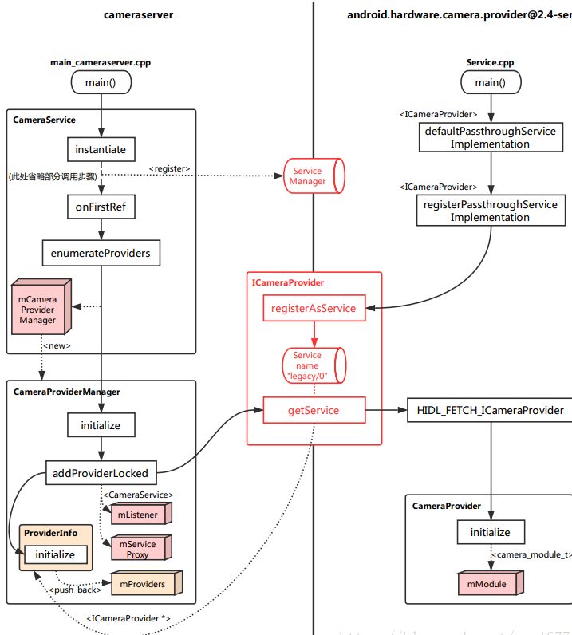

**二、Camera HAL3的框架更新：**

*   **Application framework：**用于给APP提供访问hardware的Camera API2，通过binder来访问camera service。

*   **AIDL:** 基于Binder实现的一个用于让App fw代码访问natice fw代码的接口。其实现存在于下述路径：frameworks/av/camera/aidl/android/hardware。其中：

    (1) ICameraService 是相机服务的接口。用于请求连接、添加监听等。  
    (2) ICameraDeviceUser 是已打开的特定相机设备的接口。应用框架可通过它访问具体设备。  
    (3) ICameraServiceListener 和 ICameraDeviceCallbacks 分别是从 CameraService 和 CameraDevice 到应用框架的回调。

*   **Natice framework**：frameworks/av/。提供了ICameraService、ICameraDeviceUser、ICameraDeviceCallbacks、ICameraServiceListener等aidl接口的实现。以及camera server的main函数。
*   **Binder IPC interface**：提供进程间通信的接口，APP和CameraService的通信、CameraService和HAL的通信。其中，AIDL、HIDL都是基于Binder实现的。
*   **Camera Service**：frameworks/av/services/camera/。同APP、HAL交互的服务，起到了承上启下的作用。
*   **HAL：**Google的HAL定义了可以让Camera Service访问的标准接口。对于供应商而言，必须要实现这些接口。

**1.Camera HAL3 构建连路的过程，如下图（红色虚线是上行路线，黑色虚线则是下行路线）：**

**　　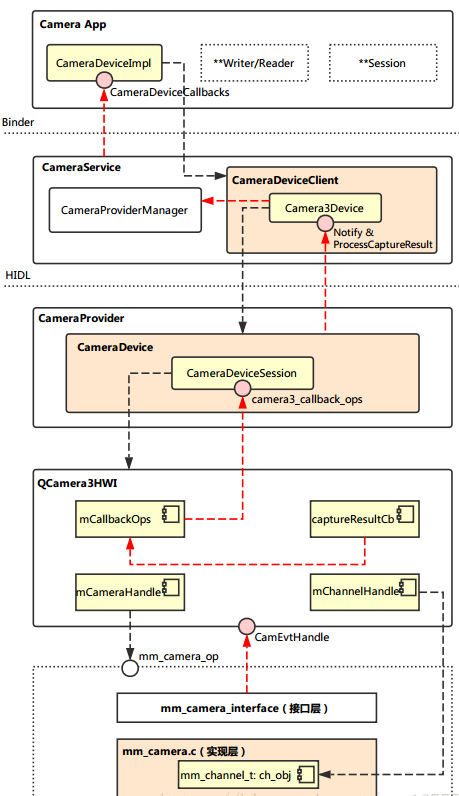**

 　**2.从 App 到 CameraService的调用流程**

　　从 Application 连接到 CameraService，这涉及到 Android 架构中的三个层次：App 层，Framework 层，Runtime 层。其中，App 层直接调用 Framework 层所封装的方法，而 Framework 层需要通过 Binder 远程调用 Runtime 中 CameraService 的函数。  
　　这一部分主要的函数调用逻辑如下图所示：  
　　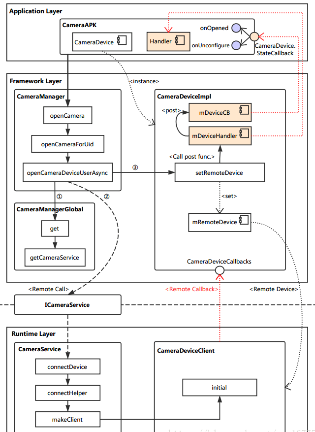

 　　在 App 中，需要调用打开相机的API如下:

*   CameraCharacteristics：描述摄像头的各种特性，我们可以通过CameraManager的getCameraCharacteristics(@NonNull String cameraId)方法来获取。
*   CameraDevice：描述系统摄像头，类似于早期的Camera。
*   CameraCaptureSession：Session类，当需要拍照、预览等功能时，需要先创建该类的实例，然后通过该实例里的方法进行控制（例如：拍照 capture()）。
*   CaptureRequest：描述了一次操作请求，拍照、预览等操作都需要先传入CaptureRequest参数，具体的参数控制也是通过CameraRequest的成员变量来设置。
*   CaptureResult：描述拍照完成后的结果。

  
　　例如打开camera的java代码：

　mCameraManager.openCamera(currentCameraId, stateCallback, backgroundHandler);

　　Camera2拍照流程如下所示：

　　

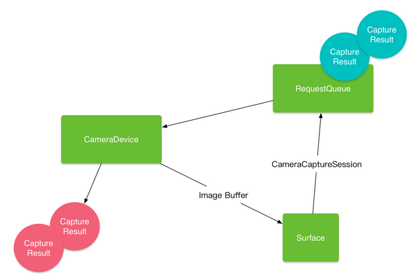

　**(1)Framework CameraManager ：`/frameworks/base/core/java/android/hardware/camera2/CameraManager.java`**

　　最初的入口就是 CameraManager 的 `openCamera` 方法，但通过代码可以看到，它仅仅是调用了 `openCameraForUid` 方法。

@RequiresPermission(android.Manifest.permission.CAMERA) public void openCamera(@NonNull String cameraId,
        @NonNull final CameraDevice.StateCallback callback, @Nullable Handler handler) throws CameraAccessException {

    openCameraForUid(cameraId, callback, handler, USE\_CALLING\_UID);
}

　　下面的代码**忽略掉了一些参数检查相关操作**，最终主要调用了 `openCameraDeviceUserAsync` 方法。

public void openCameraForUid(@NonNull String cameraId,
        @NonNull final CameraDevice.StateCallback callback, @Nullable Handler handler, int clientUid) throws CameraAccessException { /* Do something in*/ ...... /* Do something out*/ openCameraDeviceUserAsync(cameraId, callback, handler, clientUid);
}

　　参考如下注释分析：

private CameraDevice openCameraDeviceUserAsync(String cameraId,
        CameraDevice.StateCallback callback, Handler handler, final int uid) throws CameraAccessException {
    CameraCharacteristics characteristics = getCameraCharacteristics(cameraId);
    CameraDevice device = null; synchronized (mLock) {

        ICameraDeviceUser cameraUser = null;

        android.hardware.camera2.impl.CameraDeviceImpl deviceImpl =   //实例化一个 CameraDeviceImpl。构造时传入了 CameraDevice.StateCallback 以及 Handler。
                new android.hardware.camera2.impl.CameraDeviceImpl(  
                    cameraId,
                    callback,
                    handler,
                    characteristics,
                    mContext.getApplicationInfo().targetSdkVersion);

        ICameraDeviceCallbacks callbacks = deviceImpl.getCallbacks(); //获取 CameraDeviceCallback 实例，这是提供给远端连接到 CameraDeviceImpl 的接口。

       try { if (supportsCamera2ApiLocked(cameraId)) {  //HAL3 中走的是这一部分逻辑，主要是从 CameraManagerGlobal 中获取 CameraService 的本地接口，通过它远端调用（采用 Binder 机制） connectDevice 方法连接到相机设备。
　　　　　　　　　　　　　　　　　　　　　　　　　　　　　　　　//注意返回的 cameraUser 实际上指向的是远端 CameraDeviceClient 的本地接口。 // Use cameraservice's cameradeviceclient implementation for HAL3.2+ devices
                ICameraService cameraService = CameraManagerGlobal.get().getCameraService(); if (cameraService == null) { throw new ServiceSpecificException(
                        ICameraService.ERROR_DISCONNECTED, "Camera service is currently unavailable");
                }
                cameraUser = cameraService.connectDevice(callbacks, cameraId,
                        mContext.getOpPackageName(), uid);
            } else { // Use legacy camera implementation for HAL1 devices
                int id; try {
                    id = Integer.parseInt(cameraId);
                } catch (NumberFormatException e) { throw new IllegalArgumentException("Expected cameraId to be numeric, but it was: "
                            + cameraId);
                }

                Log.i(TAG, "Using legacy camera HAL.");
                cameraUser = CameraDeviceUserShim.connectBinderShim(callbacks, id);
            }
        } catch (ServiceSpecificException e) { /* Do something in */ ...... /* Do something out */ } // TODO: factor out callback to be non-nested, then move setter to constructor // For now, calling setRemoteDevice will fire initial // onOpened/onUnconfigured callbacks. // This function call may post onDisconnected and throw CAMERA_DISCONNECTED if // cameraUser dies during setup.
        deviceImpl.setRemoteDevice(cameraUser); //将 CameraDeviceClient 设置到 CameraDeviceImpl 中进行管理。
        device = deviceImpl;
    } return device;
}

　**(2)CameraDeviceImpl : `/frameworks/base/core/java/android/hardware/camera2/Impl/CameraDeviceImpl.java`**

　　在继续向下分析打开相机流程之前，先简单看看调用到的 CameraDeviceImpl 中的`setRemoteDevice` 方法，主要是将获取到的远端设备保存起来：

/** \* Set remote device, which triggers initial onOpened/onUnconfigured callbacks
 \*
 \* &lt;p&gt;This function may post onDisconnected and throw CAMERA_DISCONNECTED if remoteDevice dies
 \* during setup.&lt;/p&gt;
 * */
public void setRemoteDevice(ICameraDeviceUser remoteDevice) throws CameraAccessException { synchronized(mInterfaceLock) { // TODO: Move from decorator to direct binder-mediated exceptions // If setRemoteFailure already called, do nothing
        if (mInError) return;

        mRemoteDevice = new ICameraDeviceUserWrapper(remoteDevice); //通过 ICameraDeviceUserWrapper 给远端设备实例加上一层封装。
 IBinder remoteDeviceBinder = remoteDevice.asBinder(); //使用 Binder 机制的一些基本设置。 // For legacy camera device, remoteDevice is in the same process, and // asBinder returns NULL.
        if (remoteDeviceBinder != null) { try {
                remoteDeviceBinder.linkToDeath(this, /*flag*/ 0); //如果这个binder消失，为标志信息注册一个接收器。
            } catch (RemoteException e) {
                CameraDeviceImpl.this.mDeviceHandler.post(mCallOnDisconnected); throw new CameraAccessException(CameraAccessException.CAMERA_DISCONNECTED, "The camera device has encountered a serious error");
            }
        }

        mDeviceHandler.post(mCallOnOpened); //需此处触发 onOpened 与 onUnconfigured 这两个回调，每个回调都是通过 mDeviceHandler 启用一个新线程来调用的。
 mDeviceHandler.post(mCallOnUnconfigured);
    }
}

**　（3）Runtime：通过 Binder 机制，我们远端调用了 `connectDevice` 方法（在 C++ 中称为函数，但说成方法可能更顺口一些），这个方法实现在 CameraService 类中。**

**　（4）CameraService：`/frameworks/av/services/camera/libcameraservice/CameraService.cpp`**

Status CameraService::connectDevice( const sp&lt;hardware::camera2::ICameraDeviceCallbacks&gt;& cameraCb, const String16& cameraId, const String16& clientPackageName, int clientUid, /*out*/ sp&lt;hardware::camera2::ICameraDeviceUser&gt;* device) {

    ATRACE_CALL();
    Status ret = Status::ok();
    String8 id = String8(cameraId);
    sp&lt;CameraDeviceClient&gt; client = nullptr; //此处调用的 connectHelper 方法才真正实现了连接逻辑（HAL1 时最终也调用到这个方法）。需要注意的是，设定的模板类型是 ICameraDeviceCallbacks 以及 CameraDeviceClient。
    ret = connectHelper&lt;hardware::camera2::ICameraDeviceCallbacks,CameraDeviceClient&gt;(cameraCb, id,
            CAMERA\_HAL\_API\_VERSION\_UNSPECIFIED, clientPackageName,
            clientUid, USE\_CALLING\_PID, API_2, /*legacyMode*/ false, /*shimUpdateOnly*/ false, /*out*/client); if(!ret.isOk()) {
        logRejected(id, getCallingPid(), String8(clientPackageName),
                ret.toString8()); return ret;
    } *device = client; //client 指向的类型是 CameraDeviceClient，其实例则是最终的返回结果。
    return ret;
}

　　`connectHelper` 内容较多，忽略掉我们还无需关注的地方分析：

template<class CALLBACK, class CLIENT> Status CameraService::connectHelper(const sp&lt;CALLBACK&gt;& cameraCb, const String8& cameraId, int halVersion, const String16& clientPackageName, int clientUid, int clientPid,
        apiLevel effectiveApiLevel, bool legacyMode, bool shimUpdateOnly, /*out*/sp&lt;CLIENT&gt;& device) {
    binder::Status ret = binder::Status::ok();

    String8 clientName8(clientPackageName); /* Do something in */ ...... /* Do something out */ sp&lt;BasicClient&gt; tmp = nullptr; //调用 makeClient 生成 CameraDeviceClient 实例。
        if(!(ret = makeClient(this, cameraCb, clientPackageName, cameraId, facing, clientPid,
                clientUid, getpid(), legacyMode, halVersion, deviceVersion, effectiveApiLevel, /*out*/&tmp)).isOk()) { return ret;
        } //初始化 CLIENT 实例。注意此处的模板类型 CLIENT 即是 CameraDeviceClient，传入的参数 mCameraProviderManager 则是与 HAL service 有关。 
        client = static_cast&lt;CLIENT*&gt;(tmp.get());

        LOG\_ALWAYS\_FATAL_IF(client.get() == nullptr, "%s: CameraService in invalid state",
                \_\_FUNCTION\_\_);

        err = client->initialize(mCameraProviderManager); /* Do something in */ ...... /* Do something out */

    // Important: release the mutex here so the client can call back into the service from its // destructor (can be at the end of the call)
    device = client; return ret;
} 

　　makeClient 主要是根据 API 版本以及 HAL 版本来选择生成具体的 Client 实例，Client 就沿着前面分析下来的路径返回到 CameraDeviceImpl 实例中，被保存到 mRemoteDevice。

Status CameraService::makeClient(const sp&lt;CameraService&gt;& cameraService, const sp&lt;IInterface&gt;& cameraCb, const String16& packageName, const String8& cameraId, int facing, int clientPid, uid_t clientUid, int servicePid, bool legacyMode, int halVersion, int deviceVersion, apiLevel effectiveApiLevel, /*out*/sp&lt;BasicClient&gt;* client) { if (halVersion < 0 || halVersion == deviceVersion) { // Default path: HAL version is unspecified by caller, create CameraClient // based on device version reported by the HAL.
        switch(deviceVersion) { case CAMERA\_DEVICE\_API\_VERSION\_1_0: /* Do something in */ ...... /* Do something out */
          case CAMERA\_DEVICE\_API\_VERSION\_3_0: case CAMERA\_DEVICE\_API\_VERSION\_3_1: case CAMERA\_DEVICE\_API\_VERSION\_3_2: case CAMERA\_DEVICE\_API\_VERSION\_3_3: case CAMERA\_DEVICE\_API\_VERSION\_3_4: if (effectiveApiLevel == API_1) { // Camera1 API route
                sp&lt;ICameraClient&gt; tmp = static_cast&lt;ICameraClient*&gt;(cameraCb.get()); *client = new Camera2Client(cameraService, tmp, packageName, cameraIdToInt(cameraId),
                        facing, clientPid, clientUid, servicePid, legacyMode);
            } else { // Camera2 API route : 实例化了 CameraDeviceClient 类作为 Client（注意此处构造传入了 ICameraDeviceCallbacks，这是连接到 CameraDeviceImpl 的远端回调）
                sp&lt;hardware::camera2::ICameraDeviceCallbacks&gt; tmp = static_cast&lt;hardware::camera2::ICameraDeviceCallbacks*&gt;(cameraCb.get()); *client = new CameraDeviceClient(cameraService, tmp, packageName, cameraId,
                        facing, clientPid, clientUid, servicePid);
            } break; default: // Should not be reachable
            ALOGE("Unknown camera device HAL version: %d", deviceVersion); return STATUS\_ERROR\_FMT(ERROR\_INVALID\_OPERATION, "Camera device \\"%s\\" has unknown HAL version %d",
                    cameraId.string(), deviceVersion);
        }
    } else { /* Do something in */ ...... /* Do something out */ } return Status::ok();
}

　　至此，打开相机流程中，从 App 到 CameraService 的调用逻辑基本上就算走完了。

　　简图总结:

　　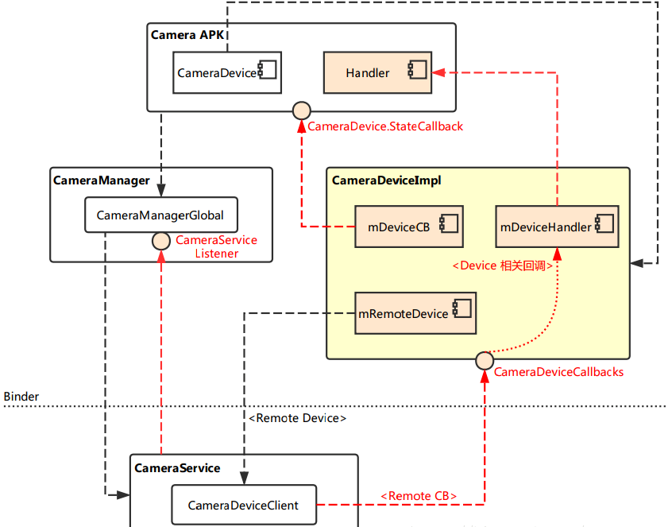

　　Ps：

*   CameraManagerGlobal 是真正的实现层，它与 JAVA 层的 CameraService 创建连接，从而创建相机的连路。
*   CameraDeviceImpl 相当于运行上下文，它取代了 Android N 之前的 JNI 层。

**　3.从 CameraService 到 HAL Service**

　　由于 Android O 中加入了 Treble 机制，CameraServer 一端主体为 CameraService，它将会寻找现存的 Provider service，将其加入到内部的 CameraProviderManager 中进行管理，相关操作都是通过远端调用进行的。  
　　而 Provider service 一端的主体为 CameraProvider，它在初始化时就已经连接到 libhardware 的 Camera HAL 实现层，并以 CameraModule 来进行管理。  
　　进程的启动后，连路的 “载体” 就搭建完成了（需要注意，此时 QCamera3HWI 还未创建），可用下图简单表示：  
　　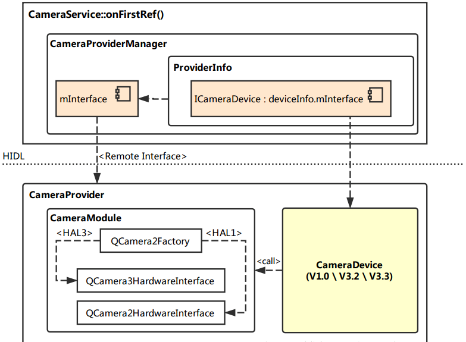

　　　而在打开相机时，该层的完整连路会被创建出来，主要调用逻辑如下图：

　　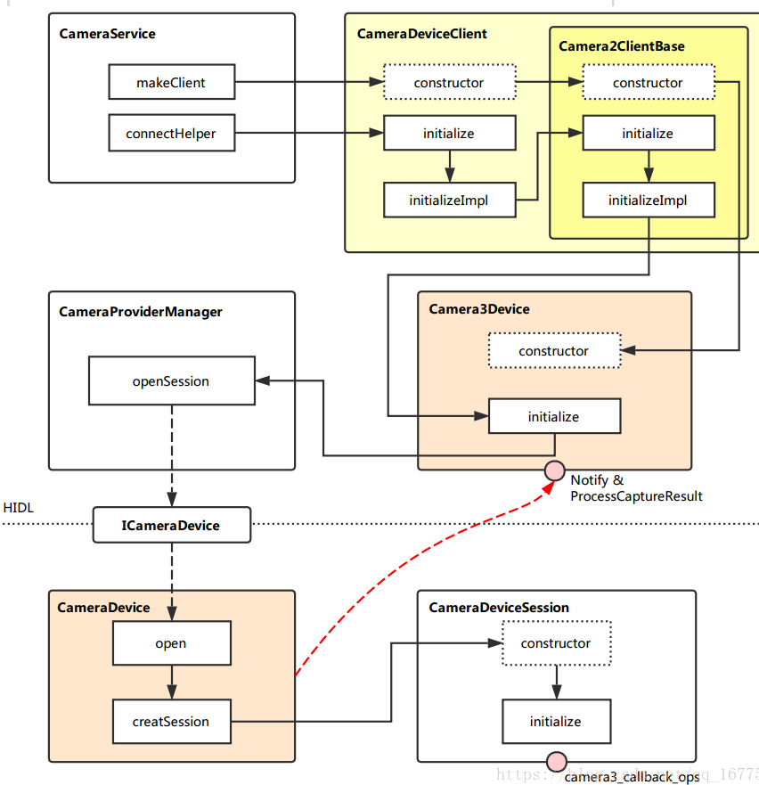

　　　　上回讲到，在 CameraService::makeClient 中，实例化了一个 CameraDeviceClient。现在我们就从它的构造函数开始，继续探索打开相机的流程。  
　　　　这一部分主要活动在 Runtime 层，这里分成 CameraService 与 HAL Service 两侧来分析。

  
**　　（1）CameraDeviceClien**t ：**`frameworks\av\services\camera\libcameraservice\api2\CameraDeviceClient.cpp`**

CameraDeviceClient::CameraDeviceClient(const sp&lt;CameraService&gt;& cameraService, const sp&lt;hardware::camera2::ICameraDeviceCallbacks&gt;& remoteCallback, const String16& clientPackageName, const String8& cameraId, int cameraFacing, int clientPid,
        uid_t clientUid, int servicePid) :
    Camera2ClientBase(cameraService, remoteCallback, clientPackageName,
                cameraId, cameraFacing, clientPid, clientUid, servicePid),  //继承它的父类 Camera2ClientBase 
    mInputStream(),
    mStreamingRequestId(REQUEST\_ID\_NONE),
    mRequestIdCounter(0),
    mPrivilegedClient(false) { char value\[PROPERTY\_VALUE\_MAX\];
    property_get("persist.camera.privapp.list", value, "");
    String16 packagelist(value); if (packagelist.contains(clientPackageName.string())) {
        mPrivilegedClient = true;
    }

    ATRACE_CALL();
    ALOGI("CameraDeviceClient %s: Opened", cameraId.string());
}

　　CameraService 在创建 CameraDeviceClient 之后，会调用它的初始化函数：

//对外提供调用的初始化函数接口 initialize。
status_t CameraDeviceClient::initialize(sp&lt;CameraProviderManager&gt; manager) { return initializeImpl(manager);
} //初始化的具体实现函数，模板 TProviderPtr 在此处即是 CameraProviderManager 类。
template&lt;typename TProviderPtr&gt;
//首先将父类初始化，注意此处传入了 CameraProviderManager。
status_t CameraDeviceClient::initializeImpl(TProviderPtr providerPtr) {
    ATRACE_CALL();
    status_t res;

    res = Camera2ClientBase::initialize(providerPtr); if (res != OK) { return res;
    } //这里是关于 FrameProcessor 的创建与初始化配置等等
 String8 threadName;
    mFrameProcessor = new FrameProcessorBase(mDevice);
    threadName = String8::format("CDU-%s-FrameProc", mCameraIdStr.string());
    mFrameProcessor->run(threadName.string());

    mFrameProcessor->registerListener(FRAME\_PROCESSOR\_LISTENER\_MIN\_ID,
                                      FRAME\_PROCESSOR\_LISTENER\_MAX\_ID, /*listener*/this, /*sendPartials*/true); return OK;
}

 　**　（2）Camera2ClientBase：`frameworks\av\services\camera\libcameraservice\common\Camera2ClientBase.cpp`**

template &lt;typename TClientBase&gt;　//模板 TClientBase，在 CameraDeviceClient 继承 Camera2ClientBase 时被指定为 CameraDeviceClientBase。
Camera2ClientBase&lt;TClientBase&gt;::Camera2ClientBase( //构造的相关参数，以及初始化列表，这里面需要注意 TCamCallbacks 在 CameraDeviceClientBase 中被指定为了 ICameraDeviceCallbacks。 
        const sp&lt;CameraService&gt;& cameraService, const sp&lt;TCamCallbacks&gt;& remoteCallback, const String16& clientPackageName, const String8& cameraId, int cameraFacing, int clientPid,
        uid_t clientUid, int servicePid):
        TClientBase(cameraService, remoteCallback, clientPackageName,
                cameraId, cameraFacing, clientPid, clientUid, servicePid),
        mSharedCameraCallbacks(remoteCallback),
        mDeviceVersion(cameraService->getDeviceVersion(TClientBase::mCameraIdStr)),
        mDeviceActive(false)
{
    ALOGI("Camera %s: Opened. Client: %s (PID %d, UID %d)", cameraId.string(),
            String8(clientPackageName).string(), clientPid, clientUid);

    mInitialClientPid = clientPid;
    mDevice = new Camera3Device(cameraId); //创建了一个 Camera3Device。
    LOG\_ALWAYS\_FATAL_IF(mDevice == 0, "Device should never be NULL here.");
}

　　回去再看看初始化函数：

template &lt;typename TClientBase&gt; //初始化函数接口，真正的实现部分在 initializeImpl 中。
status_t Camera2ClientBase&lt;TClientBase&gt;::initialize(sp&lt;CameraProviderManager&gt; manager) { return initializeImpl(manager);
} //TClientBase 对应 CameraDeviceClientBase，而 TProviderPtr 对应的是 CameraProviderManager。
template &lt;typename TClientBase&gt; template &lt;typename TProviderPtr&gt; status_t Camera2ClientBase&lt;TClientBase&gt;::initializeImpl(TProviderPtr providerPtr) {
    ATRACE_CALL();
    ALOGV("%s: Initializing client for camera %s", \_\_FUNCTION\_\_,
          TClientBase::mCameraIdStr.string());
    status_t res; // Verify ops permissions
    res = TClientBase::startCameraOps(); //调用 CameraDeviceClientBase 的 startCameraOps 方法，检查 ops 的权限。
    if (res != OK) { return res;
    } if (mDevice == NULL) {
        ALOGE("%s: Camera %s: No device connected",
                \_\_FUNCTION\_\_, TClientBase::mCameraIdStr.string()); return NO_INIT;
    }

    res = mDevice->initialize(providerPtr); //初始化 Camera3Device 的实例，注意此处传入了 CameraProviderManager。
    if (res != OK) {
        ALOGE("%s: Camera %s: unable to initialize device: %s (%d)",
                \_\_FUNCTION\_\_, TClientBase::mCameraIdStr.string(), strerror(-res), res); return res;
    } //在 Camera3Device 实例中设置 Notify 回调。
    wp&lt;CameraDeviceBase::NotificationListener&gt; weakThis(this);
    res = mDevice->setNotifyCallback(weakThis); return OK;
}

　　**(3)Camera3Device:`frameworks\av\services\camera\libcameraservice\device3\Camera3Device.cpp`**

Camera3Device::Camera3Device(const String8 &id):
        mId(id),
        mOperatingMode(NO_MODE),
        mIsConstrainedHighSpeedConfiguration(false),
        mStatus(STATUS_UNINITIALIZED),
        mStatusWaiters(0),
        mUsePartialResult(false),
        mNumPartialResults(1),
        mTimestampOffset(0),
        mNextResultFrameNumber(0),
        mNextReprocessResultFrameNumber(0),
        mNextShutterFrameNumber(0),
        mNextReprocessShutterFrameNumber(0),
        mListener(NULL),
        mVendorTagId(CAMERA\_METADATA\_INVALID\_VENDOR\_ID)
{
    ATRACE_CALL();
　　//在这个观察构造函数中设定了两个回调接口：
    camera3\_callback\_ops::notify = &sNotify;
    camera3\_callback\_ops::process\_capture\_result = &sProcessCaptureResult;
    ALOGV("%s: Created device for camera %s", \_\_FUNCTION\_\_, mId.string());
}

　　其初始化函数篇幅较长，这里省略掉了关于 RequestMetadataQueue 的相关操作。

status_t Camera3Device::initialize(sp&lt;CameraProviderManager&gt; manager) {
    ATRACE_CALL();
    Mutex::Autolock il(mInterfaceLock);
    Mutex::Autolock l(mLock);

    ALOGV("%s: Initializing HIDL device for camera %s", \_\_FUNCTION\_\_, mId.string()); if (mStatus != STATUS_UNINITIALIZED) {
        CLOGE("Already initialized!"); return INVALID_OPERATION;
    } if (manager == nullptr) return INVALID_OPERATION;

    sp&lt;ICameraDeviceSession&gt; session;
    ATRACE_BEGIN("CameraHal::openSession");
    status_t res = manager->openSession(mId.string(), this, //调用CameraProviderManager的openSession方法，开启了远端的**Session**
            /*out*/ &session);
    ATRACE_END(); if (res != OK) {
        SET\_ERR\_L("Could not open camera session: %s (%d)", strerror(-res), res); return res;
    } /* Do something in */ ...... /* Do something out */

    return initializeCommonLocked();
}

　　**（4）CameraProviderManager：`frameworks\av\services\camera\libcameraservice\common\CameraProviderManager.cpp`**

status_t CameraProviderManager::openSession(const std::string &id, const sp&lt;hardware::camera::device::V3_2::ICameraDeviceCallback&gt;& callback, /*out*/ sp&lt;hardware::camera::device::V3_2::ICameraDeviceSession&gt; *session) {

    std::lock_guard&lt;std::mutex&gt; lock(mInterfaceMutex);

    auto deviceInfo = findDeviceInfoLocked(id, //首先调用 findDeviceInfoLocked，获取 HAL3 相关的 DeviceInfo3
            /*minVersion*/ {3,0}, /*maxVersion*/ {4,0}); if (deviceInfo == nullptr) return NAME\_NOT\_FOUND;

    auto \*deviceInfo3 = static_cast&lt;ProviderInfo::DeviceInfo3\*&gt;(deviceInfo);

    Status status;
    hardware::Return<void> ret; //通过远端调用 CameraDevice 的 open 方法，创建 CameraDeviceSession 实例并将其本地调用接口通过入参 session 返回。
    ret = deviceInfo3->mInterface->open(callback, \[&status, &session\]
            (Status s, const sp&lt;device::V3_2::ICameraDeviceSession&gt;& cameraSession) {
                status = s; if (status == Status::OK) { *session = cameraSession;
                }
            }); if (!ret.isOk()) {
        ALOGE("%s: Transaction error opening a session for camera device %s: %s",
                \_\_FUNCTION\_\_, id.c\_str(), ret.description().c\_str()); return DEAD_OBJECT;
    } return mapToStatusT(status);
}

　**　(5)CameraDevice:`hardware\interfaces\camera\device\3.2\default\CameraDevice.cpp`**

　　CameraDevice 的实例实际上在初始化 HAL Service 之后就存在了。 前面说到，通过 CameraProviderManager 中的 `deviceInfo` 接口，调用**远端 CameraDevice 实例**的 `open` 方法，下面就来看看它的代码实现：

Return<void\> CameraDevice::open(const sp&lt;ICameraDeviceCallback&gt;& callback, open\_cb \_hidl_cb)  {
    Status status = initStatus();
    sp&lt;CameraDeviceSession&gt; session = nullptr; if (callback == nullptr) {
        ALOGE("%s: cannot open camera %s. callback is null!",
                \_\_FUNCTION\_\_, mCameraId.c_str());
        \_hidl\_cb(Status::ILLEGAL_ARGUMENT, nullptr); return Void();
    } if (status != Status::OK) { /* Do something in */ ...... /* Do something out */ } else {
        mLock.lock(); /* Do something in */ ...... /* Do something out */

        /** Open HAL device */ status_t res;
        camera3\_device\_t *device;

        ATRACE_BEGIN("camera3->open");
        res = mModule->open(mCameraId.c_str(), //注意 mModule 是在 HAL Service 初始化时就已经配置好的，它对从libhardware库中加载的 Camera HAL 接口进行了一层封装，从这里往下就会一路走到 QCamera3HWI 的构造流程去。
                reinterpret\_cast&lt;hw\_device_t**&gt;(&device));
        ATRACE_END(); /* Do something in */ ...... /* Do something out */

　　　　 //创建 session 并让内部成员 mSession 持有，具体实现的函数为 creatSession。
        session = createSession(
                device, info.static\_camera\_characteristics, callback); /* Do something in */ ...... /* Do something out */ mSession = session;

        IF_ALOGV() {
            session->getInterface()->interfaceChain(\[\](
                ::android::hardware::hidl_vec&lt;::android::hardware::hidl_string&gt; interfaceChain) {
                    ALOGV("Session interface chain:"); for (auto iface : interfaceChain) {
                        ALOGV("  %s", iface.c_str());
                    }
                });
        }
        mLock.unlock();
    }
    \_hidl\_cb(status, session->getInterface()); return Void();
}

　　而 creatSession 中直接创建了一个 CameraDeviceSession。当然在其构造函数中会调用内部的初始化函数，然后会进入 HAL 接口层 QCamera3HWI 的初始化流程，至此，从 CameraService 到 HAL Service 这一部分的打开相机流程就基本走通了。  
　　简图总结:

　　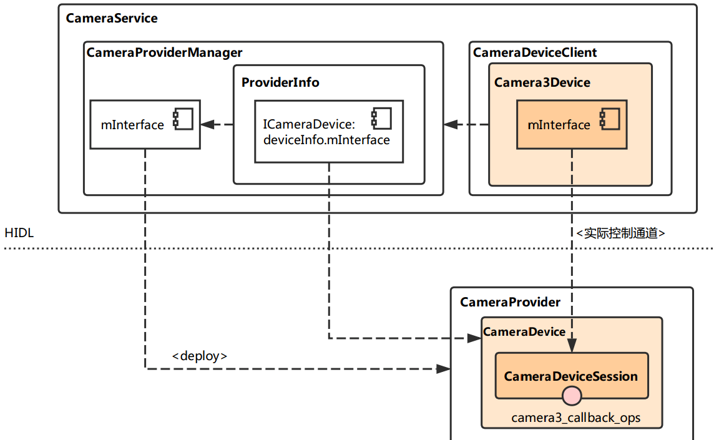

**　4.从 **HAL Service** 到 Camera **HAL****

　在 HAL3 中，Camera HAL 的接口转化层（以及流解析层）由 QCamera3HardwareInterface 担当，而接口层与实现层与 HAL1 中基本没什么差别，都是在 mm\_camera\_interface.c 与 mm_camera.c 中。  
　　那么接口转化层的实例是何时创建的，又是怎么初始化的，创建它的时候，与接口层、实现层又有什么交互？通过下图展示的主要调用流程:

　　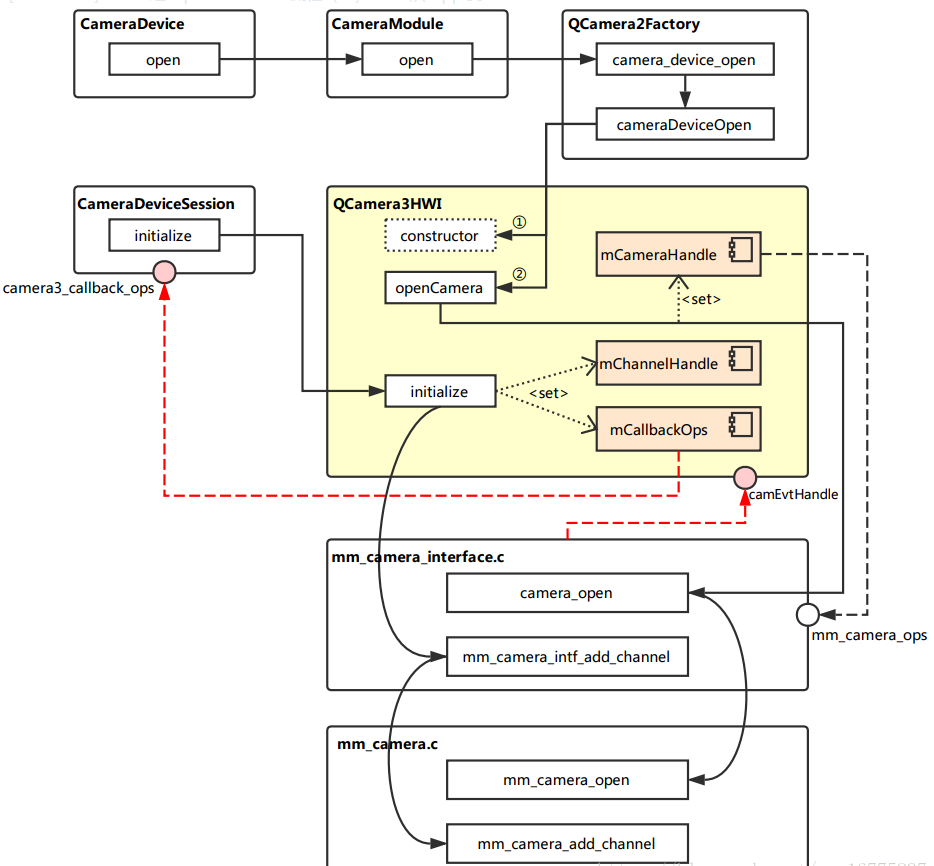

**　　　(1)CameraModule(HAL Servic) : `hardware\interfaces\camera\common\1.0\default\CameraModule.cpp`**

　　　　上回说到，CameraDevice::open 的实现中，调用了 mModule->open，即 CameraModule::open，通过代码来看，它做的事并不多，主要是调用 mModule->common.methods->open，来进入下一层级的流程。  
　　　　而这里则需要注意了，open 是一个函数指针，它指向的是 QCamera2Factory 的 camera\_device\_open 方法，至于为什么和 QCamera2Factory 有关，这就要回头看 HAL Service 的启动初始化流程了。

int CameraModule::open(const char\* id, struct hw\_device\_t** device) { int res;
    ATRACE_BEGIN("camera_module->open");
    res = filterOpenErrorCode(mModule->common.methods->open(&mModule->common, id, device));
    ATRACE_END(); return res;
}

　**　（2）QCamera2Factory（Camera HAL）：`hardware\qcom\camera\qcamera2\QCamera2Factory.cpp`**

/*===========================================================================
 \* FUNCTION   : camera\_device\_open
 \*
 \* DESCRIPTION: static function to open a camera device by its ID
 \*
 \* PARAMETERS :
 \*   @camera_id : camera ID
 \*   @hw_device : ptr to struct storing camera hardware device info
 \*
 \* RETURN     : int32_t type of status
 \*              NO_ERROR  -- success
 \*              none-zero failure code
 *==========================================================================*/
int QCamera2Factory::camera\_device\_open( const struct hw\_module\_t *module, const char *id,
    struct hw\_device\_t **hw_device)
{ /* Do something in */ ...... /* Do something out */ #ifdef QCAMERA\_HAL1\_SUPPORT //注意到这里通过宏定义添加了对 HAL1 的兼容操作。实际上是要调用 cameraDeviceOpen 来进行下一步操作。
    if(gQCameraMuxer)
        rc =  gQCameraMuxer->camera\_device\_open(module, id, hw_device); else #endif
        rc = gQCamera2Factory->cameraDeviceOpen(atoi(id), hw_device); return rc;
}

struct hw\_module\_methods_t QCamera2Factory::mModuleMethods = {
    .open = QCamera2Factory::camera\_device\_open, //这里就将前面所说的 open 函数指针指定为了 camera\_device\_open 这个方法。
};

　　`cameraDeviceOpen` 的工作：

/*===========================================================================
 \* FUNCTION   : cameraDeviceOpen
 \*
 \* DESCRIPTION: open a camera device with its ID
 \*
 \* PARAMETERS :
 \*   @camera_id : camera ID
 \*   @hw_device : ptr to struct storing camera hardware device info
 \*
 \* RETURN     : int32_t type of status
 \*              NO_ERROR  -- success
 \*              none-zero failure code
 *==========================================================================*/
int QCamera2Factory::cameraDeviceOpen(int camera_id,
                    struct hw\_device\_t **hw_device)
{ /* Do something in */ ...... /* Do something out */

    if ( mHalDescriptors\[camera\_id\].device\_version == CAMERA\_DEVICE\_API\_VERSION\_3_0 ) {
        QCamera3HardwareInterface *hw = new QCamera3HardwareInterface(mHalDescriptors\[camera_id\].cameraId, //首先创建了 QCamera3HardwareInterface 的实例。
 mCallbacks); if (!hw) {
            LOGE("Allocation of hardware interface failed"); return NO_MEMORY;
        }
        rc = hw->openCamera(hw_device); //调用实例的 openCamera 方法。
        if (rc != 0) {
            delete hw;
        }
    } /* Do something in */ ...... /* Do something out */

    return rc;
}

**　　(3)QCamera3HardwareInterface : `hardware\qcom\camera\qcamera2\hal3\QCamera3HWI.cpp`**

　　首先需要注意的是内部成员 `mCameraOps` 的定义。 在构造实例时，有 `mCameraDevice.ops = &mCameraOps;`(关键点)

camera3\_device\_ops_t QCamera3HardwareInterface::mCameraOps = {
    .initialize = QCamera3HardwareInterface::initialize,
    .configure_streams = QCamera3HardwareInterface::configure_streams,
    .register\_stream\_buffers = NULL,
    .construct\_default\_request_settings = QCamera3HardwareInterface::construct\_default\_request_settings,
    .process\_capture\_request = QCamera3HardwareInterface::process\_capture\_request,
    .get\_metadata\_vendor\_tag\_ops = NULL,
    .dump = QCamera3HardwareInterface::dump,
    .flush = QCamera3HardwareInterface::flush,
    .reserved = {0},
};

　　再来继续看看 `openCamera` 实现：

int QCamera3HardwareInterface::openCamera(struct hw\_device\_t **hw_device)
{ /* Do something in */ ...... /* Do something out */ rc = openCamera(); //调用另一个 openCamera 方法，这是具体实现的部分。
    if (rc == 0) { *hw_device = &mCameraDevice.common; //打开相机成功后，将设备结构中的 common 部分通过双重指针 hw_device 返回。
    } else
        *hw_device = NULL; /* Do something in */ ...... /* Do something out */
    return rc;
} int QCamera3HardwareInterface::openCamera()
{ /* Do something in */ ...... /* Do something out */ rc = camera\_open((uint8\_t)mCameraId, &mCameraHandle);  //这里就开始进入接口层了，调用的是接口层中的 camera_open 接口。注意此处获取到了 mCameraHandle.

    /* Do something in */ ...... /* Do something out */ rc = mCameraHandle->ops->register\_event\_notify(mCameraHandle->camera_handle, //注意这里传入了一个 camEvtHandle
            camEvtHandle, (void *)this); /* Do something in */ ...... /* Do something out */ rc = mCameraHandle->ops->get\_session\_id(mCameraHandle->camera_handle, 
        &sessionId\[mCameraId\]); /* Do something in */ ...... /* Do something out */

    return NO_ERROR;
}

　　上面是接口转化层中，关于 `openCamera` 的部分，下面继续看看它的初始化函数。 在前面已经分析过，创建 CameraDeviceSession 实例时，会调用它内部的初始化方法，而这其中包含了调用 QCamera3HWI 的初始化方法 **`initialize`**

int QCamera3HardwareInterface::initialize(const struct camera3_device *device, const camera3\_callback\_ops_t *callback_ops)
{
    LOGD("E");
    QCamera3HardwareInterface *hw = reinterpret_cast&lt;QCamera3HardwareInterface *&gt;(device->priv); if (!hw) {
        LOGE("NULL camera device"); return -ENODEV;
    } int rc = hw->initialize(callback_ops); //调用了真正实现的初始化逻辑的函数
    LOGD("X"); return rc;
} int QCamera3HardwareInterface::initialize( const struct camera3\_callback\_ops *callback_ops)
{
    ATRACE_CALL(); int rc;

    LOGI("E :mCameraId = %d mState = %d", mCameraId, mState);
    pthread\_mutex\_lock(&mMutex); // Validate current state
    switch (mState) { case OPENED: /* valid state */
            break; default:
            LOGE("Invalid state %d", mState);
            rc = -ENODEV; goto err1;
    }

    rc = initParameters(); //参数（mParameters）初始化，注意这里的参数和 CameraParameter 是不同的，它是 metadata_buffer 相关参数的结构。
    if (rc < 0) {
        LOGE("initParamters failed %d", rc); goto err1;
    }
    mCallbackOps = callback_ops; //这里将 camera3\_call\_back_ops 与 mCallbackOps 关联了起来。
 mChannelHandle = mCameraHandle->ops->add_channel( //获取 mChannelHandle 这一句柄，调用的方法实际是 mm\_camera\_interface.c 中的 mm\_camera\_intf\_add\_channel。
            mCameraHandle->camera_handle, NULL, NULL, this); if (mChannelHandle == 0) {
        LOGE("add_channel failed");
        rc = -ENOMEM;
        pthread\_mutex\_unlock(&mMutex); return rc;
    }

    pthread\_mutex\_unlock(&mMutex);
    mCameraInitialized = true;
    mState = INITIALIZED;
    LOGI("X"); return 0;

err1:
    pthread\_mutex\_unlock(&mMutex); return rc;
}

　　**（4）mm\_camera\_interface.c(接口层) ：`hardware\qcom\camera\qcamera2\stack\mm-camera-interface\src\mm_camera_interface.c`**

　　　　`camera_open` 中干的事也不多，**省略掉了关于为 `cam_obj` 分配内存以及初始化的部分**。实际上是调用实现层中的 `mm_camera_open` 来真正实现打开相机设备的操作，设备的各种信息都填充到 `cam_obj` 结构中。

int32\_t camera\_open(uint8\_t camera\_idx, mm\_camera\_vtbl_t **camera_vtbl)
{
    int32_t rc = 0;
    mm\_camera\_obj_t *cam_obj = NULL; /* Do something in */ ...... /* Do something out */ rc = mm\_camera\_open(cam_obj); /* Do something in */ ...... /* Do something out */ }

　　　　而关于初始化时调用的 `mm_camera_intf_add_channel` 代码如下:

static uint32\_t mm\_camera\_intf\_add\_channel(uint32\_t camera_handle,
                                           mm\_camera\_channel\_attr\_t *attr,
                                           mm\_camera\_buf\_notify\_t channel_cb, void *userdata)
{
    uint32\_t ch\_id = 0;
    mm\_camera\_obj_t \* my_obj = NULL;

    LOGD("E camera_handler = %d", camera_handle);
    pthread\_mutex\_lock(&g\_intf\_lock);
    my_obj = mm\_camera\_util\_get\_camera\_by\_handler(camera_handle); if(my_obj) {
        pthread\_mutex\_lock(&my_obj->cam_lock);
        pthread\_mutex\_unlock(&g\_intf\_lock);
        ch_id = mm\_camera\_add\_channel(my\_obj, attr, channel_cb, userdata); //通过调用实现层的 mm\_camera\_add_channel 来获取一个 channel id，也就是其句柄。
    } else {
        pthread\_mutex\_unlock(&g\_intf\_lock);
    }
    LOGD("X ch_id = %d", ch_id); return ch_id;
}

　　**(5)mm_camera.c(实现层) ：`hardware\qcom\camera\qcamera2\stack\mm-camera-interface\src\mm_camera.c`**

　终于来到最底层的实现了，`mm_camera_open` 主要工作是填充 `my_obj`，并且启动、初始化一些线程相关的东西，关于线程的部分我这里就省略掉了。

int32\_t mm\_camera\_open(mm\_camera\_obj\_t *my_obj)
{ char dev\_name\[MM\_CAMERA\_DEV\_NAME_LEN\];
    int32_t rc = 0;
    int8\_t n\_try=MM\_CAMERA\_DEV\_OPEN\_TRIES;
    uint8\_t sleep\_msec=MM\_CAMERA\_DEV\_OPEN\_RETRY_SLEEP; int cam_idx = 0; const char *dev\_name\_value = NULL; int l_errno = 0;
    pthread\_condattr\_t cond_attr;

    LOGD("begin\
"); if (NULL == my_obj) { goto on_error;
    }
    dev\_name\_value = mm\_camera\_util\_get\_dev\_name(my\_obj->my_hdl); //此处调用的函数是为了获取 my_obj 的句柄，这里不深入分析。
    if (NULL == dev\_name\_value) { goto on_error;
    }
    snprintf(dev\_name, sizeof(dev\_name), "/dev/%s",
             dev\_name\_value);
    sscanf(dev_name, "/dev/video%d", &cam_idx);
    LOGD("dev name = %s, cam_idx = %d", dev\_name, cam\_idx); do{
        n_try--;
        errno = 0;
        my_obj->ctrl\_fd = open(dev\_name, O\_RDWR | O\_NONBLOCK); //读取设备文件的文件描述符，存到 my\_obj->ctrl\_fd 中。
        l_errno = errno;
        LOGD("ctrl\_fd = %d, errno == %d", my\_obj->ctrl\_fd, l\_errno); if((my\_obj->ctrl\_fd >= 0) || (errno != EIO && errno != ETIMEDOUT) || (n_try <= 0 )) { break;
        }
        LOGE("Failed with %s error, retrying after %d milli-seconds",
              strerror(errno), sleep_msec);
        usleep(sleep_msec * 1000U);
    }while (n_try > 0); if (my\_obj->ctrl\_fd < 0) {
        LOGE("cannot open control fd of '%s' (%s)\
",
                  dev\_name, strerror(l\_errno)); if (l_errno == EBUSY)
            rc = -EUSERS; else rc = -1; goto on_error;
    } else {
        mm\_camera\_get\_session\_id(my_obj, &my_obj->sessionid); //成功获取到文件描述符后，就要获取 session 的 id 了。
        LOGH("Camera Opened id = %d sessionid = %d", cam\_idx, my\_obj->sessionid);
    } /* Do something in */ ...... /* Do something out */

    /* unlock cam\_lock, we need release global intf\_lock in camera_open(),
     \* in order not block operation of other Camera in dual camera use case.*/ pthread\_mutex\_unlock(&my_obj->cam_lock); return rc;
}

　　初始化的相关部分，`mm_camera_add_channel` 代码如下：

uint32\_t mm\_camera\_add\_channel(mm\_camera\_obj_t *my_obj,
                               mm\_camera\_channel\_attr\_t *attr,
                               mm\_camera\_buf\_notify\_t channel_cb, void *userdata)
{
    mm\_channel\_t *ch_obj = NULL;
    uint8\_t ch\_idx = 0;
    uint32\_t ch\_hdl = 0; //从现有的 Channel 中找到第一个状态为 NOTUSED 的，获取到 ch_obj 中
    for(ch\_idx = 0; ch\_idx < MM\_CAMERA\_CHANNEL\_MAX; ch\_idx++) { if (MM\_CHANNEL\_STATE\_NOTUSED == my\_obj->ch\[ch_idx\].state) {
            ch_obj = &my_obj->ch\[ch_idx\]; break;
        }
    }

　　/*初始化 ch\_obj 结构。首先调用 mm\_camera\_util\_generate_handler 为其生成一个句柄（也是该函数的返回值），
　　 *然后将状态设置为 STOPPED，注意这里还保存了 my\_obj 的指针及其 session id，最后调用 mm\_channel_init 完成了 Channel 的初始化。*/
    if (NULL != ch_obj) { /* initialize channel obj */ memset(ch_obj, 0, sizeof(mm\_channel\_t));
        ch_hdl = mm\_camera\_util\_generate\_handler(ch_idx);
        ch_obj->my_hdl = ch_hdl;
        ch_obj->state = MM\_CHANNEL\_STATE_STOPPED;
        ch_obj->cam_obj = my_obj;
        pthread\_mutex\_init(&ch_obj->ch_lock, NULL);
        ch_obj->sessionid = my_obj->sessionid;
        mm\_channel\_init(ch\_obj, attr, channel\_cb, userdata);
    }

    pthread\_mutex\_unlock(&my_obj->cam_lock); return ch_hdl;
}

　　简图总结:

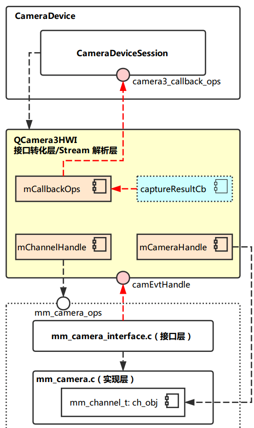

  　　总而言之，上面这一顿操作下来后，相机从上到下的整个连路就已经打通，接下来应该只要 APP 按照流程下发 Preview 的 Request 就可以开始获取预览数据了。

**三、核心概念：Request**

　　request是贯穿camera2数据处理流程最为重要的概念，应用框架是通过向camera子系统发送request来获取其想要的result。  
　　request有下述几个重要特征：

*   _    一个request可以对应一系列的result。_
*   _    request应当包含所有必要的配置信息，存放于metadata中。如：分辨率和像素格式；sensor、镜头、闪光等的控制信息；3A 操作模式；RAW 到 YUV 处理控件；以及统计信息的生成等。_
*   _    request需要携带对应的surface（也就是框架里面的stream），用于接收返回的图像。_
*   _    多个request可以同时处于in-flight状态，并且submit request是non-blocking方式的。也就是说，上一个request没有处理完，也可以submit新的request。_
*   _    队列中request的处理总是按照FIFO的形式。_
*   _    snapshot的request比preview的request拥有更高的优先级。_

　**1.request的整体处理流程如下图：**  
　　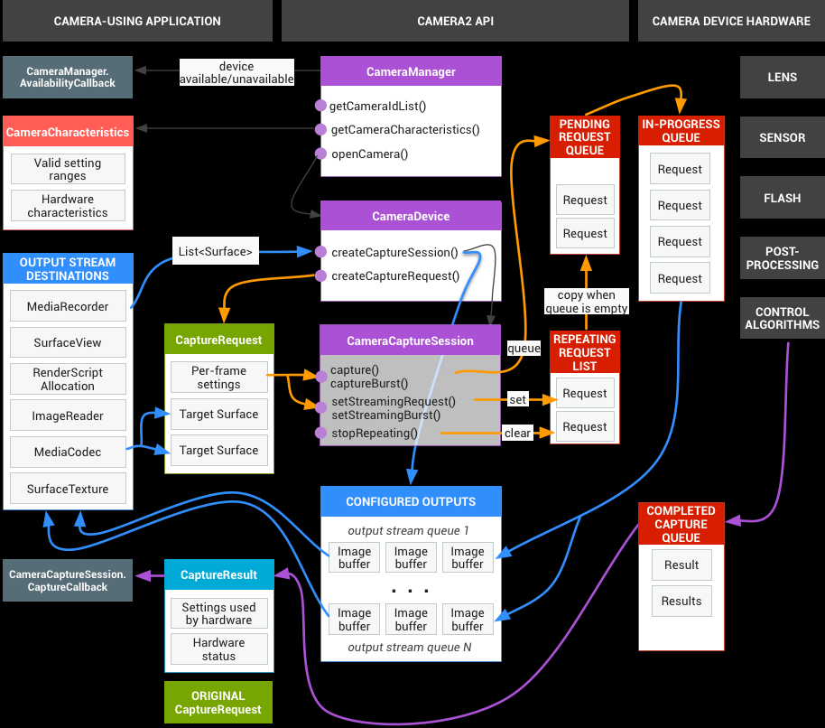

**open 流程（黑色箭头线条）**
    CameraManager注册AvailabilityCallback回调，用于接收相机设备的可用性状态变更的通知。
    CameraManager通过调用getCameraIdList()获取到当前可用的camera id，通过getCameraCharacteristcs()函数获取到指定相机设备的特性。
    CameraManager调用openCamera()打开指定相机设备，并返回一个CameraDevice对象，后续通过该CameraDevice对象操控具体的相机设备。
    使用CameraDevice对象的createCaptureSession()创建一个session，数据请求（预览、拍照等）都是通过session进行。在创建session时，需要提供Surface作为参数，用于接收返回的图像。

**configure stream流程（蓝色箭头线条）**
    申请Surface，如上图的OUTPUT STREAMS DESTINATIONS框，用于在创建session时作为参数，接收session返回的图像。
    创建session后，surface会被配置成框架的stream。在框架中，stream定义了图像的size及format。
    每个request都需要携带target surface用于指定返回的图像是归属到哪个被configure的stream的。
 **request处理流程（橙色箭头线条）**
    CameraDevice对象通过createCaptureRequest()来创建request，每个reqeust都需要有surface和settings（settings就是metadata，request包含的所有配置信息都是放在metadata中的）。
    使用session的capture()、captureBurst()、setStreamingRequest()、setStreamingBurst()等api可以将request发送到框架。
    预览的request，通过setStreamingRequest()、setStreamingBurst()发送，仅调用一次。将request set到repeating request list里面。只要pending request queue里面没有request，就将repeating list里面的request copy到pending queue里面。
    拍照的request，通过capture()、captureBurst()发送，每次需要拍照都会调用。每次触发，都会直接将request入到pending request queue里面，所以拍照的request比预览的request的优先级更高。
    in-progress queue代表当前正在处理的request的queue，每处理完一个，都会从pending queue里面拿出来一个新的request放到这里。

**数据返回流程（紫色箭头线条）**
    硬件层面返回的数据会放到result里面返回，会通过session的capture callback回调响应。

　**2.request在HAL的处理方式**

　　（1）framework发送异步的request到hal。  
　　（2）hal必须顺序处理request，对于每一个request都要返回timestamp（shutter，也就是帧的生成时间）、metadata、image buffers。  
　　（3）对于request引用的每一类steam，必须按FIFO的方式返回result。比如：对于预览的stream，result id 9必须要先于result id 10返回。但是拍照的stream，当前可以只返回到result id 7，因为拍照和预览用的stream不一样。  
　　（4）hal需要的信息都通过request携带的metadata接收，hal需要返回的信息都通过result携带的metadata返回。

　　HAL处理request的整体流程如下图。  
　　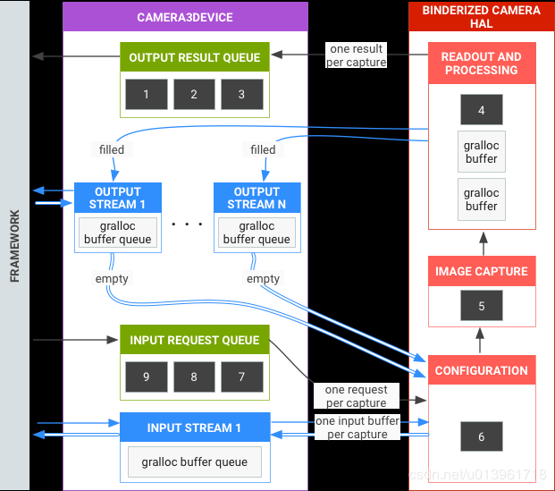

**request处理流程（黑色箭头线条）**
    framework异步地submit request到hal，hal依次处理，并返回result。
    每个被submit到hal的request都必须携带stream。stream分为input stream和output stream：input stream对应的buffer是已有图像数据的buffer，hal对这些buffer进行reprocess；output stream对应的buffer是empty buffer，hal将生成的图像数据填充的这些buffer里面。

**input stream处理流程（图像的INPUT STREAM** **1****）**
    request携带input stream及input buffer到hal。
    hal进行reprocess，然后新的图像数据重新填充到buffer里面，返回到framework。

**output stream处理流程（图像的OUTPUT STREAM** **1****…N）**
    request携带output stream及output buffer到hal。
    hal经过一系列模块的的处理，将图像数据写到buffer中，返回到frameowork。

-end-