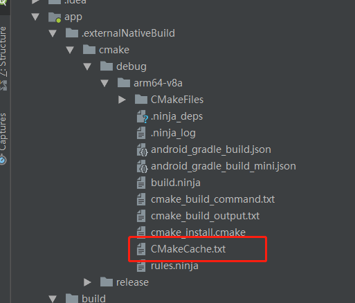

CMakeList.txt 加载so库的使用方法

最重要的是要在build.gradle中加入如下：
android{
...
sourceSets.main {
        jniLibs.srcDirs = ['libs']
        jni.srcDirs = []
    }
}
要不然会找不到so库

1、CMakeCache.txt 编译CMake的中间文件。

2、include_directories(src/main/cpp/include)
so库文件或者其他cpp源文件需要的头文件

3、link_directories(libs/arm64-v8a/)
链接到so所在文件

4、add_library(my_native-lib
SHARED
src/main/cpp/my_native-lib.cpp)

Creates and names a library, sets it as either STATIC or SHARED, and provides the relative paths to its source code. You can define multiple libraries, and CMake builds them for you. Gradle automatically packages shared libraries with your APK.

5、find_library( # Sets the name of the path variable.
              log-lib

              # Specifies the name of the NDK library that
              # you want CMake to locate.
              log )

Searches for a specified prebuilt library and stores the path as a variable. Because CMake includes system libraries in the search path by default, you only need to specify the name of the public NDK library you want to add. CMake verifies that the library exists before completing its build.

6、target_link_libraries( # Specifies the target library.
                       my_native-lib

                       # Links the target library to the log library
                       # included in the NDK.
                       ${log-lib}
                       native-lib)
所有的链接库，可以是变量，也可以是第3条定义的，去掉前缀lib，去掉后缀.so

CMakeList.txt示例:

# For more information about using CMake with Android Studio, read the

# documentation:  https://d.android.com/studio/projects/add-native-code.html

# Sets the minimum version of CMake required to build the native library.

cmake_minimum_required(VERSION 3.4.1)

include_directories(src/main/cpp/include)
link_directories(libs/${ANDROID_ABI})

# Creates and names a library, sets it as either STATIC

# or SHARED, and provides the relative paths to its source code.

# You can define multiple libraries, and CMake builds them for you.

# Gradle automatically packages shared libraries with your APK.

file(GLOB native_src "src/main/cpp/entity/MainFunction.cpp")
add_library( # Sets the name of the library.
native-lib

# Sets the library as a shared library.

SHARED

# Provides a relative path to your source file(s).

${native_src}
)

# Searches for a specified prebuilt library and stores the path as a

# variable. Because CMake includes system libraries in the search path by

# default, you only need to specify the name of the public NDK library

# you want to add. CMake verifies that the library exists before

# completing its build.

find_library( # Sets the name of the path variable.
log-lib

# Specifies the name of the NDK library that

# you want CMake to locate.

log )

# Specifies libraries CMake should link to your target library. You

# can link multiple libraries, such as libraries you define in this

# build script, prebuilt third-party libraries, or system libraries.

target_link_libraries( # Specifies the target library.
native-lib
arcsoft_dualcam_refocus
mpbase

# Links the target library to the log library

# included in the NDK.

${log-lib} )