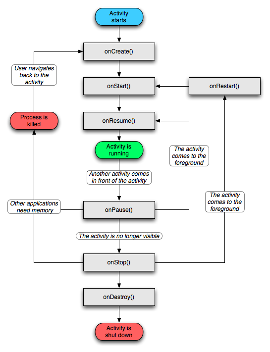

Activity生命周期

谈及 activity 的生命周期时，往往只说明单个 activity 的生命周期，而不说明从一个 activity 进入到另一个 activity 时，或者从一个 activity 返回到上一个 activity 时这些函数的调用顺序。现整理如下图所示：

可见原则是优先把目标 activity 尽快展示出来，等目标 activity 展现出来后，再在后台执行自身的 onStop，或者以及 onDestroy。而并不是先执行完自己的 onStop/onDestroy 再去执行目标 activity 的 onCreate/onRestart。

