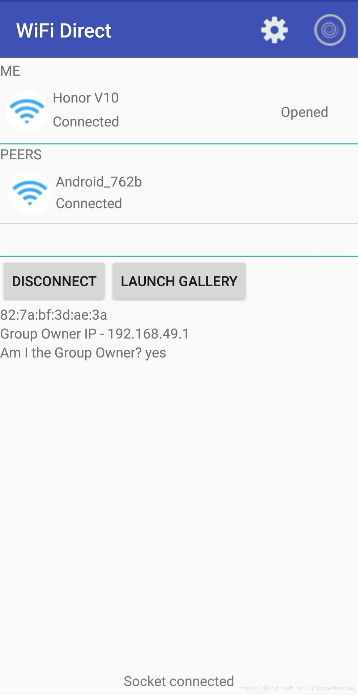

Android WiFi直连 双向通信

[原文地址](https://blog.csdn.net/VNanyesheshou/article/details/82316436)：[https://blog.csdn.net/VNanyesheshou/article/details/82316436](https://blog.csdn.net/VNanyesheshou/article/details/82316436)  
DEMO下载：[http://www.demodashi.com/demo/13965.html](http://www.demodashi.com/demo/13965.html)  
本文主要说一下，Android通过WiFi直连的方式实现图片双向传输（图片可以传输，也可以把它修改下传输聊天信息了）。

## <a id="t0"></a><a id="t0"></a>1 WiFi直连概述

WiFi直连也就是WiFi设备点对点连接（WiFi P2P），它允许具有适当硬件的Android 4.0（API级别14）或更高版本的设备通过Wi-Fi直接相互连接，而无需中间接入点。使用这些API，您可以发现并连接到其他设备（前提是每个设备支持Wi-Fi P2P），然后通过比蓝牙连接更长的距离快速连接进行通信。这对于在用户之间共享数据的应用程序很有用，例如多人游戏或照片共享应用程序。

Wi-Fi P2P API包含以下主要部分：  
允许您发现，请求和连接到对等的方法在WifiP2pManager类中定义。  
允许您通知WifiP2pManager方法调用成功或失败的监听器。调用WifiP2pManager方法时，每个方法都可以接收作为参数传入的特定侦听器。  
通知您Wi-Fi P2P框架检测到的特定事件的意图，例如断开的连接或新发现的对等体。  
您经常将API的这三个主要组件一起使用。例如，您可以提供WifiP2pManager.ActionListener呼叫discoverPeers()，以便您可以使用ActionListener.onSuccess()和ActionListener.onFailure() 方法通知您。

* * *

## <a id="t1"></a><a id="t1"></a>2 Demo

  
注意事项:

### <a id="t2"></a><a id="t2"></a>2.1 搜索不到可用设备

1.  确保对端设备处于搜索状态；
2.  对端设备异常，可尝试重启WLAN开关，重新搜索。
3.  自身设备异常，可尝试重启WLAN开关，重新搜索。

### <a id="t3"></a><a id="t3"></a>2.2 连接失败

1.  确保对端设备没有与其他设备建立WLAN直连连接。
2.  确保对端设备接收连接请求。
3.  对端设备异常，请尝试重新连接。

* * *

## <a id="t4"></a><a id="t4"></a>3 创建Wi-Fi P2P应用程序

创建Wi-Fi P2P应用程序涉及为您的应用程序创建和注册广播接收器，发现对等体，连接到对等体以及将数据传输到对等体。以下部分描述了如何执行此操作。

### <a id="t5"></a><a id="t5"></a>3.1 初始设置

1 添加权限

```
<uses-permission android:name="android.permission.ACCESS_WIFI_STATE" />
<uses-permission android:name="android.permission.CHANGE_WIFI_STATE" />
<uses-permission android:name="android.permission.ACCESS_NETWORK_STATE" />
<uses-permission android:name="android.permission.CHANGE_NETWORK_STATE" />
<uses-permission android:name="android.permission.INTERNET" />

<uses-feature android:name="android.hardware.wifi.direct" android:required="true"/>
```

build.gradle并设置最小版本为14或以上。 minSdkVersion 14

2 初始化

获取Wi-Fi P2P框架的实例并注册您的应用程序。

```

mWifiP2pManager = (WifiP2pManager) getSystemService(Context.WIFI_P2P_SERVICE);

mChannel = mWifiP2pManager.initialize(this, getMainLooper(), null);
```

3 注册监听

```
IntentFilter intentFilter = new IntentFilter()
//监听 Wi-Fi P2P是否开启
intentFilter.addAction(WifiP2pManager.WIFI_P2P_STATE_CHANGED_ACTION)
//监听 Wi-Fi P2P扫描状态
intentFilter.addAction(WifiP2pManager.WIFI_P2P_DISCOVERY_CHANGED_ACTION)
//监听 可用的P2P列表发生了改变。
intentFilter.addAction(WifiP2pManager.WIFI_P2P_PEERS_CHANGED_ACTION)
//监听 Wi-Fi P2P的连接状态发生了改变
intentFilter.addAction(WifiP2pManager.WIFI_P2P_CONNECTION_CHANGED_ACTION)
//监听 设备的详细配置发生了变化
intentFilter.addAction(WifiP2pManager.WIFI_P2P_THIS_DEVICE_CHANGED_ACTION)

mReceiver = new WiFiDirectBroadcastReceiver(mWifiP2pManager, mChannel, this)
//对上述的action 进行注册监听
registerReceiver(mReceiver, intentFilter)
```

### <a id="t6"></a><a id="t6"></a>3.2 发现设备

调用discoverPeers()以检测范围内的可用对等方，此函数的调用是异步的。如果您创建了一个WifiP2pManager.ActionListener，则会将成功或失败传递给您的应用程序onSuccess()，onFailure()。该 onSuccess()方法仅通知您发现过程成功，并且未提供有关其发现的实际对等方的任何信息

```
mWifiP2pManager.discoverPeers(mChannel, new ActionListener() {
    
    @Override
    public void onSuccess() {
        Toast.makeText(MainActivity.this, "Discovery Initiated",
                Toast.LENGTH_SHORT).show();
    }

    
    @Override
    public void onFailure(int reasonCode) {
        Toast.makeText(MainActivity.this, "Discovery Failed : " + reasonCode,
                Toast.LENGTH_SHORT).show();
    }
});
```

如果发现过程成功并检测到对等体，则系统会发送广播WIFI\_P2P\_PEERS\_CHANGED\_ACTION，您可以在广播接收器中监听该意图以获得对等体列表。当您的应用程序收到WIFI\_P2P\_PEERS\_CHANGED\_ACTION意图时，您可以请求已发现的对等方的列表requestPeers()。以下代码显示了如何设置它：

```
PeerListListener peerListListener;

if (WifiP2pManager.WIFI_P2P_PEERS_CHANGED_ACTION.equals(action)) {

    // request available peers from the wifi p2p manager. This is an
    // asynchronous call and the calling activity is notified with a
    // callback on PeerListListener.onPeersAvailable()
    if (mManager != null) {
        mManager.requestPeers(mChannel, peerListListener);
    }
}
```

该requestPeers()方法也是异步的，并且可以在对等列表可用时通知您的活动，该列表onPeersAvailable()在WifiP2pManager.PeerListListener接口中定义。该onPeersAvailable()方法为您提供了一个WifiP2pDeviceList，您可以迭代以查找要连接的对等方。

### <a id="t7"></a><a id="t7"></a>3.3 连接

在获取可用的对等项列表后，如果已找到要连接的设备，请调用该connect()方法以连接到该设备。此方法调用需要一个WifiP2pConfig 包含要连接的设备信息的对象。以下代码显示如何创建与所需设备的连接：

```
WifiP2pDevice device;
WifiP2pConfig config = new WifiP2pConfig();

config.deviceAddress = device.deviceAddress;
mManager.connect(mChannel, config, new ActionListener() {

    @Override
    public void onSuccess() {
    }

    @Override
    public void onFailure(int reason) {
        
    }
});
```

WifiP2pManager.ActionListener中onSuccess()并不能表示成功连接，而是应该通过广播监听

```
ConnectionInfoListener infoListener
if (WifiP2pManager.WIFI_P2P_CONNECTION_CHANGED_ACTION.equals(action)) {
    NetworkInfo networkInfo = (NetworkInfo) intent
        .getParcelableExtra(WifiP2pManager.EXTRA_NETWORK_INFO);
    if (networkInfo.isConnected()) {
        
        
        manager.requestConnectionInfo(channel, infoListener);
    } else {
        
    }
}
```

连接成功后，调用requestConnectionInfo()获取group的相关信息。该操作是异步的，在如下代码涨接收信息：

```
@Override
public void onConnectionInfoAvailable(final WifiP2pInfo info) {
    if (info.groupFormed && info.isGroupOwner) {
        
    } else if (info.groupFormed) {
        
        
        
    }
}
```

### <a id="t8"></a><a id="t8"></a>3.4 Socket

建立连接后，您可以使用套接字在设备之间传输数据。传输数据的基本步骤如下：

创建一个ServerSocket。此套接字等待来自指定端口上的客户端的连接并阻塞直到它发生，因此在后台线程中执行此操作。  
创建一个客户端Socket。客户端使用服务器套接字的IP地址和端口连接到服务器设备。  
将数据从客户端发送到服务器。当客户端套接字成功连接到服务器套接字时，您可以使用字节流将数据从客户端发送到服务，也可以从服务端发送到客户端。  
服务器套接字等待客户端连接（使用该accept()方法）。此调用将阻塞，直到客户端连接，因此调用它是另一个线程。当连接发生时，服务器设备可以从客户端接收数据。对此数据执行任何操作，例如将其保存到文件或将其呈现给用户。

group owner创建Server Socket，等待连接

```
mServerSocket = new ServerSocket(SOCKET_PORT);
mClientSocket = mServerSocket.accept();
```

非Owner创建Socket，连接Server端。

```
mClientSocket = new Socket();
mClientSocket.connect((new InetSocketAddress(mHostAddress, SOCKET_PORT)), 0);
```

### <a id="t9"></a><a id="t9"></a>3.5 互传图片

socekt连接成功后，保留outputStream 和inputStream，并进行接收和发送的相关操作。

```

mOutputStream = new DataOutputStream(mClientSocket.getOutputStream());
mInputStream = new DataInputStream(mClientSocket.getInputStream());

while (!mExit) {
    
    if(!receiveFile(mInputStream))
        break;
}
```

发送图片

```
long len = file.length();
try {
    
    mOutputStream.writeLong(len);
    
    FileInputStream inputStream = new FileInputStream(file);
    byte buf[] = new byte[4096];
    int count;
    
    while ((count = inputStream.read(buf)) != -1) {
        mOutputStream.write(buf, 0, count);
    }
    inputStream.close();
} catch (IOException e) {
    e.printStackTrace();
}
```
