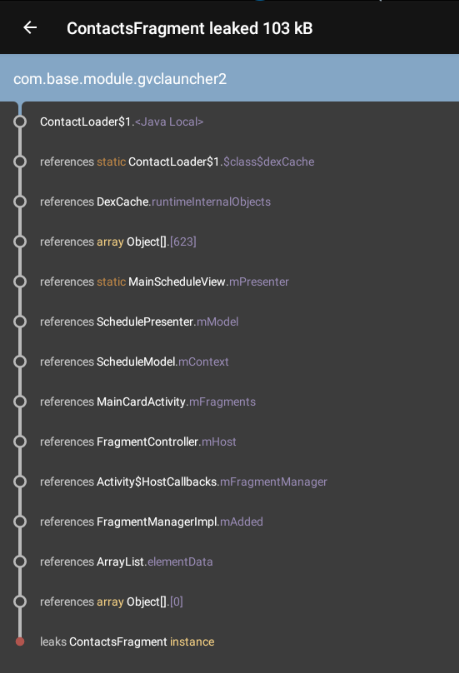

LeakCanary ，内存泄漏的查找

[TOC]
# `Android Studio` 建的`app` 使用`LeakCannary`
## app中的`build.gradle`的添加
`dependencies` 中增加如下代码
```java
implementation 'com.squareup.haha:haha:2.0.3'
implementation 'com.squareup.leakcanary:leakcanary-android:1.5.4'
implementation 'com.squareup.leakcanary:leakcanary-analyzer:1.5.4'
implementation 'com.squareup.leakcanary:leakcanary-watcher:1.5.4'
```

## `AndroidManifest.xml` 中添加权限：
```xml
<uses-permission android:name="android.permission.WRITE_EXTERNAL_STORAGE" />
<uses-permission android:name="android.permission.READ_EXTERNAL_STORAGE" />
```
## 增加`Application`相关代码
```java
    public RefWatcher mRefWatcher;
    @Override
    public void onCreate() {
        super.onCreate();
        if (LeakCanary.isInAnalyzerProcess(this)) {
            // This process is dedicated to LeakCanary for heap analysis.
            // You should not init your app in this process.
            return;
        }
        mRefWatcher = LeakCanary.install(this);
    }

    public static RefWatcher getRefWatcher(Context context) {
        MyApplication launcherApplication = (MyApplication) context.getApplicationContext();
        return launcherApplication.mRefWatcher;
    }
```
**如果原本没有`Appilication`:**
1. 增加 `MyApplication.java`，代码如下：
```java
public class MyApplication extends Application {

    public RefWatcher mRefWatcher;
    @Override
    public void onCreate() {
        super.onCreate();


        if (LeakCanary.isInAnalyzerProcess(this)) {
            // This process is dedicated to LeakCanary for heap analysis.
            // You should not init your app in this process.
            return;
        }

        mRefWatcher = LeakCanary.install(this);

    }

    public static RefWatcher getRefWatcher(Context context) {
        MyApplication launcherApplication = (MyApplication) context.getApplicationContext();
        return launcherApplication.mRefWatcher;
    }
}

```
2. 修改`AndroidManifest.xml`
在`application`标签中增加`android:name=".MyApplication"`

## 要监控的`Activity`或者`Fragment`添加如下代码:
**记得要申请权限**
```
requestPermissions(new String[]{
                WRITE_EXTERNAL_STORAGE,
                READ_EXTERNAL_STORAGE
        }, 1000);
```

1. Activity:
```
@Override
protected void onCreate(Bundle savedInstanceState) {
    RefWatcher refWatche = MyApplication.getRefWatcher(this);
    refWatche.watch(this);
}
```
2. Fragment:
```
@Override
public void onCreate(@Nullable Bundle savedInstanceState) {
    super.onCreate(savedInstanceState);
    RefWatcher refWatche = LauncherApplication.getRefWatcher(getContext());
    refWatche.watch(this);
}
```


# `Android`源码中使用`LeakCannary`
## `Android.mk`中做如下修改：
```make
LOCAL_STATIC_JAVA_LIBRARIES := Haha \
                               Watcher
                               
LOCAL_AAPT_FLAGS := --auto-add-overlay \
                    --extra-packages com.squareup.leakcanary

#结尾添加如下：
include $(CLEAR_VARS)
LOCAL_PREBUILT_STATIC_JAVA_LIBRARIES := Haha:libs/haha-2.0.3.jar \
                    Analyzer:libs/leakcanary-analyzer-1.5.4.aar \
                    Watcher:libs/leakcanary-watcher-1.5.4.jar \
                    LeakMain:libs/leakcanary-android-1.5.4.aar
```

## `AndroidManifest.xml`参考上文所述

## `Activity`与`Fragment`中添加的代码参考上文

# 结果分析
反复操作，在手机中查看`app`->`Leaks`。
结果可能如下图：


由上往下看，上一行最后的紫色字体是对下一行的引用。看上图第六、七两行:`SchedulePresenter`中有对`ScheduleModel`的引用，引用的变量名是`mMoel`。结合源码一起分析，找到内存泄漏的确切原因，并进行修改。


