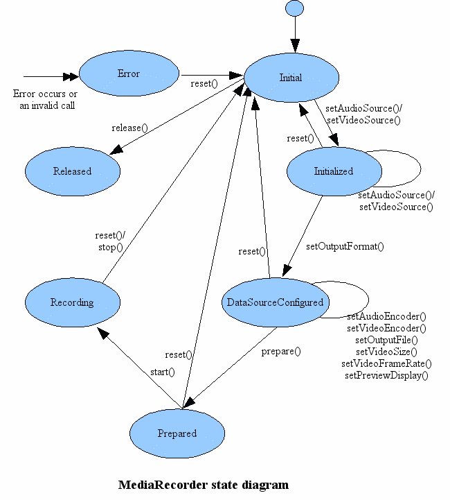

MeidaRecorder 录音



[具体使用参考](https://developer.android.com/guide/topics/media/mediarecorder?hl=zh-cn)

```
    private MediaRecorder mMediaRecorder;
    //开始录音
    public void startRecord(String filePath) {
        
        if(mMediaRecorder == null) {
            mMediaRecorder = new MediaRecorder();
        }

        mMediaRecorder.setAudioSource(MediaRecorder.AudioSource.MIC);
        mMediaRecorder.setOutputFormat(MediaRecorder.OutputFormat.AMR_NB);
        mMediaRecorder.setOutputFile(filePath);
        mMediaRecorder.setAudioEncoder(MediaRecorder.AudioEncoder.AMR_NB);

        try {
            mMediaRecorder.prepare();
            mMediaRecorder.start();
            mHandler.sendEmptyMessage(START_RECORDING);
        } catch (IOException e) {
            e.printStackTrace();
            mMediaRecorder.stop();
            mMediaRecorder.release();
            mMediaRecorder = null;
            mHandler.sendEmptyMessage(RECORD_ERROR);
        }
    }
    //停止录音
    public void stopRecord() {
        mMediaRecorder.stop();
        isRecording = false;
        mHandler.sendEmptyMessage(STOP_RECORDING);
        mMediaRecorder.release();
        mMediaRecorder = null;
    }
    //播放
    private MediaPlayer mMediaPlayer;
    public void playAudioStream(String filepath) {
        if(isPlaying){
            return;
        }
        new Thread(){
            @Override
            public void run() {
               if(mMediaPlayer == null) {
                   mMediaPlayer = new MediaPlayer();
               }
                try {
                    mMediaPlayer.setDataSource(file.getAbsolutePath());
                    mMediaPlayer.prepare();
                    mMediaPlayer.setVolume(1.0f);
                    mMediaPlayer.start();
                    mHandler.sendEmptyMessage(START_PLAY);
                } catch (IOException e) {
                    e.printStackTrace();
                    mMediaPlayer.release();
                    mMediaPlayer = null;
                    mHandler.sendEmptyMessage(PLAY_ERROR);
                }
            }
        }.start();
    }
```


AudioRecorder 使用
```
        final int bufferSize = AudioRecord.getMinBufferSize(SAMPLE_RATE_HZ,
                AudioFormat.CHANNEL_CONFIGURATION_STEREO, AudioFormat.ENCODING_PCM_16BIT);
        final AudioRecord audioRecord = new AudioRecord(MediaRecorder.AudioSource.MIC, SAMPLE_RATE_HZ, AudioFormat.CHANNEL_CONFIGURATION_STEREO,
                AudioFormat.ENCODING_PCM_16BIT, bufferSize);
        audioRecord.startRecording();
        
        //读取数据：
        byte[] data = new byte[bufferSize];
        audioRecord.read(data, 0, bufferSize);
        bufferedOutputStream.write(data, 0, result);
```

