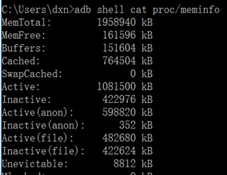
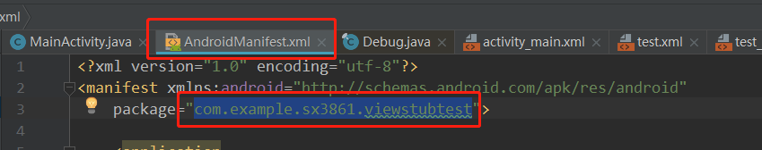
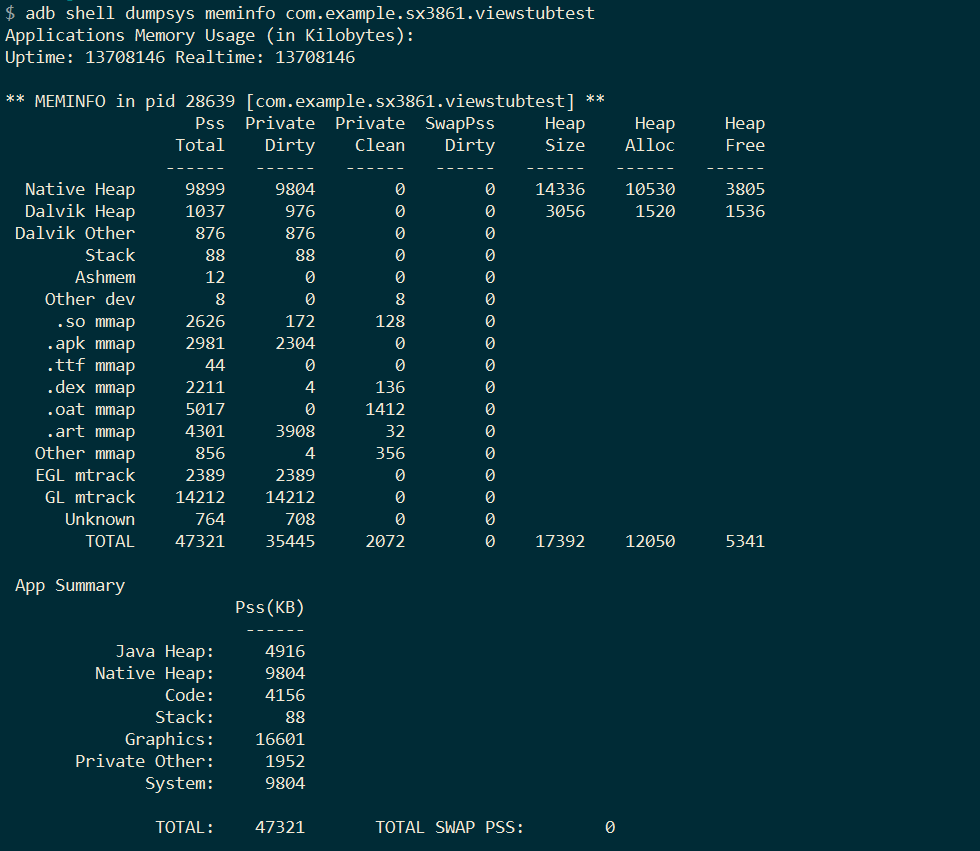
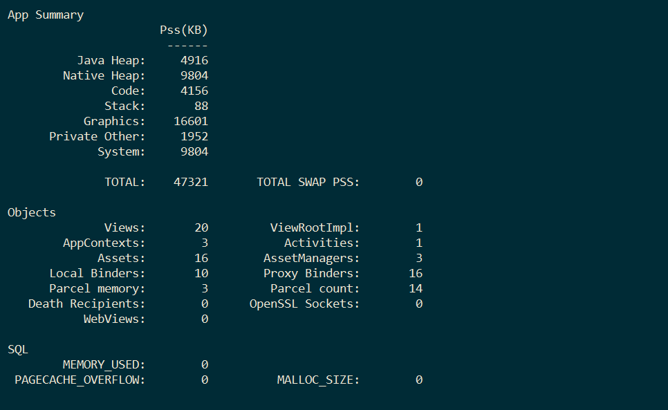
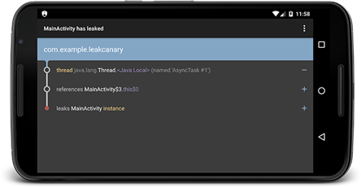
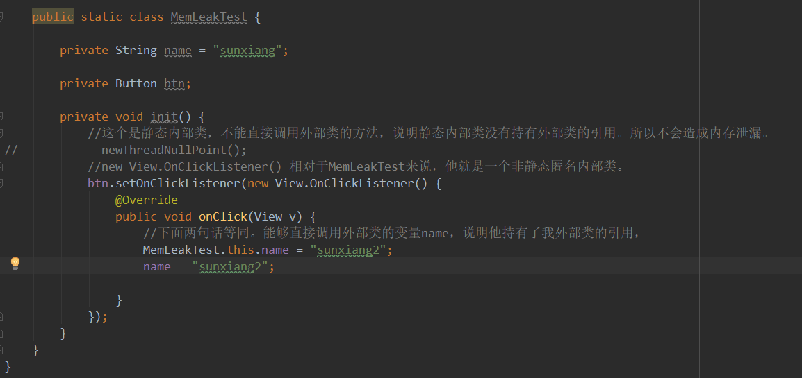

性能优化（内存泄漏）（TODO-2）

# 一、获取应用内存占用大小
1. 使用adb命令查看
`adb shell cat /proc/meminfo`

> 其中，第一行的MemTotal表示手机总体内存大小，第二行的MemFree表示手机当前可用的内存。

我们可以通过命令`adb shell dumpsys meminfo <process name>` 获取指定进程的内存占用，如下：
process name 从AndroidManifest.xml文件中packa中获取：




> 以上有对内存总的详细信息，还有对App 对象，和数据库分别的内存信息。Android的内存分为两块，分为Dalvik和Native两块。我们关注内存占用的重点就是关注这两块占用的内存。

2. 代码查看，可以参考AndroidExamples中的ViewStubTest代码部分

# 二、获取内存分配文件
1. `adb`
使用`adb shell am dumpheap <process name> <file path>` 命令获取指定进程的java堆，并保存到指定文件路径。
2. Android Studio中的Android profiler 中获取
3. 在代码中，可以使用Debug中的dumpHprofData接口获取java堆内存。一般我们可以在进程出现OOM崩溃的时候获取dump文件。
// 在进程出现OOM崩溃为时候进行dump Java heap操作。
```
Thread.setDefaultUncaughtExceptionHandler(new Thread.UncaughtExceptionHandler() {

    @Override
    public void uncaughtException(Thread t, Throwable e) {
        if (e instanceof OutOfMemoryError) {
            try {

                File file = new File(Environment.getExternalStorageDirectory(), System.currentTimeMillis() + ".hprof");

                Debug.dumpHprofData(file.getAbsolutePath());
            } catch (IOException exception) {
                exception.printStackTrace();
            }
        }
    }
});
```
## 三、使用LeakCanary监控内存泄漏

1. [Leak Canary](https://github.com/square/leakcanary)是Square公司开源的一款`Android`和`Java`内存泄漏的检测工具库。`Leak Canary`能够检测应用中的`Activity`的泄漏，还可以自定义检测泄漏对象。泄漏对象的引用路径会通过可视化的方式进行展示。


使用方式参考上面的链接。注意加上以下代码，监控app死掉之后，内存泄漏的对象。
在`Debug`版本中，如果检测到某个 `activity` 有内存泄露，`LeakCanary` 就会自动地显示一个通知。
`LeakCanary`的`install`方法的返回值是`RefWatcher`对象，我们可以使用`RefWatcher` 监控那些本该被回收的对象。
```
public void onDestroy() {
// install返回的watcher对象
    RefWatcher watcher = {...};
    watcher.watch(this);
}
```
2. 工作原理

    1. 调用Application类中的registerActivityLifecycleCallbacks方法注册Activity生命周期的回调，在Activity销毁的时候调用RefWatcher.watch()方法监控这个Activity。
    
    2. RefWatcher.watch() 创建一个 KeyedWeakReference 到要被监控的对象。
    3. 然后在后台线程检查引用是否被清除，如果没有，调用`GC`。
    4. 如果引用还是未被清除，把 `heap` 内存 `dump` 到 `APP` 对应的文件系统中的一个 `.hprof` 文件中。
    5. 在另外一个进程中的 `HeapAnalyzerService` 有一个 `HeapAnalyzer` 使用`HAHA` 解析这个文件。`HAHA`是一个分析`java heap`的开源库，功能类似`MAT`，但这个没有UI界面。
    6. 得益于唯一的 `reference key, HeapAnalyzer` 找到 `KeyedWeakReference`，定位内存泄露。
    7. `HeapAnalyzer` 计算出到 `GC roots` 的最短强引用路径，并确定是否是泄露。如果是的话，建立导致泄露的引用链。如果这个引用链的信息还不足以分析出问题，那么可以采用`MAT`工具深入分析。
    8. 引用链传递到 `APP` 进程中的 `DisplayLeakService`， 并以通知的形式展示出来。

3. 系统内存泄漏
LeakCanary 有一个已知问题的忽略列表，在AndroidExcludedRefs类中。这个类中记录的都是系统引起的内存泄漏。当系统的内存泄漏问题发生时，一般的开发者能做的事情很有限。一般可以选择忽略，也可以通过阅读系统源码寻找一些规避的方法。主要还是看影响程度。

4. 扩展
我们也可以进行扩展，比如将出现泄漏的dump文件上传到服务器，就可以通过以下的方式实现。
编写一个上传dump文件的服务类，继承自`DisplayLeakService`类。
```
public class UploadDumpService extends DisplayLeakService {
    @Override

    protected void afterDefaultHandling(HeapDump heapDump, AnalysisResult result, String leakInfo) {

        if (!result.leakFound || result.excludedLeak) {
            return;
        }
        // TODO 在这里执行上传逻辑
    }
}
```
在Application中初始化Leak Canary时采用，指定自定义的UploadDumpService上传文件服务类。
LeakCanary.refWatcher(this).listenerServiceClass(UploadDumpService.class)
        .excludedRefs(AndroidExcludedRefs.createAppDefaults().build())
        .buildAndInstall();
如果不用上传服务，可以直接调用LeakCanary.install(this);这个方法实际调用上面的方法。上传文件服务类用的是默认类。即上面的父类。
最后不要忘记在AndroidMenifest文件中注册服务（Service）。这样就能实现自定义的后处理。

**四、内存泄漏常见场景**
1、静态成员变量引用

静态成员变量只有在应用被销毁时才会消失。因为你随时都有可能用到，还不需要New，所以只能在应用销毁时才能销毁。所以设置为静态的变量需要相当小心。视图和Activity等生命周期短而且内存占用高的变量就不能设置，要设置也是设置成弱引用。弱引用是在GC扫描的时候，不管内存现在是否紧张都会被释放。软引用，会视当前内存紧不紧张的情况而定。类似于如下使用：

    private static WeakReference<String> USER_NAME = new WeakReference<String>("sunxiang");

2、非静态内部类（非静态匿名内部类一样的）

内部类会持有外部类的引用。比如你在Activity中OKHttp中设置了某个监听器，new ..Listener(){}。这个就是非静态匿名内部类。这个匿名内部类就会被OKHttp持有。OKHttp底部持有，短时间不会释放。而内部类实例总会持有外部类的引用（这就是为什么在onClickListener里面能够直接调用Activity中的变量。如下图），所以当Activity不再使用了也不能销毁，这就导致了内存泄漏。所以，可以使用静态内部类或者是将这个匿名内部类的实现移动到轻量的类中，那就内存泄漏就不会有Activity那么大了。



那为什么静态内部类就不会导致内存泄漏呢？
因为静态内部类不会持有外部类的引用。所以内存泄漏在于外部类的内存泄漏，不是内部类。
并不是所有的内部类只能使用静态内部类，只有在该内部类中的生命周期不可控制的情况下，我们要采用静态内部类，其它时候大家可以照旧。

3、Activity被长期持有

Activity是Context的一种实现。在其他地方使用了某个Activity的Context，导致了这个Activity不能及时释放，造成了内存泄漏。解决办法是在Activity生命周期与业务模块生命周期交错的地方最好使用Application的Context。因为他的生命周期本身就是伴随着应用的。

4、Handler
具体详情查看笔记Handler
handler引起内存泄漏的原因：

1、使用了匿名内部类，activity结束了但还被handler持有，因此会有内存泄漏。所以Handler 采用静态内部类，同时采用弱引用持有外部activity的引用

2、在Activity的onDestory中调用mHandler.removeCallbacksAndMessages(null); 这样就会清除所有消息队列中的消息。这样handler就也会被销毁。

一般Handler的使用方式可以采用静态类和弱引用进行如下改造：
```
public class OuterActivity extends Activity {
    private Handler mHandler;

    @Override
    protected void onCreate(Bundle savedInstanceState) {
        super.onCreate(savedInstanceState);
//    即使UIHandler的初始化函数是私有的也是能行的。
        mHandler = new UIHandler(this);
    }

    public void doSomething() {
    }

    @Override
    protected void onDestroy() {
        super.onDestroy();
        // 移除所有的消息
        mHandler.removeCallbacksAndMessages(null);
    }

    private  static class UIHandler  extends Handler {
        private  WeakReference<OuterActivity> ref;
        private  UIHandler(OuterActivity activity) {
            ref = new WeakReference<>(activity);
        }
      @Override
        public void handleMessage(Message msg) {
            OuterActivity activity = ref.get();
            if (activity == null) {
                return;
            }
            activity.doSomething();
        }
    }
}
```
5、注册监听器未反注册

在Android中有许多的系统服务需要注册回调，这些回调如果没有进行反注册就会一直持有。如绑定Service、注册广播、监听传感器、监听剪切板等操作，都需要进行反注册。

6、native资源未关闭

资源性对象比如(Cursor，Steam)往往在native层存在缓冲，我们在不使用的时候，应该及时关闭它们，以便它们的缓冲及时回收内存。可以采用严苛模式动态检测出资源未及时关闭的问题。

7、集合对象未清理
在业务逻辑中常常会使用到集合，集合的生命周期的控制是必不可少的，我们应当在设计的时候就考虑好集合中的对象添加与移除的时机。

8、WebView内存泄漏

由于系统WebView在调用destroy方法后依旧存在内存泄漏问题，所以最好的方式是将WebView移动到单独的进程中进行使用，在使用完成后就杀死进程，这样就能够完整地释放WebView的内存。

**五、内存优化常见方法**
1、图片优化

分辨率适配，在分辨率较高，图片放在了低分辨率文件夹里面，就会放大显示图片，内存会变大。分辨率较低，图片放在高分辨率文件夹里面，就会缩小图片，影响显示。如果两个文件夹都放会增大APP体积。

BitmapFactory.Options 中的injustDecodeBound可以直接获取图片大小而不加载图片。

BitmapFactory.Options中的inSampleSize 可以实现加载缩小后的图片。该参数代表缩小比例。取值只能取2的指数。取值为2，则图片缩小为原图的四分之一。如果设置为3，最终赋值相当于赋2，向下取整。

BitmapFactory.Options中的inBitmap可以重复加载内存小的图片。比如原图内存A，需要加载的内存为B，A的内存需要大于B。临时使用某图片，使用此方法。BitmapFactory.Options options = new BitmapFactory.Options();

options.inBitmap = bitmapA;
Bitmap bitmapB = BitmapFactory.decodeFile("ss");

尽量不要使用setImageBitmap或setImageResource或BitmapFactory.decodeResource来设置一张大图，因为这些函数在完成decode后，最终都是通过java层的createBitmap来完成的，需要消耗更多内存，可以通过BitmapFactory.decodeStream方法，创建出一个bitmap，再将其设为ImageView的 source。

从设计上进行优化，在不影响图片效果的情况下，可以采用内存占用较少的图片格式；如果是纯色背景可以采用颜色值；如果图片内容能够简单，可以采用shape进行实现；图片的设计尽量小，如9图可以越小越好；在可行的情况下，可以将大图根据内容元素进行拆分，如一张中间带内容和颜色过渡效果，最外层是纯色的设计图，可以将图片减少为中间部分，外层部分采用颜色进行实现。

2、优化内存抖动

    如果频繁的创建和销毁临时对象，很容易触发GC操作，造成内存的抖动，从而影响了应用的正常运行。所以在一些调用非常频繁的方法中，如View的onDraw方法、onTouch方法、以及循环体内部等都不要频繁创建临时对象。可以优化成一个或多个缓存对象。

3、视图复用
    众所周知，在ListView、GridView等视图开发时，在getView中应该使用被复用的convertView。

4、减少视图层级
    在视图开发过程中，要尽量减少视图层级。一般的布局开发好像都能通过线性布局的嵌套来实现，我们要避免这种惯性思维，如果嵌套的层级过多就不合理了。

5、使用轻量的数据结构

    使用Android SDK提供的SparseArray等轻量级的数据结构。SparseArray内存优于java提供的HashMap等数据结构，适合数据量少的情况下使用。

6、避免使用枚举
使用各种常量类型替代枚举的使用。枚举在Android平台上存在较大的争议，不建议使用。

7、减少代码

Java虚拟机上方法区用于存储已被虚拟机加载的类信息、常量、静态变量、代码等数据。也就说我们减少代码量就是减少内存占用。利用proguard工具混淆代码是非常有必要的。

**实际应用中遇到的内存泄露，面试时可说**
**(生命周期长的变量持有了生命周期短但内存大的变量)**
**1、静态成员变量持有context**
public class ToastUtil {

    private static Toast mToast;

    public static void showToast(Context context, String text) {
            if(mToast != null) {
                mToast.cancel();
            }
            //修改方式
            context = context.getApplicationContext();
            mToast = Toast.makeText(context, text, Toast.LENGTH_LONG);
            mToast.show();
    }
}

这个类是为了只显示一个Toast，这里的mToast是一个静态变量，会一直存在，而这个mToast持有了Context，内存占比比较大。会导致内存泄漏。

2、非静态内部类会持有外部类的引用，非静态内部类如果是网络请求的返回很容易造成内存泄漏。因为网络可能没有返回，那么那个网络请求就会一直存在，这个非静态内部类会一直存在，那么他持有的外部类也会一直存在，这样就造成了内存泄漏。

处理方式：把网络请求提出来在一个类里面，这个类初始化的时候把Activity传进来，添加onDestory方法，方法内十Activity为空，在Activity的onDestory方法中调用这个类的onDestory方法。这样，在Activity调用onDestory时，调用了网络类的onDestory，然后在这个方法中将Activity置为空。这样Activity就能销毁了

3、一定要注意反注册，否则很容易造成内存泄漏