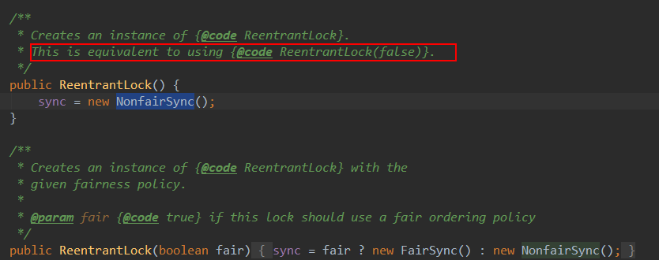

锁

一、ReentrantLock
1、初始化：

2、普通使用lock()
ReentrantLock lock = new ReentrantLock();
lock.lock()
......
......
lock.unlock()

3、newCondition()
Condition condition = lock.newCondition()
condition.await();
这样这个拥有锁的线程会阻塞线程，并放弃锁。这样其他的线程就能使用了。

其他拥有这个锁的线程condition.signalAll()，唤醒等待锁的线程。
await() 和signalAll() 方法需要在那个你被锁的线程中执行。
具体使用参考AndroidExamples/LockUse

关键字Synchronized
wait()方式类似于condition.await()
notifyAll 类似于 signalAll

几种方式优先选择的顺序
1、java.util.concurrent(线程、队列)
2、synchronized
3、ReentrantLock

4、阻塞队列

5、ReentrantLock和Synchronized的区别：
https://blog.csdn.net/natian306/article/details/18504111

**这里可以看出，利用 lock 可以使我们多线程交互变得方便，而使用 synchronized 则无法做到这点。**

ReentrantLock 这个类还提供了 2 种竞争锁的机制：公平锁和非公平锁。这 2 种机制的意思从字面上也能了解个大概：即对于多线程来说，公平锁会依赖线程进来的顺序，后进来的线程后获得锁。而非公平锁的意思就是后进来的锁也可以和前边等待锁的线程同时竞争锁资源。对于效率来讲，当然是非公平锁效率更高，因为公平锁还要判断是不是线程队列的第一个才会让线程获得锁。

Synchronized
（1）不加锁的方法与加锁的方法肯定不互斥
（2）静态方法加锁，对类加锁，与对对象加锁是两码事。不会与对象加锁形成互斥
                    //大前提，静态加锁
                //静态不加锁，不互斥
//                Use.dosomething2();
                //静态枷锁，互斥
//                Use.dosomething3();
                //非静态加锁，不互斥
//                use.dosomething4();
                //非静态不加锁，不互斥
//                use.dosomething5();

//--------------------------------------------------------------------------

                //大前提，非静态加锁
                //非静态加锁，互斥
//                use.dosomething42();
                //非静态不加锁，不互斥
//                use.dosomething5();

双重校验锁

public static BigLoadingGifUtil getInstance(Activity activity) {
  if(*instance* == null) {
    synchronized (BigLoadingGifUtil.class) {
      if(*instance* == null) {
        *instance* = new BigLoadingGifUtil(activity);
      }
    }
  }
  return  *instance*;
}