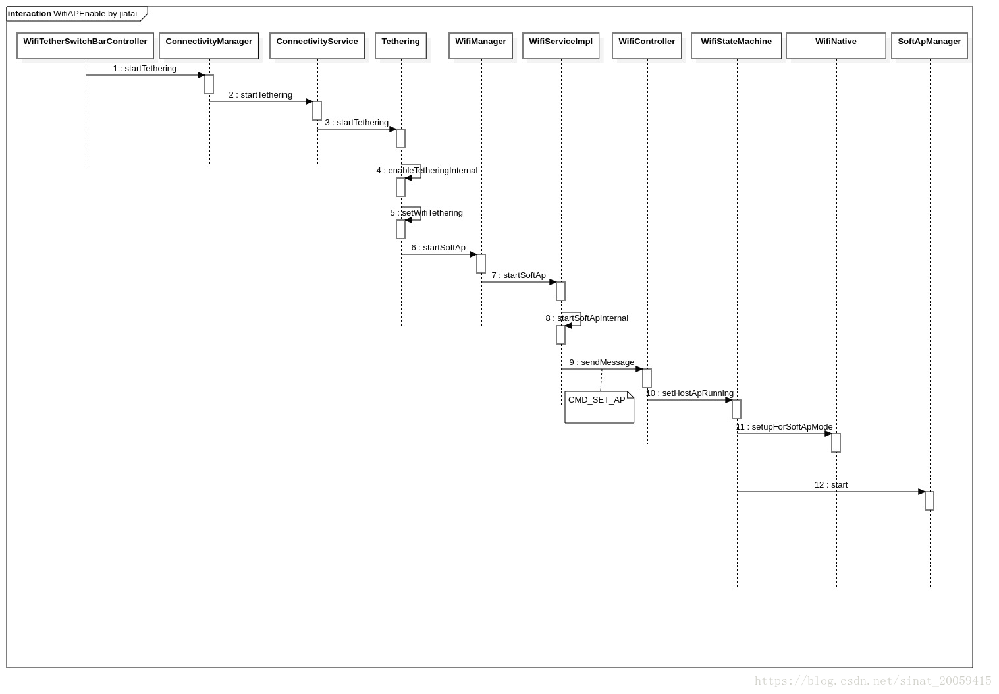
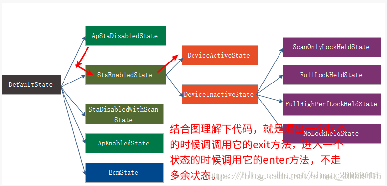
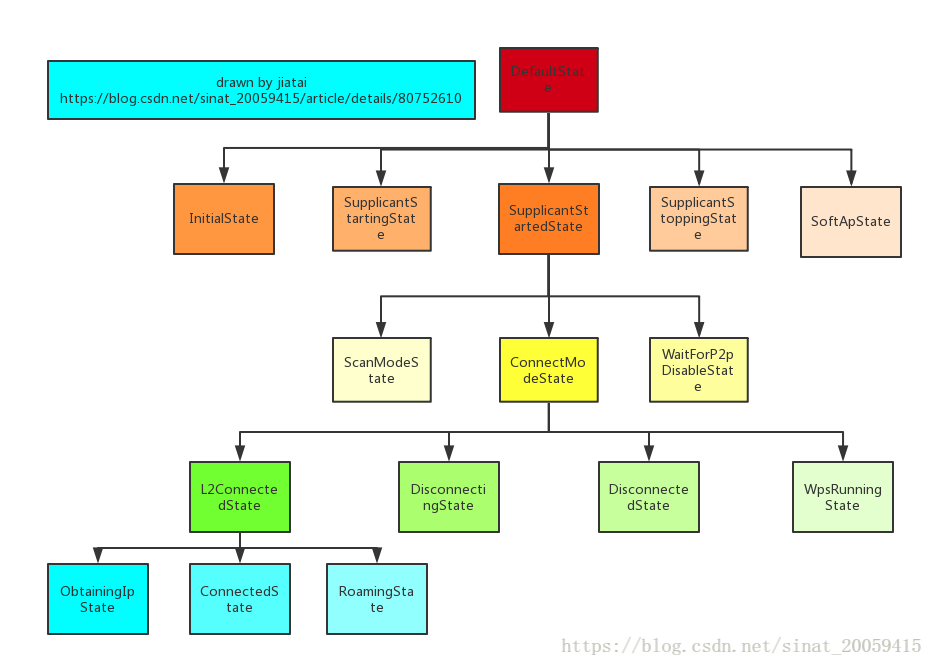
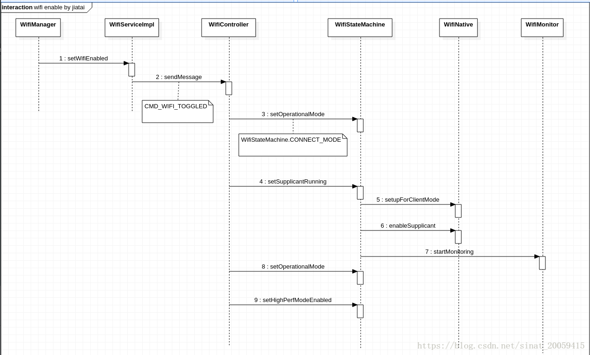

Android O WiFi热点 开启流程梳理

**前言**：之前主要梳理了WiFi开启扫描连接的流程，现在梳理下WiFi 热点 的开启流程。

时序图mdj样式：[https://download.csdn.net/download/sinat_20059415/10542186](https://download.csdn.net/download/sinat_20059415/10542186)

[wifi热点](https://baike.baidu.com/item/wifi%E7%83%AD%E7%82%B9/2874054)是将手机接收的GPRS、3G或4G信号转化为wifi信号发出去的技术，手机必须有无线AP功能，才能当做热点。有些系统自带建热点这个功能比如 IOS（比如 iPhone 4s）。

如果你把你的iPhone当做热点，那么像TOUCH，PAD这样有WIFI功能的，都可以搜索到你手机建立的WIFI网络，连接上以后，TOUCH等使用WIFI产生的流量上网都是消耗的乐WIFI里的手机卡的GPRS或3G流量，所以iphone里最好放一张包大流量的上网卡。还有，把手机当做热点很费电，最好用的时候插上充电器。



## <a id="t2"></a><a id="t2"></a>2.1 Settings

Android O的Settings引入了PreferenceController这个包装类来实现对Preference的精细化控制，让代码结构更加地鲜明，很好地体现了单一职责原则，以前的Preference都是一大坨代码冗余在一起，看的都头疼。

TetherSettings->WifiTetherPreferenceController->WifiTetherSwitchBarController

TetherSettings是WiFi热点对应的界面，WifiTetherSwitchBarController是用来负责热点开关的相关逻辑处理的。

/packages/apps/Settings/src/com/android/settings/wifi/tether/WifiTetherSwitchBarController.java

```
public class WifiTetherSwitchBarController implements SwitchWidgetController.OnSwitchChangeListener,LifecycleObserver, OnStart, OnStop {public boolean onSwitchToggled(boolean isChecked) {        mSwitchBar.setEnabled(false);        mConnectivityManager.stopTethering(TETHERING_WIFI);        mSwitchBar.setEnabled(false);        mConnectivityManager.startTethering(TETHERING_WIFI, true ,                NoOpOnStartTetheringCallback.newInstance(), new Handler(Looper.getMainLooper()));
```

可以看到WiFi热点代开是通过ConnectivityManager的startTethering方法。

附

1) callback(抽象类直接new出来的，内部实现还没有。。。)

```
class NoOpOnStartTetheringCallback {public static ConnectivityManager.OnStartTetheringCallback newInstance() {return new ConnectivityManager.OnStartTetheringCallback() {
```

```
public static abstract class OnStartTetheringCallback {public void onTetheringStarted() {}public void onTetheringFailed() {}
```

2)状态监听：

```
private final BroadcastReceiver mReceiver = new BroadcastReceiver() {public void onReceive(Context context, Intent intent) {            String action = intent.getAction();if (WifiManager.WIFI_AP_STATE_CHANGED_ACTION.equals(action)) {final int state = intent.getIntExtra(                        WifiManager.EXTRA_WIFI_AP_STATE, WifiManager.WIFI_AP_STATE_FAILED);                handleWifiApStateChanged(state);            } else if (Intent.ACTION_AIRPLANE_MODE_CHANGED.equals(action)) {private void handleWifiApStateChanged(int state) {case WifiManager.WIFI_AP_STATE_ENABLING:                mSwitchBar.setEnabled(false);case WifiManager.WIFI_AP_STATE_ENABLED:if (!mSwitchBar.isChecked()) {                    mSwitchBar.setChecked(true);case WifiManager.WIFI_AP_STATE_DISABLING:if (mSwitchBar.isChecked()) {                    mSwitchBar.setChecked(false);                mSwitchBar.setEnabled(false);case WifiManager.WIFI_AP_STATE_DISABLED:                mSwitchBar.setChecked(false);                mSwitchBar.setChecked(false);private void enableWifiSwitch() {boolean isAirplaneMode = Settings.Global.getInt(mContext.getContentResolver(),                Settings.Global.AIRPLANE_MODE_ON, 0) != 0;            mSwitchBar.setEnabled(!mDataSaverBackend.isDataSaverEnabled());            mSwitchBar.setEnabled(false);
```

## <a id="t3"></a><a id="t3"></a>2.2 ConnectivityManager

```
@RequiresPermission(android.Manifest.permission.TETHER_PRIVILEGED)public void startTethering(int type, boolean showProvisioningUi,final OnStartTetheringCallback callback, Handler handler) {        Preconditions.checkNotNull(callback, "OnStartTetheringCallback cannot be null.");        ResultReceiver wrappedCallback = new ResultReceiver(handler) {protected void onReceiveResult(int resultCode, Bundle resultData) {if (resultCode == TETHER_ERROR_NO_ERROR) {                    callback.onTetheringStarted();                    callback.onTetheringFailed();            String pkgName = mContext.getOpPackageName();            Log.i(TAG, "startTethering caller:" + pkgName);            mService.startTethering(type, wrappedCallback, showProvisioningUi, pkgName);        } catch (RemoteException e) {            Log.e(TAG, "Exception trying to start tethering.", e);            wrappedCallback.send(TETHER_ERROR_SERVICE_UNAVAIL, null);
```

至于mService:

```
                (ConnectivityManager) context.getSystemService(Context.CONNECTIVITY_SERVICE);
```

SystemServiceRegistry:

```
        registerService(Context.CONNECTIVITY_SERVICE, ConnectivityManager.class,new StaticApplicationContextServiceFetcher<ConnectivityManager>() {public ConnectivityManager createService(Context context) throws ServiceNotFoundException {                IBinder b = ServiceManager.getServiceOrThrow(Context.CONNECTIVITY_SERVICE);                IConnectivityManager service = IConnectivityManager.Stub.asInterface(b);return new ConnectivityManager(context, service);
```

```
public ConnectivityManager(Context context, IConnectivityManager service) {        mContext = Preconditions.checkNotNull(context, "missing context");        mService = Preconditions.checkNotNull(service, "missing IConnectivityManager");
```

SystemServer:

```
                traceBeginAndSlog("StartConnectivityService");                    connectivity = new ConnectivityService(                            context, networkManagement, networkStats, networkPolicy);                    ServiceManager.addService(Context.CONNECTIVITY_SERVICE, connectivity);                    networkStats.bindConnectivityManager(connectivity);                    networkPolicy.bindConnectivityManager(connectivity);                    reportWtf("starting Connectivity Service", e);
```

所以mService是ConnectivityService。

## <a id="t4"></a><a id="t4"></a>2.3 ConnectivityService

```
public void startTethering(int type, ResultReceiver receiver, boolean showProvisioningUi,        ConnectivityManager.enforceTetherChangePermission(mContext, callerPkg);if (!isTetheringSupported()) {            receiver.send(ConnectivityManager.TETHER_ERROR_UNSUPPORTED, null);        mTethering.startTethering(type, receiver, showProvisioningUi);
```

## <a id="t5"></a><a id="t5"></a>2.4 Tethering

```
public void startTethering(int type, ResultReceiver receiver, boolean showProvisioningUi) {if (!isTetherProvisioningRequired()) {            enableTetheringInternal(type, true, receiver);if (showProvisioningUi) {            runUiTetherProvisioningAndEnable(type, receiver);            runSilentTetherProvisioningAndEnable(type, receiver);
```

暂时先认为打开tethering需要provision吧，继续往下看。

```
protected boolean isTetherProvisioningRequired() {final TetheringConfiguration cfg = mConfig;if (mSystemProperties.getBoolean(DISABLE_PROVISIONING_SYSPROP_KEY, false)                || cfg.provisioningApp.length == 0) {if (carrierConfigAffirmsEntitlementCheckNotRequired()) {return (cfg.provisioningApp.length == 2);
```

shouProvisioningUi由设置传入，是true

```
private void runUiTetherProvisioningAndEnable(int type, ResultReceiver receiver) {        ResultReceiver proxyReceiver = getProxyReceiver(type, receiver);        sendUiTetherProvisionIntent(type, proxyReceiver);
```

```
private ResultReceiver getProxyReceiver(final int type, final ResultReceiver receiver) {        ResultReceiver rr = new ResultReceiver(null) {protected void onReceiveResult(int resultCode, Bundle resultData) {if (resultCode == TETHER_ERROR_NO_ERROR) {                    enableTetheringInternal(type, true, receiver);                    sendTetherResult(receiver, resultCode);        Parcel parcel = Parcel.obtain();        rr.writeToParcel(parcel,0);        parcel.setDataPosition(0);        ResultReceiver receiverForSending = ResultReceiver.CREATOR.createFromParcel(parcel);return receiverForSending;
```

```
private void sendUiTetherProvisionIntent(int type, ResultReceiver receiver) {        Intent intent = new Intent(Settings.ACTION_TETHER_PROVISIONING);        intent.putExtra(EXTRA_ADD_TETHER_TYPE, type);        intent.putExtra(EXTRA_PROVISION_CALLBACK, receiver);        intent.addFlags(Intent.FLAG_ACTIVITY_NEW_TASK);final long ident = Binder.clearCallingIdentity();            mContext.startActivityAsUser(intent, UserHandle.CURRENT);            Binder.restoreCallingIdentity(ident);
```

Settings有如下类会接收并处理消息

```
        <activity android:name="TetherProvisioningActivity"            android:permission="android.permission.TETHER_PRIVILEGED"            android:excludeFromRecents="true"            android:theme="@style/Theme.ProvisioningActivity">            <intent-filter android:priority="1">                <action android:name="android.settings.TETHER_PROVISIONING_UI" />                <category android:name="android.intent.category.DEFAULT" />
```

```
public class TetherProvisioningActivity extends Activity {private static final int PROVISION_REQUEST = 0;private static final String TAG = "TetherProvisioningAct";private static final String EXTRA_TETHER_TYPE = "TETHER_TYPE";private static final boolean DEBUG = Log.isLoggable(TAG, Log.DEBUG);private ResultReceiver mResultReceiver;public void onCreate(Bundle savedInstanceState) {super.onCreate(savedInstanceState);        mResultReceiver = (ResultReceiver)getIntent().getParcelableExtra(                ConnectivityManager.EXTRA_PROVISION_CALLBACK);int tetherType = getIntent().getIntExtra(ConnectivityManager.EXTRA_ADD_TETHER_TYPE,                ConnectivityManager.TETHERING_INVALID);        String[] provisionApp = getResources().getStringArray(                com.android.internal.R.array.config_mobile_hotspot_provision_app);        Intent intent = new Intent(Intent.ACTION_MAIN);        intent.setClassName(provisionApp[0], provisionApp[1]);        intent.putExtra(EXTRA_TETHER_TYPE, tetherType);            Log.d(TAG, "Starting provisioning app: " + provisionApp[0] + "." + provisionApp[1]);if (getPackageManager().queryIntentActivities(intent,                PackageManager.MATCH_DEFAULT_ONLY).isEmpty()) {            Log.e(TAG, "Provisioning app is configured, but not available.");            mResultReceiver.send(ConnectivityManager.TETHER_ERROR_PROVISION_FAILED, null);        startActivityForResultAsUser(intent, PROVISION_REQUEST, UserHandle.CURRENT);public void onActivityResult(int requestCode, int resultCode, Intent intent) {super.onActivityResult(requestCode, resultCode, intent);if (requestCode == PROVISION_REQUEST) {if (DEBUG) Log.d(TAG, "Got result from app: " + resultCode);int result = resultCode == Activity.RESULT_OK ?                    ConnectivityManager.TETHER_ERROR_NO_ERROR :                    ConnectivityManager.TETHER_ERROR_PROVISION_FAILED;            mResultReceiver.send(result, null);
```

具体provision app需要vendor具体配置，看framework/base/core/res/res是空的

```
./values/config.xml:407:    <string-array translatable="false" name="config_mobile_hotspot_provision_app">./values/config.xml-408-    <!--./values/config.xml-409-        <item>com.example.provisioning</item>./values/config.xml-410-        <item>com.example.provisioning.Activity</item>./values/config.xml-411-    -->./values/config.xml-412-    </string-array>
```

完成后回调onActivityResult，发送ConnectivityManager.TETHER\_ERROR\_NO_ERROR，继续调用enableTetheringInternal方法。

```
        ResultReceiver rr = new ResultReceiver(null) {protected void onReceiveResult(int resultCode, Bundle resultData) {if (resultCode == TETHER_ERROR_NO_ERROR) {                    enableTetheringInternal(type, true, receiver);                    sendTetherResult(receiver, resultCode);
```

```
private void enableTetheringInternal(int type, boolean enable, ResultReceiver receiver) {boolean isProvisioningRequired = enable && isTetherProvisioningRequired();                result = setWifiTethering(enable);if (isProvisioningRequired && result == TETHER_ERROR_NO_ERROR) {                    scheduleProvisioningRechecks(type);                sendTetherResult(receiver, result);                result = setUsbTethering(enable);if (isProvisioningRequired && result == TETHER_ERROR_NO_ERROR) {                    scheduleProvisioningRechecks(type);                sendTetherResult(receiver, result);case TETHERING_BLUETOOTH:                setBluetoothTethering(enable, receiver);                Log.w(TAG, "Invalid tether type.");                sendTetherResult(receiver, TETHER_ERROR_UNKNOWN_IFACE);
```

可以看到tethering不特指WiFi热点，总体包含蓝牙WiFi热点和Usb。

我们还是走不需要provision的流程把。。。

```
private int setWifiTethering(final boolean enable) {int rval = TETHER_ERROR_MASTER_ERROR;final long ident = Binder.clearCallingIdentity();synchronized (mPublicSync) {                mWifiTetherRequested = enable;final WifiManager mgr = getWifiManager();if ((enable && mgr.startSoftAp(null )) ||                    (!enable && mgr.stopSoftAp())) {                    rval = TETHER_ERROR_NO_ERROR;            Binder.restoreCallingIdentity(ident);
```

这边会走到WifiManager里去，wifi config为空表示使用已有的WiFi config。后面的senTetherResult就是回调之前的receiver通知执行结果。

## <a id="t6"></a><a id="t6"></a>2.5 WifiManager

```
public boolean startSoftAp(@Nullable WifiConfiguration wifiConfig) {return mService.startSoftAp(wifiConfig);        } catch (RemoteException e) {throw e.rethrowFromSystemServer();
```

## <a id="t7"></a><a id="t7"></a>2.6 WifiServiceImpl

```
public boolean startSoftAp(WifiConfiguration wifiConfig) {        enforceNetworkStackPermission();        mLog.info("startSoftAp uid=%").c(Binder.getCallingUid()).flush();synchronized (mLocalOnlyHotspotRequests) {if (!mLocalOnlyHotspotRequests.isEmpty()) {return startSoftApInternal(wifiConfig, WifiManager.IFACE_IP_MODE_TETHERED);
```

```
private boolean startSoftApInternal(WifiConfiguration wifiConfig, int mode) {        mLog.trace("startSoftApInternal uid=% mode=%")                .c(Binder.getCallingUid()).c(mode).flush();if (wifiConfig == null || isValid(wifiConfig)) {            SoftApModeConfiguration softApConfig = new SoftApModeConfiguration(mode, wifiConfig);            mWifiController.sendMessage(CMD_SET_AP, 1, 0, softApConfig);        Slog.e(TAG, "Invalid WifiConfiguration");
```

这边对空的wificonfig包装成了SoftApModeConfiguration接由WifiController处理。

```
public void sendMessage(int what, int arg1, int arg2, Object obj) {        SmHandler smh = mSmHandler;        smh.sendMessage(obtainMessage(what, arg1, arg2, obj));
```

## <a id="t8"></a><a id="t8"></a>2.7 WifiController



ApStaDisabledState会对该消息进行对应的处理

```
                            mSettingsStore.setWifiSavedState(WifiSettingsStore.WIFI_DISABLED);                        mWifiStateMachine.setHostApRunning((SoftApModeConfiguration) msg.obj,                        transitionTo(mApEnabledState);
```

## <a id="t9"></a><a id="t9"></a>2.8 WifiStateMachine



```
public void setHostApRunning(SoftApModeConfiguration wifiConfig, boolean enable) {            sendMessage(CMD_START_AP, wifiConfig);            sendMessage(CMD_STOP_AP);
```

看了一圈只有InitialState对该消息有正确响应

```
                    transitionTo(mSoftApState);
```

InitialState exit()方法为空，看下SoftApState的enter方法

```
class SoftApState extends State {private SoftApManager mSoftApManager;private String mIfaceName;private class SoftApListener implements SoftApManager.Listener {public void onStateChanged(int state, int reason) {if (state == WIFI_AP_STATE_DISABLED) {                    sendMessage(CMD_AP_STOPPED);                } else if (state == WIFI_AP_STATE_FAILED) {                    sendMessage(CMD_START_AP_FAILURE);                setWifiApState(state, reason, mIfaceName, mMode);final Message message = getCurrentMessage();if (message.what != CMD_START_AP) {throw new RuntimeException("Illegal transition to SoftApState: " + message);            SoftApModeConfiguration config = (SoftApModeConfiguration) message.obj;            mMode = config.getTargetMode();            IApInterface apInterface = null;            Pair<Integer, IApInterface> statusAndInterface = mWifiNative.setupForSoftApMode();if (statusAndInterface.first == WifiNative.SETUP_SUCCESS) {                apInterface = statusAndInterface.second;                incrementMetricsForSetupFailure(statusAndInterface.first);if (apInterface == null) {                setWifiApState(WIFI_AP_STATE_FAILED,                        WifiManager.SAP_START_FAILURE_GENERAL, null, mMode);                transitionTo(mInitialState);                mIfaceName = apInterface.getInterfaceName();            } catch (RemoteException e) {            checkAndSetConnectivityInstance();            mSoftApManager = mWifiInjector.makeSoftApManager(mNwService,                                                             config.getWifiConfiguration());            mWifiStateTracker.updateState(WifiStateTracker.SOFT_AP);
```

这边的调用流程和WiFi的启动流程有点类似。先梳理到这，后面应该是硬菜。。。



