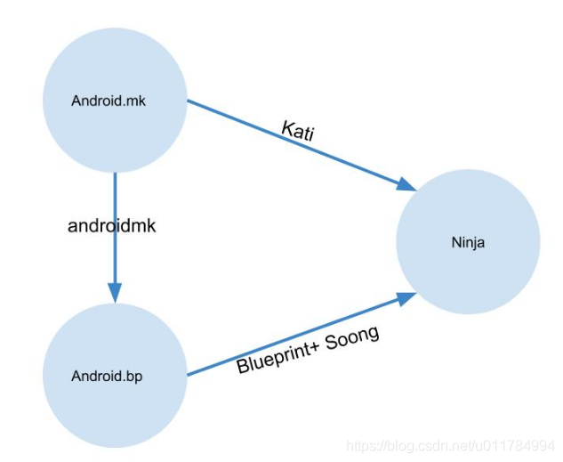

Android.bp

## <a id="t0"></a><a id="t0"></a><a id="Androidbp_0"></a>Android.bp简介

> Android 7.0之后希望用Android.bp替换Android.mk，bp简单的配置更方便Ninja 文件的产生，而Blueprint和Soong 就此产生。Android 利用Blueprint和Soong 来解析bp文件，经过最终转换为ninja files。 Blueprint和Soong都是由Golang写的项目。 从Android Nougat开始，prebuilts/go/目录下新增了Golang所需的运行环境，在编译时使用。Android.bp以及相关支持，从Android Nougat开始加入，从 Android Oreo（8.0）开始默认开启。 如果需要在Android Nougat的版本使用，需要在执行编译时添加变量: make ‘USE_SOONG=true’ Soong是以前Android基于make的编译系统的替代品。它以Android.bp文件替代Android.mk，Android.bp文件用类似JSON的简洁声明来描述需要构建的模块。

参考文档：

- [Android.bp入门指南之浅析Android.bp语法](https://blog.csdn.net/tkwxty/article/details/104395820)
- [Android.bp 简介](https://segmentfault.com/a/1190000021633504?utm_source=tag-newest)
- [Android.bp学习笔记](https://www.bbsmax.com/A/xl56G2k4dr/)

再来说一说跟着Android版本相应的发展演变过程:

1.  Android 7.0引入ninja和kati
2.  Android 8.0使用Android.bp来替换Android.mk，引入Soong
3.  Android 9.0强制使用Android.bp

## <a id="t1"></a><a id="t1"></a><a id="_16"></a>转换关系



通过Kati将Android.mk转换成ninja格式的文件，通过Blueprint+Soong将Android.bp转换成ninja格式的文件，通过androidmk将将Android.mk转换成Android.bp，但针对没有分支、循环等流程控制的Android.mk才有效。

这里涉及到Ninja, kati, Soong, bp概念，接下来分别简单介绍一下。

- Ninja

ninja是一个编译框架，会根据相应的ninja格式的配置文件进行编译，但是ninja文件一般不会手动修改，而是通过将Android.bp文件转换成ninja格文件来编译。

- Android.bp

Android.bp的出现就是为了替换Android.mk文件。bp跟mk文件不同，它是纯粹的配置，没有分支、循环等流程控制，不能做算数逻辑运算。如果需要控制逻辑，那么只能通过Go语言编写。

- Soong

Soong类似于之前的Makefile编译系统的核心，负责提供Android.bp语义解析，并将之转换成Ninja文件。Soong还会编译生成一个androidmk命令，用于将Android.mk文件转换为Android.bp文件，不过这个转换功能仅限于没有分支、循环等流程控制的Android.mk才有效。

- Blueprint

Blueprint是生成、解析Android.bp的工具，是Soong的一部分。Soong负责Android编译而设计的工具，而Blueprint只是解析文件格式，Soong解析内容的具体含义。Blueprint和Soong都是由Golang写的项目，从Android 7.0，prebuilts/go/目录下新增Golang所需的运行环境，在编译时使用。

- Kati

kati是专为Android开发的一个基于Golang和C++的工具，主要功能是把Android中的Android.mk文件转换成Ninja文件。代码路径是build/kati/，编译后的产物是ckati。

## <a id="t2"></a><a id="t2"></a><a id="Androidbp_45"></a>Android.bp语法初识

- 例子1

```
cc_library_shared {				//编译成动态库，类似于Android.mk中的BUILD_SHARED_LIBRARY
    name: "libbluetooth_jni",	//编译出的模块的名称，类似于Android.mk中的LOCAL_MODULE
    srcs: [ 					//源文件，类似于Android.mk中的LOCAL_SRC_FILES
        "com_android_bluetooth_btservice_AdapterService.cpp",
        "com_android_bluetooth_hfp.cpp",
        "com_android_bluetooth_hfpclient.cpp",
        "com_android_bluetooth_a2dp.cpp",
        "com_android_bluetooth_a2dp_sink.cpp",
        "com_android_bluetooth_avrcp.cpp",
        "com_android_bluetooth_avrcp_controller.cpp",
        "com_android_bluetooth_hid.cpp",
        "com_android_bluetooth_hidd.cpp",
        "com_android_bluetooth_hdp.cpp",
        "com_android_bluetooth_pan.cpp",
        "com_android_bluetooth_gatt.cpp",
        "com_android_bluetooth_sdp.cpp",
    ],
    include_dirs: [				//用户指定的头文件查找路径，类似于Android.mk中的LOCAL_C_INCLUDES
        "libnativehelper/include/nativehelper",
        "system/bt/types",
    ],
    shared_libs: [				//编译所依赖的动态库，类似于Android.mk中的LOCAL_SHARED_LIBRARIES
        "libandroid_runtime",
        "libchrome",
        "libnativehelper",
        "libcutils",
        "libutils",
        "liblog",
        "libhardware",
    ],
    static_libs: [				//编译所依赖的静态库，类似于Android.mk中的LOCAL_STATIC_LIBRARIES
        "libbluetooth-types",
    ],
    cflags: [					///编译flag,类似于Android.mk中的LOCAL_CFLAGS
        "-Wall",
        "-Wextra",
        "-Wno-unused-parameter",
    ],
}


```

- 例子2

```
cc_binary {             //编译成可执行文件，cc_library_shared编译成动态库
    name: "bt_test",    //编译出的可执行文件的名字为bt_test
    vendor: true,       //编译出来放在/vendor目录下(默认是放在/system目录下)
    srcs: ["bt_test.cpp"], //源文件，格式["a.cpp", "b.cpp"]
    cflags: [
        "-Wall",
        "-Werror",
        "-Wno-unused-parameter",
    ],                    //编译flag
    include_dirs: [
        "hardware/interfaces/halnode/1.0/default",    //用户值定的头文件查找路径
    ],
    shared_libs: [       //编译依赖的动态库
        "liblog",
        "libutils",
        "libhidltransport",
        "android.hardware.halnode@1.0",
        "libhidlbase",
        "libbase",
    ],
}

```

- 例子3

srcs 属性以字符串列表的形式指定用于编译模块的源文件。您可以使用模块引用语法 “:” 来引用生成源文件的其他模块的输出，如 genrule 或 filegroup。是不是感觉一头雾水，好吗，还是上实例说明：

```
~/ssd/qcom_64/msm8953-9$ cd frameworks/base/core/java/
~/ssd/qcom_64/msm8953-9/frameworks/base/core/java$ vi Android.bp

filegroup {
    name: "IKeyAttestationApplicationIdProvider.aidl",
    srcs: ["android/security/keymaster/IKeyAttestationApplicationIdProvider.aidl"],
}

filegroup {
    name: "IDropBoxManagerService.aidl",
    srcs: ["com/android/internal/os/IDropBoxManagerService.aidl"],

~/ssd/qcom_64/msm8953-9/frameworks/base/core$ cd ..
~/ssd/qcom_64/msm8953-9/frameworks/base$ vi libs/services/Android.bp

cc_library_shared {
    name: "libservices",
    srcs: [
        ":IDropBoxManagerService.aidl",
        "src/os/DropBoxManager.cpp",
        "src/os/StatsDimensionsValue.cpp",
        "src/os/StatsLogEventWrapper.cpp",
    ],  

    shared_libs: [
        "libbinder",
        "liblog",
        "libcutils",
        "libutils",
    ],


```

### <a id="t3"></a><a id="t3"></a><a id="_157"></a>模块

从前面的列子可以看出定义一个模块从模块的类型开始，模块有不同的类型，如前面例子中的cc\_library\_shared，当然类型还有很多种，譬如cc\_binary android\_app cc\_library\_static等等。模块包含一些属性格式为“property-name:property-value”，其中name属性必须指定，其属性值必须是全局唯一的。

其中默认模块可用于在多个模块中重复相同的属性，是不是用文字表达很模糊，好吗，上实例：

```
cc_defaults {//		//默认模块名称
    name: "default_module",
    shared_libs: ["libz"],
    stl: "none",
}
cc_binary {
    name: "test1",
    defaults: ["default_module"],	//引用默认模块名称
    srcs: ["src/test/test.c"],
}


```

### <a id="t4"></a><a id="t4"></a><a id="_177"></a>类型

变量和属性是强类型，变量根据第一项赋值动态变化，属性由模块类型静态设置。支持的类型为：

- 布尔值（true 或 false）
- 整数 (int)
- 字符串 (“string”)
- 字符串列表 (\[“string1”, “string2”\])
- 映射 ({key1: “value1”, key2: \[“value2”\]})
- 映射可以包含任何类型的值，包括嵌套映射。列表和映射可能在最后一个值后面有终止逗号。

### <a id="t5"></a><a id="t5"></a><a id="_188"></a>其它可用选项

- subdirs = \[“ndk”\] 　　//指定进入下层ndk目录进行编译
    
- export\_include\_dirs: \[ 　　//从其他模块添加头文件检索路径 “include”, “include/camera” \],
    
- export\_shared\_lib\_headers: \[“libcamera\_metadata”\],
    
- local\_include\_dirs: \[“aidl”\], 　　//如果从当前目录添加路径时使用，将./aidl目录加入头文件的搜索路径
    
- static\_libs: \[“libupdater”\], 　　//指定对库libupdater进行静态链接 static\_executable: true,
    

### <a id="t6"></a><a id="t6"></a><a id="_200"></a>变量

Android.bp文件可包含顶级变量赋值：

```
test_srcs = ["src/test.c"],
cc_binary {
    name: "test",
    srcs: test_srcs,
}

```

变量范围限定为声明它们的文件的其余部分，以及任何子蓝图文件。变量是不可变的，但有一个例外 —— 它们可以附上+= 赋值，但仅在变量被引用之前。

### <a id="t7"></a><a id="t7"></a><a id="_215"></a>注释

我们知道Android.mk中可以进行注释，当然Android.bp里面也可以，Android.mk中使用"#"然后添加注释，Android.bp使用单行注释//和多行注释/* */两种方式。

### <a id="t8"></a><a id="t8"></a><a id="_219"></a>运算符

可以使用 \+ 运算符附加字符串、字符串列表和映射。可以使用 \+ 运算符对整数求和。附加映射会生成两个映射中键的并集，并附加在两个映射中都存在的所有键的值。

###条件语句  
Soong 不支持 Android.bp 文件中的条件语句。但是，编译规则中需要条件语句的复杂问题将在 Go（在这种语言中，您可以使用高级语言功能，并且可以跟踪条件语句引入的隐式依赖项）中处理。大多数条件语句都会转换为映射属性，其中选择了映射中的某个值并将其附加到顶级属性。

例如，要支持特定于架构的文件，请使用以下命令：

```
cc_library {
    ...
    srcs: ["generic.cpp"],
    arch: {
        arm: {
            srcs: ["arm.cpp"],
        },
        x86: {
            srcs: ["x86.cpp"],
        },
    },
}

```

```
system/core/libusbhost$ cat Android.bp 

cc_library {
    name: "libusbhost",
    vendor_available: true,
    vndk: {
        enabled: true,
    },
    host_supported: true,
    srcs: ["usbhost.c"],
    cflags: ["-Werror"],
    export_include_dirs: ["include"],
    target: {   //相当于if
        android: {    //编译Android上运行的程序 相当于if
            cflags: [
                "-g",
                "-DUSE_LIBLOG",
            ],
            shared_libs: ["liblog"],
        },
        darwin: {    //编译darwin上运行的程序
            enabled: false,
        },
    },
}

```

### <a id="t9"></a><a id="t9"></a><a id="_272"></a>支持模块类型

Android.bp可以支持android\_app、cc\_binary、cc\_binary\_host等多种类型，具体定义在Android源码的build/soong/androidmk/cmd/androidmk/android.go可以查看，具体如下：

```
var moduleTypes = map[string]string{
    "BUILD_SHARED_LIBRARY":        "cc_library_shared",
    "BUILD_STATIC_LIBRARY":        "cc_library_static",
    "BUILD_HOST_SHARED_LIBRARY":   "cc_library_host_shared",
    "BUILD_HOST_STATIC_LIBRARY":   "cc_library_host_static",
    "BUILD_HEADER_LIBRARY":        "cc_library_headers",
    "BUILD_EXECUTABLE":            "cc_binary",
    "BUILD_HOST_EXECUTABLE":       "cc_binary_host",
    "BUILD_NATIVE_TEST":           "cc_test",
    "BUILD_HOST_NATIVE_TEST":      "cc_test_host",
    "BUILD_NATIVE_BENCHMARK":      "cc_benchmark",
    "BUILD_HOST_NATIVE_BENCHMARK": "cc_benchmark_host",

    "BUILD_JAVA_LIBRARY":             "java_library",
    "BUILD_STATIC_JAVA_LIBRARY":      "java_library_static",
    "BUILD_HOST_JAVA_LIBRARY":        "java_library_host",
    "BUILD_HOST_DALVIK_JAVA_LIBRARY": "java_library_host_dalvik",
    "BUILD_PACKAGE":                  "android_app",
}

```

### <a id="t10"></a><a id="t10"></a><a id="_298"></a>支持预编译类型

Android.bp可以支持多种预编译类型，具体定义在Android源码的build/soong/androidmk/cmd/androidmk/android.go可以查看，如下图所示：

```
var prebuiltTypes = map[string]string{
    "SHARED_LIBRARIES": "cc_prebuilt_library_shared",
    "STATIC_LIBRARIES": "cc_prebuilt_library_static",
    "EXECUTABLES":      "cc_prebuilt_binary",
    "JAVA_LIBRARIES":   "prebuilt_java_library",
}

```

### <a id="t11"></a><a id="t11"></a><a id="_312"></a>常用工具

(1)bpfmt 一个是格式化工具bpfmt。 与gofmt类似，可以格式化Blueprint文件。 （其实，代码基本上都是从gofmt复制而来。）eg 格式化当前目录及其递归子目录下的所有Android.bp：

```
wugn # bpfmt -w .

```

(2)androidmk 另一个是androidmk，负责转换Android.mk为Android.bp。

```
wugn: # androidmk Android.mk > Android.bp

```