WifiDisplay(Miracast)技术原理及实现

## <a id="t2"></a><a id="t2"></a><a id="1_WifiDisplay_2"></a>1\. WifiDisplay简介

Wi-Fi Display经常和Miracast联系在一起。实际上，Miracast是Wi-Fi联盟（Wi-Fi Alliance）对支持Wi-Fi Display功能的设备的认证名称。通过Miracast认证的设备将在最大程度内保持对Wi-Fi Display功能的支持和兼容。

Miracast的Android实现涉及到系统的多个模块，包括：

- MediaPlayerService及相关模块：原因很明显，因为Miracast本身就牵扯到RTP/RTSP及相应的编解码技术。
  
- SurfaceFlinger及相关模块：SurfaceFlinger的作用是将各层UI数据混屏并投递到显示设备中去显示。现在，SurfaceFlinger将支持多个显示设备。而支持Miracast的远端设备也做为一个独立的显示设备存在于系统中。
  
- WindowManagerService及相关模块：WindowManagerService用于管理系统中各个UI层的位置和属性。由于并非所有的UI层都会通过Miracast投递到远端设备上。例如手机中的视频可投递到远端设备上去显示，但假如在播放过程中，突然弹出一个密码输入框（可能是某个后台应用程序发起的），则这个密码输入框就不能投递到远端设备上去显示。所以，WindowManagerService也需要修改以适应Miracast的需要。
  
- DisplayManagerService及相关模块：DisplayManagerService服务是Android 4.2新增的，用于管理系统中所有的Display设备。
  
- WifiService及相关模块：WifiDisplay协议的实现建立在WifiP2P的基础上，其中涉及的Wifi技术包括WiFi-Direct（WiFi P2P）、Wi-Fi Protected Setup（Wifi网络自动配置及添加网络）、11n/WMM/WPA2（11n就是802.11n协议，它将11a和11g提供的Wi-Fi传输速率从56Mbps提升到300甚至600Mbps。WMM是Wi-Fi Multimedia的缩写，是一种针对实时视音频数据的QoS服务。而WPA2意为Wi-Fi Protected Acess第二版，主要用来给传输的数据进行加密保护）。
  

图1 给出了WFD涉及的技术及协议框图，基于WifiP2P网络技术，利用RTSP作为音频及视频流控制协议，涉及了流媒体的传输、控制、加密、解密、编码及解码等技术流程。  
WFD中涉及的技术层面比较多，相关的协议也比较多，包括了WIFI P2P技术、RTSP及RTP技术、流媒体技术以及音视频编解码相关的技术，如果要对WFD有比较深入的了解，还需要花费较多的时间去研究相关的技术细节。  
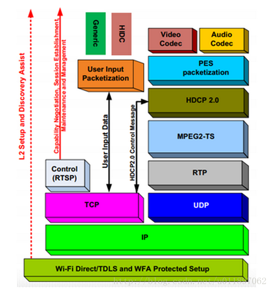  
图1 WFD涉及的技术及协议框图

## <a id="t3"></a><a id="t3"></a><a id="2_WifiDisplay_23"></a>2\. WifiDisplay协议流程

建立WifiDisplay主要步骤如下：  
1\. WFD Device Discovery（WFD设备发现）  
2\. WFD Service Discovery (Optional)（WFD服务发现（可选））  
3\. Device Selection（设备选择）  
4\. WFD Connection Setup（WFD连接）  
5\. WFD Capability Negotiation（WFD能力协商）  
6\. WFD Session Establishment（WFD会话建立）  
7\. User Input Back Channel Setup (Optional)（UIBC反向控制）  
8\. Link Content Protection Setup (Optional)（内容保护，即数据加密）  
9\. Payload Control（负载控制）  
10\. WFD Source and WFD Sink standby (Optional)  
11\. WFD Session Teardown（会话终止）  
WFD设备通过wifiP2P连接后，Sink端与Source端建立TCP连接，Sink端为Client而Source端为Server。默认端口为7236，执行的协议为RTSP协议。建立连接后进行RTSP协商。步骤6，协商成功后建立会话；步骤7，UIBC通道建立，用于Sink端反向控制Source端，该步骤为可选实现； 步骤8，对与传输的内容做加密保护（HDCP），步骤9，开始音频及视频流的传输与控制，Payload Control：传输过程中，设备可根据无线信号的强弱，甚至设备的电量状况来动态调整传输数据和格式。可调整的内容包括压缩率，视音频格式，分辨率等内容。步骤11，会话终止。  
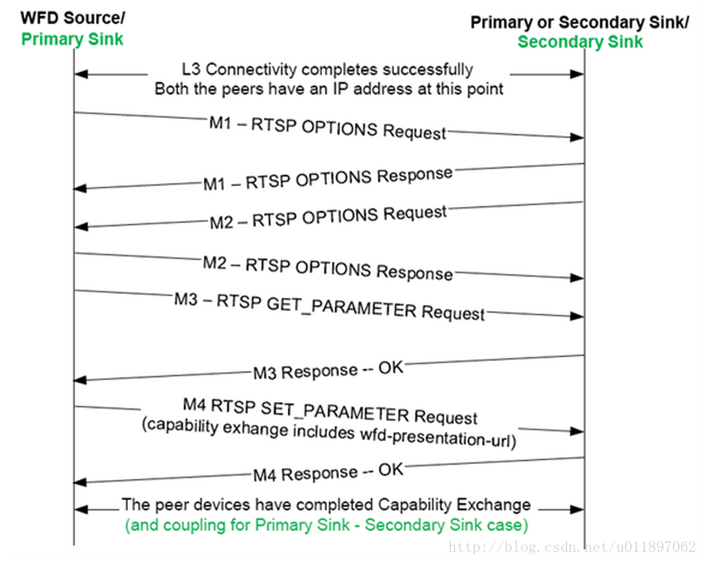

图 2 会话建立及协商过程图

RTSP M1和M2主要协商Source和Sink都支持的RTSP methods。  
RTSP M3和M4主要协商Source和Sink在会话中使用的参数。  
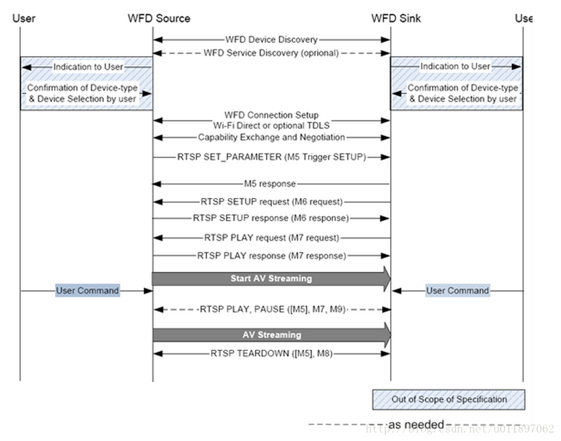  
图3 RTSP协议控制图

When an exchange of RTSP M7 request and response messages has successfully completed between the WFD Source and the WFD Sink, the WFD Session is established.  
RTSP协议控制中主要有以下几种状态SETUP、PLAY、PAUSE、TEARDOWN  
WFD Source and WFD Sink session management Reference Model  
通过下面命令抓取了WifiDisplay相关的协议包，主要是RTSP控制流相关的协议包。  
tcpdump -i any -w /savePath  
具体的协议包相关的内容如图4所示，协议中相关的流程及步骤和图1、2中的交互流程是一致的，具体包括以下几个主要步骤OPTIONS、GET\_PARAMETER、SET\_PARAMETER、 SETUP、PLAY、TEARDOWN等，这些都是RTSP中相关的协议内容。

当Source与Sink设备完成PLAY的交互后，Source端便开始传输音频及视频流给Sink端，Sink端作为被动接收端，只需要在P2P interface的19000（默认的RTP数据传输端口）绑定监听接收来自Source端的数据流对相关的音视频流做处理即可。图5给出了音视频流的协议包，可以看到音视频的传输通过MPEG TS、MPEG PES等相关协议作为传输载体。  
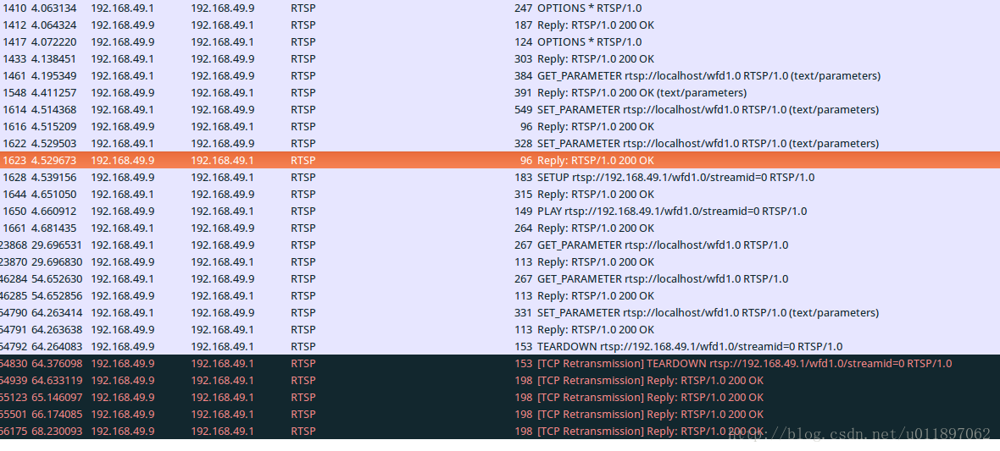  
图4 完整RTSP协商流程，协商的内容主要是视频流的控制方法及支持的音频及视频格式

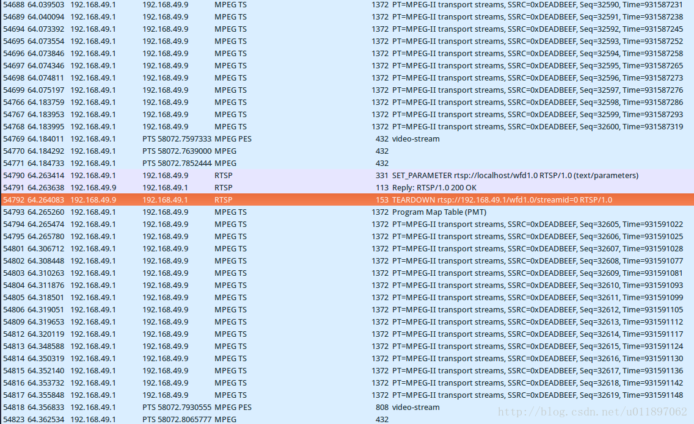  
图5 完成协商后开始传输音频及视频流，即TS包及PES包

对于WifiDisplay会话管理有以下模型可供参考，该结构大致分为四个层次， UI、 Session Policy Management、协议实现层及基于Wifi的网络传输层。在协议实现层中主要分为几个模块WFD Ddiscovery、WFD Link Establishment、 UIBC、Capability Negotiation、Session/Stream Control等。

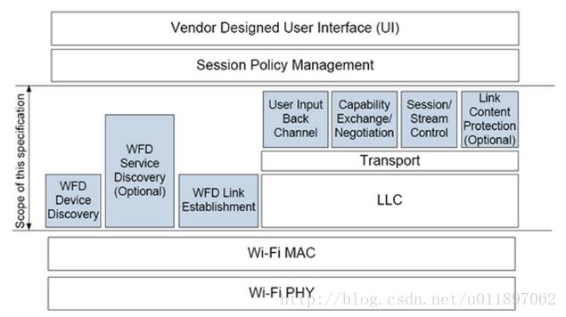

图6 WFD设备会话管理的模型

  
图7 音频及视频流控制模型

实时流协议RTSP是一个应用层协议，用于控制具有实时特性的数据（例如多媒体流）的传送。RTSP协议一般与RTP/RTCP和RSVP等底层协议一起协同工作，提供基于Internet的整套的流服务。它可以选择发送通道（例如：UDP、组播UDP和TCP）和基于RTP的发送机制。它可以应用于组播和点播。RTP, RTCP,RSVP 定义如下：  
　　1\. 实时传输协议RTP(Real-time Transport protocol)  
　　2\. 实时传输控制协议RTCP(Real-time Transport Control protocol)  
　　3\. 实时流协议RTSP(Real Time Streaming protocol)  
　　4\. 资源预留协议RSVP(Resource Reserve Protocol)  
客户端与服务器运行实时流控制协议RTSP，以对该流进行各种VCR控制信号的交换，如播放（PLAY）、停止（PAUSE）、快进、快退等。当服务完毕，客户端提出拆线（TEARDOWN）请求。服务器使用RTP/UDP协议将媒体数据传输给客户端，一旦数据抵达客户端，客户端应用程序即可播放输出。在流式传输中，使用RTP/RTCP/UDP和RTSP/TCP两种不同的通信协议在客户端和服务器间建立联系。

## <a id="t4"></a><a id="t4"></a><a id="3_WifiDisplay_77"></a>3\. WifiDisplay显示框架实现

为了实现WifiDisplay google在Android现有显示系统的基础上加入的虚拟设备的支持，下图给出了Android显示系统的架构图。  
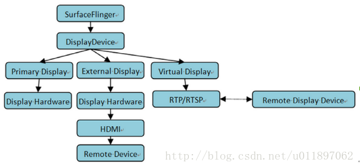  
图8 DisplayDevice的隔离示意图  
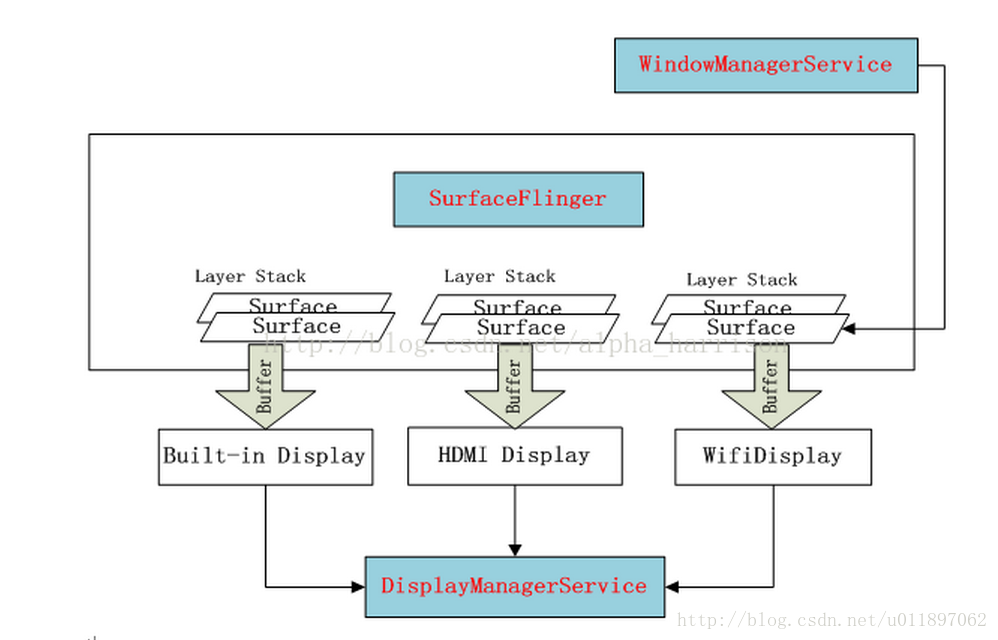  
图9 Android图层示意图

1.  WindowManagerService  
    管理窗口之间的关系。包括位置、优先级等。
2.  SurfaceFlinger  
    负责对各个Surface按照Z-order进行Merge，然后把Merge之后的Buffer显示到Display上。
3.  DisplayManagerService  
    管理在系统中加载的各个Display。包括管理各个Display的生命周期，并且对各个Display进行配置。当Display状态变化的时候向系统和应用程序发送通知。

```
void SurfaceFlinger::doComposition() {
    ATRACE_CALL();
    const bool repaintEverything = android_atomic_and(0, &mRepaintEverything);
    for (size_t dpy=0 ; dpy<mDisplays.size() ; dpy++) {
        const sp<DisplayDevice>& hw(mDisplays[dpy]);
        if (hw->isDisplayOn() && (hw->getDisplayType() != DisplayDevice::DISPLAY_EXTERNAL)) {
            
            const Region dirtyRegion(hw->getDirtyRegion(repaintEverything));
            
            doDisplayComposition(hw, dirtyRegion);
            hw->dirtyRegion.clear();
            hw->flip(hw->swapRegion);
            hw->swapRegion.clear();
        }
        
        hw->compositionComplete();
    }
    postFramebuffer();
}

```

SurfaceFlinger将遍历系统中所有的DisplayDevice来完成各自的混屏工作。  
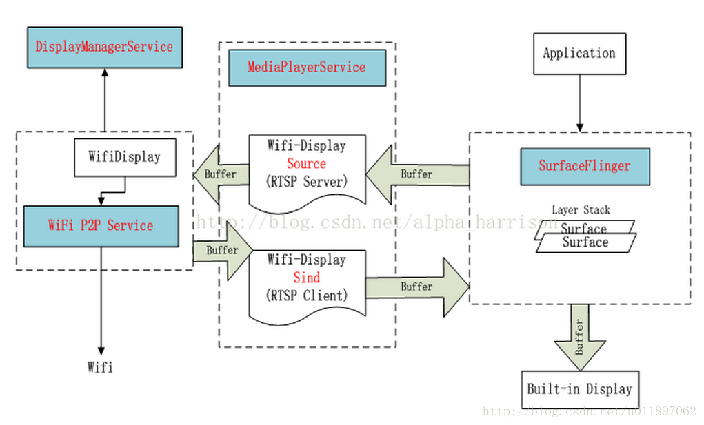  
图10 WifiDisplay显示模型  
作为Wifi-Diplay Source的设备建立RTSP Server，将SurfaceFlinger merge的Buffer数据stream到Wifi-Diplay的peer端。作为Wifi-Diplay Sink的设备是一个RTSP的Client端，从peer端读取数据，在built-in的Display上显示。

## <a id="t5"></a><a id="t5"></a><a id="4_Android_WifiDisplay_117"></a>4\. Android WifiDisplay实现

### <a id="t6"></a><a id="t6"></a><a id="41_Source_118"></a>4.1 Source端实现

基于Android6.0 代码Source端入口在原生Settings->设备->显示->投射,这个功能如果正常使用时，需要更改一个配置项。

```
<bool name="config_enableWifiDisplay">true</bool>

```

该配置项路径为  
frameworks/base/core/res/res/values/config.xml  
该入口的主要作用是扫描并发现sink设备。

#### <a id="411__128"></a>4.1.1 设备扫描及发现

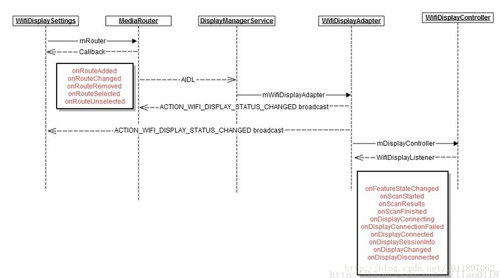  
图11 设备发现流程图  
当用户点击了optionMenu中enable wifi display选项时，会触发相关的设备扫描及更新操作，在WifiDisplaySettings和WifiDisplayController都有注册ContentObserver来监控这个值的变化。触发设备扫描的是在WifiDisplayController中通过updateWfdEnableState()进行的，最终通过WifiP2pManager.requestPeers来完成设备的扫描工作，获取扫描到的设备列表是在WifiDisplaySettings通过update(int changes)进行的。对于设备连接状态的管理主要通过updateConnection()来进行。由于设备的连接过程是一个异步过程，所以在设备操作相关的过程中会反复调用updateConnection() 来判定设备状态及更新连接操作。  
设备列表更新及管理通过下面函数update实现

```
private void update(int changes) {
    boolean invalidateOptions = false;
    
    if ((changes & CHANGE_SETTINGS) != 0) {
        mWifiDisplayOnSetting = Settings.Global.getInt(getContentResolver(),
                Settings.Global.WIFI_DISPLAY_ON, 0) != 0;
        mWifiDisplayCertificationOn = Settings.Global.getInt(getContentResolver(),
                Settings.Global.WIFI_DISPLAY_CERTIFICATION_ON, 0) != 0;
        mWpsConfig = Settings.Global.getInt(getContentResolver(),
            Settings.Global.WIFI_DISPLAY_WPS_CONFIG, WpsInfo.INVALID);
        
        invalidateOptions = true;
    }
    
    if ((changes & CHANGE_WIFI_DISPLAY_STATUS) != 0) {
        mWifiDisplayStatus = mDisplayManager.getWifiDisplayStatus();
        
        invalidateOptions = true;
    }
    
    final PreferenceScreen preferenceScreen = getPreferenceScreen();
    preferenceScreen.removeAll();
    
    final int routeCount = mRouter.getRouteCount();
    for (int i = 0; i < routeCount; i++) {
        MediaRouter.RouteInfo route = mRouter.getRouteAt(i);
        if (route.matchesTypes(MediaRouter.ROUTE_TYPE_REMOTE_DISPLAY)) {
            preferenceScreen.addPreference(createRoutePreference(route));
        }
    }
    
    if (mWifiDisplayStatus != null
            && mWifiDisplayStatus.getFeatureState() == WifiDisplayStatus.FEATURE_STATE_ON) {
        
        for (WifiDisplay display : mWifiDisplayStatus.getDisplays()) {
            if (!display.isRemembered() && display.isAvailable()
                    && !display.equals(mWifiDisplayStatus.getActiveDisplay())) {
                preferenceScreen.addPreference(new UnpairedWifiDisplayPreference(
                        getActivity(), display));
            }
        }
        
        if (mWifiDisplayCertificationOn) {
            buildCertificationMenu(preferenceScreen);
        }
    }
    
    if (invalidateOptions) {
        getActivity().invalidateOptionsMenu();
    }
}

```

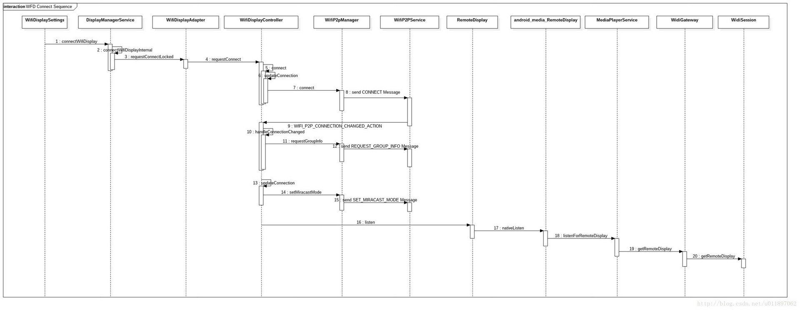  
图12 Source端 RTSP连接流程图  
下图是Source端设备建立连接的流程图，主要建立RSTP协议的Socket连接，通过接收Sink端的协议信息解析相关操作，代码流程如下图所示。  
socket的建立主要在WidiSourceRtsp.cpp的prepareListenSocket函数中实现，并在这个socket上监听是否有客户端的连接请求, rtsp消息处理在cbHandleParserEvent中处理。  
在WidiSession.cpp中RSTP及media event处理主要通过WorkHandler处理，相关消息处理在函数onMessageReceived中处理。

## <a id="t7"></a><a id="t7"></a><a id="42_Sink_192"></a>4.2 Sink端的实现

图13 给出了sink端的实现框架图，从框架图可以看出APP主要和Sink API交互，Sink API和框架服务中的Wifi server 及 mediaserver交互，APP通过Control interface进行WFD相关的控制操作，底层状态的接收则通过Events interface,也就是一些相关的回调方法来处。  
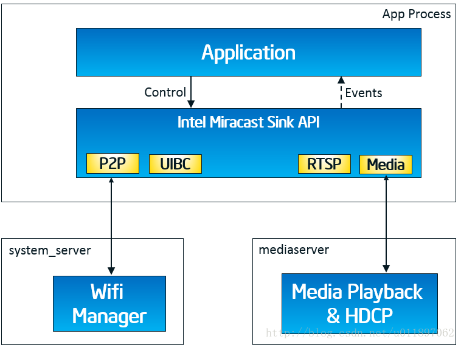  
图13 Sink端 实现框架结构图  
  
图 14 RTSP会话流程图  
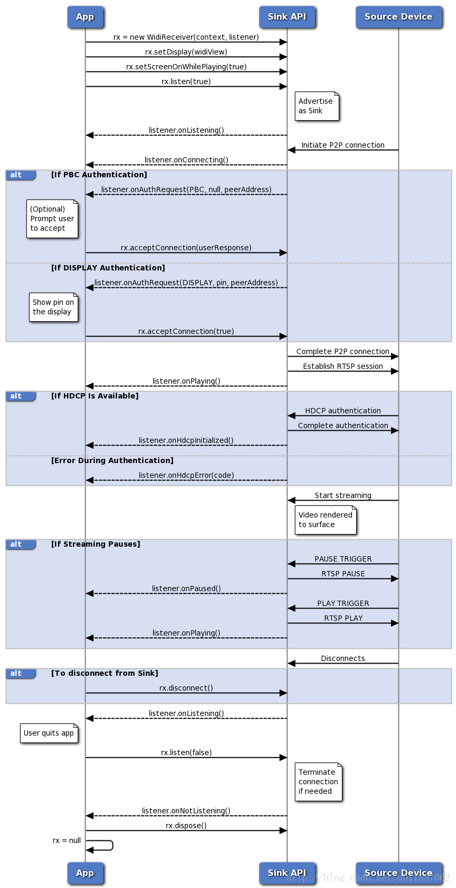  
图15 WFD控制流程图

图14给出了Intel实现的sink端的RTSP会话管理流程图，RTSP的协议实现主要通过C++实现，对于协商后相关的状态反馈通过回调函数完成，如果想进一步了解相关的流程，请查看相关的代码。

图15 给出了WFD会话管理的流程图，WFD中除了RTSP的实现，还包括连接认证（Connection Auth）、视频流加密及解密(HDCP)、UIBC实现等。

### 4.2.1 设备如何被发现

1.  init P2P channel

```
mP2pManager = (WifiP2pManager) context.getSystemService(Context.WIFI_P2P_SERVICE);
Looper looper = mHandlerThread.getLooper();
if (mP2pManager == null || looper == null) {
    throw new NullPointerException("Failed to get P2P_SERVICE or widi_receiver thread looper");
}
mChannel = mP2pManager.initialize(context, looper, mChannelListener);

```

2.  advertise Sink

```
WifiP2pWfdInfo wfdInfo = new WifiP2pWfdInfo();
wfdInfo.setWfdEnabled(true);
wfdInfo.setDeviceType(WifiP2pWfdInfo.PRIMARY_SINK);
wfdInfo.setSessionAvailable(true);
wfdInfo.setControlPort(7236);
wfdInfo.setMaxThroughput(50);
Log.d(TAG,"advertise sink");
mP2pManager.setWFDInfo(mChannel, wfdInfo, mActionListener);
mHandler.post(mDiscoverPeers);
mCallbackHandler.post(mSendEnabled);
discover peers

    public void run() {
        mP2pManager.discoverPeers(mChannel, mActionListener);
        mHandler.postDelayed(this, DISCOVER_INTERVAL_MS);
    }

```

经过这三个阶段的工作，其他设备就可以发现这台设备了

### 4.2.2 设备p2p连接后如何建立RTSP连接

P2P连接上之后可以从相关Intent中获取到Source端传递过来的建立RTSP连接的ip和端口，Sink端根据这些信息主动去连接。

```
else if (netInfo.getState() == NetworkInfo.State.CONNECTED) {
    if (mRtsp != null) {
        Log.i(TAG, "Ignoring extra CONNECTED event");
        return;
    }
    WifiP2pInfo p2pInfo = intent.getParcelableExtra(WifiP2pManager.EXTRA_WIFI_P2P_INFO);
    if (p2pInfo == null) {
        Log.i(TAG, "WIFI_P2P_INFO is not available");
        return;
    }
    if (p2pInfo.groupFormed) {
        mHandler.removeCallbacks(mDiscoverPeers);
        WifiP2pGroup group = intent.getParcelableExtra(WifiP2pManager.EXTRA_WIFI_P2P_GROUP);
        if (group == null) {
            Log.i(TAG, "WIFI_P2P_GROUP is not availble");
            return;
        }
        mP2pInterface = group.getInterface();
        mSourceRtspPort = 7236;
        if (p2pInfo.isGroupOwner) {
            Collection<WifiP2pDevice> devices = group.getClientList();
            if (devices != null) {
                if (devices.isEmpty())
                    Log.i(TAG, "Device list empty!");
                else {
                    for (WifiP2pDevice device : devices) {
                        if (sReflectionInited) {
                            
                            
                            try {
                                mSourceMacAddress = (String) sIfAddr.get(device);
                            } catch (Exception e) {
                                Log.e(TAG, "Failed to get interfaceAddress field"
                                        + " by reflection: " + e);
                            }
                        } else
                            Log.e(TAG, "Reflection not initialiazed,"
                                    + "can't get interfaceAddress content");
                        if (device.wfdInfo != null) {
                            mSourceRtspPort = device.wfdInfo.getControlPort();
                            Log.i(TAG, "mSourceRtspPort obtained is " + mSourceRtspPort);
                        }
                        else
                            Log.i(TAG, "Using default RTSP Port=" + mSourceRtspPort);
                    }
                }
            }
 }
        else {
            mSourceIp = p2pInfo.groupOwnerAddress.getHostAddress();
            if (group.getOwner().wfdInfo != null) {
                mSourceRtspPort = group.getOwner().wfdInfo.getControlPort();
                Log.i(TAG, "mSourceRtspPort obtained is " + mSourceRtspPort);
            }
            else
                Log.i(TAG, "Using default RTSP Port=" + mSourceRtspPort);
        }
        if (mSourceIp != null && mSourceRtspPort > 0 && mSourceRtspPort <= 65535) {
            mHandler.post(new ConnectRtsp(mSourceIp, mSourceRtspPort));
        }
    }
}
 }

```

### 4.2.3 RTSP连接实现

执行完下面的代码后，RTSP连接就建立起来了，相关的视频流通过mediaplay来完成处理。

```
public void run() {
        Log.i(TAG, "Connect RTSP " + sourceIp + "/" + sourceRtspPort);
        mConnectorTypeRequested = false;
        mDisplayManager.registerDisplayListener(mDisplayListener, null);
        try {
            Log.d(TAG,"media reset begin");
            mMediaPlayer.reset();
            Log.d(TAG,"media reset over");
            mMediaPlayer.setDataSource("intel_rtp://" + mP2pInterface + ":" + RTP_LISTEN_PORT);
            mMediaPlayer.prepare();
        } catch (Exception e) {
            Log.e(TAG, "Exception trying to play media", e);
        }
        mSourceIp = sourceIp;
        mRtsp = new WidiSinkRtsp();
        if (mRtsp.init(sourceIp + ":" + sourceRtspPort, mSinkListener) == 0)
            mRtsp.start();
    }
}

```