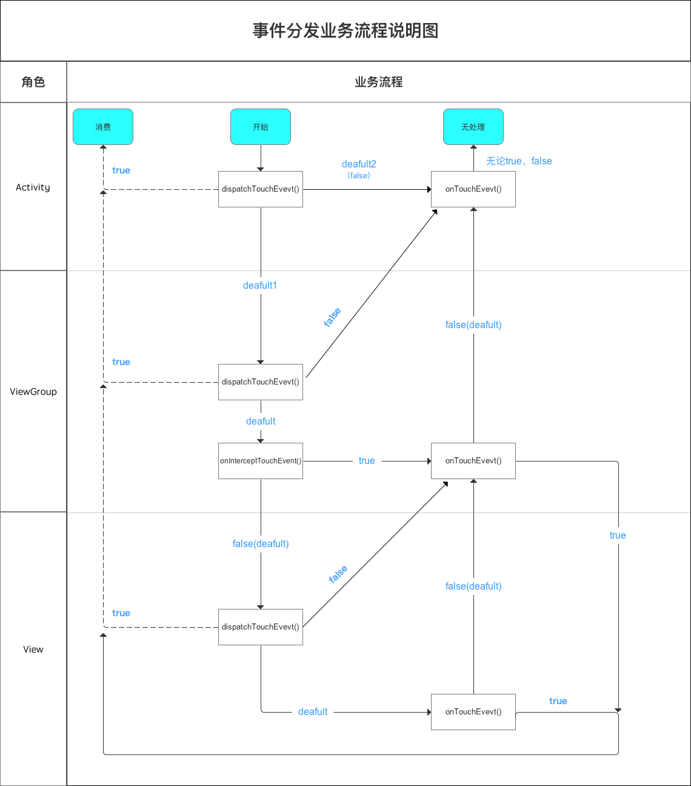

点击事件分发

Activity -> ViewGroup -> View

Activity (dispatchTouchEvent)()
     默认会调用 ViewGroup.dispatchTouchEvent
         默认调用ViewGroup.onInterceptTouchEvent
             return false, 调用 View.dispatchTouchEvent
                 默认调用 View.OnTouchEvent
                     return false 调用ViewGroup.onTouchEvent
                     return true  依次返回
             return true, 调用ViewGroup.OnTouchEvent
                 return true 依次返回
                 return false 调用Activity.OnTouchEvent

         return false 调用Activity.OnTouchEvent
             return true 结束
             return false 结束

         return true 依次返回
     return false 结束
     return true 结束

所有return true 都会依次返回，无上层返回则结束

dipatchTouchEvent
    默认    Activity 会调用ViewGroup.dispatchTouchEvent
            ViewGroup 会调用onInterceptTouchEvent
            View 会调用onTouchEvent

    true    依次返回

    false   交给上层onTouchEvent处理 没有则结束

onInterceptTouchEvent
    默认、false        View.disptachTouchEvent
    true            ViewGroup.onTouchEvent

onTouchEvent
    false     调用上层的onTouchEvent
    true    依次返回

左侧虚线：具备相关性 & 逐层返回

可参考：https://blog.csdn.net/carson_ho/article/details/54136311