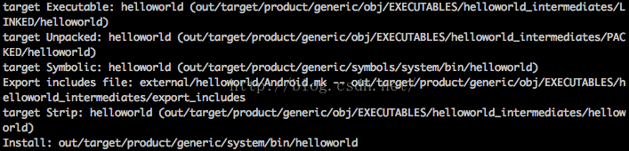

Android源码树中C代码的编译_ZChongr-CSDN博客

侯 Sir说：“源码之下，了无秘密。” 但有些秘密还是要搞起来了看得更真切，仅从静态代码的体位很难体会到运动时的妙处。因此环境搭好了，下一步就是调试。gdbserver搭配gdb的调试环境走得很顺利，可是mmm出的C代码总是没有debugging symbol。在调研原因的过程中倒是熟悉了一些工具的用法，值得记录。

首先，关于mmm的代码，它是写在build/envsetup.sh中的函数，内部是对make的简单封装：指定要编译的模块，该函数会进入Android源码根目录，将指定模块的.mk文件传给make进行编译、链接。网上有对它的详细分析。

期初，我创建了external/helloworld，并在其下放了helloworld.c和Android.mk，执行

```
$ mmm external/helloworld
$ make snod
```

把生成的helloworld可执行文件打包到emulator的/system/bin里。当dbg提示(no debugging symbols found)，我的第一反应是应该修改Android.mk文件，添加-g编译参数：

```
LOCAL_PATH := $(call my-dir)
include $(CLEAR_VARS)
LOCAL_MODULE_TAGS := optional
LOCAL_MODULE := helloworld
<strong><span style="color:#ff0000;">LOCAL_CFLAGS += -g -O0</span></strong>
LOCAL_SRC_FILES := $(call all-subdir-c-files)
include $(BUILD_EXECUTABLE)
```

可是没有任何效果，gdb还是那么提示。我怀疑是gdb的版本不匹配，我是用的是Mac平台，gdb是这么用的：

```
$ ./prebuilts/gcc/darwin-x86/arm/arm-linux-androideabi-4.9/bin/arm-linux-androideabi-gdb
(gdb) file out/target/product/generic/system/bin/helloworld
Reading symbols from out/target/product/generic/system/bin/helloworld...(no debugging symbols found)...done.
```

怎么验证helloworld中是否存在调试符号表呢？能干这事的工具还挺多，我用了三个：

*   objdump工具，它可以用来反汇编binary文件，加参数-t显示symbol table：

```
$ ./prebuilts/gcc/darwin-x86/x86/x86_64-linux-android-4.9/bin/x86_64-linux-android-objdump -t out/target/product/generic/system/bin/helloworld
```

  

*   nm工具，它可以列出目标文件中的各种符号：

```
$ ./prebuilts/gcc/darwin-x86/arm/arm-linux-androideabi-4.9/bin/arm-linux-androideabi-nm  out/target/product/generic/system/bin/helloworld
```

  

*   readelf工具，它可以解析elf格式的文件：

```
$ ./prebuilts/gcc/darwin-x86/arm/arm-linux-androideabi-4.9/bin/arm-linux-androideabi-readelf -a out/target/product/generic/system/bin/helloworld
```

Linux下的工具真是好强大，而且在prebuilts/gcc下面都有对应的版本。不过这些强大的工具一致表明刚刚make出来的binary确实没有调试信息！

我又怀疑到自己的编译环境，难道是我的cc工具有问题？在.mk文件下添加如下输出，看$(CC)是啥：

```
LOCAL_PATH := $(call my-dir)
include $(CLEAR_VARS)
<strong><span style="color:#ff0000;">$(warning $(CC))</span></strong>
LOCAL_MODULE_TAGS := optional
LOCAL_MODULE := helloworld
LOCAL_CFLAGS += -O2 -fno-inline
LOCAL_SRC_FILES := $(call all-subdir-c-files)
include $(BUILD_EXECUTABLE)
```

输出的结果就是cc，再使用cc -g helloworld.c看生成的a.out文件是有调试信息的！

网上不少文章都提到不要在LOCAL_CFLAGS中加入优化/调试级别的参数：

```
Try not to change the optimization/debugging level in your Android.mk, this can be handled automatically for you by specifying the appropriate information in your Application.mk, and will let the NDK generate useful data files used during debugging.
```

这让我更加疑惑，这种纯C文件没有Application.mk怎么办呢？

晚上跟宋大侠一起review过程的时候，大侠关注到mmm最后有这么一段文字：

  

原来犯了个弱智错误，mmm说得很清楚：它同时生成了多个版本的helloworld，其中有原始版本，也有被阉割掉调试信息的strip版本，那么用于打包到system.img中的是不是阉割版？

赶快挨个验明正身：

```
$ ./prebuilts/gcc/darwin-x86/arm/arm-linux-androideabi-4.9/bin/arm-linux-androideabi-nm out/target/product/generic/obj/EXECUTABLES/helloworld_intermediates/LINKED/helloworld

00003e90 d _DYNAMIC
00003fc8 d _GLOBAL_OFFSET_TABLE_
00000df8 t _Unwind_Complete
00000eac t _Unwind_DeleteException
00000e74 t _Unwind_GetLanguageSpecificData
00000e90 t _Unwind_GetRegionStart
00000c88 t _Unwind_RaiseException
00000dfc t _Unwind_Resume
000009c0 t _Unwind_VRS_Get
............
```

果然是这样。所以不建议在LOCAL_CFLAGS中指定优化/调试等级。