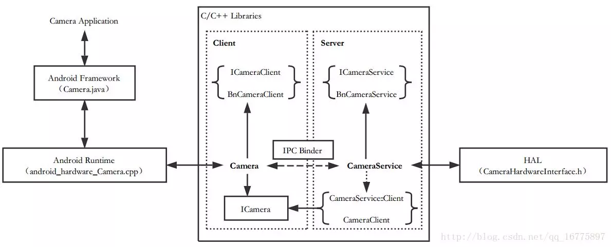

Android Camera 流程学习记录（一）—— Camera 基本架构 - 天王盖地虎626的个人空间 - OSCHINA

Camera 架构  
NOTE：这是 Android Camera API 1 的相关架构。  
Camera 的架构与 Android 整体架构是保持一致的：   
Framework ： Camera.java  
Android Runtime : android\_hardware\_Camera.cpp  
Library :   
Client (Camera.cpp, ICameraClient.cpp, etc...)  
Server (CameraService.cpp, ICameraService.cpp, etc...)  
HAL : CameraHardwareInterface.h  
以上是 Camera 与 Android 架构对层次的相关信息。  
架构简图

\- NOTE：由于 HAL 层之后的 Device Drivers 部分比较复杂，还需要一段时间去慢慢学习，所以目前先忽略这一部分的内容。

相关文件位置（Android 7.1 源码）  
Application：（这部分不是学习的重点）   
packages/apps/Camera2/src/com/android/camera/***  
Framework：   
/frameworks/base/core/java/android/hardware/Camera.java  
Android Runtime：   
frameworks/base/core/jni/android\_hardware\_Camera.cpp  
C/C++ Libraries：   
Client：   
frameworks/av/camera/CameraBase.cpp  
frameworks/av/camera/Camera.cpp  
frameworks/av/camera/ICamera.cpp  
frameworks/av/camera/aidl/android/hardware/ICamera.aidl  
frameworks/av/camera/aidl/android/hardware/ICameraClient.aidl  
Server：   
frameworks/av/camera/cameraserver/main_cameraserver.cpp  
frameworks/av/services/camera/libcameraservice/CameraService.cpp  
frameworks/av/services/camera/libcameraservice/api1/CameraClient.cpp  
frameworks/av/camera/aidl/android/hardware/ICameraService.aidl  
HAL：   
HAL 1：   
frameworks/av/services/camera/libcameraservice/device1/CameraHardwareInterface.h  
HAL 3：(主要学习了 HAL 1 的机制，HAL 3 以后再补充）   
frameworks/av/services/camera/libcameraservice/device3/***  
小结  
紧接着上一篇关于 Android 基本架构的介绍，先对 Camera 的架构有一个初步的印象。  
根据架构简图可以看到，实际上 Camera 的架构与 Android 架构是一一对应的，上层应用调用 Camera 相关的方法后，指令依次通过框架层、运行时环境、本地库、硬件抽象层，最终到达具体设备。设备执行动作后，获得的数据又会沿着反方向依次发送到最上层。  
需要注意的是，在本地库这一层中，涉及到一个 C/S 结构：   
即通过客户端与服务端的交互来传递指令与数据。  
实际上，只有服务端与 HAL 层进行沟通。  
由于客户端与服务端是不同的进程，它们之间需要依靠 IPC Binder 机制 来进行通讯。（Binder 机制在参考书1中有详细的分析）  
————————————————