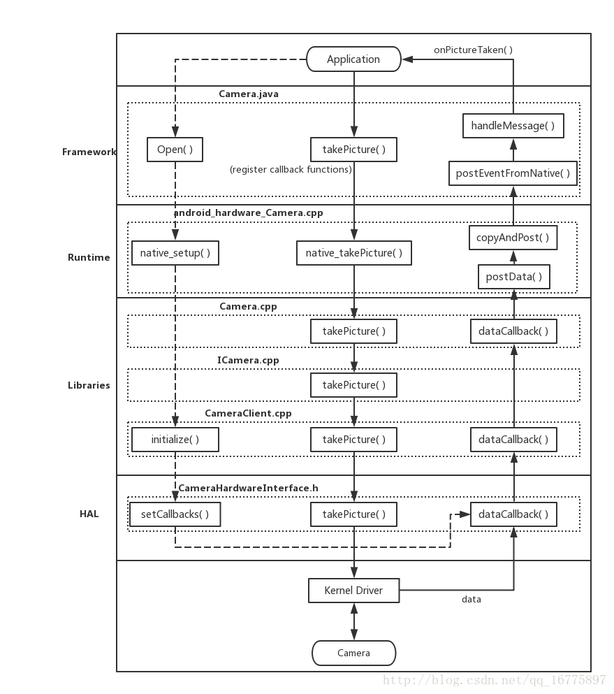

Android Camera 流程学习记录（五，完结）—— Camera.takePicture() 流程解析 - 天王盖地虎626的个人空间 - OSCHINA

https://my.oschina.net/u/920274/blog/3136189
简介  
在前面的几篇笔记中，我已经把 Camera 控制流的部分梳理得比较清楚了。在 Camera 流程中，还有一个重要的部分，即数据流。  
Camera API 1 中，数据流主要是通过函数回调的方式，依照从下往上的方向，逐层 return 到 Applications 中。  
由于数据流的部分相对来说比较简单，所以我就将其与 Camera 的控制流结合起来，从 takePicture() 方法切入，追踪一个比较完整的 Camera 流程，这个系列的笔记到这篇也就可以结束了。  
takePicture() flow  
1\. Open 流程  
Camera Open 的流程，在之前的一篇笔记中已经比较详细地描述了。  
在这里，再关注一下这个流程中，HAL 层的部分。  
1.1 CameraHardwareInterface.h  
位置：frameworks/av/services/camera/libcameraservice/device1/CameraHardwareInterface.h  
setCallback()：   
设置 notify 回调，这用来通知数据已经更新。  
设置 data 回调以及 dataTimestamp 回调，对应的是函数指针 mDataCb 与 mDataCvTimestamp 。  
注意到，设置 mDevice->ops 对应回调函数时，传入的不是之前设置的函数指针，而是 \_\_data\_cb 这样的函数。在该文件中，实现了 \_\_data\_cb ，将回调函数做了一层封装。 
```
/\*\* Set the notification and data callbacks */  
void setCallbacks(notify\_callback notify\_cb,  
                  data\_callback data\_cb,  
                  data\_callback\_timestamp data\_cb\_timestamp,  
                  void* user)  
{  
    mNotifyCb = notify_cb;  
    mDataCb = data_cb;  
    mDataCbTimestamp = data\_cb\_timestamp;  
    mCbUser = user;

    ALOGV("%s(%s)", \_\_FUNCTION\_\_, mName.string());

    if (mDevice->ops->set_callbacks) {  
        mDevice->ops->set_callbacks(mDevice,  
                               \_\_notify\_cb,  
                               \_\_data\_cb,  
                               \_\_data\_cb_timestamp,  
                               \_\_get\_memory,  
                               this);  
    }  
}

\_\_data\_cb()：   
对原 callback 函数简单封装，附加了一个防止数组越界判断。  
static void \_\_data\_cb(int32\_t msg\_type,  
                      const camera\_memory\_t *data, unsigned int index,  
                      camera\_frame\_metadata_t *metadata,  
                      void *user)  
{  
    ALOGV("%s", \_\_FUNCTION\_\_);  
    CameraHardwareInterface *__this =  
            static_cast&lt;CameraHardwareInterface *&gt;(user);  
    sp&lt;CameraHeapMemory&gt; mem(static_cast&lt;CameraHeapMemory *&gt;(data->handle));  
    if (index >= mem->mNumBufs) {  
        ALOGE("%s: invalid buffer index %d, max allowed is %d", \_\_FUNCTION\_\_,  
             index, mem->mNumBufs);  
        return;  
    }  
    \_\_this->mDataCb(msg\_type, mem->mBuffers\[index\], metadata, __this->mCbUser);  
}
```
2\. 控制流  
2.1 Framework  
2.1.1 Camera.java  
位置：frameworks/base/core/java/android/hardware/Camera.java  
takePicture()：   
设置快门回调。  
设置各种类型的图片数据回调。  
调用 JNI takePicture 方法。  
注意，传入的参数 msgType 是根据相应 CallBack 是否存在而确定的，每种 Callback 应该对应一个二进制中的数位（如 1，10，100 中 1 的位置），于是这里采用 |= 操作给它赋值。
```
public final void takePicture(ShutterCallback shutter, PictureCallback raw,  
        PictureCallback postview, PictureCallback jpeg) {  
    mShutterCallback = shutter;  
    mRawImageCallback = raw;  
    mPostviewCallback = postview;  
    mJpegCallback = jpeg;

    // If callback is not set, do not send me callbacks.  
    int msgType = 0;  
    if (mShutterCallback != null) {  
        msgType |= CAMERA\_MSG\_SHUTTER;  
    }  
    if (mRawImageCallback != null) {  
        msgType |= CAMERA\_MSG\_RAW_IMAGE;  
    }  
    if (mPostviewCallback != null) {  
        msgType |= CAMERA\_MSG\_POSTVIEW_FRAME;  
    }  
    if (mJpegCallback != null) {  
        msgType |= CAMERA\_MSG\_COMPRESSED_IMAGE;  
    }

    native_takePicture(msgType);  
    mFaceDetectionRunning = false;  
}
```
2.2 Android Runtime  
2.2.1 android\_hardware\_Camera.cpp  
位置：frameworks/base/core/jni/android\_hardware\_Camera.cpp   
takePicture()：  
获取已经打开的 camera 实例，调用其 takePicture() 接口。  
注意，在这个函数中，对于 RAW_IMAGE 有一些附加操作：   
如果设置了 RAW 的 callback ，则要检查上下文中，是否能找到对应 Buffer。  
若无法找到 Buffer ，则将 CAMERA\_MSG\_RAW\_IMAGE 的信息去掉，换成 CAMERA\_MSG\_RAW\_IMAGE_NOTIFY。  
替换后，就只会获得 notification 的消息，而没有对应的图像数据。
```
static void android\_hardware\_Camera_takePicture(JNIEnv *env, jobject thiz, jint msgType)  
{  
    ALOGV("takePicture");  
    JNICameraContext* context;  
    sp&lt;Camera&gt; camera = get\_native\_camera(env, thiz, &context);  
    if (camera == 0) return;

    /*  
     \* When CAMERA\_MSG\_RAW_IMAGE is requested, if the raw image callback  
     \* buffer is available, CAMERA\_MSG\_RAW_IMAGE is enabled to get the  
     \* notification \_and\_ the data; otherwise, CAMERA\_MSG\_RAW\_IMAGE\_NOTIFY  
     \* is enabled to receive the callback notification but no data.  
     *  
     \* Note that CAMERA\_MSG\_RAW\_IMAGE\_NOTIFY is not exposed to the  
     \* Java application.  
     */  
    if (msgType & CAMERA\_MSG\_RAW_IMAGE) {  
        ALOGV("Enable raw image callback buffer");  
        if (!context->isRawImageCallbackBufferAvailable()) {  
            ALOGV("Enable raw image notification, since no callback buffer exists");  
            msgType &= ~CAMERA\_MSG\_RAW_IMAGE;  
            msgType |= CAMERA\_MSG\_RAW\_IMAGE\_NOTIFY;  
        }  
    }

    if (camera->takePicture(msgType) != NO_ERROR) {  
        jniThrowRuntimeException(env, "takePicture failed");  
        return;  
    }  
}
```
2.3 C/C++ Libraries  
2.3.1 Camera.cpp  
位置：frameworks/av/camera/Camera.cpp  
takePicture()：   
获取一个 ICamera，调用其 takePicture 接口。  
这里直接用 return 的方式调用，比较简单。  
```
// take a picture  
status_t Camera::takePicture(int msgType)  
{  
    ALOGV("takePicture: 0x%x", msgType);  
    sp &lt;::android::hardware::ICamera&gt; c = mCamera;  
    if (c == 0) return NO_INIT;  
    return c->takePicture(msgType);  
}
```
2.3.2 ICamera.cpp  
位置：frameworks/av/camera/ICamera.cpp  
takePicture()：   
利用 Binder 机制发送相应指令到服务端。  
实际调用到的是 CameraClient::takePicture() 函数。  
```
// take a picture - returns an IMemory (ref-counted mmap)  
status_t takePicture(int msgType)  
{  
    ALOGV("takePicture: 0x%x", msgType);  
    Parcel data, reply;  
    data.writeInterfaceToken(ICamera::getInterfaceDescriptor());  
    data.writeInt32(msgType);  
    remote()->transact(TAKE_PICTURE, data, &reply);  
    status_t ret = reply.readInt32();  
    return ret;  
}
```
2.3.3 CameraClient.cpp  
位置：frameworks/av/services/camera/libcameraservice/api1/CameraClient.cpp  
takePicture()：   
注意，CAMERA\_MSG\_RAW\_IMAGE 指令与 CAMERA\_MSG\_RAW\_IMAGE_NOTIFY 指令不能同时有效，需要进行对应的检查。  
对传入的指令过滤，只留下与 takePicture() 操作相关的。  
调用 CameraHardwareInterface 中的 takePicture() 接口。  
```
// take a picture - image is returned in callback  
status_t CameraClient::takePicture(int msgType) {  
    LOG1("takePicture (pid %d): 0x%x", getCallingPid(), msgType);

    Mutex::Autolock lock(mLock);  
    status_t result = checkPidAndHardware();  
    if (result != NO_ERROR) return result;

    if ((msgType & CAMERA\_MSG\_RAW_IMAGE) &&  
        (msgType & CAMERA\_MSG\_RAW\_IMAGE\_NOTIFY)) {  
        ALOGE("CAMERA\_MSG\_RAW\_IMAGE and CAMERA\_MSG\_RAW\_IMAGE_NOTIFY"  
                " cannot be both enabled");  
        return BAD_VALUE;  
    }

    // We only accept picture related message types  
    // and ignore other types of messages for takePicture().  
    int picMsgType = msgType  
                        & (CAMERA\_MSG\_SHUTTER |  
                           CAMERA\_MSG\_POSTVIEW_FRAME |  
                           CAMERA\_MSG\_RAW_IMAGE |  
                           CAMERA\_MSG\_RAW\_IMAGE\_NOTIFY |  
                           CAMERA\_MSG\_COMPRESSED_IMAGE);

    enableMsgType(picMsgType);

    return mHardware->takePicture();  
}
```
2.4 HAL  
2.4.1 CameraHardwareInterface.h  
位置：frameworks/av/services/camera/libcameraservice/device1/CameraHardwareInterface.h  
takePicture()：   
通过 mDevice 中设置的函数指针，调用 HAL 层中具体平台对应的 takePicture 操作的实现逻辑。  
接下来就是与具体的平台相关的流程了，这部分内容对我并非主要，而且在上一篇笔记中已经有比较深入的探索，所以在这里就不继续向下挖掘了。  
控制流程到了 HAL 层后，再向 Linux Drivers 发送控制指令，从而使具体的 Camera 设备执行指令，并获取数据。  
```
/**  
 \* Take a picture.  
 */  
status_t takePicture()  
{  
    ALOGV("%s(%s)", \_\_FUNCTION\_\_, mName.string());  
    if (mDevice->ops->take_picture)  
        return mDevice->ops->take_picture(mDevice);  
    return INVALID_OPERATION;  
}
```
3. 数据流  
由于数据流是通过 callback 函数实现的，所以探究其流程的时候我是从底层向上层进行分析的。  
3.1 HAL  
3.1.1 CameraHardwareInterface.h  
位置：frameworks/av/services/camera/libcameraservice/device1/CameraHardwareInterface.h  
这里我们只选择 dataCallback 相关流程进行分析。  
\_\_data\_cb()：   
该回调函数是在同文件中实现的 setCallbacks() 函数中设置的。  
Camera 设备获得数据后，就会往上传输，在 HAL 层中会调用到这个回调函数。  
通过函数指针 mDataCb 调用从上一层传入的回调，从而将数据上传。  
这个 mDataCb 指针对应的，是 CameraClient 类中实现的 dataCallback()。  
```
static void \_\_data\_cb(int32\_t msg\_type,  
                      const camera\_memory\_t *data, unsigned int index,  
                      camera\_frame\_metadata_t *metadata,  
                      void *user)  
{  
    ALOGV("%s", \_\_FUNCTION\_\_);  
    CameraHardwareInterface *__this =  
            static_cast&lt;CameraHardwareInterface *&gt;(user);  
    sp&lt;CameraHeapMemory&gt; mem(static_cast&lt;CameraHeapMemory *&gt;(data->handle));  
    if (index >= mem->mNumBufs) {  
        ALOGE("%s: invalid buffer index %d, max allowed is %d", \_\_FUNCTION\_\_,  
             index, mem->mNumBufs);  
        return;  
    }  
    \_\_this->mDataCb(msg\_type, mem->mBuffers\[index\], metadata, __this->mCbUser);  
}
```
3.2 C/C++ Libraries  
3.2.1 CameraClient.cpp  
位置：frameworks/av/services/camera/libcameraservice/api1/CameraClient.cpp  
dataCallback()：   
这个回调在该文件实现的 initialize() 函数中设置到 CameraHardwareInterface 中。  
启动这个回调后，就从 Cookie 中获取已连接的客户端。  
根据 msgType，启动对应的 handle 操作。  
选择其中一个分支的 handle 函数来看。  
```
void CameraClient::dataCallback(int32_t msgType,  
        const sp&lt;IMemory&gt;& dataPtr, camera\_frame\_metadata_t \*metadata, void\* user) {  
    LOG2("dataCallback(%d)", msgType);

    sp&lt;CameraClient&gt; client = static_cast&lt;CameraClient*&gt;(getClientFromCookie(user).get());  
    if (client.get() == nullptr) return;

    if (!client->lockIfMessageWanted(msgType)) return;  
    if (dataPtr == 0 && metadata == NULL) {  
        ALOGE("Null data returned in data callback");  
        client->handleGenericNotify(CAMERA\_MSG\_ERROR, UNKNOWN_ERROR, 0);  
        return;  
    }

    switch (msgType & ~CAMERA\_MSG\_PREVIEW_METADATA) {  
        case CAMERA\_MSG\_PREVIEW_FRAME:  
            client->handlePreviewData(msgType, dataPtr, metadata);  
            break;  
        case CAMERA\_MSG\_POSTVIEW_FRAME:  
            client->handlePostview(dataPtr);  
            break;  
        case CAMERA\_MSG\_RAW_IMAGE:  
            client->handleRawPicture(dataPtr);  
            break;  
        case CAMERA\_MSG\_COMPRESSED_IMAGE:  
            client->handleCompressedPicture(dataPtr);  
            break;  
        default:  
            client->handleGenericData(msgType, dataPtr, metadata);  
            break;  
    }  
}
```
handleRawPicture()：   
在 open 流程中，connect() 函数调用时，mRemoteCallback 已经设置为一个客户端实例，其对应的是 ICameraClient 的强指针。  
通过这个实例，这里基于 Binder 机制来启动客户端的 dataCallback。  
客户端的 dataCallback 是实现在 Camera 类中。  
```
// picture callback - raw image ready  
void CameraClient::handleRawPicture(const sp&lt;IMemory&gt;& mem) {  
    disableMsgType(CAMERA\_MSG\_RAW_IMAGE);

    ssize_t offset;  
    size_t size;  
    sp&lt;IMemoryHeap&gt; heap = mem->getMemory(&offset, &size);

    sp&lt;hardware::ICameraClient&gt; c = mRemoteCallback;  
    mLock.unlock();  
    if (c != 0) {  
        c->dataCallback(CAMERA\_MSG\_RAW_IMAGE, mem, NULL);  
    }  
}
```
3.2.2 Camera.cpp  
位置：frameworks/av/camera/Camera.cpp  
dataCallback()：   
调用 CameraListener 的 postData 接口，将数据继续向上传输。  
postData 接口的实现是在 android\_hardware\_Camera.cpp 中。  
```
// callback from camera service when frame or image is ready  
void Camera::dataCallback(int32_t msgType, const sp&lt;IMemory&gt;& dataPtr,  
                          camera\_frame\_metadata_t *metadata)  
{  
    sp&lt;CameraListener&gt; listener;  
    {  
        Mutex::Autolock _l(mLock);  
        listener = mListener;  
    }  
    if (listener != NULL) {  
        listener->postData(msgType, dataPtr, metadata);  
    }  
}
```
3.3 Android Runtime  
3.3.1 android\_hardware\_Camera.cpp  
位置：frameworks/base/core/jni/android\_hardware\_Camera.cpp  
postData()：   
是 JNICameraContext 类的成员函数，该类继承了 CameraListener。  
首先获取虚拟机指针。  
然后过滤掉 CAMERA\_MSG\_PREVIEW_METADATA 信息。  
进入分支处理。  
对于数据传输路径，关键是在于 copyAndPost() 函数。  
```
void JNICameraContext::postData(int32_t msgType, const sp&lt;IMemory&gt;& dataPtr,  
                                camera\_frame\_metadata_t *metadata)  
{  
    // VM pointer will be NULL if object is released  
    Mutex::Autolock _l(mLock);  
    JNIEnv *env = AndroidRuntime::getJNIEnv();  
    if (mCameraJObjectWeak == NULL) {  
        ALOGW("callback on dead camera object");  
        return;  
    }

    int32\_t dataMsgType = msgType & ~CAMERA\_MSG\_PREVIEW\_METADATA;

    // return data based on callback type  
    switch (dataMsgType) {  
        case CAMERA\_MSG\_VIDEO_FRAME:  
            // should never happen  
            break;

        // For backward-compatibility purpose, if there is no callback  
        // buffer for raw image, the callback returns null.  
        case CAMERA\_MSG\_RAW_IMAGE:  
            ALOGV("rawCallback");  
            if (mRawImageCallbackBuffers.isEmpty()) {  
                env->CallStaticVoidMethod(mCameraJClass, fields.post_event,  
                        mCameraJObjectWeak, dataMsgType, 0, 0, NULL);  
            } else {  
                copyAndPost(env, dataPtr, dataMsgType);  
            }  
            break;

        // There is no data.  
        case 0:  
            break;

        default:  
            ALOGV("dataCallback(%d, %p)", dataMsgType, dataPtr.get());  
            copyAndPost(env, dataPtr, dataMsgType);  
            break;  
    }

    // post frame metadata to Java  
    if (metadata && (msgType & CAMERA\_MSG\_PREVIEW_METADATA)) {  
        postMetadata(env, CAMERA\_MSG\_PREVIEW_METADATA, metadata);  
    }  
}
```
copyAndPost()：   
首先确认 Memory 中数据是否存在。  
申请 Java 字节数组(jbyteArray, jbyte*)，并将 Memory 数据赋予到其中。  
重点是这个函数：   
env->CallStaticVoidMethod(mCameraJClass, fields.post_event, mCameraJObjectWeak, msgType, 0, 0, obj);  
它的功能是将图像传给 Java 端。  
通过字段 post_event，在 c++ 中调用 Java 的方法，并传入对应的参数。  
最终调用到 Java 端的 postEventFromNative() 方法。  
```
void JNICameraContext::copyAndPost(JNIEnv* env, const sp&lt;IMemory&gt;& dataPtr, int msgType)  
{  
    jbyteArray obj = NULL;

    // allocate Java byte array and copy data  
    if (dataPtr != NULL) {  
        ssize_t offset;  
        size_t size;  
        sp&lt;IMemoryHeap&gt; heap = dataPtr->getMemory(&offset, &size);  
        ALOGV("copyAndPost: off=%zd, size=%zu", offset, size);  
        uint8\_t \*heapBase = (uint8\_t\*)heap->base();

        if (heapBase != NULL) {  
            const jbyte* data = reinterpret_cast&lt;const jbyte*&gt;(heapBase + offset);

            if (msgType == CAMERA\_MSG\_RAW_IMAGE) {  
                obj = getCallbackBuffer(env, &mRawImageCallbackBuffers, size);  
            } else if (msgType == CAMERA\_MSG\_PREVIEW_FRAME && mManualBufferMode) {  
                obj = getCallbackBuffer(env, &mCallbackBuffers, size);

                if (mCallbackBuffers.isEmpty()) {  
                    ALOGV("Out of buffers, clearing callback!");  
                    mCamera->setPreviewCallbackFlags(CAMERA\_FRAME\_CALLBACK\_FLAG\_NOOP);  
                    mManualCameraCallbackSet = false;

                    if (obj == NULL) {  
                        return;  
                    }  
                }  
            } else {  
                ALOGV("Allocating callback buffer");  
                obj = env->NewByteArray(size);  
            }

            if (obj == NULL) {  
                ALOGE("Couldn't allocate byte array for JPEG data");  
                env->ExceptionClear();  
            } else {  
                env->SetByteArrayRegion(obj, 0, size, data);  
            }  
        } else {  
            ALOGE("image heap is NULL");  
        }  
    }

    // post image data to Java  
    env->CallStaticVoidMethod(mCameraJClass, fields.post_event,  
            mCameraJObjectWeak, msgType, 0, 0, obj);  
    if (obj) {  
        env->DeleteLocalRef(obj);  
    }  
}
```
3.4 Framework  
3.4.1 Camera.java  
位置：frameworks/base/core/java/android/hardware/Camera.java  
以下两个方法都是 EventHandler 的成员，这个类继承了 Handler 类。  
postEventFromNative()：   
首先确定 Camera 是否已经实例化。  
确认后，通过 Camera 的成员 mEventHandler 的 obtainMessage 方法将从 Native 环境中获得的数据封装成 Message 类的一个实例，然后调用 sendMessage() 方法将数据传出。
```
private static void postEventFromNative(Object camera_ref,  
                                        int what, int arg1, int arg2, Object obj)  
{  
    Camera c = (Camera)((WeakReference)camera_ref).get();  
    if (c == null)  
        return;

    if (c.mEventHandler != null) {  
        Message m = c.mEventHandler.obtainMessage(what, arg1, arg2, obj);  
        c.mEventHandler.sendMessage(m);  
    }  
}
```
handleMessage()：   
sendMessage() 方法传出的数据会通过这个方法作出处理，从而发送到对应的回调类中。  
注意到几个不同的回调类（mRawImageCallback、mJpegCallback 等）中都有 onPictureTaken() 方法，通过调用这个方法，底层传输到此的数据最终发送到最上层的 Java 应用中，上层应用通过解析 Message 就可以得到拍到的图像，从而得以进行后续的操作。  
我所分析的数据流的流程到此就可以结束了。  
[@Override](https://my.oschina.net/u/1162528)  
```
public void handleMessage(Message msg) {  
    switch(msg.what) {  
    case CAMERA\_MSG\_SHUTTER:  
        if (mShutterCallback != null) {  
            mShutterCallback.onShutter();  
        }  
        return;

    case CAMERA\_MSG\_RAW_IMAGE:  
        if (mRawImageCallback != null) {  
            mRawImageCallback.onPictureTaken((byte\[\])msg.obj, mCamera);  
        }  
        return;

    case CAMERA\_MSG\_COMPRESSED_IMAGE:  
        if (mJpegCallback != null) {  
            mJpegCallback.onPictureTaken((byte\[\])msg.obj, mCamera);  
        }  
        return;

    case CAMERA\_MSG\_PREVIEW_FRAME:  
        PreviewCallback pCb = mPreviewCallback;  
        if (pCb != null) {  
            if (mOneShot) {  
                // Clear the callback variable before the callback  
                // in case the app calls setPreviewCallback from  
                // the callback function  
                mPreviewCallback = null;  
            } else if (!mWithBuffer) {  
                // We're faking the camera preview mode to prevent  
                // the app from being flooded with preview frames.  
                // Set to oneshot mode again.  
                setHasPreviewCallback(true, false);  
            }  
            pCb.onPreviewFrame((byte\[\])msg.obj, mCamera);  
        }  
        return;

    case CAMERA\_MSG\_POSTVIEW_FRAME:  
        if (mPostviewCallback != null) {  
            mPostviewCallback.onPictureTaken((byte\[\])msg.obj, mCamera);  
        }  
        return;

    case CAMERA\_MSG\_FOCUS:  
        AutoFocusCallback cb = null;  
        synchronized (mAutoFocusCallbackLock) {  
            cb = mAutoFocusCallback;  
        }  
        if (cb != null) {  
            boolean success = msg.arg1 == 0 ? false : true;  
            cb.onAutoFocus(success, mCamera);  
        }  
        return;

    case CAMERA\_MSG\_ZOOM:  
        if (mZoomListener != null) {  
            mZoomListener.onZoomChange(msg.arg1, msg.arg2 != 0, mCamera);  
        }  
        return;

    case CAMERA\_MSG\_PREVIEW_METADATA:  
        if (mFaceListener != null) {  
            mFaceListener.onFaceDetection((Face\[\])msg.obj, mCamera);  
        }  
        return;

    case CAMERA\_MSG\_ERROR :  
        Log.e(TAG, "Error " + msg.arg1);  
        if (mErrorCallback != null) {  
            mErrorCallback.onError(msg.arg1, mCamera);  
        }  
        return;

    case CAMERA\_MSG\_FOCUS_MOVE:  
        if (mAutoFocusMoveCallback != null) {  
            mAutoFocusMoveCallback.onAutoFocusMoving(msg.arg1 == 0 ? false : true, mCamera);  
        }  
        return;

    default:  
        Log.e(TAG, "Unknown message type " + msg.what);  
        return;  
    }  
}
```
流程简图

  
小结  
在这篇笔记中，我们从 Camera.takePicture() 方法着手，联系之前学习的 Open 流程，将整个 Camera 流程简单地追踪了一遍。  
不管是控制流还是数据流，都是要通过五大层次依次执行下一步的。控制流是将命令从顶层流向底层，而数据流则是将底层的数据流向顶层。  
如果要自定义一个对数据进行处理的 C++ 功能库，并将其加入相机中，我们可以通过对 HAL 层进行一些修改，将 RAW 图像流向我们的处理过程，再将处理后的 RAW 图像传回 HAL 层（需要在 HAL 层对 RAW 格式进行一些处理才能把图像上传），最后通过正常的回调流程把图像传到顶层应用中，就可以实现我们的自定义功能了。  
至此，对于整个 Camera 的框架，及其运作方式，我们就已经有了比较清晰的了解了。  
在 Android 5.0 版本后，Camera 推出了 Camera API 2，它有着全新的流程（但总体架构是不会有大变化的）。接下来我会找空余的时间去学习学习这个新的东西，到时候再另开一系列的学习笔记吧。