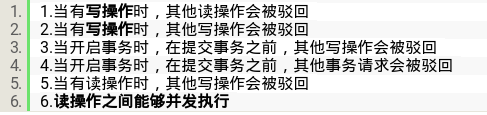

Android 小知识

[TOC]
# 加载view
```
LayoutInflater.*from*(mContext).inflate(R.layout.*adapter_p-ersonal_profile_info*, parent, false);
```
最后的参数是`attachToRoot`，如果为`true`，这里返回的`view`是`parent`，如果是`false`，返回的就是这个`R.layout.adapter_personal_profile_info`文件本身所形成的View。

# RecyclerView的循环利用，上一个视图消失了，下个需要展示的视图重复利用。
# Firebase shell 查看日志：
    - adb shell setprop log.tag.FA VERBOSE
    - adb shell setprop log.tag.FA-SVC VERBOSE
    - adb logcat -v time -s FA FA-SVC
# path, file, Uri, URI 转化：
**注意URI和Uri的区别**
1. URI：是java.net的子类
2. Uri ：是android.net的子类，Uri 不能被实例化
- Uri -> file
```
        File file = null;   //图片地址
        try {
            file = new File(new URI(uri.toString()));
        } catch (URISyntaxException e) {
            e.printStackTrace();
        }
```
- file.path -> Uri
```
 Uri uri = Uri.parse("file://" + path);
```

- file -> URI
```
URI uri = file.toURI();
```
- Uri -> path
```
public class UriTofilePath {
    public static String getFilePathByUri(Context context, Uri uri) {
        String path = null;
        // 4.4及之后的 是以 content:// 开头的，比如 content://com.android.providers.media.documents/document/image%3A235700
        if (ContentResolver.SCHEME_CONTENT.equals(uri.getScheme()) && Build.VERSION.SDK_INT >= Build.VERSION_CODES.KITKAT) {
            if (DocumentsContract.isDocumentUri(context, uri)) {
                if (isExternalStorageDocument(uri)) {
                    // ExternalStorageProvider
                    final String docId = DocumentsContract.getDocumentId(uri);
                    final String[] split = docId.split(":");
                    final String type = split[0];
                    if ("primary".equalsIgnoreCase(type)) {
                        path = Environment.getExternalStorageDirectory() + "/" + split[1];
                        return path;
                    }
                } else if (isDownloadsDocument(uri)) {
                    // DownloadsProvider
                    final String id = DocumentsContract.getDocumentId(uri);
                    final Uri contentUri = ContentUris.withAppendedId(Uri.parse("content://downloads/public_downloads"),
                            Long.valueOf(id));
                    path = getDataColumn(context, contentUri, null, null);
                    return path;
                } else if (isMediaDocument(uri)) {
                    // MediaProvider
                    final String docId = DocumentsContract.getDocumentId(uri);
                    final String[] split = docId.split(":");
                    final String type = split[0];
                    Uri contentUri = null;
                    if ("image".equals(type)) {
                        contentUri = MediaStore.Images.Media.EXTERNAL_CONTENT_URI;
                    } else if ("video".equals(type)) {
                        contentUri = MediaStore.Video.Media.EXTERNAL_CONTENT_URI;
                    } else if ("audio".equals(type)) {
                        contentUri = MediaStore.Audio.Media.EXTERNAL_CONTENT_URI;
                    }
                    final String selection = "_id=?";
                    final String[] selectionArgs = new String[]{split[1]};
                    path = getDataColumn(context, contentUri, selection, selectionArgs);
                    return path;
                }
            }
        }else {
            // 以 file:// 开头的
            if (ContentResolver.SCHEME_FILE.equals(uri.getScheme())) {
                path = uri.getPath();
                return path;
            }
            // 以 content:// 开头的，比如 content://media/extenral/images/media/17766
            if (ContentResolver.SCHEME_CONTENT.equals(uri.getScheme()) && Build.VERSION.SDK_INT < Build.VERSION_CODES.KITKAT) {
                Cursor cursor = context.getContentResolver().query(uri, new String[]{MediaStore.Images.Media.DATA}, null, null, null);
                if (cursor != null) {
                    if (cursor.moveToFirst()) {
                        int columnIndex = cursor.getColumnIndexOrThrow(MediaStore.Images.Media.DATA);
                        if (columnIndex > -1) {
                            path = cursor.getString(columnIndex);
                        }
                    }
                    cursor.close();
                }
                return path;
            }
        }
        return null;
    }

    private static String getDataColumn(Context context, Uri uri, String selection, String[] selectionArgs) {
        Cursor cursor = null;
        final String column = "_data";
        final String[] projection = {column};
        try {
            cursor = context.getContentResolver().query(uri, projection, selection, selectionArgs, null);
            if (cursor != null && cursor.moveToFirst()) {
                final int column_index = cursor.getColumnIndexOrThrow(column);
                return cursor.getString(column_index);
            }
        } finally {
            if (cursor != null)
                cursor.close();
        }
        return null;
    }

    private static boolean isExternalStorageDocument(Uri uri) {
        return "com.android.externalstorage.documents".equals(uri.getAuthority());
    }

    private static boolean isDownloadsDocument(Uri uri) {
        return "com.android.providers.downloads.documents".equals(uri.getAuthority());
    }

    private static boolean isMediaDocument(Uri uri) {
        return "com.android.providers.media.documents".equals(uri.getAuthority());
    }
}
```
# 优化ListView 或者GridView 一样的方式：
1. 自定义GridView
```
public class MyGridView extends GridView {

    public boolean isOnMeasure = false;

    public MyGridView(Context context) {
        super(context);
    }

    public MyGridView(Context context, AttributeSet attrs) {
        super(context, attrs);
    }

    public MyGridView(Context context, AttributeSet attrs, int defStyleAttr) {
        super(context, attrs, defStyleAttr);
    }

    @Override
    protected void onMeasure(int widthMeasureSpec, int heightMeasureSpec) {
        isOnMeasure = true;
        super.onMeasure(widthMeasureSpec, heightMeasureSpec);
    }

    @Override
    protected void onLayout(boolean changed, int l, int t, int r, int b) {
        isOnMeasure = false;
        super.onLayout(changed, l, t, r, b);
    }
}
```
2. 在Adapter中：
```
    @Override
    public View getView(final int position, View convertView, final ViewGroup parent) {
        final ViewHolder holder;
        //convertView multiplexing
        if (convertView == null) {
            LayoutInflater inflater = (LayoutInflater) context
                .getSystemService(Context.LAYOUT_INFLATER_SERVICE);
            convertView = inflater.inflate(R.layout.recording_list_item, null);
                convertView.setBackgroundColor(Color.TRANSPARENT);
                holder = new ViewHolder(convertView);
            convertView.setTag(holder);
        } else {
            holder = (ViewHolder) convertView.getTag();
        }
        if (mGridView != null && !mGridView.isOnMeasure) {
            //修改界面
        }

        return convertView;
    }
```

# 使用后进先出的队列实现后进先出的进城池，同时，固定队列中的数量
目前默认的队列都是先进先出的模式，都是我们可以通过继承LinkedBlockingDeque来实现后进先出，原理就是将take()和poll()方法重写一下，分别调用takeLast()和pollLast(),同时实现固定长度，超过长度把第一个删掉，重新加入
```

    private static int mMaxPoolSize = Runtime.getRuntime().availableProcessors();
    private static int mCorePoolSize = Runtime.getRuntime().availableProcessors();
    private static int mCapacity = 12 - Runtime.getRuntime().availableProcessors();
    private static ThreadPoolExecutor mThreadPoolExecutor = new ThreadPoolExecutor(mCorePoolSize,
            mMaxPoolSize,
            0,
            TimeUnit.SECONDS,
            new MyLinkedBlockingDeque<Runnable>(mCapacity),
            (r, executor) -> Log.d("setDuration", "rejectedExecution: runnale:" + r));
    private static class MyLinkedBlockingDeque<E> extends LinkedBlockingDeque<E> {
        public MyLinkedBlockingDeque(int capacity) {
            super(capacity);
        }

        @Override
        public E poll() {
            return pollLast();
        }

        @Override
        public E take() throws InterruptedException {
            return takeLast();
        }

        ReentrantLock lock = new ReentrantLock();

        @Override
        public boolean offerLast(E e) {
            lock.lock();
            try {
                if (!super.offerLast(e)) {
                    removeFirst();
                }
                return super.offerLast(e);
            } catch (Exception ex) {
                ex.printStackTrace();
                return super.offerLast(e);
            } finally {
                lock.unlock();
            }
        }
    }
```
# clipToPadding的使用：
> 作用：设为false，父布局不限制子布局的宽度
父布局中增加属性
```
android:clipToPadding="false"
android:paddingLeft="24dp"
android:paddingRight="24dp"
```
子布局中
```
android:layout_marginRight="-24dp"
android:layout_marginLeft="-24dp"
```
# 其他线程调用Toast
会报`java.lang.RuntimeException: Can't toast on a thread that has not called Looper.prepare()`错误.
因为Toast也是将消息放入队列的，所以需要如下调用：
```
new Thread(new Runnable() {
            @Override
            public void run() {
                Looper.prepare();
                Toast.makeText(getApplicationContext(), "nihao", Toast.LENGTH_LONG).show();
                Looper.loop();
            }
        }).start();
```

# 数据库读写操作，冲突问题



