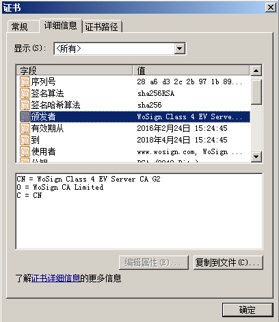
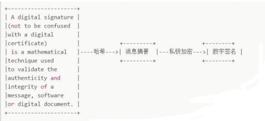
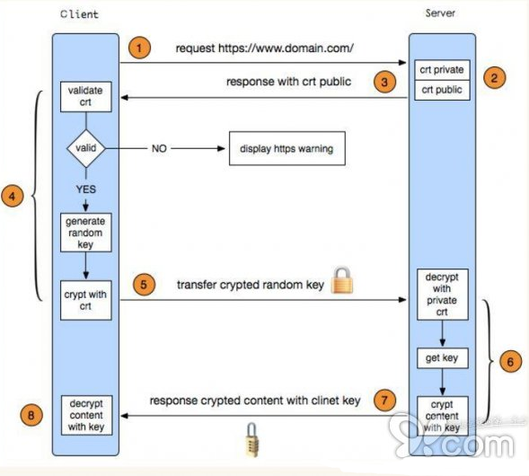
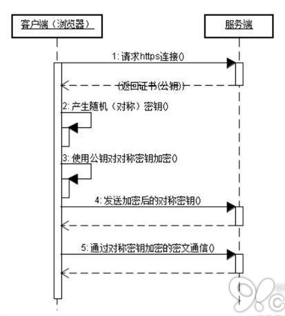

HTTPS 摘抄

参考：https://www.ruanyifeng.com/blog/2014/02/ssl_tls.html
https://www.wosign.com/Info/https_tls_ssl_http.htm

**一、什么是HTTPS、TLS、SSL**

[HTTPS](https://www.wosign.com/)，也称作HTTP over TLS。TLS的前身是SSL，TLS 1.0通常被标示为SSL 3.1，TLS 1.1为SSL 3.2，TLS 1.2为SSL 3.3。下图描述了在TCP/IP协议栈中TLS(各子协议)和HTTP的关系。

**二、HTTP和HTTPS协议的区别**

1、HTTPS协议需要到证书颁发机构(Certificate Authority，简称CA)[申请证书](https://www.wosign.com/price.htm)，一般免费证书很少，需要交费。

2、HTTP是超文本传输协议，信息是明文传输，HTTPS则是具有安全性的SSL加密传输协议。
3、HTTP和HTTPS使用的是完全不同的连接方式，使用的端口也不一样,前者是80,后者是443。
4、HTTP的连接很简单,是无状态的。
5、HTTPS协议是由SSL+HTTP协议构建的可进行加密传输、身份认证的网络协议，要比HTTP协议安全。
从上面可看出，HTTPS和HTTP协议相比提供了
· 数据完整性：内容传输经过完整性校验
· 数据隐私性：内容经过对称加密，每个连接生成一个唯一的加密密钥
· 身份认证：第三方无法伪造服务端(客户端)身份
其中，数据完整性和隐私性由TLS Record Protocol保证，身份认证由TLS Handshaking Protocols实现。
**三、证书**
1、什么是证书呢?

2、证书中包含什么信息
证书信息：过期时间和序列号
所有者信息：姓名等
所有者公钥
3、为什么服务端要发送证书给客户端
互联网有太多的服务需要使用证书来验证身份，以至于客户端(操作系统或浏览器等)无法内置所有证书，需要通过服务端将证书发送给客户端。
4、客户端为什么要验证接收到的证书
中间人攻击

5、客户端如何验证接收到的证书
为了回答这个问题，需要引入数字签名(Digital Signature)。

将一段文本通过哈希(hash)和私钥加密处理后生成数字签名。

假设消息传递在Bob，Susan和Pat三人之间发生。Susan将消息连同数字签名一起发送给Bob，Bob接收到消息后，可以这样验证接收到的消息就是Susan发送的

当然，这个前提是Bob知道Susan的公钥。更重要的是，和消息本身一样，公钥不能在不安全的网络中直接发送给Bob。

此时就引入了证书颁发机构(Certificate Authority，简称CA)，CA数量并不多，Bob客户端内置了所有受信任CA的证书。CA对Susan的公钥(和其他信息)数字签名后生成证书。

Susan将证书发送给Bob后，Bob通过CA证书的公钥验证证书签名。
Bob信任CA，CA信任Susan， 使得 Bob信任Susan，信任链(Chain Of Trust)就是这样形成的。

事实上，Bob客户端内置的是CA的根证书(Root Certificate)，HTTPS协议中服务器会发送证书链(Certificate Chain)给客户端。

**正式开始HTTPS的内容：**
**一、HTTPS的基本原理**
从上面可知，HTTPS能够加密信息，以免敏感信息被第三方获取。所以很多银行网站或电子邮箱等等安全级别较高的服务都会采用HTTPS协议。

HTTPS其实是有两部分组成：HTTP +SSL/ TLS，也就是在HTTP上又加了一层处理加密信息的模块。服务端和客户端的信息传输都会通过TLS进行加密，所以传输的数据都是加密后的数据。具体是如何进行加密，解密，验证的，且看下图。

1. 客户端发起HTTPS请求
这个没什么好说的，就是用户在浏览器里输入一个HTTPS网址，然后连接到server的443端口。
2. 服务端的配置

采用HTTPS协议的服务器必须要有一套数字证书，可以自己制作，也可以向组织申请。区别就是自己颁发的证书需要客户端验证通过，才可以继续访问，而使用受信任的公司申请的证书则不会弹出提示页面(startssl就是个不错的选择，有1年的免费服务)。这套证书其实就是一对公钥和私钥。如果对公钥和私钥不太理解，可以想象成一把钥匙和一个锁头，只是全世界只有你一个人有这把钥匙，你可以把锁头给别人，别人可以用这个锁把重要的东西锁起来，然后发给你，因为只有你一个人有这把钥匙，所以只有你才能看到被这把锁锁起来的东西。

3. 传送证书
这个证书其实就是公钥，只是包含了很多信息，如证书的颁发机构，过期时间等等。
4. 客户端解析证书

这部分工作是由客户端的TLS来完成的，首先会验证公钥是否有效，比如颁发机构，过期时间等等，如果发现异常，则会弹出一个警告框，提示证书存在问题。如果证书没有问题，那么就生成一个随机值。然后用证书对该随机值进行加密。就好像上面说的，把随机值用锁头锁起来，这样除非有钥匙，不然看不到被锁住的内容。

5. 传送加密信息
这部分传送的是用证书加密后的随机值，目的就是让服务端得到这个随机值，以后客户端和服务端的通信就可以通过这个随机值来进行加密解密了。
6. 服务端解密信息

服务端用私钥解密后，得到了客户端传过来的随机值(私钥)，然后把内容通过该值进行对称加密。所谓对称加密就是，将信息和私钥(随机值)通过某种算法混合在一起，这样除非知道私钥(随机值)，不然无法获取内容，而正好客户端和服务端都知道这个私钥(随机值)，所以只要加密算法够彪悍，私钥(随机值)够复杂，数据就够安全。

7. 传输加密后的信息
这部分信息是服务端用私钥(随机值)加密后的信息，可以在客户端被还原
8. 客户端解密信息
客户端用之前生成的私钥(随机值)解密服务端传过来的信息，于是获取了解密后的内容。整个过程第三方即使监听到了数据，也束手无策。
**二、HTTPS的通信流程和握手过程**
1、HTTPS对应的通信时序图：

2、HTTPS在传输数据之前需要客户端(浏览器)与服务端(网站)之间进行一次握手，在握手过程中将确立双方加密传输数据的密码信息。TLS/SSL协议不仅仅是一套加密传输的协议，更是一件经过艺术家精心设计的艺术品，TLS/SSL中使用了非对称加密，对称加密以及HASH算法。握手过程的具体描述如下：

1. 浏览器将自己支持的一套加密规则发送给网站。
2.网站从中选出一组加密算法与HASH算法，并将自己的身份信息以证书的形式发回给浏览器。证书里面包含了网站地址，加密公钥，以及证书的颁发机构等信息。
3.浏览器获得网站证书之后浏览器要做以下工作：

a) 验证证书的合法性(颁发证书的机构是否合法，证书中包含的网站地址是否与正在访问的地址一致等)，如果证书受信任，则浏览器栏里面会显示一个小锁头，否则会给出证书不受信的提示。

b) 如果证书受信任，或者是用户接受了不受信的证书，浏览器会生成一串随机数的密码，并用证书中提供的公钥加密。
c) 使用约定好的HASH算法计算握手消息，并使用生成的随机数对消息进行加密，最后将之前生成的所有信息发送给网站。
4.网站接收浏览器发来的数据之后要做以下的操作：
a) 使用自己的私钥将信息解密取出密码，使用密码解密浏览器发来的握手消息，并验证HASH是否与浏览器发来的一致。
b) 使用密码加密一段握手消息，发送给浏览器。

5.浏览器解密并计算握手消息的HASH，如果与服务端发来的HASH一致，此时握手过程结束，之后所有的通信数据将由之前浏览器生成的随机密码并利用对称加密算法进行加密。

**随机数的作用：**
期间总共会出现三次随机数：
（1）客户端第一次发起请求建立连接
（2）服务端对上次客户端的响应，和证书一起下发
（3）客户端拿到公钥，再次生成一个随机数（pre-master-key），并用公钥加密发给服务端，发送的是随机数（pre-master-key），不是密钥
（4）上述三个随机数的目的都是为了生成对称密钥。保证密钥的唯一性。

（5）不管是客户端还是服务器，都需要随机数，这样生成的密钥才不会每次都一样。由于 SSL 协议中证书是静态的，因此十分有必要引入一种随机因素来保证协商出来的密钥的随机性。