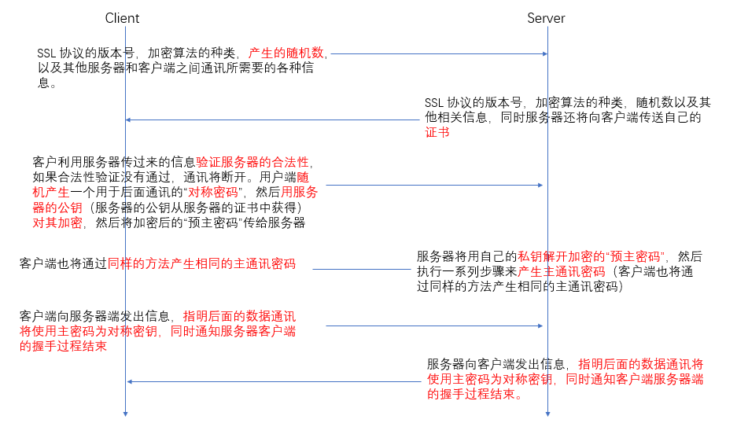

Http与Https

Https的交互过程

随机数的作用：
期间总共会出现三次随机数：
（1）客户端第一次发起请求建立连接
（2）服务端对上次客户端的响应，和证书一起下发
（3）客户端拿到公钥，再次生成一个随机数（pre-master-key），并用公钥加密发给服务端，发送的是随机数（pre-master-key），不是密钥
（4）上述三个随机数的目的都是为了生成对称密钥。保证密钥的唯一性。

（5）不管是客户端还是服务器，都需要随机数，这样生成的密钥才不会每次都一样。由于 SSL 协议中证书是静态的，因此十分有必要引入一种随机因素来保证协商出来的密钥的随机性。
