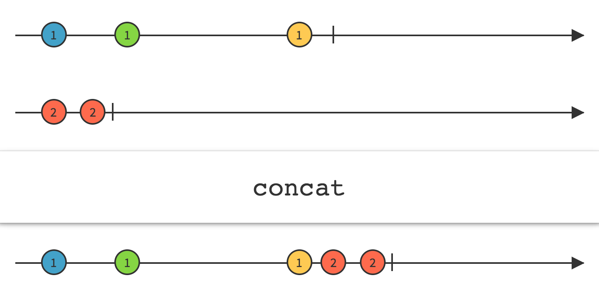
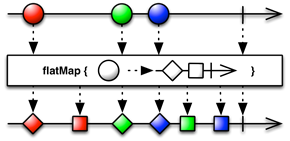
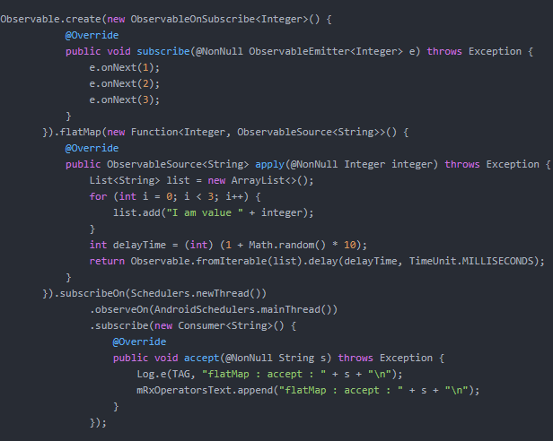
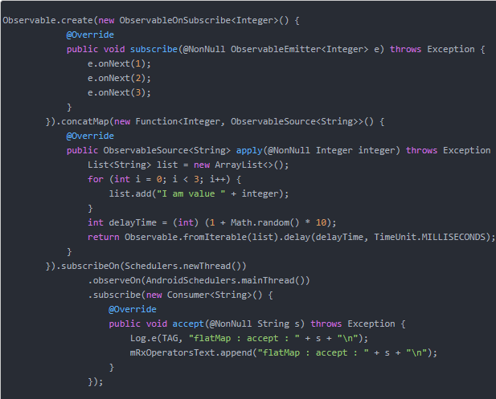
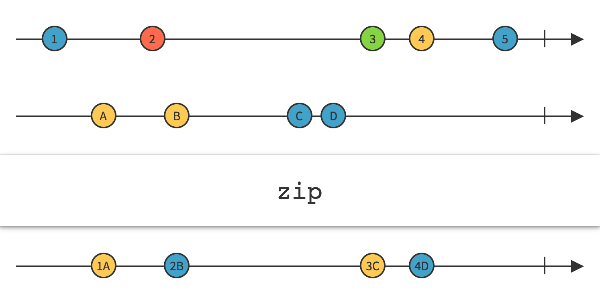
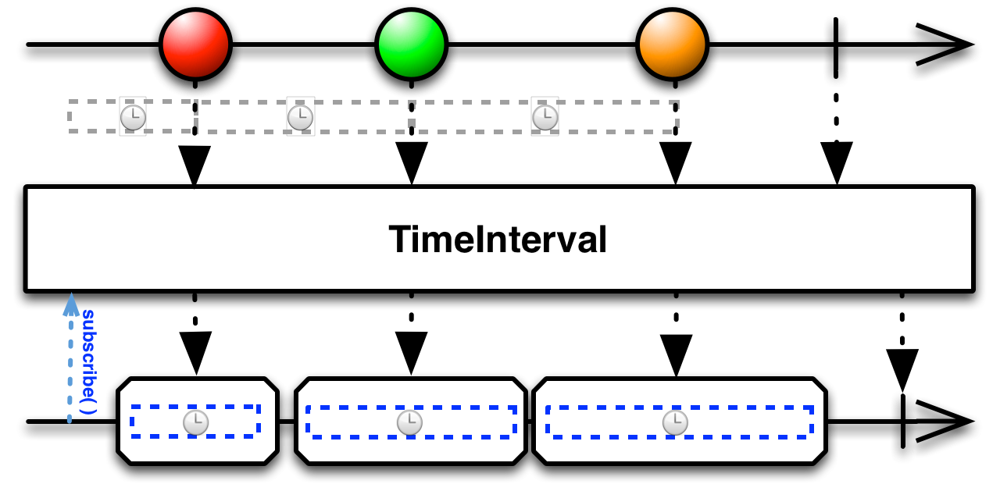
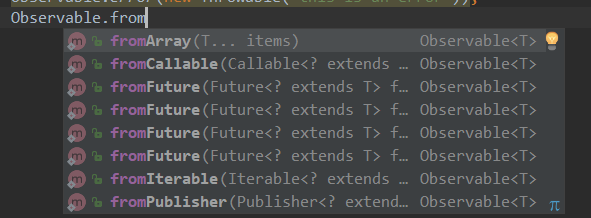

RxJava（TOSTUDY-9）

RxJava
基于事件流的异步处理

Schedulers.io()
Schedulers.newThread()
[Schedulers.computation](http://schedulers.computation/)()
Schedulers.mainThread()

Observable.create().map 类之间的转换

Observable.create().flatMap(new Function<Reply, ObservableSource<Reply2>>() {})在接收第一个Observable的返回Reply，在变换后，进行第二个Observable的发射，下面在接收的事件就说第二个Observable发射的事件了。并且如果第二个发送多个事件，flatmap是无法保证顺序的

Observable.create().concatMap 用法和上面一样，但在进行第二次事件的发射时，是保证顺序的。

Observable.concat(observable1, observable2) observable1 先发射，若顺利完成并调用了onComplete,则会执行observable2的发射，否则不执行

Observable.merge(observable1, observable2)  两个事件混杂发射，不用等到Observable1发射完成

Observable.zip(observable1, observable2, new BiFunction<reply1, reply2, reply3>{}).doOnNext(new Consumer())

Flowable.interval(long initialDelay, long period, TimeUnit unit, Scheduler scheduler)

    initialDelay:多长时间之后开始发送事件
    period：隔多久再次发送事件
    unit: 时间单位
    scheduler: 等待发送和发送事件所在进程

Observable.just("sss",12)

Observable.from...()与Rxjava1不同

Observable.create().distinct()  对发射的事件去重

Observable.create().filter(new Predicate<Integer>(){ public boolean test()...}) 过滤，test方法中return true; 保留。

Observable.just(1,2,3,4,5).buffer(count, skip)   count=3, skip=2   发射的都是list， 第一次发射 [1,2,3],count为3，再skip 为2，第二次发射[3,4,5],再skip 2个，第三次发射[5]

Observable.timer()和interval差不多，但没有第一个参数initDelay

Observable.doOnNext(new Consumer()) 在调用observer.onNext()之前会调用这个。

Observable.create().subcribe(new Observer())可以换成 Observable.create().subcribe(new Consumer()(onNext()), new Consumer()(onError()), new Consumer()(onComplete()))

Observable.just(1,2,3,4,5).skip(3)  只会发射4，5, 跳过前3个

Observable.just(1,2,3,4,5).take(3)  只会发射1，2，3  最多发送3个

Observable.just(1,2,3,4,5).subscribe(new singelObserver<>())   只会接收第一个事件，并且singleObserver只有onError,onSuccess方法。

Observable.create().debounce(500, TimeUnit.MILLISECONDS)  发送事件间隔小于500的都去掉

Observable.create().last(default)  仅发射最后一个，如果没有事件发射就发射default

Observable.just(1,2,3).reduce(new BiFunction<> )  将前两个发射事件做处理，再与第三个事件做处理，再与第四个。。。。最后变成一个事件的发射，比如处理方式是两个数相加，这边最后发射的是6

Observable.just(1,2,3).scan(new BiFunction<> )
同上，不过这边会把每一次处理的结果都会发射。比如处理方式是两个数相加，发射的就是3，6.

* * *

* * *

**RxJava2**
一、RxJava简介
    Asynchronous：
    1.异步的,RxJava是一个异步的库
    2.基于回调的
    Event-based：
    1.基于事件的
    2.事件分发的库，消息传递
二、RxJava的五大元素
（1）Observable
（2）Observer
（3）Subscription
（4）OnSubscribe
（5）Subscriber

三、RxJava2的五大元素
分为背压和非背压两种方式。
背压：背压是指在异步场景中，被观察者发送事件速度远快于观察者的处理速度的情况下，**一种**告诉上游的被观察者降低发送速度的**策略**。
自己概括为，**一种让被观察者降低发送事件速度的策略。**
**注意：**
背压策略的一个前提是异步环境，也就是说，被观察者和观察者处在不同的线程环境中。
背压（Backpressure）并不是一个像flatMap一样可以在程序中直接使用的操作符，他只是一种控制事件流速的策略。

1、不支持背压：
（1）Observable
a.观察得到的-被观察者,不支持背压
b.通过Observable创建一个可观察的序列(create方法)
c.通过subscribe去注册一个观察者
（2）Observer
a.用于接收数据-观察者
b.作为Observable的subscribe方法的参数
（3）Disposable
a.和RxJava1的Subscription的作用相当
b.用于取消订阅和获取当前的订阅状态
（4）OnSubscrible
a.当订阅时会触发此接口调用
b.在Observable内部，实际作用是向观察者发射数据
（5）Emitter
a.一个发射数据的接口，和Observer的方法类似
b.本质是对Observer和Subscriber的包装

2、背压：
（1）Flowable
a.易流动的---被观察者，支持背压
b.通过Flowable创建一个可观察的序列(create方法)
c.通过subscribe去注册一个观察者
（2）Subscriber
a.一个单独接口，和Observer的方法类似
b.作为Flowable的subscribe方法的参数
（3）Subscription
a.订阅,和RxJava1的有所不同
b.支持背压，有用于背压的request方法
（4）FlowableOnSubscribe
a.当订阅时会触发此接口调用
b.在Flowable内部，实际作用是向观察者发射数据
（5）Emitter
a.一个发射数据的接口，和Observer的方法类似
b.本质是对Observer的Subscriber的包装

总结如下图：

四、使用
1、创建Obervable
（1）正常创建(create)
Observable observable = Observale.create(new ObservableOnSubscribe<Object>(){
        @Overide
        public void subscribe(ObservableEmitter<object> e){}
})

创建Observable的方法，这里的subscribe 会在这个observable 被订阅的时候调用。但是这个方法晚于Observer的onSubsribe()方法。

ObservableEmitter 是事件发射器类，可以把他赋值给外部类的常量。（这里很可能造成内存泄漏）

（2）empty
Observable.empty()：创建一个不发射任何数据但是正常终止的Observable

（3）never
Observable.never()：创建一个不发射数据也不终止的Observable

（4）error
Observable.error(new Throwable("this is an error"))：创建一个不发射数据以一个错误终止的Observable

2、创建Observer
Observer observer = new Observer<Object> {
         @Override
            public void onSubscribe(Disposable d) {
                //该方法是在此observer在订阅了一个observable时调用的。
            }

            @Override
            public void onNext(Object o) {
                //该方法就是处理订阅事件的方法
            }

            @Override
            public void onError(Throwable e) {

                //发生错误的时候会调用这个方法，这个方法调用了之后，observable和observer也就解绑了。当observable和observer已经解绑的情况下，再调用onError会报异常

            }

            @Override
            public void onComplete() {
                //完成订阅，解除订阅。
            }
}

以上四个方法的调用源码（ObservableCreate 的静态类 CreateEmitter）如下（一看就明白）：
                @Override
                public void onNext(T t) {
                    if (t == null) {

                        onError(new NullPointerException("onNext called with null. Null values are generally not allowed in 2.x operators and sources."));

                        return;
                    }
                    if (!isDisposed()) {
                        observer.onNext(t);
                    }
                }

                @Override
                public void onError(Throwable t) {
                    if (t == null) {

                        t = new NullPointerException("onError called with null. Null values are generally not allowed in 2.x operators and sources.");

                    }
                    if (!isDisposed()) {
                        try {
                            observer.onError(t);
                        } finally {
                            dispose();
                        }
                    } else {
                        RxJavaPlugins.onError(t);
                    }
                }

                @Override
                public void onComplete() {
                    if (!isDisposed()) {
                        try {
                            observer.onComplete();
                        } finally {
                            dispose();
                        }
                    }
                }

3、开始订阅：
（1）observable.subscribe(observer);
然后会调用Observer.onSubscribe()，再调用ObservableOnSubscribe.subscribe()

如何记住：当你要订阅一个东西，肯定是订阅者（Observer）先知道，然后Observer的方法都是onNext,onError,onComplelte，所以是onSubscribe()。

（2）简单订阅
observable.subscirbe(new Consumer<Object>() {
    @Override
    public void accpet(Object o)
        //这个方法是该接口的唯一方法
        //这个Consumer 实例等同于onNext
    }
}，errorConsumer, completeConsumer, subscribeConsumer );
就参数是consumer实例来说，subscribe方法重载了四次。
subscribe(onNext)
subscribe(onNext, onError)
subscribe(onNext, onError, onComplete)
subscribe(onNext, onError, onComplete, onSubscirbe)

4、线程切换

**切换线程可以切换订阅事件的线程(ObservableOnSubscribe.subscribe) 和 处理事件的线程（observer.onNext()）。但不会改变observer.onSubscribe()。**

**默认处理事件的线程和订阅事件的在一个线程里面，除非切换处理事件的线程**
（1）observeOn()
切换处理事件的线程，每一次调用都会改变处理事件的线程。可参考下面代码设计。
（2）subscribeOn ()
切换订阅事件的线程，在不调用observeOn时，也会切换处理事件的线程。仅仅是第一次调用起作用。
（3）线程参数（详情参考：https://mcxiaoke.gitbooks.io/rxdocs/content/Scheduler.html）

|     |     |
| --- | --- |
| **调度器类型** | **效果** |
| Schedulers.computation() | 用于计算任务，如事件循环或和回调处理，不要用于IO操作(IO操作请使用Schedulers.io())；默认线程数等于处理器的数量 |
| Schedulers.from(executor) | 使用指定的Executor作为调度器 |
| Schedulers.immediate( ) | 在当前线程立即开始执行任务 |
| Schedulers.io( ) | 用于IO密集型任务，如异步阻塞IO操作，这个调度器的线程池会根据需要增长；对于普通的计算任务，请使用Schedulers.computation()。Schedulers.io( )默认是一个CachedThreadScheduler，很像一个有线程缓存的新线程调度器 |
| Schedulers.newThread( ) | 为每个任务创建一个新线程 |
| Schedulers.trampoline( ) | 当其它排队的任务完成后，在当前线程排队开始执行 |

observable.observeOn(AndroidSchedulers.mainThread())
                .doOnNext(new Consumer<Integer>() {
                    @Override

                    public void accept(@NonNull Integer integer) throws Exception {

                        Log.e(TAG, "After observeOn(mainThread)，Current thread is " + Thread.currentThread().getName());

                    }
                })
                .observeOn(Schedulers.io())
                .subscribe(new Consumer<Integer>() {
                    @Override

                    public void accept(@NonNull Integer integer) throws Exception {

                        Log.e(TAG, "After observeOn(io)，Current thread is " + Thread.currentThread().getName());

                    }
                });

5、操作符
（1）map
类型转换。

使用场景：
发送请求后，接收到response，然后发射出去，通过map，转换成特定的entity，在onNext()中处理。
举例：拉取离线消息，发送请求，得到response是一大堆的json 字符串，通过map转换为msg，在onNext中存入数据库。

（2）concat
合并衔接：

使用场景：

两个Observable，分别执行两个请求，第二个Observable不需要第一个Observable的结果，不管执行请求成功或者失败，我都需要执行第二个。但第一个和第二个事件的发送却有明显的先后顺序。

（3）flatmap
将一个发射数据的Observable（不是发射的事件）变换为多个Observables，然后将它们发射的数据合并后放进一个单独的Observable。

使用场景：
发送一个请求 ，然后需要这个请求的结果，再去发送一个请求，而订阅者（Observer）真正处理的是第二个请求的结果。

举例：outLook一键登陆多个邮箱。登陆 outlook是一个Observable，发送请求登陆成功，发射很多事件，分别取各个邮箱去拉取邮件。然后经过flatmap，把发射的所有事件都变成了Observable，每个邮箱对应的Observable发射拉取该邮箱邮件的事件又重新被整理到一个Observable里面，注意是无序的，然后发射事件。这么看，对于开始的Observable来说，发射了几个事件，flatmap根据发射事件内容，再次发射一个或多个事件。而观察者真正处理的是后面一次发射的事件。

给我的感觉就是把发射的一个事件，横向扩展为多个事件，且事件顺序不一定。concatMap的作用和flatMap一样，但顺序是一定的。扩展的几个Observable再重新合并成一个Observable的时候，是每个Observable依次轮流发一个事件。

可以参考下面的例子理解：
flatMap:

结果：

concatMap:

结果：

（4）zip
通过一个函数将多个Observables的发射物结合到一起，基于这个函数的结果为每个结合体发射单个数据项。

使用场景：
多个请求的结果合并发射出去。
举例，一个Observable是获取用户姓名，并发射出来，另一个Observable是获取用户年龄，并发射出来，zip将年龄和姓名组合起来去判断用户归属。
注意上图结合的规律

（5）timeInterval
将发射事件转换为发射事件之间的间隔时间。

订阅者处理的对象是Timed类型
包含了三个成员属性，
    final T value;                        原本发射的事件对象
    final long time;                    本次发射与上次发射之间的时间间隔，第一次是从订阅到发射
    final TimeUnit unit;             时间单位

（6）interval

这个是Flowable和Observable的静态方法。创建一个按固定时间间隔发射整数序列的Observable。在onNext中接受的参数是从0开始依次递增的整数。

注意0是从哪里开始的
其中可选参数Scheduler：

the Scheduler on which the waiting happens and items are emitted。指定等待和发送事件的线程。从第4部分线程切换可以看出来，如果没有制定observeOn，也会改变处理事件的线程。

（7）just
创建一个发射指定值的Observable

注意：如果你传递null给Just，它会返回一个发射null值的Observable。不要误认为它会返回一个空Observable（完全不发射任何数据的Observable），如果需要空Observable你应该使用Empty操作符。

Observable.just(1, 2, 3)。创建了一个Observable发射1，2，3三个事件。

（8）from

将其它种类的对象和数据类型转换为Observable。from与just类似，但是From会将数组或Iterable的数据取出然后逐个发射，而Just只是简单的原样发射，将数组或Iterable当做单个数据。

（9）distinct
去重再发送。比较的是hashcode值。

（10）filter
过滤之后再发送

（11）buffer
重新整理发送的事件，再发送
int count = 3， skip = 2；
Observable.just(1,2,3,4,5).buffer(count, skip);
重新整理为三个事件List发送，三个List分别是（1，2，3）（3，4，5）（5）

（12）doOnNext()
Observable observable = doOnNext(new Consumer() {});
举例，可能在处理某个对象时，想要将他保存一下，再去处理，那就可以将保存操作放在这里。

（13）skip
跳过几个事件

（14）take
最多能接收几个事件

（15）Single
顾名思义，Single 只会接收一个参数，而 SingleObserver 只会调用 onError() 或者 onSuccess()。
                Single.just(new Random().nextInt())
                .subscribe(new SingleObserver<Integer>() {
                    @Override
                    public void onSubscribe(@NonNull Disposable d) {

                    }

                    @Override
                    public void onSuccess(@NonNull Integer integer) {

                        mRxOperatorsText.append("single : onSuccess : "+integer+"
");

                        Log.e(TAG, "single : onSuccess : "+integer+"
" );
                    }

                    @Override
                    public void onError(@NonNull Throwable e) {

                        mRxOperatorsText.append("single : onError : "+e.getMessage()+"
");

                        Log.e(TAG, "single : onError : "+e.getMessage()+"
");
                    }
                });

（16）debounce
去除发送频率过快的项，只会针对两次发送的间隔来说。如果时间间隔小于了timeout,两端的值都会保留，否则两端的值都会去除

使用方法：debounce(long timeout, TimeUnit unit)；
举例：
                emitter.onNext(1);
                Thread.sleep(300);
                emitter.onNext(2);
                Thread.sleep(200);
                emitter.onNext(3);
                Thread.sleep(400);
                emitter.onNext(4);

debounce(299, TimeUnit.MILLISECONDS)

上述的例子会发送1，3，4。由例子看出来，第一个间隔300，保留了1，按道理应该保留2，但2和3 之间的是200，所以2会去除。因为2和3之间的是200，所以3也应该去除，但3和4之间是400，应该保留。所以综上所述，这个事件的去留，取决于他与后面事件发射的间隔。经测试最后一个一定会保留

（17）last()
发射最后一个，返回的是single类型

（18）merge
整合两个Observable

concat是需要等到第一个Observable发送完成。

（19）reduce

            reduce(new BiFunction<Integer, Integer, Integer>() {
                   @Override

                   public Integer apply(@NonNull Integer integer, @NonNull Integer integer2) throws Exception {

                       return integer + integer2;
                   }
               })

先1和2相加为3，然后3和3相加为6，然后6和4相加为10，最后10和5相加为15。仅仅输出最后结果15。

（20）scan
scan的基本作用和reduce一样，但会输出每一步的值

（21）window
比较复杂，可参考：https://mcxiaoke.gitbooks.io/rxdocs/content/operators/Window.html