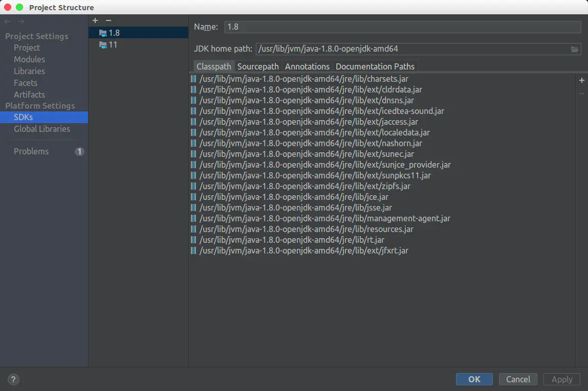

安装多个版本java

安装多个版本java
sudo add-apt-repository ppa:openjdk-r/ppa
sudo apt-get update
sudo apt-get install openjdk-8-jdk
sudo apt-get install openjdk-7-jdk

选择正确版本
sudo update-alternatives --config java
sudo update-alternatives --config javac

安装openjdk-6-jdk(不管用)

wget http://launchpadlibrarian.net/235298493/openjdk-6-jdk_6b38-1.13.10-1_amd64.deb

wget http://launchpadlibrarian.net/235298496/openjdk-6-jre_6b38-1.13.10-1_amd64.deb

wget http://launchpadlibrarian.net/235298494/openjdk-6-jre-headless_6b38-1.13.10-1_amd64.deb

wget http://launchpadlibrarian.net/235298487/openjdk-6-jre-lib_6b38-1.13.10-1_all.deb

wget http://launchpadlibrarian.net/250277191/tzdata_2016c-0ubuntu1_all.deb
wget http://launchpadlibrarian.net/250277190/tzdata-java_2016c-0ubuntu1_all.deb

sudo  dpkg -i openjdk-6-jdk_6b38-1.13.10-1_amd64.deb openjdk-6-jre_6b38-1.13.10-1_amd64.deb openjdk-6-jre-headless_6b38-1.13.10-1_amd64.deb openjdk-6-jre-lib_6b38-1.13.10-1_all.deb tzdata_2016c-0ubuntu1_all.deb tzdata-java_2016c-0ubuntu1_all.deb

openJDK 配置javafx包：
打开 Project Structure，选择SDKs，可以看到JDK路径。

点击旁边的 “+” 号，然后在 jdk 目录下，`/home/Sun/Software/idea-IC-191.6183.87/jre64/lib/ext`文件夹里找到 jfxrt.jar 这个包，并且导入，就OK啦～

update-alternatives的默认值修改
```shell
vim /var/lib/dpkg/alternatives/java
```