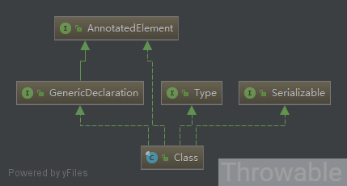
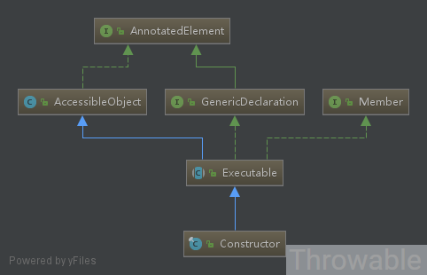
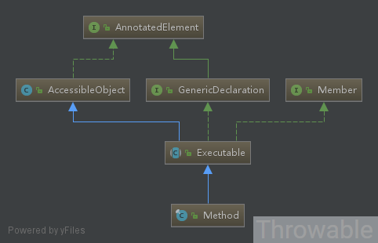
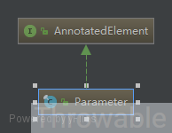

深入分析Java反射(一)-核心类库和方法 - Throwable

[参考](https://www.throwx.cn/2018/12/02/java-reflection-lib/)
## 前提
 
Java反射的API在JavaSE1.7的时候已经基本完善，**但是本文编写的时候使用的是Oracle JDK11**，因为JDK11对于sun包下的源码也上传了，可以直接通过IDE查看对应的源码和进行Debug。

本文主要介绍反射的基本概念以及核心类`Class`、`Constructor`、`Method`、`Field`、`Parameter`的常用方法。

本文极长，请准备一个使自己舒服的姿势阅读。

<a id="more"></a>

## 什么是反射

反射(Reflection)是一种可以在运行时检查和动态调用类、构造、方法、属性等等的编程语言的能力，甚至可以不需要在编译期感知类的名称、方法的名称等等。**[Oracle关于Java反射的官方教程](https://docs.oracle.com/javase/tutorial/reflect/index.html)中指出反射是由应用程序使用，用于检查或修改在Java虚拟机中运行的应用程序的运行时行为，这是一个相对高级的功能，需要由掌握Java语言基础知识的开发者使用**。

反射的优点有很多，前面提到可以检查或修改应用程序的运行时行为、抑制修饰符限制直接访问私有属性等等，这里主要列举一下它的缺点：

- 性能开销：由于反射涉及动态解析的类型，因此无法执行某些Java虚拟机优化。因此，反射操作的性能低于非反射操作，应避免在性能敏感应用程序中频繁调用反射操作代码片段。
- 安全限制：反射需要运行时权限，不能在安全管理器(security manager)下进行反射操作。
- 代码可移植性：反射代码打破了抽象，反射的类库有可能随着平台(JDK)升级发生改变，反射代码中允许执行非反射代码的逻辑例如允许访问私有字段，这些问题都有可能影响到代码的可移植性。

JDK中对和反射相关的类库集中在`java.lang.reflect`包和`java.lang`包中，`java.lang.reflect`包和`java.lang`包是开发者可以直接使用的，部分`java.lang.reflect`包中接口的实现类存放在`sun.reflect`包中，一般情况下`sun`包下的类库有可能跟随平台升级发生改变，一般尽量少用，否则有可能因为JDK升级导致原来的代码无法正常运行。还有部分反射相关的类库存放在`jdk.internal.reflect`包中，这个包是JDK内部使用的包，一般也不建议滥用其中的类库。可以理解为`java.lang.reflect`包和`java.lang`包中的类库就是面向开发者的类库。

## 图解反射核心类的体系

`java.lang.reflect`包反射核心类有核心类`Class`、`Constructor`、`Method`、`Field`、`Parameter`，它们的基础体系如下：

`java.lang.Class`类继承体系:



`java.lang.reflect.Constructor`类继承体系:



`java.lang.reflect.Method`类继承体系:



`java.lang.reflect.Field`类继承体系:


`java.lang.reflect.Parameter`类继承体系:



由它们的类继承图可以看出：

- Class、Constructor、Method、Field、Parameter共有的父接口是AnnotatedElement。
- Constructor、Method、Field共有的父类是AnnotatedElement、AccessibleObject和Member。
- Constructor、Method共有的父类是AnnotatedElement、AccessibleObject、Member、GenericDeclaration和Executable。

下面会先简单分析`AnnotatedElement`、`AccessibleObject`、`Member`、`GenericDeclaration`、`Executable`几个类提供的功能，然后重点分析`Class`、`Constructor`、`Method`、`Field`、`Parameter`的常用方法。

这里先说一个规律，在Class中，`getXXX()`方法和`getDeclearedXXX()`方法有所区别。注解类型`Annotation`的操作方法例外，因为基于注解的修饰符必定是public的：

- getDeclaredMethod(s)：返回类或接口声明的所有方法，包括公共、保护、默认(包)访问和私有方法，但不包括继承的方法。对于获取Method对象，`Method[] methods = clazz.getDeclaredMethods();`返回的是clazz本类所有修饰符(public、default、private、protected)的方法数组，但是不包含继承而来的方法。
- getMethod(s):返回某个类的所有公用(public)方法包括其继承类的公用方法，当然也包括它所实现接口的方法。对于获取Method对象，`Method[] methods = clazz.getMethods();`表示返回clazz的父类、父类接口、本类、本类接口中的全部修饰符为public的方法数组。
- getDeclaredField(s)和getField(s)、getDeclaredConstructor(s)和getConstructor(s)同上。
- getDeclaredAnnotation(s)：返回直接存在于此元素上的所有注解，此方法将忽略继承的注解，准确来说就是忽略@Inherited注解的作用。
- getAnnotation(s)：返回此元素上存在的所有注解，包括继承的所有注解。

如果想获取一个类的所有修饰符的方法，包括所有父类中的方法，那么建议递归调用`getDeclaredMethods()`(所谓递归调用就是一直追溯目标类的父类递归调用`getDeclaredMethods()`方法直到父类为Object类型，这个思路可以参考Spring框架中的相关工具类)。获取一个类的所有Field、Constructor也可以类似操作，可以参考或者直接使用Spring中的工具类ReflectionUtils的相关方法。@Inherited元注解是一个标记注解，@Inherited阐述了某个被标注的Annotation类型是可以被继承的，详细的在分析AnnotatedElement的时候再展开。

## Type接口

`java.lang.reflect.Type`接口是Java中所有类型的共同父类，这些类型包括原始类型、泛型类型、数组类型、类型变量和基本类型，接口定义如下：

```
public interface Type {

    default String getTypeName() {
        return toString();
    }
}

```

## AnnotatedElement接口

`AnnotatedElement`是一个接口，它定义的方法主要和注解操作相关，例如用于判断注解的存在性和获取注解等等。

| 方法  | 功能  |
| --- | --- |
| boolean isAnnotationPresent(`Class<? extends Annotation>` annotationClass) | 判断指定的注解类型在当前的实例上是否存在 |
| `<T extends Annotation>` T getAnnotation(`Class<T>` annotationClass) | 获取当前实例上指定注解类型的注解实例，不存在时返回null |
| Annotation\[\] getAnnotations() | 获取当前实例上所有注解实例，包括继承获得的注解，不存在则返回长度为0的数组 |
| `<T extends Annotation>` T getDeclaredAnnotation(`Class<T>` annotationClass) | 获取当前实例上指定注解类型的注解实例，不包括继承获得的注解，不存在则返回长度为0的数组 |
| `<T extends Annotation>` T\[\] getDeclaredAnnotations(`Class<T>` annotationClass) | 获取当前实例上所有的注解实例，不包括继承获得的注解，不存在则返回长度为0的数组 |
| `<T extends Annotation>` T\[\] getDeclaredAnnotationsByType(`Class<T>` annotationClass) | 在不使用@Repeatable的时候，功能和getDeclaredAnnotations方法一致，如果使用了@Repeatable，则合并解析@Repeatable后的结果 |
| `<T extends Annotation>` T\[\] getAnnotationsByType(`Class<T>` annotationClass) | 如果指定annotationClass注解类型可继承(使用了@Inherited)，那么递归调用getDeclaredAnnotationsByType |

举个简单例子：

```
public class Main {

    public static void main(String[] args) {
        Class<?> clazz = Sub.class;
        System.out.println("-----getAnnotations-----");
        Annotation[] annotations = clazz.getAnnotations();
        for (Annotation annotation : annotations) {
            System.out.println(annotation.toString());
        }
        System.out.println("-----getDeclaredAnnotation-->SupperAnnotation-----");
        SupperAnnotation declaredSupperAnnotation = clazz.getDeclaredAnnotation(SupperAnnotation.class);
        System.out.println(declaredSupperAnnotation);
        System.out.println("-----getAnnotation-->SupperAnnotation-----");
        SupperAnnotation supperAnnotation = clazz.getAnnotation(SupperAnnotation.class);
        System.out.println(supperAnnotation);
        System.out.println("-----getDeclaredAnnotation-->SubAnnotation-----");
        SubAnnotation declaredSubAnnotation = clazz.getDeclaredAnnotation(SubAnnotation.class);
        System.out.println(declaredSubAnnotation);
        System.out.println("-----getDeclaredAnnotationsByType-->SubAnnotation-----");
        SubAnnotation[] declaredSubAnnotationsByType = clazz.getDeclaredAnnotationsByType(SubAnnotation.class);
        for (SubAnnotation subAnnotation : declaredSubAnnotationsByType) {
            System.out.println(subAnnotation);
        }
        System.out.println("-----getDeclaredAnnotationsByType-->SupperAnnotation-----");
        SupperAnnotation[] declaredSupperAnnotationsByType = clazz.getDeclaredAnnotationsByType(SupperAnnotation.class);
        for (SupperAnnotation supperAnnotation1 : declaredSupperAnnotationsByType) {
            System.out.println(supperAnnotation1);
        }
        System.out.println("-----getAnnotationsByType-->SupperAnnotation-----");
        SupperAnnotation[] supperAnnotationsByType = clazz.getAnnotationsByType(SupperAnnotation.class);
        for (SupperAnnotation supperAnnotation2 : supperAnnotationsByType) {
            System.out.println(supperAnnotation2);
        }
    }


    @SupperAnnotation
    private static class Supper {

    }

    @SubAnnotation
    private static class Sub extends Supper {

    }

    @Retention(RetentionPolicy.RUNTIME)
    @Inherited
    @Documented
    @Target(ElementType.TYPE)
    private @interface SupperAnnotation {

        String value() default "SupperAnnotation";
    }

    @Retention(RetentionPolicy.RUNTIME)
    @Documented
    @Target(ElementType.TYPE)
    private @interface SubAnnotation {

        String value() default "SubAnnotation";
    }
}

```

运行后输出：

```
-----getAnnotations-----
@org.throwable.inherited.Main$SupperAnnotation(value=SupperAnnotation)
@org.throwable.inherited.Main$SubAnnotation(value=SubAnnotation)
-----getDeclaredAnnotation-->SupperAnnotation-----
null
-----getAnnotation-->SupperAnnotation-----
@org.throwable.inherited.Main$SupperAnnotation(value=SupperAnnotation)
-----getDeclaredAnnotation-->SubAnnotation-----
@org.throwable.inherited.Main$SubAnnotation(value=SubAnnotation)
-----getDeclaredAnnotationsByType-->SubAnnotation-----
@org.throwable.inherited.Main$SubAnnotation(value=SubAnnotation)
-----getDeclaredAnnotationsByType-->SupperAnnotation-----
-----getAnnotationsByType-->SupperAnnotation-----
@org.throwable.inherited.Main$SupperAnnotation(value=SupperAnnotation)

```

可以尝试注释掉@Inherited再运行一次，对比一下结果。如果注释掉@Inherited，从Sub这个类永远无法获取到它的父类Supper中的@SupperAnnotation。Class、Constructor、Method、Field、Parameter都实现了AnnotatedElement接口，所以它们都具备操作注解的功能。

## Member接口

Member接口注解提供成员属性的一些描述，主要提供的方法如下：

| 方法  | 功能  |
| --- | --- |
| `Class<?>` getDeclaringClass() | 获取声明的Class对象，也就是获取当前Member实例的来源Class对象 |
| String getName() | 获取实例的名称，对于Constructor返回全类名，对于Method返回方法名，对于Field返回属性名 |
| int getModifiers() | 获取实例的修饰符 |
| boolean isSynthetic() | 是否合成的 |

这些方法里面除了`isSynthetic()`都比较好理解。synthetic总的来说，是由编译器引入的字段、方法、类或其他结构，主要用于JVM内部使用，为了遵循某些规范而作的一些小技巧从而绕过这些规范，有点作弊的感觉，只不过是由编译器光明正大为之，一般开发者是没有权限的(但事实上有时候还是能被利用到的)。下面这个例子参考自[synthetic Java合成类型](https://blog.csdn.net/a327369238/article/details/52608805):

```
public class Main {

    private static class Inner {
    }
    static void checkSynthetic (String name) {
        try {
            System.out.println (name + " : " + Class.forName (name).isSynthetic ());
        } catch (ClassNotFoundException exc) {
            exc.printStackTrace (System.out);
        }
    }
    public static void main(String[] args) throws Exception
    {
        new Inner ();
        checkSynthetic ("com.fcc.test.Main");
        checkSynthetic ("com.fcc.test.Main$Inner");
        checkSynthetic ("com.fcc.test.Main$1");
    }
}

com.fcc.test.Main : false
com.fcc.test.Main$Inner : false
com.fcc.test.Main$1 : true


class Main$1 {
}

```

Inner这个内部类是私有的，私有内部类。拥有内部类的类编译后内外部类两者没有关系，那么私有内部类编译后默认是没有对外构造器的(如果以上代码中在Inner手动给一个public的构造器，`Main$1`是不会出现的)，但是我们又知道，外部类是可以引用内部类的，那么编译后，又是两个毫无关系的类，一个类没对外构造器，但另一个类确实是有对这个类的实例对象权限(这里就是重点，内部类哪怕没有public构造器，外部类都有实例化内部类对象的权限)的，这种情况下编译器就会生成一个合成类，也就是`Main$1`，一个什么也没有的空类(是的，什么也没有，连构造器都没有)。但到这里，仍然不明白其实现原理是怎么样的，原先以为合成类是那个内部类的副本，外部类访问内部类，在编译器认为只是和合成类交互，只是合成类只有外部类有权限访问，但是事实上，不管内部类怎么变化，合成类只是一个空的类，有点类似标记作用(真正作用却是不得而知)。

## AccessibleObject类

`AccessibleObject`是一个普通Java类，实现了AnnotatedElement接口，但是对应AnnotatedElement的非默认方法的实现都是直接抛异常，也就是AnnotatedElement的接口方法必须由AccessibleObject的子类去实现，个人认为AccessibleObject应该设计为抽象类。`AccessibleObject`在JDK1.1的时候已经存在，在JDK9的时候被改进过，添加了一些新的方法，下面列举一下常用的方法：

| 方法  | 功能  |
| --- | --- |
| void setAccessible(boolean flag) | 设置实例是否可以访问，如果设置为true，可以抑制修饰符，直接进行访问 |
| boolean isAccessible() | 返回实例是否可以访问，实际上这个值并不准确，它只有在setAccessible被调用的时候才会更新 |
| boolean trySetAccessible() | 功能类似于setAccessible(boolean flag)，返回值决定是否抑制修饰符成功 |
| static void setAccessible(AccessibleObject\[\] array, boolean flag) | setAccessible(boolean flag)的批量操作方法 |

一般而言，我们需要通过`getModifiers()`方法判断修饰符是否public，如果是非public，则需要调用`setAccessible(true)`进行修饰符抑制，否则会因为无权限访问会抛出异常。

## GenericDeclaration接口

GenericDeclaration接口继承自AnnotatedElement，它的源码如下：

```
public interface GenericDeclaration extends AnnotatedElement {

    public TypeVariable<?>[] getTypeParameters();
}

```

新增了一个方法`getTypeParameters()`用于返回类型变量`TypeVariable`数组，这里的`TypeVariable`是类型变量，它的定义如下：

```
public interface TypeVariable<D extends GenericDeclaration> extends Type, AnnotatedElement {
    
    Type[] getBounds();
    
    D getGenericDeclaration();
    
    String getName();
    
    AnnotatedType[] getAnnotatedBounds();
}

```

后面的文章介绍泛型的时候再展开。

## Executable类

`Executable`是一个抽象类，它继承自`AccessibleObject`，实现了`Member`和`GenericDeclaration`接口。`Executable`的实现类是`Method`和`Constructor`，它的主要功能是从`Method`和`Constructor`抽取出两者可以共用的一些方法例如注解的操作，参数的操作等等，这里不详细展开。

## Modifier

Modifier主要提供一系列的静态方法，用于判断基于int类型的修饰符参数的具体类型，这个修饰符参数来源于Class、Constructor、Method、Field、Parameter的`getModifiers()`方法。下面介绍一下Modifier的主要方法：

| 方法  | 功能  |
| --- | --- |
| static boolean isAbstract(int mod) | 整数modifier参数是否包括abstract修饰符 |
| static boolean isFinal(int mod) | 整数modifier参数是否包括final修饰符 |
| static boolean isInterface(int mod) | 整数modifier参数是否包括interface修饰符 |
| static boolean isNative(int mod) | 整数modifier参数是否包括native修饰符 |
| static boolean isPrivate(int mod) | 整数modifier参数是否包括private修饰符 |
| static boolean isProtected(int mod) | 整数modifier参数是否包括protected修饰符 |
| static boolean isPublic(int mod) | 整数modifier参数是否包括public修饰符 |
| static boolean isStatic(int mod) | 整数modifier参数是否包括static修饰符 |
| static boolean isStrict(int mod) | 整数modifier参数是否包括strictfp修饰符 |
| static boolean isSynchronized(int mod) | 整数modifier参数是否包括synchronized修饰符 |
| static boolean isTransient(int mod) | 整数modifier参数是否包括transient修饰符 |
| static boolean isVolatile(int mod) | 整数modifier参数是否包括volatile修饰符 |
| static boolean toString(int mod) | 返回描述指定修饰符中的访问修饰符标志的字符串 |

## Class类

`Class`实现了`Serializable`、`GenericDeclaration`、`Type`、`AnnotatedElement`接口，它提供了类型判断、类型实例化、获取方法列表、获取字段列表、获取父类泛型类型等方法。下面主要介绍一下它的主要方法：

| 方法  | 功能  |
| --- | --- |
| `Class<?>` forName(String className) | 传入全类名创建Class实例 |
| T newInstance() | 通过当前的Class实例进行实例化对象，返回的就是新建的对象 |
| int getModifiers() | native方法，返回当前Class的修饰符 |
| String getName() | 返回类名称，虚拟机中类名表示 |
| String getCanonicalName() | 返回类名称，便于理解的类名表示 |
| String getSimpleName() | 返回类名称，源代码中给出的底层类的简单名称 |
| Package getPackage() | 返回类的包属性 |
| String getPackageName() | 返回类的包路径名称 |
| String toGenericString() | 返回描述此Class的字符串，其中包括类型参数的字面量 |
| `TypeVariable<Class<T>>[]` getTypeParameters() | 获取类定义泛型的类型变量 |
| `Class<?>[]` getClasses() | 获取所有的修饰符为public的成员Class，包括父类 |
| `Class<?>[]` getDeclaredClasses() | 获取本类所有修饰符的成员Class，不包括父类 |
| `Constructor<?>[]` getConstructors() | 获取所有的修饰符为public的构造器，包括父类 |
| `Constructor<T>` getConstructor(`Class<?>... parameterTypes`) | 获取参数类型匹配的修饰符为public的构造器，包括父类 |
| `Constructor<?>[]` getDeclaredConstructors() | 获取本类所有修饰符的构造器，不包括父类 |
| `Constructor<T>[]` getDeclaredConstructor(`Class<?>... parameterTypes`) | 获取本类参数类型匹配的所有修饰符的构造器，不包括父类 |
| Method\[\] getMethods() | 获取本类所有的修饰符为public的方法列表，包括父类 |
| Method\[\] getDeclaredMethods() | 获取本类所有修饰符的方法列表，不包括父类 |
| Method getMethod(String name, `Class<?>... parameterTypes`) | 通过指定方法名和参数类型获取本类修饰符为public的方法，包括父类 |
| Method getDeclaredMethod(String name, `Class<?>... parameterTypes`) | 通过指定方法名和参数类型获取本类不限修饰符的方法，不包括父类 |
| Field\[\] getFields() | 获取本类所有的修饰符为public的属性列表，包括父类 |
| Field\[\] getDeclaredFields() | 获取本类所有修饰符的属性列表，不包括父类 |
| Field getField(String name) | 通过指定属性名名获取本类修饰符为public的属性，包括父类 |
| Field getDeclaredField(String name) | 通过指定属性名获取本类不限修饰符的属性，不包括父类 |
| `Class<?>[] getInterfaces()` | 获取类实现的所有接口的Class数组 |
| Type\[\] getGenericInterfaces() | 获取类实现的所有泛型参数接口的Type数组 |
| `Class<? super T>` getSuperclass() | 获取当前类的父类的Class，如果当前类是Object、接口、基本数据类型(primitive)或者void，则返回null |
| Type getGenericSuperclass() | 获取当前类的泛型参数父类的Type，如果当前类是Object、接口、基本数据类型(primitive)或者void，则返回null |
| native boolean isInstance(Object obj) | 判断传入的object是否当前类的实例 |
| native boolean isAssignableFrom(`Class<?> cls`) | 判断传入的Class对象是否和当前类相同，或者是否当前类的超类或超接口 |
| native boolean isInterface() | 判断当前类是否接口 |
| native boolean isArray() | 判断当前类是否数组 |
| native boolean isPrimitive() | 判断当前类是否基本数据类型 |
| boolean isAnnotation() | 判断当前类是否注解类型 |
| boolean isSynthetic() | 判断当前类是否复合 |
| native `Class<?>` getComponentType() | 如果当前类是数组，返回数组元素的类型 |
| `Class<?>` getEnclosingClass() | 返回一个类，当前类(一般是成员类)在这个类(封闭类，相对于内部类的外部类或者说外面一层)中定义 |
| `Constructor<?>` getEnclosingConstructor() | 返回构造器，当前类是在这个构造函数中定义 |
| Method getEnclosingMethod() | 返回方法，当前类是在这个方法中定义 |
| Module getModule() | 返回模块，JDK9新增方法 |

`getName()`、`getCanonicalName()`和`getSimpleName()`都是用于获取类的名称，但是有所区别，下面举个列子说明一下：

```
public class Main {

	public static void main(String[] args) {
		Supper<String, List<Integer>> supper = new Supper<>();
		Class<?> clazz = supper.getClass();
		System.out.println("name->" + clazz.getName());
		System.out.println("canonicalName->" + clazz.getCanonicalName());
		System.out.println("simpleName->" + clazz.getSimpleName());
		System.out.println("======================================");
		String[][] strings = new String[1][1];
		System.out.println("name->" + strings.getClass().getName());
		System.out.println("canonicalName->" + strings.getClass().getCanonicalName());
		System.out.println("simpleName->" + strings.getClass().getSimpleName());
	}

	private static class Supper<K, V> {
		private K key;
		private V value;
        
	}
}

```

运行后输出结果：

```
name->club.throwable.reflect.Main$Supper
canonicalName->club.throwable.reflect.Main.Supper
simpleName->Supper
======================================
name->[[Ljava.lang.String;
canonicalName->java.lang.String[][]
simpleName->String[][]

```

简单理解为：

- `getName()`：用于获取类在Java虚拟机中的类名表示。
- `getCanonicalName()`：用于获取全类名，包括包路径，包路径以点号分隔。
- `getSimpleName()`：用于获取类名，不包括包路径。

下面再举一个例子通过类名进行实例化对象和操作，从例子可以看到，实例化对象可以不依赖`new`关键字，这就是反射的强大之处：

```
public class Main3 {

	public static void main(String[] args) throws Exception {
		Class<?> clazz = Class.forName("club.throwable.reflect.Main3$Supper");
		Supper supper = (Supper) clazz.newInstance();
		System.out.println(supper.sayHello("throwable"));
	}

	public static class Supper {

		public String sayHello(String name) {
			return String.format("%s say hello!", name);
		}
	}
}

```

这里需要注意一点，`Class.forName`方法只能使用在修饰符为public的类上，如果使用在其他修饰符类上会抛出异常(IllegalAccessException)，那么，如果上面的Supper类的修饰符修改为private，怎么样才能正常实例化它？这个问题将会在下面分析Constructor的时候得到解决。另外，这里的`Class.forName`方法不是获取Class实例的唯一方式，总结有以下三种方式：

- 1、使用类的字面量"类名.class"。类字面常量使得创建Class对象的引用时不会自动地初始化该对象，而是按照之前提到的加载，链接，初始化三个步骤，这三个步骤是个懒加载的过程，不使用的时候就不加载。
- 2、使用`Class.forName(全类名);`方法。
- 3、使用实例的`getClass()`方法。`getClass()`是所有的对象都能够使用的方法，因为getClass()方法是Object类的方法，所有的类都继承了Object，因此所有类的对象也都具有getClass()方法。

一般来说，使用"类名.class"，这样做即简单安全又比较高效。因为在编译时就会受到检查，因此不需要置于try语句块中，并且它根除了对forName()方法的调用(forName()方法是一个耗时比较多的方法)，所以相对比较高效。

最后，分析一下这几个比较难懂的方法`getEnclosingClass()`、`getEnclosingConstructor()`、`getEnclosingMethod()`：

- `getEnclosingClass()`：返回一个类，当前类(一般是成员类)在这个类(**一般叫封闭类，相对于内部类的外部类或者说外面一层**)中定义。
- `getEnclosingConstructor()`：返回构造器，当前类是在这个构造函数中定义。
- `getEnclosingClass()`：返回方法，当前类是在这个方法中定义。

**我们在新建一个类的时候，这个类可以使另一个类中定义的成员类、构造方法中定义的内部类、方法中定义的内部类。可以通过当前的类反向获取定义当前的类的类、构造或者方法，这三种情况对应上面三个方法**。举个例子：

`getEnclosingClass()`方法使用例子：

```
public class Main5 {

    public static void main(String[] args) throws Exception{
        Class<Outter.Inner> clazz = Outter.Inner.class;
        Class<?> enclosingClass = clazz.getEnclosingClass();
        System.out.println(enclosingClass.getName());
    }
    
    public static class Outter {

        public static class Inner {

        }
    }
}

```

输出结果：

```
org.throwable.inherited.Main5$Outter

```

在这里，Inner就是当前定义的类，它是Outter的静态成员类，或者说Outter是Inner的封闭类，通过Inner的Class的`getEnclosingClass()`方法获取到的就是Outter的Class实例。

`getEnclosingConstructor()`方法使用例子：

```
public class Main6 {

    public static void main(String[] args) throws Exception {
        Outter outter = new Outter();
    }

    public static class Outter {

        
        public Outter() {
            
            class Inner {

            }

            Class<Inner> innerClass = Inner.class;
            Class<?> enclosingClass = innerClass.getEnclosingClass();
            System.out.println(enclosingClass.getName());
            Constructor<?> enclosingConstructor = innerClass.getEnclosingConstructor();
            System.out.println(enclosingConstructor.getName());
        }
    }
}

```

输出结果：

```
org.throwable.inherited.Main6$Outter
org.throwable.inherited.Main6$Outter

```

在这里，Inner是Outter的无参数构造里面定义的构造内部类，它也只能在Outter的无参数构造里面使用，通过Inner的Class的`getEnclosingConstructor()`方法获取到的就是Outter的无参数构造。

`getEnclosingMethod()`方法使用例子：

```
public class Main7 {

    public static void main(String[] args) throws Exception {
        Outter outter = new Outter();
        outter.print();
    }

    public static class Outter {

        public void print(){
            
            class Inner {

            }

            Class<Inner> innerClass = Inner.class;
            Class<?> enclosingClass = innerClass.getEnclosingClass();
            System.out.println(enclosingClass.getName());
            Method enclosingMethod = innerClass.getEnclosingMethod();
            System.out.println(enclosingMethod.getName());
        }
    }
}

```

输出结果：

```
org.throwable.inherited.Main7$Outter
print

```

在这里，Inner是Outter的print方法里面定义的方法内部类，它也只能在Outter的print方法里面使用，通过Inner的Class的`getEnclosingMethod()`方法获取到的就是Outter的print方法。这种方式可能不常用，但是可以在某版本的spring-jdbc的`JdbcTemplate`的源码中看到类似的类定义逻辑。

前面介绍过`getXXX()`方法和`getDeclearedXXX()`方法有所区别，这里做个对比表格：

**Class中获取Field列表的方法：**

| Class中的API | 获取所有的Field | 包括继承的Field | 包括私有的Field |
| --- | --- | --- | --- |
| getDeclaredField() | N   | N   | Y   |
| getField() | N   | Y   | N   |
| getDeclaredFields() | Y   | N   | Y   |
| getFields() | Y   | Y   | N   |

**Class中获取Method列表的方法：**

| Class中的API | 获取所有的Method | 包括继承的Method | 包括私有的Method |
| --- | --- | --- | --- |
| getDeclaredMethod() | N   | N   | Y   |
| getMethod() | N   | Y   | N   |
| getDeclaredMethods() | Y   | N   | Y   |
| getMethods() | Y   | Y   | N   |

**Class中获取Constructor列表的方法：**

| Class中的API | 获取所有的Constructor | 包括私有的Constructor |
| --- | --- | --- |
| getDeclaredConstructor() | N   | Y   |
| getConstructor() | N   | N   |
| getDeclaredConstructors() | Y   | Y   |
| getConstructors() | Y   | N   |

## Constructor类

`Constructor`用于描述一个类的构造函数。它除了能获取到构造的注解信息、参数的注解信息、参数的信息之外，还有一个很重要的作用是可以抑制修饰符进行实例化，而Class的实例化方法`newInstance`只能实例化修饰符为public的类。Constructor的主要方法如下：

| 方法  | 功能  |
| --- | --- |
| `Class<T>` getDeclaringClass() | 获取当前构造的定义类 |
| String getName() | 获取当前构造的名称 |
| int getModifiers() | 获取当前构造的修饰符 |
| String toGenericString() | 返回描述此构造的字符串，其中包括类型参数的字面量 |
| `TypeVariable<Constructor<T>>[]` getTypeParameters() | 获取类定义泛型参数的类型变量 |
| `Class<?>[]` getExceptionTypes() | 获取当前构造异常类型数组，如果不存在则返回一个长度为0的数组 |
| Type\[\] getGenericExceptionTypes() | 获取当前构造异常类型数组的泛型类型，如果不存在则返回一个长度为0的数组 |
| Type\[\] getGenericParameterTypes() | 获取当前构造参数的泛型类型，如果不存在则返回一个长度为0的数组 |
| Annotation\[\]\[\] getParameterAnnotations() | 获取当前构造参数的注解数组，这里是二维数组的原因是一个参数可以使用多个注解 |
| int getParameterCount() | 获取当前构造参数的数量 |
| `Class<?>[]` getParameterTypes() | 获取当前构造参数的Class数组 |
| boolean isSynthetic() | 当前构造是否复合的 |
| boolean isVarArgs() | 当前构造是否使用不定参数 |
| T newInstance(Object…initargs) | 使用此构造对象表示的构造方法来创建该构造方法的声明类的新实例，并用指定的初始化参数初始化该实例 |
| Parameter\[\] getParameters() | 返回此构造对象的参数Parameter数组，如果没有则返回一个长度为0的数组 |
| void setAccessible(boolean flag) | 抑制构造访问修饰符的权限判断 |

下面我们举个例子说明使用构造实例化对象可以抑制修饰符访问权限控制的问题：

```
public class Main8 {

    public static void main(String[] args) throws Exception{
        Class<Supper> supperClass = Supper.class;
        Constructor<Supper> constructor = supperClass.getDeclaredConstructor();
        constructor.setAccessible(Boolean.TRUE);
        Supper supper = constructor.newInstance();
        supper.sayHello("throwable");
    }

    private static class Supper {

        public void sayHello(String name) {
            System.out.println(String.format("%s say hello!", name));
        }
    }
}

```

输出结果：

```
throwable say hello!

```

这就是为什么一些IOC容器的实现框架中实例化类的时候优先依赖于无参数构造的原因，如果使用`Class#newInstance`方法，上面的代码调用逻辑会抛异常。

## Method类

Method用于描述一个类的方法。它除了能获取方法的注解信息，还能获取方法参数、返回值的注解信息和其他信息。Method常用的方法如下：

| 方法  | 功能  |
| --- | --- |
| `Class<?>` getDeclaringClass() | 获取方法对应的Class |
| Object getDefaultValue() | 获取方法上的注解成员的默认值 |
| `Class<?>[]` getExceptionTypes() | 获取方法上的异常类型数组，如果没有则返回一个长度为0的数组 |
| Type\[\] getGenericExceptionTypes() | 获取方法上的异常泛型类型Type数组，如果没有则返回一个长度为0的数组 |
| Parameter\[\] getParameters() | 返回方法的参数Parameter数组，如果没有则返回一个长度为0的数组 |
| int getParameterCount() | 返回方法的参数的数量 |
| `Class<?>[]` getParameterTypes() | 返回方法的参数的类型Class数组，如果没有则返回一个长度为0的数组 |
| Annotation\[\]\[\] getParameterAnnotations() | 返回方法的注解Annotation数组，这里使用二维数组的原因是一个参数可以使用多个注解 |
| `TypeVariable<Method>[]` getTypeParameters() | 返回方法的泛型参数的类型变量 |
| Type\[\] getGenericParameterTypes() | 返回方法参数的泛型类型Type数组 |
| `Class<?>` getReturnType() | 返回方法的返回值的类型Class |
| Type getGenericReturnType() | 返回方法的返回值的泛型类型Type |
| AnnotatedType getAnnotatedReturnType() | 获取方法返回值的注解类型实例AnnotatedType |
| boolean isBridge() | 是否桥方法 |
| boolean isDefault() | 是否接口的默认方法 |
| boolean isSynthetic() | 是否复合的 |
| boolean isVarArgs() | 是否使用了不定参数 |
| String toGenericString() | 返回方法带有泛型字面量的描述字符串 |
| String getName() | 返回方法的名称 |
| int getModifiers() | 返回方法的修饰符 |
| Object invoke(Object obj, Object… args) | 对带有指定参数的指定对象调用由此方法对象表示的底层方法 |
| void setAccessible(boolean flag) | 抑制方法访问修饰符的权限判断 |

关注其中的`invoke(Object obj, Object... args)`方法，第一个是要调用这个方法的对象，剩下的方法的参数，返回值就是该方法执行的返回值。如果方法的修饰符不是public，在调用`invoke`方法前需要调用`setAccessible(boolean flag)`抑制方法访问修饰符的权限判断，否则会抛出异常。举个例子如下：

```
public class Main10 {

    public static void main(String[] args) throws Exception{
        Class<Supper> supperClass = Supper.class;
        Supper supper = supperClass.newInstance();
        Method sayHello = supperClass.getDeclaredMethod("sayHello", String.class);
        sayHello.setAccessible(Boolean.TRUE);
        sayHello.invoke(supper,"throwable");
    }

    public static class Supper{

        private void sayHello(String name){
            System.out.println(String.format("%s say hello!", name));
        }
    }
}

```

输出结果：

```
throwable say hello!

```

## Field类

`Field`类用来描述一个类里面的属性或者叫成员变量，通过Field可以获取属性的注解信息、泛型信息，获取和设置属性的值等等。Field的主要方法如下：

| 方法  | 功能  |
| --- | --- |
| String getName() | 返回该属性的名称 |
| int getModifiers() | 返回该属性的修饰符 |
| `Class<?>` getType() | 返回该属性的类型Class |
| `Class<?>` getParameterizedType() | 返回该属性的泛型类型Type |
| boolean isSynthetic() | 该属性是否复合的 |
| boolean isEnumConstant() | 该属性是否枚举类型的元素 |
| Object get(Object obj) | 通过对象实例获取该属性的值 |
| void set(Object obj,Object value) | 通过对象实例设置该属性的值 |
| void setAccessible(boolean flag) | 抑制属性访问修饰符的权限判断 |

这里忽略了注解以及Field实现了`FieldAccessor`接口中的`getBoolean`、`setBoolean`等方法。下面举个例子说明一下Field的用法：

```
public class Main12 {

    public static void main(String[] args) throws Exception {
        Class<Supper> supperClass = Supper.class;
        Supper supper = supperClass.newInstance();
        Method sayHello = supperClass.getDeclaredMethod("sayHello");
        sayHello.setAccessible(Boolean.TRUE);
        Field name = supperClass.getDeclaredField("name");
        name.setAccessible(Boolean.TRUE);
        name.set(supper,"throwable");
        System.out.println("Field get-->" + name.get(supper));
        sayHello.invoke(supper);
        name.set(supper, "throwable-10086");
        System.out.println("Field get-->" + name.get(supper));
        sayHello.invoke(supper);
    }

    public static class Supper {

        private String name;

        private void sayHello() {
            System.out.println(String.format("%s say hello!", name));
        }
    }
}

```

输出结果：

```
Field get-->throwable
throwable say hello!
Field get-->throwable-10086
throwable-10086 say hello!

```

## Parameter类

`Parameter`用于描述`Method`或者`Constructor`的参数，主要是用于获取参数的名称。因为在Java中没有形式参数的概念，也就是参数都是没有名称的。Jdk1.8新增了Parameter用来填补这个问题，使用javac编译器的时候加上`-parameters`参数的话，会在生成的.class文件中额外存储参数的元信息，这样会导致.class文件的大小增加。当你输入`javac -help`的时候，你会看到-parameters这个选项。获取Parameter的方法是Method或者Constructor的父类Executable的getParamaters方法。一般而言，Parameter是用于获取参数名称的后备方案，因为Jdk1.8之前没有这个类，并且即使使用了Jdk1.8如果javac编译器的时候没有加上`-parameters`参数的话，通过Parameter获取到的参数名称将会是"arg0"、“arg1”…"argn"类似的没有意义的参数名称。一般框架中使用其他方法解析方法或者构造器的参数名称，参考Spring的源码，具体是`LocalVariableTableParameterNameDiscoverer`，是使用ASM去解析和读取类文件字节码，提取参数名称。Parameter的主要方法如下：

| 方法  | 功能  |
| --- | --- |
| String getName() | 返回该参数的名称 |
| int getModifiers() | 返回该参数的修饰符 |
| `Class<?>` getType() | 返回该参数的类型Class |
| `Class<?>` getParameterizedType() | 返回该参数的泛型类型Type |
| boolean isNamePresent() | 该参数的名称是否保存在class文件中，需要编译时加参数-parameters |
| boolean isImplicit() | 该参数是否隐式声明 |
| boolean isSynthetic() | 该参数是否复合的 |
| boolean isVarArgs() | 该参数是否不定参数 |

这里举个例子，编译时候添加参数`-parameters`：

```
public class Main11 {

    public static void main(String[] args) throws Exception {
        Class<Supper> supperClass = Supper.class;
        Method sayHello = supperClass.getDeclaredMethod("sayHello", String.class);
        sayHello.setAccessible(Boolean.TRUE);
        Parameter[] parameters = sayHello.getParameters();
        for (Parameter parameter : parameters) {
            System.out.println("isNamePresent->" + parameter.isNamePresent());
            System.out.println("isImplicit->" + parameter.isImplicit());
            System.out.println("getName->" + parameter.getName());
            System.out.println("=====================");
        }

    }

    public static class Supper {

        private void sayHello(String name) {
            System.out.println(String.format("%s say hello!", name));
        }
    }
}

```

输出结果：

```
isNamePresent->true
isImplicit->false
getName->name
=====================

```

如果不设置编译参数`-parameters`，会输出下面的结果：

```
isNamePresent->false
isImplicit->false
getName->arg0
=====================

```

## 小结

这篇文章开篇对反射的基本进行介绍，后面花大量篇幅列举了相关类库的API和API使用，掌握这些类库，才能轻松地进行反射编程。

(本文完 e-2018122)