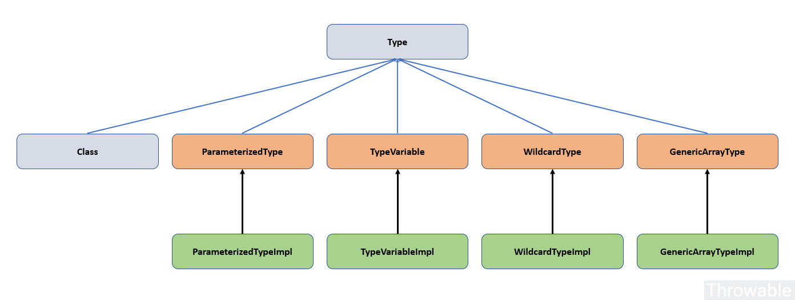

深入分析Java反射(三)-泛型 - Throwable

## 前提
 
Java反射的API在JavaSE1.7的时候已经基本完善，**但是本文编写的时候使用的是Oracle JDK11**，因为JDK11对于sun包下的源码也上传了，可以直接通过IDE查看对应的源码和进行Debug。

本文主要介绍反射中一个比较难的问题-泛型。

<a id="more"></a>

## 泛型的简介

泛型是在2004年JavaSE 5.0(JDK1.5)版本中添加到Java编程语言中的泛型编程工具。泛型的设计是为了应用在Java的类型系统，**提供"用类型或者方法操作各种类型的对象从而提供编译期的类型安全功能(原文：a type or method to operate on objects of various types while providing compile-time type safety)"**。但是在2016年的一些研究表明，泛型并不是在所有的情况下都能保证编译期的类型安全，例如切面(Aspect)编程的编译期类型安全并没有完全实现。

**泛型的一个最大的优点就是：提供编译期的类型安全**。举个很简单的例子，在引入泛型之前，`ArrayList`内部只维护了一个Object数组引用，这种做法有两个问题：

- 从数组列表获取一个元素的时候必须进行类型的强转。
- 向数组列表中可以添加任何类型的对象，导致无法得知数组列表中存放了什么类型的元素。

引入泛型之后，我们可以通过类型参数明确定义`ArrayList`：

```
ArrayList<String> list = new ArrayList<String>();


ArrayList<String> list = new ArrayList<>();

```

下面先列举出Java中泛型的一些事实：

- **Java虚拟机中不存在泛型，只有普通的类和方法，但是字节码中存放着泛型相关的信息**。
- 所有的类型参数都使用它们的限定类型替换。
- 桥方法(Bridge Method)由编译器合成，用于保持多态(**Java虚拟机利用方法的参数类型、方法名称和方法返回值类型确定一个方法**)。
- 为了保持类型的安全性，必要时需要进行类型的强制转换。

## 理解类型擦除

### 类型擦除是什么

类型擦除(或者更多时候喜欢称为"**泛型擦除**")的具体表现是：无论何时定义一个泛型类型，都自动提供一个相应的原始类型(Raw Type，这里的原始类型并不是指int、boolean等基本数据类型)，原始类型的类名称就是带有泛型参数的类删去泛型参数后的类型名称，而原始类型会擦除(Erased)类型变量，并且把它们替换为限定类型(如果没有指定限定类型，则擦除为Object类型)，举个例子`Pair<T>`带有泛型参数的类型如下：

```
public class Pair<T>{

    private T first;
    private T second;

    public Pair(T first,T second){
        this.first = first;
        this.second = second;
    }

    public T getFirst(){
        return first;
    }

    public T getSecond(){
        return second;
    }
}

```

擦除类型后的`Pair<T>`的原始类型为：

```
public class Pair{

    private Object first;
    private Object second;

    public Pair(Object first,Object second){
        this.first = first;
        this.second = second;
    }

    public Object getFirst(){
        return first;
    }

    public Object getSecond(){
        return second;
    }
}

```

举个更复杂的例子，如果泛型参数类型是有上限的，变量会擦除为上限的类型：

```
public class Interval<T extends Comparable & Serializable> implements Serializable {

	private T lower;
	private T upper;

	public Interval(T lower, T upper) {
		this.lower = lower;
		this.upper = upper;
	}

	
}

```

类型擦除后的`Interval<T extends Comparable & Serializable>`原始类型：

```
public class Interval implements Serializable {

	private Comparable lower;
	private Comparable upper;

	public Interval(Comparable lower, Comparable upper) {
		this.lower = lower;
		this.upper = upper;
	}

	
}

```

像上面这种多个泛型上限的类型，应该尽量把标识接口上限类型放在边界列表的尾部，这样做可以提高效率。

### 为什么需要擦除类型

在JDK1.5之前，也就是在泛型出现之前，所有的类型包括基本数据类型(int、byte等)、包装类型、其他自定义的类型等等都可以使用类文件(.class)字节码对应的`java.lang.Class`描述，也就是`java.lang.Class`类的一个具体实例对象就可以代表任意一个指定类型的原始类型。这里把泛型出现之前的所有类型暂时称为"历史原始类型"。

在JDK1.5之后，数据类型得到了扩充，出历史原始类型扩充了四种泛型类型：参数化类型(ParameterizedType)、类型变量类型(TypeVariable)、限定符类型(WildcardType)、泛型数组类型(GenericArrayType)。历史原始类型和新扩充的泛型类型都应该统一成各自的字节码文件类型对象，也就应该把泛型类型归并进去`java.lang.Class`中。但是由于JDK已经迭代了很多版本，泛型并不属于当前Java中的基本成分，如果JVM中引入真正的泛型类型，那么必须涉及到JVM指令集和字节码文件的修改(这个修改肯定不是小的修改，因为JDK当时已经迭代了很多年，而类型是编程语言的十分基础的特性，引入泛型从项目功能迭代角度看可能需要整个JVM项目做回归测试)，这个功能的代价十分巨大，所以Java没有在Java虚拟机层面引入泛型。

Java为了使用泛型，于是使用了类型擦除的机制引入了"泛型的使用"，并没有真正意义上引入和实现泛型。Java中的泛型实现的是编译期的类型安全，也就是泛型的类型安全检查是在编译期由编译器(常见的是javac)实现的，这样就能够确保数据基于类型上的安全性并且避免了强制类型转换的麻烦(实际上，强制类型转换是由编译器完成了，只是不需要人为去完成而已)。**一旦编译完成，所有的泛型类型都会被擦除，如果没有指定上限，就会擦除为Object类型，否则擦除为上限类型。**

既然Java虚拟机中不存在泛型，那么为什么可以从JDK中的一些类库获取泛型信息？这是因为类文件(.class)或者说字节码文件本身存储了泛型的信息，相关类库(可以是JDK的类库，也可以是第三方的类库)读取泛型信息的时候可以从字节码文件中提取，例如比较常用的字节码操作类库ASM就可以读取字节码中的信息甚至改造字节码动态生成类。例如前面提到的`Interval<T extends Comparable & Serializable>`类，使用`javap -c -v`命令查看其反编译得到的字节码信息，可以看到其签名如下：

```
Signature: #22                          

```

这里的签名信息实际上是保存在常量池中的，关于字节码文件的解析将来会出一个系列文章详细展开。

## Type体系

前文提到了在JDK1.5中引入了四种新的泛型类型`java.lang.reflect.ParameterizedType`、`java.lang.reflect.TypeVariable`、`java.lang.reflect.WildcardType`、`java.lang.reflect.GenericArrayType`，包括原来存在的`java.lang.Class`，一共存在五种类型。为了程序的扩展性，引入了`java.lang.reflect.Type`类作为这五种类型的公共父接口，这样子就可以使用`java.lang.reflect.Type`类型参数去接收以上五种子类型的实参或者返回值，由此从逻辑上统一了泛型相关的类型和原始存在的`java.lang.Class`描述的类型。Type体系如下：



注意：

- ParameterizedType、TypeVariable、WildcardType、GenericArrayType都是接口，它们位于`java.lang.reflect`包中。
- ParameterizedTypeImpl、TypeVariableImpl、WildcardTypeImpl、GenericArrayTypeImpl是四种泛型类型的实现，位于`sun.reflect.generics.reflectiveObjects`包中。

Type体系虽然看似很美好解决了泛型相关的类型和原始存在的`java.lang.Class`描述的类型的统一问题，但是引入了新的问题：如果一个方法返回值为`java.lang.reflect.Type`类型，或者一个方法的入参类型为`java.lang.reflect.Type`类型，这两种情况下，可能需要对`java.lang.reflect.Type`类型的对象做子类型判断，因为它的子类型有可能是上面提到的五种类型中的其中一种，这一点提高了编码的复杂性。

### ParameterizedType

ParameterizedType，parameterized type，也就是参数化类型，注释里面说到`ParameterizedType`表示一个参数化类型，例如`Collection<String>`，实际上只要带有参数化(泛型)标签`<ClassName>`的参数或者属性，都属于ParameterizedType。例如下面的类型都是ParameterizedType：

```
Set<String> set;
Class<Integer> clazz;
MyClass<String> myClass;
List<String> list;

class MyClass<V>{

}

```

而像下面的忽略泛型参数或者基本数据类型和基本数据类型的包装类都不是ParameterizedType：

```
String name = "throwbale";
int age = 25;
Set set;
List list;

public String method(int age,String name){

}

```

`java.lang.reflect.ParameterizedType`接口继承自`java.lang.reflect.Type`接口，实现类是`sun.reflect.generics.reflectiveObjects.ParameterizedTypeImpl`，其实，必要的时候，我们也可以自行实现ParameterizedType，像一些Json解析工具都是自行实现ParameterizedType的。ParameterizedType接口的方法如下：

```
public interface ParameterizedType extends Type {

    Type[] getActualTypeArguments();

    Type getRawType();

    Type getOwnerType();
} 

```

- Type\[\] getActualTypeArguments()：返回这个ParameterizedType类型的参数的实际类型Type数组，Type数组里面的元素有可能是Class、ParameterizedType、TypeVariable、GenericArrayType或者WildcardType之一。值得注意的是，无论泛型符号`<>`中有几层`<>`嵌套，这个方法仅仅脱去最外层的`<>`，之后剩下的内容就作为这个方法的返回值。
- Type getRawType()：返回的是当前这个ParameterizedType的原始类型，从ParameterizedTypeImpl的源码看来，原始类型rawType一定是一个`Class<?>`实例。举个例子，`List<Person>`通过`getRawType()`获取到的Type实例实际上是`Class<?>`实例，和List.class等价。
- Type getOwnerType()：获取原始类型所属的类型，从ParameterizedTypeImpl的源码看来，就是调用了原始类型rawType的`getDeclaringClass()`方法，而像rawType为`List<T>`、`Map<T>`这些类型的getOwnerType()实际上就是调用List.class.getDeclaringClass()，Map.class.getDeclaringClass()，返回值都是null。

举个关于ParameterizedType的简单使用例子：

```
public class Main13 {

    public static void main(String[] args) throws Exception {
        Class<Sub> subClass = Sub.class;
        Type genericSuperclass = subClass.getGenericSuperclass();
        if (genericSuperclass instanceof ParameterizedType) {
            ParameterizedType parameterizedType = (ParameterizedType) genericSuperclass;
            
            Type[] actualTypeArguments = parameterizedType.getActualTypeArguments();
            for (Type type : actualTypeArguments) {
                System.out.println(type + " is ParameterizedType -> " + (type instanceof ParameterizedType));
            }
        }
        Field field = subClass.getDeclaredField("clazz");
        Type genericType = field.getGenericType();
        System.out.println(genericType + " is ParameterizedType -> " + (genericType instanceof ParameterizedType));
    }

    public static class Person {

    }

    public static abstract class Supper<T, E> {

    }

    public static class Sub extends Supper<String, List<Person>> {

    }
}

```

输出结果：

```
class java.lang.String is ParameterizedType -> false
java.util.List<org.throwable.inherited.Main13$Person> is ParameterizedType -> true
java.lang.Class<?> is ParameterizedType -> true

```

### TypeVariable

TypeVariable，type variable，也就是类型变量，它是各种类型变量的公共父接口，它主要用来表示带有上界的泛型参数的信息，它和ParameterizedType不同的地方是，ParameterizedType表示的参数的最外层一定是已知具体类型的(如`List<String>`)，而TypeVariable面向的是K、V、E等这些泛型参数字面量的表示。常见的TypeVariable的表示形式是`<T extends KnownType-1 & KnownType-2>`。TypeVariable接口源码如下：

```
public interface TypeVariable<D extends GenericDeclaration> extends Type {
   
    Type[] getBounds();
    
    D getGenericDeclaration();
    
    String getName();
    
    AnnotatedType[] getAnnotatedBounds()
}

```

- Type\[\] getBounds()：获得该类型变量的上限(上边界)，若无显式定义(extends)，默认为Object，类型变量的上限可能不止一个，因为可以用&符号限定多个（这其中有且只能有一个为类或抽象类，且必须放在extends后的第一个，即若有多个上边界，则第一个&之后的必为接口）。
- D getGenericDeclaration：获得声明(定义)这个类型变量的类型及名称，会使用泛型的参数字面量表示，如`public void club.throwable.Main.query(java.util.List<club.throwable.Person>)`。
- String getName()：获取泛型参数的字面量名称，即K、V、E之类名称。
- AnnotatedType\[\] getAnnotatedBounds()：Jdk1.8新增的方法，用于获得注解类型的上限，若未明确声明上边界则默认为长度为0的数组。

举个关于TypeVariable的简单使用例子：

```
public class Main14 {

    public static void main(String[] args) throws Exception {
        Class<Supper> subClass = Supper.class;
        TypeVariable<Class<Supper>>[] typeParameters = subClass.getTypeParameters();
        for (TypeVariable<Class<Supper>> typeVariable : typeParameters) {
            System.out.println("getBounds --> " + Arrays.toString(typeVariable.getBounds()));
            System.out.println("getGenericDeclaration  --> " + typeVariable.getGenericDeclaration());
            System.out.println("getName --> " + typeVariable.getName());
            AnnotatedType[] annotatedBounds = typeVariable.getAnnotatedBounds();
            StringBuilder stringBuilder = new StringBuilder("getAnnotatedBounds --> ");
            for (AnnotatedType annotatedType : annotatedBounds) {
                java.lang.annotation.Annotation[] annotations = annotatedType.getAnnotations();
                for (java.lang.annotation.Annotation annotation : annotations) {
                    stringBuilder.append(annotation).append(",");
                }
            }
            System.out.println(stringBuilder.toString());
            System.out.println("===================");
        }
    }

    @Target(ElementType.TYPE)
    public @interface Annotation {

    }

    interface InterFace {

    }

    public static class Person {

    }

    public static abstract class Supper<T extends Person & InterFace, E extends Annotation> {

    }
}

```

输出结果：

```
getBounds --> [class org.throwable.inherited.Main14$Person, interface org.throwable.inherited.Main14$InterFace]
getGenericDeclaration  --> class org.throwable.inherited.Main14$Supper
getName --> T
getAnnotatedBounds -->
===================
getBounds --> [interface org.throwable.inherited.Main14$Annotation]
getGenericDeclaration  --> class org.throwable.inherited.Main14$Supper
getName --> E
getAnnotatedBounds -->
===================

```

### WildcardType

WildcardType用于表示通配符(?)类型的表达式的泛型参数，例如`<? extends Number>`等。根据WildcardType注释提示：现阶段通配符表达式仅仅接受一个上边界或者下边界，这个和定义类型变量时候可以指定多个上边界是不一样。但是为了保持扩展性，这里返回值类型写成了数组形式。实际上现在返回的数组的大小就是1。WildcardType接口源码如下：

```
public interface WildcardType extends Type {

    Type[] getUpperBounds();

    Type[] getLowerBounds();
}

```

- Type\[\] getUpperBounds()：获取泛型通配符的上限类型Type数组，实际上目前该数组只有一个元素，也就是说只能有一个上限类型。
- Type\[\] getLowerBounds()：获取泛型通配符的下限类型Type数组，实际上目前该数组只有一个元素，也就是说只能有一个下限类型。

举个关于WildcardType的简单使用例子：

```
public class Main16 {

    public static void main(String[] args) {
        Class<Main16> clazz = Main16.class;
        Method[] methods = clazz.getMethods();
        for (Method method : methods) {
            if ("print".equals(method.getName())) {
                Type[] genericParameterTypes = method.getGenericParameterTypes();
                for (Type type : genericParameterTypes) {
                    if (type instanceof ParameterizedType) {
                        ParameterizedType parameterizedType = (ParameterizedType) type;
                        Type[] actualTypeArguments = parameterizedType.getActualTypeArguments();
                        for (Type actualType : actualTypeArguments) {
                            if (actualType instanceof WildcardType) {
                                WildcardType wildcardType = (WildcardType) actualType;
                                System.out.println("WildcardType --> " + wildcardType + " getUpperBounds--> "
                                        + Arrays.toString(wildcardType.getUpperBounds()) + " getLowerBounds--> " + Arrays.toString(wildcardType.getLowerBounds()));
                            } else {
                                System.out.println("Not WildcardType --> " + actualType);
                            }
                        }

                    }
                }
            }
        }
    }

    interface Person {

    }

    public static void print(List<? extends Number> list, Set<? super Person> persons) {

    }
}

```

输出结果：

```
WildcardType --> ? extends java.lang.Number getUpperBounds--> [class java.lang.Number] getLowerBounds--> []
WildcardType --> ? super org.throwable.inherited.Main16$Person getUpperBounds--> [class java.lang.Object] getLowerBounds--> [interface org.throwable.inherited.Main16$Person]

```

这里注意的是`List<? extends Number> list`这个参数整体来看是ParameterizedType类型，剥掉第一次List之后的`? extends Number`是WildcardType类型。

### GenericArrayType

GenericArrayType，generic array type，也就是泛型数组，也就是元素类型为泛型类型的数组实现了该接口。它要求元素的类型是ParameterizedType或TypeVariable(实际中发现元素是GenericArrayType也是允许的)。举个例子：

```
List<String>[] listArray; 
T[] tArray; 

Person[] persons; 
List<String> strings; 

```

GenericArrayType接口的源码如下：

```
public interface GenericArrayType extends Type {

    Type getGenericComponentType();
}

```

- Type getGenericComponentType()：获取泛型数组中元素的类型。注意无论从左向右有几个`[]`并列，这个方法仅仅脱去最右边的`[]`之后剩下的内容就作为这个方法的返回值。

举个关于GenericArrayType的简单使用例子：

```
public class Main15<T> {


    public static void main(String[] args) throws Exception {
        Method[] methods = Main15.class.getMethods();
        for (Method method : methods) {
            if ("method".equals(method.getName())) {
                Type[] genericParameterTypes = method.getGenericParameterTypes();
                for (Type type : genericParameterTypes) {
                    if (type instanceof GenericArrayType) {
                        System.out.println("GenericArrayType --> " + type + " getGenericComponentType --> "
                                + ((GenericArrayType) type).getGenericComponentType());
                    } else {
                        System.out.println("Not GenericArrayType --> " + type);
                    }
                }
            }
        }
    }

    public static <T> void method(String[] strings, List<String> ls, List<String>[] lsa, T[] ts, List<T>[] tla, T[][] tts) {

    }
}

```

输出结果：

```
Not GenericArrayType --> class [Ljava.lang.String;
Not GenericArrayType --> java.util.List<java.lang.String>
GenericArrayType --> java.util.List<java.lang.String>[] getGenericComponentType --> java.util.List<java.lang.String>
GenericArrayType --> T[] getGenericComponentType --> T
GenericArrayType --> java.util.List<T>[] getGenericComponentType --> java.util.List<T>
GenericArrayType --> T[][] getGenericComponentType --> T[]

```

这里分析一下：

- `String[] strings`：数组是Class类型。
- `List<String> ls`：列表是ParameterizedType类型。
- `List<String>[] lsa`：数组是GenericArrayType类型，调用getGenericComponentType后返回的类型是`java.util.List<java.lang.String>`，也就是数组元素是ParameterizedType类型。
- `T[] ts`：s数组是GenericArrayType类型，调用getGenericComponentType后返回的类型是T，也就是数组元素是TypeVariable类型。
- `List<T>[] tla`：数组是GenericArrayType类型，调用getGenericComponentType后返回的类型是`java.util.List<T>`，也就是数组元素是ParameterizedType类型。
- `T[][] tts`：数组是GenericArrayType类型，调用getGenericComponentType后返回的类型T\[\]，也就是数组元素是GenericArrayType类型。

## 泛型的约束

使用Java泛型的时候需要考虑一些限制，这些限制大多数是由泛型类型擦除引起的。

- 1、不能用基本类型实例化类型参数，也就是8种基本类型不能作为泛型参数，例如`Pair<int>`是非法的，会导致编译错误，而`Pair<Integer>`是合法的。
- 2、运行时的类型查询只能适用于原始类型(非参数化类型)。

```

if(a instanceof Pair<String>) 

if(a instanceof Pair<T>)  


if(a instanceof Pair)  

```

- 3、不能创建参数化类型的数组，例如`Pair<String>[] arr = new Pair<String>[10]`是非法的。
- 4、不能实例化类型变量或者类型变量数组，例如`T t = new T()`或者`T[] arr = new T[10]`都是非法的。
- 5、Varargs警告，这是因为第4点原因导致的，一般会发生在泛型类型变量作为可变参数的情况，例如`public static <T> addAll(Collection<T> con,T ... ts)`，第二个参数实际上就是泛型类型变量数组，但是这种情况是合法的，不过会受到编译器的警告，可以通过`@SuppressWarnings("unchecked")`注解或者`@SafeVarargs`注解标注该方法以消除警告。
- 6、不能在静态域或者方法中引用类型变量，例如`private static T singleInstance;`这样是非法的。
- 7、不能抛出或者抛出或者捕获泛型类型变量，但是如果在异常规范中使用泛型类型变量则是允许的，举两个例子仔细品味一下：

```

public static <T extends Throwable> void doWork(Class<T> t) {
    try{

    }catch(T t){  

    }
}


public static <T extends Throwable> void doWork(T t) throws T{
    try{

    }catch(Throwable e){  
       throw e;
    }
}

```

- 8、通过使用`@SuppressWarnings("unchecked")`注解可以消除Java类型系统的部分基本限制，一般使用在强制转换原始类型为泛型类型(只是在编译层面告知编译器)的情况，如：

```

@SuppressWarnings("unchecked")
public static <T extends Throwable> void throwAs(Throwable e){
    throw (T) e;
}

```

其实还有泛型的继承规则和通配符规则(可以看下前面介绍的Type的子类型)等等，这里不详细展开。

## 再议泛型数组的问题

在Java泛型约束中，无法实例化参数化类型数组，例如`Pair<Integer>[] table = new Pair<Integer>[10];`是非法的。根本原因在于泛型类型的擦除和数组会记录元素类型的特性。举个例子，假设可以实例化参数化类型数组：

```
Pair<String>[] table = new Pair<String>[10];

```

上面的参数化类型数组在泛型擦除之后，数组实例table的类型为`Pair[]`，数组元素类型为`Pair`，可以强转为`Object[]`类型数组：

```
Object[] objArray = table;

```

基于泛型擦除，数组objArray可以任意赋值`Pair<AnyType>`的泛型化实例，例如：

```
objArray[0] = new Pair<Integer>();
objArray[1] = new Pair<Long>();
objArray[2] = new Pair<String>();
....

```

**这样子能够通过数组存储元素的检查，后续操作数组元素随时会出现ClassCastException。基于以上的原因，Java从编译层面直接拒绝创建参数化类型数组**。

另外，类型变量数组的实例化也是非法的，如`T[] tt = new T[10];`，这是因为类型变量仅仅是编译期的字面量，其实和Java的类型体系是不相关的。

但是要注意一点：**参数化类型数组和类型变量数组可以作为方法入参变量或者类的成员变量**。例如下面的做法是合法的：

```
public class Pair<T> {

	private Pair<T>[] attr;
	private T[] ts;

	public static <T> void method(Pair<T> pair) {

	}

	public static <T> void method(T[] ts) {

	}
}

```

最后一点，可以查看前一篇文章，其实**可以使用反射创建泛型数组**。

## 无限定通配符

泛型中支持无限定通配符`<?>`，使用无限定通配符类型的实例有以下限制：

- 所有的Getter方法只能返回Object类型的值。
- 所有的Setter方法只能赋值null，其他类型的值的设置都是非法的。

无限定通配符类型可以看做原始类型的一个影子类型，它屏蔽了除了null之外的设值操作，所有获取值的方法只能返回Object类型结果，这种特性使得通过无限定通配符类型进行一些简单的操作变得十分方便，例如：

```
public static boolean hasNulls(Pair<?> p){
    return p.getFirst() == null || p.getSecond() == null;
}

```

如果反射用得比较熟的话，`java.lang.Class`也有类似的用法：

```
Class<?> clazz = ...;
Object instance = class.newInstance();

```

## 桥方法(Bridge Method)

先说明一下什么是桥方法，看下面的代码：

```

public interface Supper<T> {

    void method(T t);
}


public class Sub implements Supper<Integer> {

	@Override
	public void method(Integer value) {
		System.out.println(value);
	}
}

```

父类`Supper<T>`在泛型擦除后原始类型是：

```
public interface Supper{

    void method(Object t);
}

```

子类`Sub`虽然实现了父类`Supper`，但是它只实现了`void method(Integer value)`而没有实现父类中的`void method(Object t)`，这个时候，编译期编译器会为子类`Sub`创建此方法，也就是子类`Sub`会变成这样：

```
public class Sub implements Supper<Integer> {

	@Override
	public void method(Integer value) {
		System.out.println(value);
	}
		
	public void method(Object value) {
		this.method((Integer) value);
	}
}

```

如果你直接这样编写一个子类`Sub`是会编译报错，而上面这里编译器生成的`void method(Object value)`方法就是桥方法。可以用反射验证一下：

```
public static void main(String[] args) throws Exception {
	Method[] declaredMethods = Sub.class.getDeclaredMethods();
	List<Method> methods = new ArrayList<>();
	for (Method method : declaredMethods) {
		if (method.getName().equals("method")) {
			methods.add(method);
		}
	}
	for (Method method : methods) {
		System.out.println(String.format("name=%s,paramTypes=%s,isBridge=%s", method.getName(),
		Arrays.toString(method.getParameterTypes()), method.isBridge()));
	}
}


name=method,paramTypes=[class java.lang.Integer],isBridge=false
name=method,paramTypes=[class java.lang.Object],isBridge=true

```

桥方法的定义比较模糊，因此这里只考虑它出现的情况，不做盲目的定义。不单只是子类实现带有泛型参数的父类会产生桥方法，还有一种比较常见的情况是在方法覆盖的时候指定一个更加"严格的"返回值类型的时候，也会产生桥方法，例如：

```
public Employee implements Cloneable{

    public Employee clone() throws CloneNotSupportedException{
        
    }
}


public Employee implements Cloneable{

    public Employee clone() throws CloneNotSupportedException{
        
    }

    
    public Object clone() throws CloneNotSupportedException{
        
    }    
}

```

这是因为：

- 编译的时候Java的方法签名是方法名称加上方法参数类型列表，也就是方法名和参数类型列表确定一个方法的签名(这样就可以很好理解方法重载，还有Java中的参数都是形参，所以参数名称没有实质意义，只有参数类型才是有意义的)。
- Java虚拟机定义一个方法的签名是由方法名称、方法返回值类型和方法参数类型列表组成，所以JVM认为返回值类型不同，而方法名称和参数类型列表一致的方法是不相同的方法。

仔细看，其实两种情况都是由于继承才导致桥方法出现。

## JDK中操作泛型的API

这里列举一下JDK中笔者所知的操作泛型的相关API(可以会有遗漏)，这些API主要和反射操作相关：

**`java.lang.Class`中的相关方法：**

| 方法  | 功能  |
| --- | --- |
| Type\[\] getGenericInterfaces() | 返回类实例的接口的泛型类型 |
| Type getGenericSuperclass() | 返回类实例的父类的泛型类型 |

**`java.lang.reflect.Constructor`中的相关方法：**

| 方法  | 功能  |
| --- | --- |
| Type\[\] getGenericExceptionTypes() | 返回构造器的异常的泛型类型 |
| Type\[\] getGenericParameterTypes() | 返回构造器的方法参数的泛型类型 |

**`java.lang.reflect.Method`中的相关方法：**

| 方法  | 功能  |
| --- | --- |
| Type\[\] getGenericExceptionTypes() | 返回方法的异常的泛型类型 |
| Type\[\] getGenericParameterTypes() | 返回方法参数的泛型类型 |
| Type getGenericReturnType() | 返回方法返回值的泛型类型 |

**`java.lang.reflect.Field`中的相关方法：**

| 方法  | 功能  |
| --- | --- |
| Type getGenericType() | 返回属性的泛型类型 |

如果在使用上面的方法得到的返回值和期望的返回值不相同，请加深对泛型类型擦除的认识。

## 小结

参考资料：

个人认为，泛型其实是JDK迭代过程中妥协和兼容历史的产物，它是一种没有实现的泛型，当然，提供编译期类型安全这一点可以让开发者避免类型转换出现人为错误，也就是说：Java中的泛型使得程序或者代码的可读性和安全性提高，这是它的最大优势。

- 《Java核心技术卷I-基础知识》
- [维基百科-Generics in Java](https://en.wikipedia.org/wiki/Generics_in_Java)

(本文完 e-20181204-c-3d r-20181205)