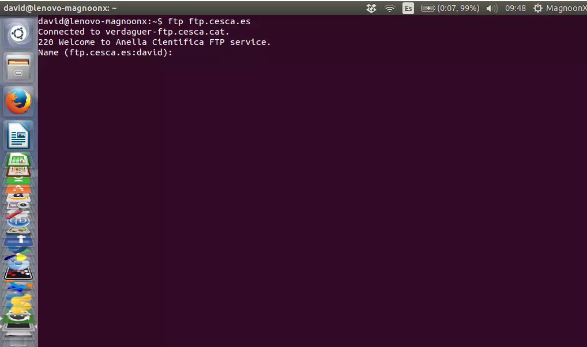
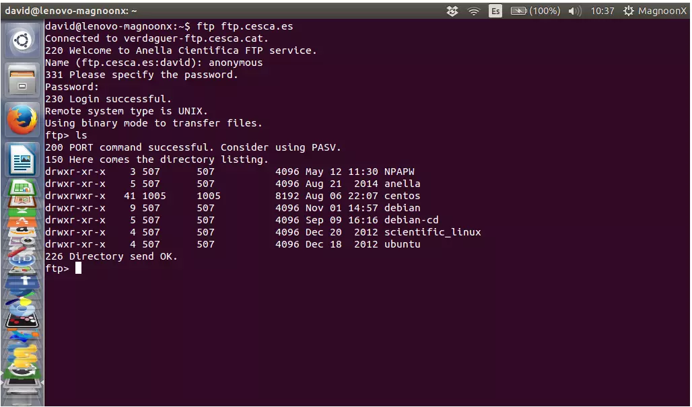
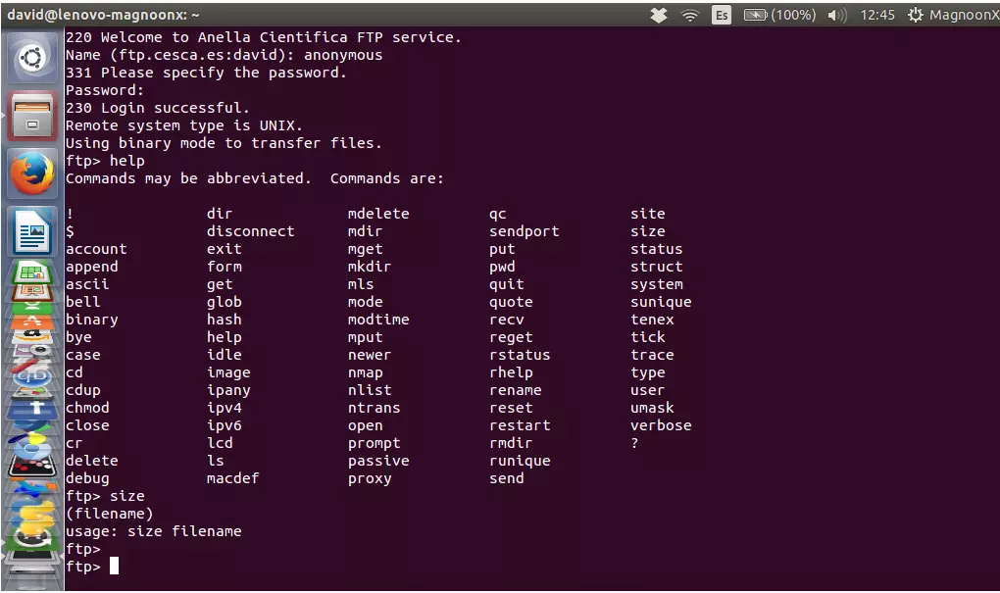

Linux 使用技巧

[TOC]
## 通过apt-get install安装软件后，软件的安装目录 
通过apt-get install 命令安装了一些软件，但这些软件的源码以及那些安装完以后的文件放在哪个文件夹下面？ 
命令：dpkg -L 软件名 
eg：dpkg -L gcc 
dpkg -L gcc-4.4 
dpkg -L g++ 
dpkg -L g++-4.4 

## 查找关键字：
grep /root/directory 'key word' -R

## 增加桌面快捷方式：
/usr/share/applications/...desktop

## 快速进入桌面快捷键
（1）System Settings -> Appearance -> Add show desktop icon to the launcher
（2）Ctrl + Win + D：快速显示桌面 / 恢复屏幕显示

## 查找包含某个命令的安装包

apt-cache search vim

## 创建连接

ln -s 源文件 目标(新生成的文件名)

## 文件目录：

/etc/hosts：ip

## 重启及关机

reboot

shutdown -r now 立刻重启 (root用户使用)

shutdown -r 10 过10分钟自动重启 (root用户使用)

shutdown -r 20:35 在时间为20:35时候重启 (root用户使用)

如果是通过shutdown命令设置重启的话，可以用shutdown -c命令取消重启

关机命令：

halt 立刻关机

poweroff 立刻关机

shutdown -h now 立刻关机 (root用户使用)

shutdown -h 10 10分钟后自动关机

如果是通过shutdown命令设置关机的话，可以用shutdown -c命令取消重启

## 命令行安装卸载deb包

sudo dpkg -i 软件包名.deb

卸载.deb文件，可以使用Adept，或输入：

sudo apt-get remove 软件包名称

## 查看已安装

dpkg -l |grep virtualbox

## 几个卸载的区别
1. apt-get autoclean:
    如果你的硬盘空间不大的话，可以定期运行这个程序，将已经删除了的软件包的.deb安装文件从硬盘中删除掉。如果你仍然需要硬盘空间的话，可以试试apt-get clean，这会把你已安装的软件包的安装包也删除掉，当然多数情况下这些包没什么用了，因此这是个为硬盘腾地方的好办法。
2. apt-get clean:
    类似上面的命令，但它删除包缓存中的所有包。这是个很好的做法，因为多数情况下这些包没有用了。但如果你是拨号上网的话，就得重新考虑了。
3. apt-get autoremove:
    删除为了满足其他软件包的依赖而安装的，但现在不再需要的软件包。
4. 其它：
    apt-get remove 软件包名称：
    删除已安装的软件包（保留配置文件）。
    apt-get --purge remove 软件包名称：
     删除已安装包（不保留配置文件)。
    去除软件仓库 ppa:repository
    去/etc/apt/sources.list.d该文件下删除对应文件

## Oracle Virtual Box
**问题：**
 VirtualBox error : kernel driver not installed(rc=-1908)：
**解决：**
`sudo apt-get remove virtualbox-dkms`
`sudo apt-get install virtualbox-dkms`

## 查找某个包
`sudo apt cache search package_name`

## 查看内存
df -m 或者 df -

## 查找指定目录深度
find . -maxdepth 1 name

## 查看内存使用情况
1. free
用来显示内存的使用情况，使用权限是所有用户。
```
free ［－b－k－m］ ［－o］ ［－s delay］ ［－t］ ［－V］

参数：
－b －k －m：分别以字节（KB、MB）为单位显示内存使用情况。
－s delay：显示每隔多少秒数来显示一次内存使用情况。
－t：显示内存总和列。
－o：不显示缓冲区调节列。 
```
2. uptime
用来显示任务队列信息。
| 现在的时间 | 系统开机运转到现在经过的时间 | 连线的使用者数量 | 最近一分钟，五分钟和十五分钟的系统负载 |
| -- | -- | -- | -- |
|11:00:16 up| 1 day  2:24|  4 users|  load average: 0.21, 0.25, 0.36|

3. top
实时地对系统处理器的状态进行监视。
```
命令格式：
top [-] [d] [p] [q] [c] [C] [S]    [n]
参数说明：
d：  指定每两次屏幕信息刷新之间的时间间隔。当然用户可以使用s交互命令来改变之。
p：  通过指定监控进程ID来仅仅监控某个进程的状态。
q：该选项将使top没有任何延迟的进行刷新。如果调用程序有超级用户权限，那么top将以尽可能高的优先级运行。
S： 指定累计模式
s ： 使top命令在安全模式中运行。这将去除交互命令所带来的潜在危险。
i：  使top不显示任何闲置或者僵死进程。
c：  显示整个命令行而不只是显示命令名
```
在top命令的显示窗口，我们还可以输入以下字母，进行一些交互：
```
h或者?  : 显示帮助画面，给出一些简短的命令总结说明。
k  ：终止一个进程。系统将提示用户输入需要终止的进程PID，以及需要发送给该进程什么样的信号。一般的终止进程可以使用15信号；如果不能正常结束那就使用信号9强制结束该进程。默认值是信号15。在安全模式中此命令被屏蔽。
i：忽略闲置和僵死进程。这是一个开关式命令。
q：  退出程序。
r：  重新安排一个进程的优先级别。系统提示用户输入需要改变的进程PID以及需要设置的进程优先级值。输入一个正值将使优先级降低，反之则可以使该进程拥有更高的优先权。默认值是10。
S：切换到累计模式。
s :  改变两次刷新之间的延迟时间。系统将提示用户输入新的时间，单位为s。如果有小数，就换算成ms。输入0值则系统将不断刷新，默认值是5。
f或者F :从当前显示中添加或者删除项目。
o或者O  :改变显示项目的顺序。
l: 切换显示平均负载和启动时间信息。即显示影藏第一行
m： 切换显示内存信息。即显示影藏内存行
t ： 切换显示进程和CPU状态信息。即显示影藏CPU行
c：  切换显示命令名称和完整命令行。 显示完整的命令。 这个功能很有用。
M ： 根据驻留内存大小进行排序。
P：根据CPU使用百分比大小进行排序。
T： 根据时间/累计时间进行排序。
W：  将当前设置写入~/.toprc文件中。这是写top配置文件的推荐方法。
```
TOP前五行统计信息：
（1）第一行是任务队列信息，同uptime命令的执行结果
（2）第二、三行为进程和CPU的信息
```
Tasks: 29 total 	进程总数
1 running	正在运行的进程数
28 sleeping	 睡眠的进程数
0 stopped	停止的进程数
0 zombie	僵尸进程数
Cpu(s): 0.3% us	用户空间占用CPU百分比
1.0% sy	内核空间占用CPU百分比
0.0% ni	用户进程空间内改变过优先级的进程占用CPU百分比
98.7% id	空闲CPU百分比
0.0% wa 	等待输入输出的CPU时间百分比
0.0% hi	 
0.0% si	 
```
（3）第四五行为内存信息
```
Mem: 191272k total	物理内存总量
173656k used	使用的物理内存总量
17616k free	空闲内存总量
22052k buffers	用作内核缓存的内存量
Swap: 192772k total 	交换区总量
0k used	使用的交换区总量
192772k free	空闲交换区总量
123988k cached	缓冲的交换区总量。 内存中的内容被换出到交换区，而后又被换入到内存，但使用过的交换区尚未被覆盖， 该数值即为这些内容已存在于内存中的交换区的大小。
相应的内存再次被换出时可不必再对交换区写入。
```

(4) 进程信息
|列名|含义|
|--|--|
|PID|进程id|
|PPID|父进程id|
|RUSER|Real user name|
|UID|进程所有者的用户id|
|USER|进程所有者的用户名|
|GROUP|进程所有者的组名|
|TTY启动进程的终端名。不是从终端启动的进程则显示为 ?|
|PR|优先级|
|NI|nice值。负值表示高优先级，正值表示低优先级|
|P|最后使用的CPU，仅在多CPU环境下有意义|
|%CPU|上次更新到现在的CPU时间占用百分比|
|TIME|进程使用的CPU时间总计，单位秒|
|TIME+|进程使用的CPU时间总计，单位1/100秒|
|%MEM|进程使用的物理内存百分比|
|VIRT|进程使用的虚拟内存总量，单位kb。VIRT=SWAP+RES|
|SWAP|进程使用的虚拟内存中，被换出的大小，单位kb。|
|RES|进程使用的、未被换出的物理内存大小，单位kb。RES=CODE+DATA|
|CODE|可执行代码占用的物理内存大小，单位kb|
|DATA|可执行代码以外的部分(数据段+栈)占用的物理内存大小，单位kb|
|SHR|共享内存大小，单位kb|
|nFLT|页面错误次数|
|nDRT|最后一次写入到现在，被修改过的页面数。|
|S|进程状态。<br>D=不可中断的睡眠状态<br>R=运行<br>S=睡眠<br>T=跟踪/停止<br>Z=僵尸进程|
|COMMAND|命令名/命令行|
|WCHAN|若该进程在睡眠，则显示睡眠中的系统函数名|
|Flags|任务标志，参考 sched.h|


4. vmstat 
```
procs -----------memory---------- ---swap-- -----io---- -system-- ----cpu----
 r  b   swpd   free   buff  cache   si   so    bi    bo   in   cs us sy id wa
 1  0 948544  93988  22672 443688    8   11    51    25   64   87  6  1 91  1
```
（1）观察磁盘活动情况
磁盘活动情况主要从以下几个指标了解：
`bi`：表示从磁盘每秒读取的块数（blocks/s），数字越大，表示读磁盘的活动越多。
`bo`：表示每秒写到磁盘的块数（blocks/s），数字越大，表示写磁盘的活动越多。
`wa`：cpu等待磁盘I／O（未决的磁盘IO）的时间比例。数字越大，表示文件系统活动阻碍cpu的情况越严重，因为cpu在等待慢速的磁盘系统提供数据。wa为0是最理想的。如果wa经常大于10，可能文件系统就需要进行性能调整了。
（2）观察cpu活动情况
vmstat比top更能反映出cpu的使用情况：
`us`：用户程序使用cpu的时间比例。这个数字越大，表示用户进程越繁忙。
`sy`：系统调用使用cpu的时间比例。注意，NFS由于是在内核里面运行的，所以NFS活动所占用的cpu时间反映在sy里面。这个数字经常很大的 话，就需要注意是否某个内核进程，比如NFS任务比较繁重。如果us和sy同时都比较大的话，就需要考虑将某些用户程序分离到另外的服务器上面，以免互相 影响。
`id`：cpu空闲的时间比例。
`wa`：cpu等待未决的磁盘IO的时间比例。

## 有软件包未被升级
`sudo apt-get dist-upgrade`

## 查询公网IP：
`curl ip.gs`

## 实时显示文件内容
`tail -f file`

## 查找文件，并搜索文件内容：
`find -maxdepth 3 -name "*.sh" -exec grep --color -n "mmp" {} +`

## 设置丢包率
```
    1. 设置
    sudo tc qdisc add dev enp1s0 root netem loss 60%
    2. 清除
    sudo tc qdisc del dev enp1s0 root
```
## 近期更新的文件
最后一个列出的将是最近创建或更新的文件。
```
$ ls -ltr ~/bin | tail -3
-rwx------ 1 shs shs   229 Sep 22 19:37 checkCPU
-rwx------ 1 shs shs   285 Sep 22 19:37 ff
-rwxrw-r-- 1 shs shs  1629 Sep 22 19:37 test2
```
## 列出今天更新的文件
```
$ ls -al --time-style=+%D | grep `date +%D`
drwxr-xr-x  60 shs  shs       69632 09/23/19 .
drwxrwxr-x   2 shs  shs     8052736 09/23/19 bin
-rw-rw-r--   1 shs  shs         506 09/23/19 stats
```

## 不搜索以点开头的目录（即隐藏目录），指定我们要查找的是文件而不是目录，并要求仅显示最近一天更新过的文件。
```
$ find . -not -path '*/\.*' -type f -mtime -1 -ls
   917517      0 -rwxrw-r--   1 shs      shs          683 Sep 23 11:00 ./newscript
```
***注意 -not 选项反转了 -path的行为，因此我们不会搜索以点开头的子目录。***

## 查找最大的文件和目录
```
$ du -kx | egrep -v "\./.+/" | sort -n | tail -5
918984      ./reports
1053980     ./notes
1217932     ./.cache
31470204    ./photos
39771212    .
```
>-k 选项让 du 以块列出文件大小，而 x 可防止其遍历其他文件系统上的目录（例如，通过符号链接引用）。命令运行后，du 命令会先列出文件大小，然后再调用 sort -n 来按照大小排序。

## 计数一个特定用户（alvin）的主目录中的文件
```
$ find /home/alvin -type f 2>/dev/null | wc -l
35624
```
>我们将 find 命令的错误输出发送到 /dev/null，为了避免搜索类似 ~/.cache 这类无法搜索并且对它的内容也不感兴趣的文件夹。

必要时，我们可以使用 `-maxdepth 1` 选项将 find 搜索范围限制在单个目录中，或者也可以将其设置为自己想要搜索的深度：
```
$ find /home/alvin -maxdepth 1 -type f | wc -l
387
```

## 重命名大量文件
我们想要将当前目录下所有文件的文件名中含有空格的全部更改为下划线，大家可以使用如下命令：
```
$ rename 's/ /_/g' *
```
>此命令行中的`g`代表"全局"。这就意味着该命令会将文件名中的所有空格更改为下划线，而不仅仅是第一个。

如果我们想要把文本的文件删除掉 .txt 扩展名，可以使用如下命令：
```
$ rename 's/.txt//g' *
```

## 快速打开所在目录
`nautilus .
`
## 批量修改多个文件中的某个字段
```
sed -i "s/aaa/bbb/g" \`grep aaa -rl ./qt\`
格式: sed -i "s/查找字段/替换字段/g" `grep 查找字段 -rl 路径`
```
> -i 表示inplace edit，就地修改文件
> -r 表示搜索子目录
> -l 表示输出匹配的文件名

## ftp 获取文件：
1. 建立连接：
`ftp ip`




2. 用户名密码登录，需要的话：

>绝大多数的 FTP 服务器是使用密码保护的，因此这些 FTP服务器会询问'username'和'password'.如果你连接到被称作匿名 FTP服务器（LCTT 译注：即，并不需要你有真实的用户信息即可使用的 FTP服务器称之为匿名 FTP服务器），可以尝试anonymous作为用户名以及使用空密码：
```
    1.Name: anonymous
    2.Password:
```
之后，终端会返回如下的信息：
```
230Login successful. 
Remote system type is UNIX.   
Using binary mode to transfer files.
ftp>
登录成功。 
```


3. 目录操作：
FTP 命令可以列出、移动和创建文件夹，如同我们在本地使用我们的电脑一样。ls可以打印目录列表，cd可以改变目录，mkdir可以创建文件夹。




4. 进入目录
`cd directory`


5. 下载文件：
> 以下命令都是在ftp中执行：
    1. `lcd local_directory`指定本地目录 
    2. `get file1`下载
    3. `mget *.txt` 批量下载

6. 上传文件：
    1.`lcd local_directory`指定本地目录  
    2. `put file1`上传，file1也可以是绝对路经
    3. `mput *.txt` 批量上传
    4. `put file1 file2` 指定上传后的文件名是file2

7. 关闭
`exit`

8. 寻求帮助
`help`



## 压缩文件：
1. 压缩当前目录下文件夹/文件test到test.tar.gz
`tar -zcvf test.tar.gz test`
2. 解压缩当前目录下的file.tar.gz到file:
`tar -zxvf file.tar.gz`
3. 查看压缩内容
`tar -tf test.tar.gz`

## 修改9图
1. 直接去掉后缀.9
2. 导入到[网站](https://www.uupoop.com/)，进行修改
3. 保存为webp格式
4. 导入到Android studio，转换为png，再转换为9图。*有可能你原来的图片也还在这文件夹，所以再转换为png时，需要把同名文件移除*

## 创建桌面快捷方式：
`/usr/share/applications`

## 查看实时网络
`sudo apt updatesudo apt -y install nload`
`nload enp1s0`

## `System program problem detected`错误，查看某个具体crash文件
查看该目录下的文件：`/var/crash`
暂时停止：`sudo systemctl disable apport` 
打开：`sudo systemctl enable apport`
永久停止：
`sudo vim /etc/default/apport` 
修改`enabled=1` 为 `enabled=0`

## 查找文件并显示绝对路径
`find . -name asm | xargs ls -ld`

## 查找文件夹及子文件夹下所有链接文件
`ls -alR | grep ^l`

## update-alternatives的默认值修改
```shell
vim /var/lib/dpkg/alternatives/java
```

## 查看需要升级的软件
`sudo apt list --upgradable`