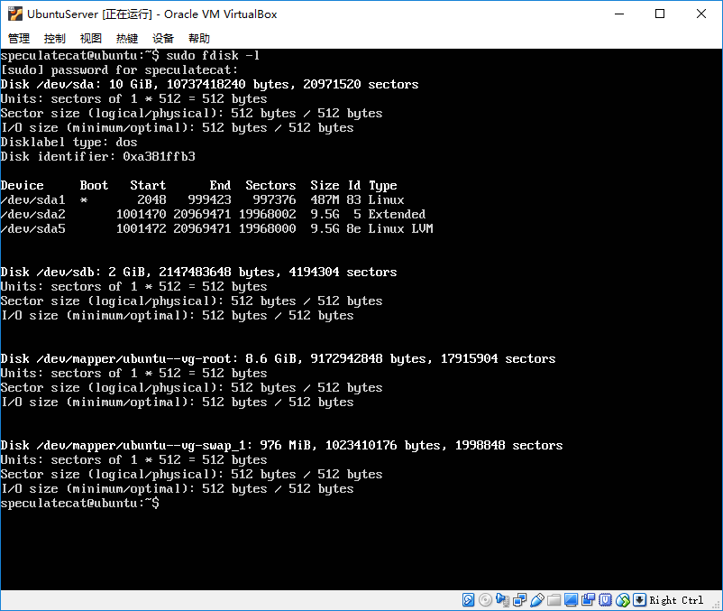
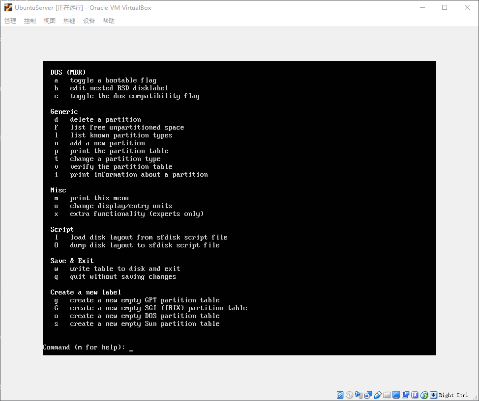
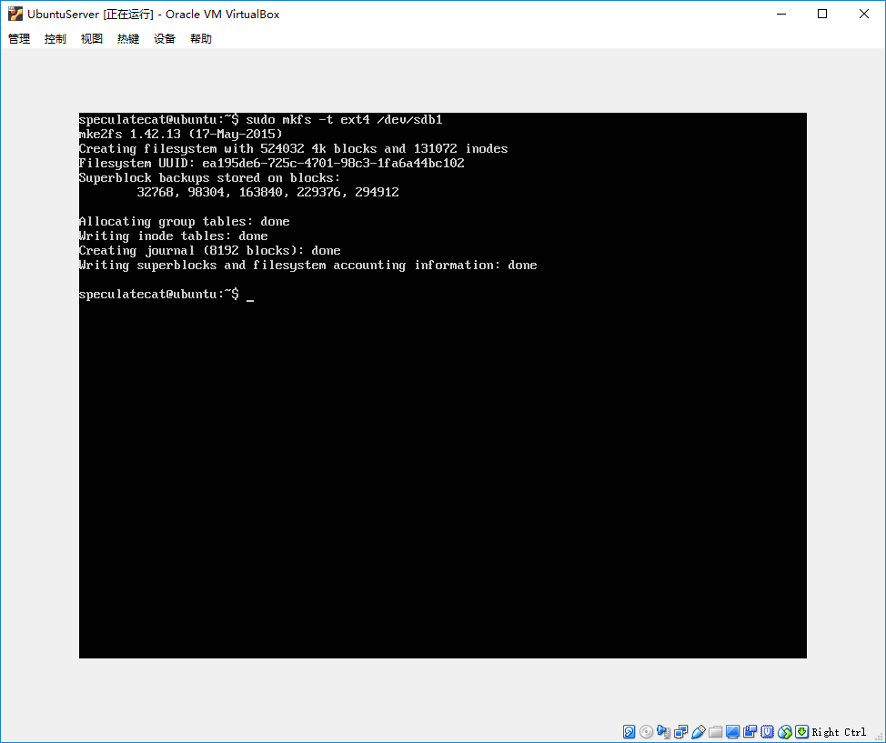
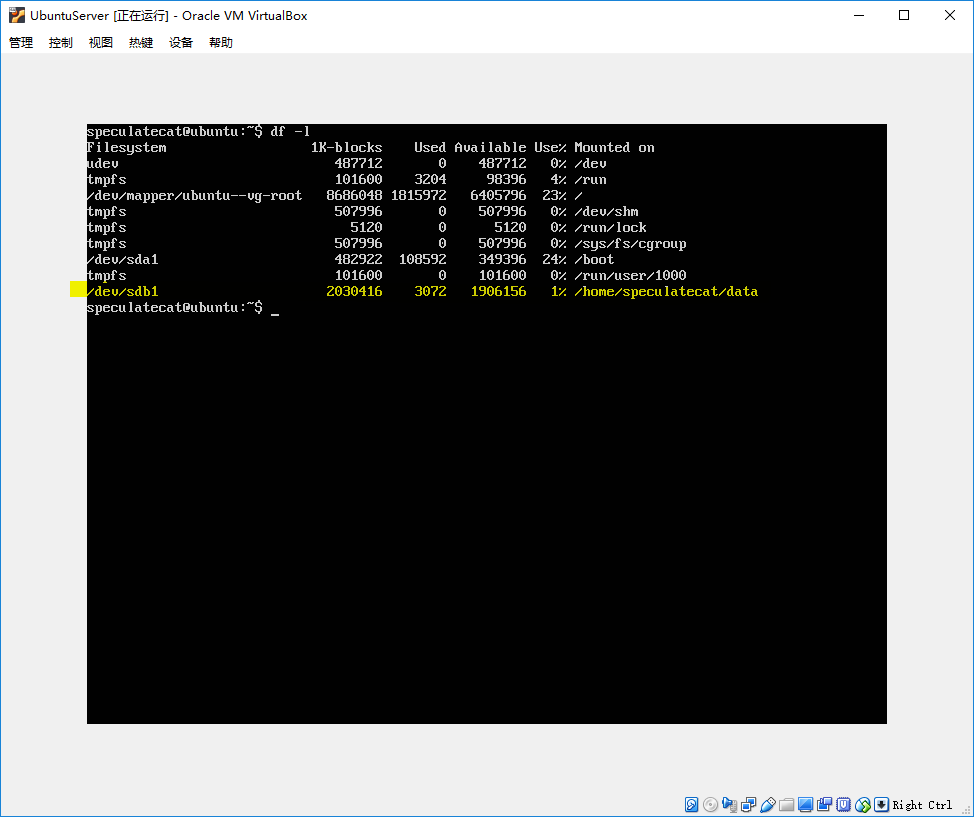
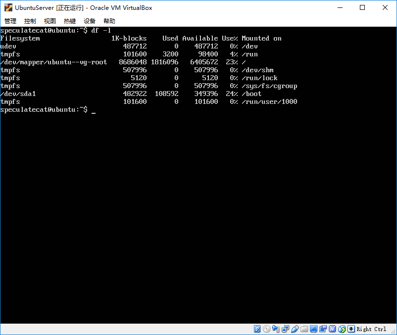
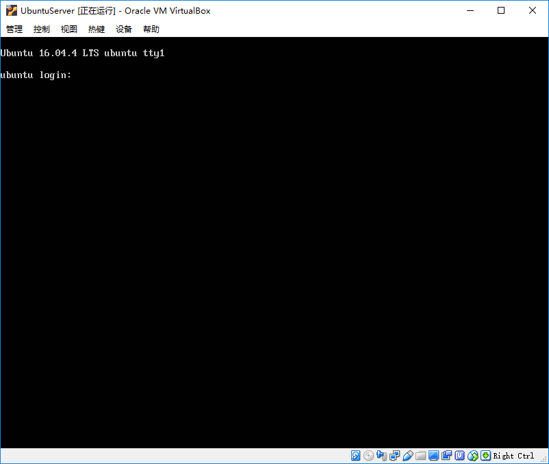

Ubuntu 挂载新硬盘

我们在使用 Ubuntu 作为服务器系统时，会有一个常用的操作情景，就是为服务器添加新硬盘。  


上图是我的工作室中的一台开发服务器的图片，可以看到，类似这种机架式服务器，前方都会有若干个可抽插硬盘笼，我们可以比较轻松的添加或者更换硬盘。

为方便演示如何为 Ubuntu 添加新硬盘，以及如何格式化分区和挂载，我们将使用 VirtualBox 虚拟机以及 Ubuntu Server 16.04 来进行演示。

## 在 VirtualBox 中添加新硬盘

我们可以在 VirtualBox 中打开指定虚拟机的设置选项，然后在存储选项卡中选择控制器SATA，然后点击右边的添加新硬盘图标，根据提示选择创建的新硬盘类型、容量大小、存放位置即可，大致方法与创建虚拟机时设置硬盘一样。以下是添加新虚拟硬盘后的截图，我们创建了一个名为 NewVirtualDisk1.vid 的虚拟硬盘。  


## 查看当前硬盘窗台

添加虚拟硬盘后，我们启动虚拟机，进入系统后，我们可以通过 `fdisk` 命令检查当前的硬盘状态。

执行以上命令后，我们可以看到以下输出：  



这里我们可以看到，我们原来的硬盘标为 /dev/sda 。下面还能看到一个名为 /dev/sdb ，容量为 2G 的硬盘，这个就是我们刚刚新设置的 NewVirtualDisk1.vid 虚拟硬盘。

## 为新硬盘分区

我们将使用 `fdisk` 对 /dev/sdb 进行分区操作，为了简化操作，我们会将这个新硬盘全部分为一个分区，具体操作如下：

进入分区工具后，我们可以输入 `m` 看指令说明：  



我们接下来要创建新分区，所以我们将会输入 `n`

```
Command (m for help): n
>> 
Partition type
  p primary (0, primary, 0 extended, 4free)
  e extended (container for logical partitions)
```

这里，我们可以给一块硬盘创建最多4个主分区，和若干逻辑分区，由于我们这里只为该硬盘创建一个分区，那么我们即创建一个主分区即可。

```
Select (default p):p
Partition number (1-4, default 1): 1
Frist sector (2048-4194303, default 2048): 2048
Last sector, *sectors or *size{K,M,G,T,P} (2048-4194303, default 4194303): 4194303
>> Create a new partition 1 of type 'Linux' and of size 2GiB
Command (m for help):w
```

我们创建分区的操作为：  
\- p 命令创建一个主分区  
\- 选择默认创建第一个分区  
\- 设置分区的开始位置  
\- 设置分区的结束位置，因为只设置一个分区，因此都选择默认选项  
\- w 命令保存分区设置

## 格式化分区

我们可以使用 `mkfs` 命令格式化分区，具体命令如下：

```
sudo mkfs -t ext4 /dev/sdb1
```

输入命令后，可以看到分区格式化成功：  



## 挂载分区

分区我们需要先创建一个目录，然后再把这个新分区挂载到目录上。具体操作如下：

```
# 我们在 ~ 目录下创建一个 data 的目录，并将新分区挂载到这里
mkdir ~/data
sudo mount /dev/sdb1 ~/data
```

挂载后，我们再通过 `df` 命令查看是否挂载成功：  



## 开机自动挂载设置

我们使用以上方法挂载分区，重启系统之后，分区并不会自动挂载。  



上图为虚拟机重启之后，再次运行 `df` 命令，我们可以看到，/dev/sdb1 分区并没有正常挂载，为解决这一问题，我们需要修改 /etc/fstab 配置文件。为配置 /etc/fstab ，我们需要先获取硬盘的 uuid，方法如下

```
ls -l /dev/disk/by-uuid
>> 
lrwxrwxrwx 1 root root 10 Apr 17 11:40 287caa60-faa1-4eed-a3c0-2643afab9913 -> ../../dm-0
lrwxrwxrwx 1 root root 10 Apr 17 11:40 4fed8d9b-8318-4cf5-8380-c8d052d28306 -> ../../dm-1
lrwxrwxrwx 1 root root 10 Apr 17 11:40 54b28c93-c6c0-48e1-9e39-54157c61f519 -> ../../sda1
lrwxrwxrwx 1 root root 10 Apr 17 11:40 ea195de6-725c-4701-98c3-1fa6a44bc102 -> ../../sdb1
# 我们因为知道我们的新硬盘是 sdb，因此可以配合 grep 命令查询
ls -l /dev/disk/by-uuid | grep sdb
lrwxrwxrwx 1 root root 10 Apr 17 11:40 ea195de6-725c-4701-98c3-1fa6a44bc102 -> ../../sdb1
```

接下来，我们将先备份原有的 /etc/fstab 文件

```
sudo cp /etc/fstab /etc/fstab.bak
```

然后我们将以下内容添加到 /etc/fstab 末尾

```
# /home/speculatecat/data
UUID=ea195de6-725c-4701-98c3-1fa6a44bc102 /home/speculatecat/data       ext4    defaults        0       2
```

这里配置的含义如下：  
\- UUID 为硬盘分区的 UUID 值  
\- 路径 为挂载的目标路径  
\- 分区格式 这里一般为 ext4  
\- 挂载参数 一般为默认 defaults  
\- 备份 0为不备份， 1为每天备份，2为不定期备份  
\- 检测 0为不检测，其他为优先级

完成设置后，我们尝试重启虚拟机，看分区是否能被自动挂载。  


我们可以从截图中看到，分区已经能被正常挂载。

## 硬盘异常情况

还存在一种常见的情况，如果硬盘被移除，或者硬盘损坏了，配置了 fstab 自动挂载，将会出现不能正常启动情况。为模拟这种情况，我们将从虚拟机中将新创建的虚拟硬盘删除。重启虚拟机，将出现以下情况：  


我们可以使用命令行工具，恢复我们备份的 fstab 配置，即可修复完成。

```
cp /etc/fstab.bak /etc/fstab
```



我们可以看到，恢复了备份的 fstab 配置文件后，系统能正常启动了。