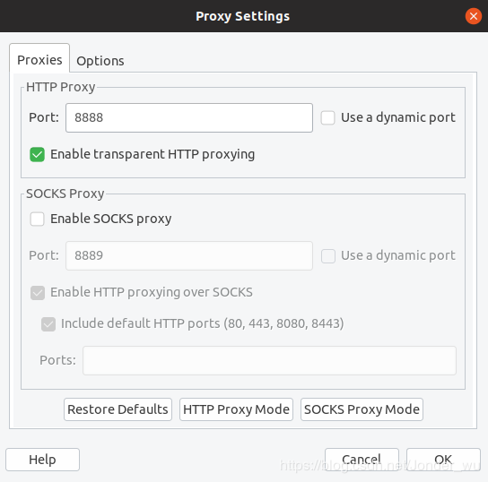

Linux 下好的软件

[TOC]
## 1、joplin笔记：
## 2、Charles

1. ```wget -q -O - https://www.charlesproxy.com/packages/apt/PublicKey | sudo apt-key add``
2. ```sudo sh -c 'echo deb https://www.charlesproxy.com/packages/apt/ charles-proxy main > /etc/apt/sources.list.d/charles.list'```
3. ```sudo apt update```
4. ```sudo apt install charles-proxy```
5. 注册码
   ```Registered Name: https://zhile.io ```
   ```License Key: 48891cf209c6d32bf4 ```
6. 证书安装
    - 保存charlesRoot.cer****(选择的是cer文件)
        - 运行charles软件，菜单Help->SSL Proxying->Save Charles Root Certificate…
        - 保存名为CharlesRoot.cer

    - 将cer转为pem格式的crt文件
    ```openssl x509 -inform der -in CharlesRoot.cer -outform pem -out CharlesRoot.crt```

    - 安装crt文件并更新ca-certificates
        ```sudo cp CharlesRoot.crt /usr/share/ca-certificates```
        ```sudo dpkg-reconfigure ca-certificates //选择ask,勾选CharlesRoot.crt并确认 ```

7.Charles配置
- 开启http代理

 运行charles软件，菜单Proxy->Proxy Setting->标签Proxies下勾选Enable transparent HTTP proxying

               

- 允许访问http和https协议
    在proxy>ssl proxy settings>Enable SSL Proxying, 然后add， host和 port都填 （如果出现抓https的包是unknown的话，一般

               是由于这个没设置），至此，服务端配置结束
               

8. 手机移动端与charles所在电脑在同一个局域网下
使手机跟charles所在电脑连在同个局域网，如果手机使用wifi，找到该wifi的高级设置，代理选择手动，代理服务器主机名填charles所在电脑的IP，可通过Help -> SSL Proxying -> Install Charles Root Certificate on a Mobile Device or Remote Browser查看，服务端口填8888

9. 手机端下载证书（先设置手机代理IP，再在这IP下下载证书)
浏览器中输入 chls.pro/ssl 来安装证书
ps. 会报安装失败，到系统设置->安全->从设备内在或sd卡安装证书来安装
注：若手机是iphone，安装完证书后，需要到设置-> 通用 -> 关于本机 -> 证书信任设置,打开证书信任

10. 抓包
在charles软件中Proxy –> Start Recording
