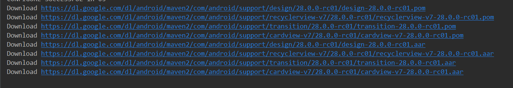
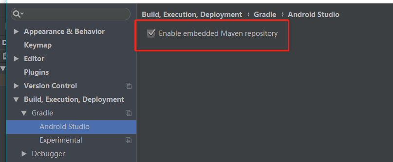

Android Studio

**源码查找：**
1、 找到本地 SDK／Sources 目录，当前电脑是D:/SDK/Sources复制一份 android-25 源码文件，并改名为 android-26
2、然后打开 android-26 文件夹，找到这两个文件：
package.xml 和 source.properties
替换二者内容中的 25 为 26，重启 AndroidStudio 即可。

当这些无法下载的时候，记得修改这个文件。

需要下载下面这个地址的module的时候，都需要加入google()

Build有错，文件下载不下来，maven相关的地址，查看错误：

## gradle编译不过过去：
1. 去掉代理
    去掉代理
    1. Android studio 设置里面去掉代理
    2. /home/Sun/.AndroidStudio3.6/config/options/proxy.settings.xml
   
2. 去[android](https://developer.android.com/studio/releases/gradle-plugin?hl=zh-cn)官网获取gradle的版本和插件版本.
3. 修改本地插件版本和gradle版本：
`MyApplication/gradle/wrapper/gradle-wrapper.properties` 里面的是gradle版本，在项目的build.gradle里面的`classpath 'com.android.tools.build:gradle:3.5.3'`是插件版本

4. 去掉这个文件里面的代理：
`/home/Sun/.gradle/gradle.properties`

5. 书签位置：
`~/.AndroidStudio4.0/config/workspace`