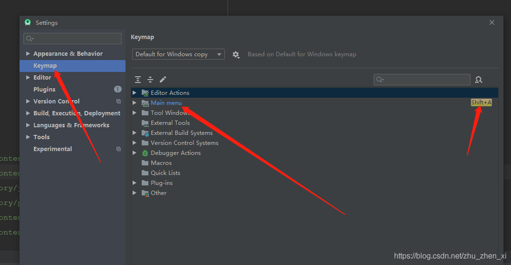

android studio File Edite等顶部的菜单栏找不到

[zhu\_zhen\_xi](https://blog.csdn.net/zhu_zhen_xi) 2020-03-12 11:40:18 294 收藏

文章标签： [前端](https://www.csdn.net/gather_2f/MtTaEg0sMzc5NzAtYmxvZwO0O0OO0O0O.html)

版权声明：本文为博主原创文章，遵循 [CC 4.0 BY-SA](http://creativecommons.org/licenses/by-sa/4.0/) 版权协议，转载请附上原文出处链接和本声明。

本文链接：[https://blog.csdn.net/zhu\_zhen\_xi/article/details/104815105](https://blog.csdn.net/zhu_zhen_xi/article/details/104815105)

版权

1、首先ctrl+alt+s调出setting  
2、然后给main menu右击添加一个快捷方式，保存  
  
3、在项目中使用自定义的快捷方式Shift+A  
4、然后按照下图勾选main menu调出即可  

-   点赞 1 
- [评论](#commentBox)
- 收藏
-   打赏
    
    打赏
    
    
    
    zhu\_zhen\_xi
    
    你的鼓励将是我创作的最大动力
    
    C币 余额
    
    ¥2 ¥4 ¥6 ¥10 ¥20 ¥50
    
    您的余额不足，请先充值哦～[去充值](https://i.csdn.net/#/wallet/balance/recharge)
    
-   举报
- 关注
- 一键三连
    
    点赞Mark关注该博主, 随时了解TA的最新博文

[*android* *studio* *顶部**菜单栏*消失了如何恢复](https://blog.csdn.net/c18871189293/article/details/105681525)

[常态丨的博客](https://blog.csdn.net/c18871189293)

04-22  1781 

[昨天碰到了一个很尴尬的问题，困扰了我很久，as*菜单栏*消失了！！！我都不知道不知道怎么操作的,我想clean、build、debug，creat、set*找**不到*地方了。发生这个问题的几率是有多大，整的我很难受，从没遇到过！！！然后上百度、google查*找*一番，关于这个问题的资料真的很少，可能遇到的几率真的是太小了吧！ 是的，就是它消失了！！！ 经过一番不懈努力，终于恢复了过...](https://blog.csdn.net/c18871189293/article/details/105681525)

[*Android*学习（二）*Android* *studio*下创建meun菜单的方法及问题](https://blog.csdn.net/myGFZ/article/details/53085178)

[myGFZ的博客](https://blog.csdn.net/myGFZ)

11-08  1万+ 

[1.在res上面右键->New->*Android* resource directory2.点击之后，出现下图Resource type选择menu，名字随便起,点击ok3.可以看到*菜单栏*已经出现了men4.menu上面右击，如下图选择：5.*file* name自己随便起,点击ok6.可以看到menu文件夹下,有一个main.XML文件，main是我起的文件名7.打开main.XML文件，在里面写入代码](https://blog.csdn.net/myGFZ/article/details/53085178)

添加代码片

- HTML/XML
- objective-c
- Ruby
- PHP
- C
- C++
- JavaScript
- Python
- Java
- CSS
- SQL
- 其它

还能输入*1000*个字符 “速评一下”

[*Android* *Studio*将不见的工具栏重新设置回来](https://blog.csdn.net/qq_32425789/article/details/82757024)

[YangZ的博客](https://blog.csdn.net/qq_32425789)

09-18  6234 

[版权声明：本文为博主原创文章，未经博主允许不得转载：https://mp.csdn.net/postedit/82757024 今天AS自带的工具栏回退按钮不见了，点了个函数跳到里面去，结果发现无法回退，搞得很烦，特意去网上查了下，记录一下贴上图片： 没有回退的工具栏样子：   点击：     结果： 推荐一个屏幕共享的工具：Synergy ,非常好用，记录一下这些...](https://blog.csdn.net/qq_32425789/article/details/82757024)

[*Android**Studio* Error:Please Select *Android* Sdk](https://blog.csdn.net/qq_23328607/article/details/77836075)

[Lizzza的博客](https://blog.csdn.net/qq_23328607)

09-04  775 

[Error:Please Select *Android* Sdk 同事更新*Android* Build Tools ，这个时候你pull下来代码发现这个错误 如果sdk路径没问题，那么还可能是以下两种问题造成解决方案： 第一种 1.查看当前buildToolsVersion 2.打开Project Structure 3.选择app->Properties-> BuildToolsVersi](https://blog.csdn.net/qq_23328607/article/details/77836075)

[*android* *studio* *File* *Edite*等*顶部*的*菜单栏**找**不到*_溪水...](https://blog.csdn.net/qq_28246519/article/details/104840850)

11-26

[*android* *studio* *File* *Edite*等*顶部*的*菜单栏**找**不到* 1、首先ctrl+alt+s调出setting 2、然后给main menu右击添加一个快捷方式,保存 3、在项目中使用自定义的快捷方式...](https://blog.csdn.net/qq_28246519/article/details/104840850)

[*Android* *Studio*的开发视图中,*顶部*工具栏不见了如何设置回来](https://blog.csdn.net/u010882634/article/details/50682845/)

10-30

[前段时间开发过程中不知道按了什么按钮,导致*Studio* 开发视图中,*顶部*的工具栏不见了。 变成了如下图的这种样式: 经过一番百度查*找*,终于*找*到了,将工具栏设置回来的...](https://blog.csdn.net/u010882634/article/details/50682845/)

[QT中三种构建*菜单栏*的方法](https://blog.csdn.net/liubing8609/article/details/90344370)

[《好好先生》专栏](https://blog.csdn.net/liubing8609)

05-21  985 

[QT中三种构建*菜单栏*的方法 方法1 《C++ GUI programming with Qt 4, Second Edition》给出的一种方法：QMenum定义单个菜单，调用menuBar（）函数创建*菜单栏*,再往*菜单栏*里添加子菜单、Action或其他dialog。 .h QMenu **file*; QMenu **edite*; QMenu \*help; QMenu \*...](https://blog.csdn.net/liubing8609/article/details/90344370)

[*Android* *studio* 解决libpng warning: iCCP: Not recognizing known sRGB pro*file* that has been *edite*d](https://blog.csdn.net/u010444171/article/details/51683595)

[等到天蓝再看海的专栏](https://blog.csdn.net/u010444171)

06-15  1744 

[*Android* *studio* 解决libpng warning: iCCP: Not recognizing known sRGB](https://blog.csdn.net/u010444171/article/details/51683595)

[*Android* *Studio*的开发视图中,*顶部*工具栏不见了如何设置...](https://blog.csdn.net/kaikevin01/article/details/79077963)

11-28

[前段时间开发过程中不知道按了什么按钮,导致*Studio* 开发视图中,*顶部*的工具栏不见了。 变成了如下图的这种样式: 经过一番百度查*找*,终于*找*到了,将工具栏设置回来的...](https://blog.csdn.net/kaikevin01/article/details/79077963)

[*Android* *Studio*开发视图中 *顶部*工具栏不见了如何设置回...](https://blog.csdn.net/qq_40626497/article/details/88125418)

11-24

[问题如下:*顶部*工具栏不见了,如何弄出来1.单击*菜单栏*中的view选项 ->Toolbar 即可2.完成效果](https://blog.csdn.net/qq_40626497/article/details/88125418)

[*Android* 文本输入框 获取焦点和设置光标到末尾](https://blog.csdn.net/Beyond0525/article/details/8947286)

[Beyond0525的专栏](https://blog.csdn.net/Beyond0525)

05-19  2万+ 

[例如做一个类似于短信发送的功能，从主界面进入短信界面 就获取短信文本框的焦点，并能将光标置于短信文本框中草稿文本的末尾： 你应该用requestFocus()获取焦点，用其他的设置好像总是有问题 mSmsEdit = (EditText) findViewById(R.id.messge_text); mSmsEdit.requestFocus();//get the focus 下面是设置](https://blog.csdn.net/Beyond0525/article/details/8947286)

[*android*中EditText如何设置取消自动聚焦的一种简单方法](https://blog.csdn.net/icycityone/article/details/17227881)

[icycityone的专栏](https://blog.csdn.net/icycityone)

12-09  2675 

[*android*中的EditText控件默认会自动获取焦点，每次进入带有EditText的控件的activity时，系统都会自动弹出软键盘，有时这种场景会使应用界面显得不太友好，取消弹出键盘的方法：           *android*:drawableLeft="@drawable/title"         *android*:inputType="phone"         androi](https://blog.csdn.net/icycityone/article/details/17227881)

[*Android* *studio* *菜单栏*搞不见了_tower888的专栏](https://blog.csdn.net/tower888/article/details/105892757)

12-3

[使用*Android* *studio*, 手贱把 *菜单栏*搞没了 解决: Ctrl+Alt+s进行设置---keymap--- 给Main Menu 设置一个快捷键,如shift+m](https://blog.csdn.net/tower888/article/details/105892757)

[*Android* *studio* 底部的状态栏不见了如何显示_张雨的博客](https://blog.csdn.net/yu540135101/article/details/83830409)

10-25

[*Android* *Studio*底边有一个选项栏,包含了Run,*Android*等等很多的选项,但是如果你一不小心不知道自己点到哪个地方了,底边选项栏不见了,如何调出来。很简单,如下图,地...](https://blog.csdn.net/yu540135101/article/details/83830409)

[*Android* ListView嵌套EditText错位的解决方法](https://blog.csdn.net/Lkyphoon/article/details/54573491)

[Lkyphoon的博客](https://blog.csdn.net/Lkyphoon)

01-16  1445 

[*Android* listview控件在*Android*项目的开发中使用是很频繁的，本意是用作信息展示的，但是在实际的开发中，可能会被赋予跟多的功能，比如嵌套edittext，做一个批量填写，虽然这样很方便，但是由于listview自身的复用特性，在使用的过程中，会出现填写的数据在滑动的过程中出现错位的情况。这就很让人头疼了，在网上搜索了一些解决方法，最普遍的就是通过设置标签来解决。本人也试过，确实可](https://blog.csdn.net/Lkyphoon/article/details/54573491)

©️2020 CSDN 皮肤主题: 深蓝海洋 设计师:CSDN官方博客 [返回首页](https://blog.csdn.net/)

- [关于我们](https://www.csdn.net/company/index.html#about)
- [招贤纳士](https://www.csdn.net/company/index.html#recruit)
- [广告服务](https://www.csdn.net/company/index.html#advertisement)
- [开发助手](https://plugin.csdn.net/)
- 400-660-0108
- [kefu@csdn.net](mailto:webmaster@csdn.net)
- [在线客服](https://csdn.s2.udesk.cn/im_client/?web_plugin_id=29181)
- 工作时间 8:30-22:00

- [公安备案号11010502030143](http://www.beian.gov.cn/portal/registerSystemInfo?recordcode=11010502030143)
- [京ICP备19004658号](http://beian.miit.gov.cn/publish/query/indexFirst.action)
- [京网文〔2020〕1039-165号](https://csdnimg.cn/release/live_fe/culture_license.png)
- [经营性网站备案信息](https://csdnimg.cn/cdn/content-toolbar/csdn-ICP.png)
- [北京互联网违法和不良信息举报中心](http://www.bjjubao.org/)
- [网络110报警服务](http://www.cyberpolice.cn/)
- [中国互联网举报中心](http://www.12377.cn/)
- [家长监护](https://download.csdn.net/index.php/tutelage/)
- [Chrome商店下载](https://chrome.google.com/webstore/detail/csdn%E5%BC%80%E5%8F%91%E8%80%85%E5%8A%A9%E6%89%8B/kfkdboecolemdjodhmhmcibjocfopejo?hl=zh-CN)
- ©1999-2020北京创新乐知网络技术有限公司
- [版权与免责声明](https://www.csdn.net/company/index.html#statement)
- [版权申诉](https://blog.csdn.net/blogdevteam/article/details/90369522)