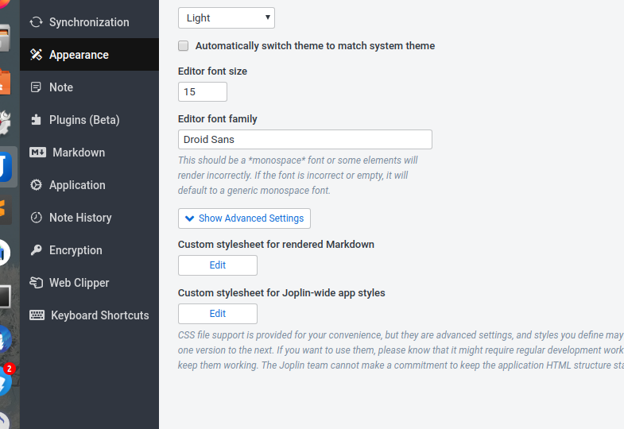

Joplin 修改markdown 格式

1. Tools -> options -> Apperance -> show Advanced Settings -> 第一个edit

	

2. 输入`@import '/home/sun/.config/joplin-desktop/github.css'`
后面css是`~/.config/Typora/themes/github.css`，可以把css和对应的文件夹拷贝到`joplin-desktop`文件夹里面，

3. 重启Joplin
