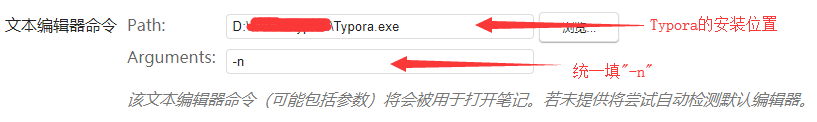

Joplin

---

Joplin + 坚果云

## 1.在浏览器中输入 `https://jianguoyun.com`，进入坚果云官网
## 2.在页面右上角点击注册，注册一个坚果云帐号
注册坚果云帐号

## 3.注册完成后在浏览器中输入https://jianguoyun.com 进入文件管理页面
管理页面

## 4.在页面左上角，点击「创建同步文件夹」-> 「新建个人同步文件夹」
创建同步文件夹

## 5.填写同步的文件夹名称为：Joplin。
填写同步的文件夹名称

## 6.点击「确定」创建同步文件夹，创建后可以看到页面左边多出了一个「GridDiary」的文件夹
完成创建同步文件夹

## 7.在页面右上角点击自己的用户名，选择「账户信息」。
账户信息

## 8.选择「安全选项」->「添加应用密码」
添加应用密码

## 9.在「添加应用密码」的名称中填写`Joplin`，以表明这个密码只在格志应用中使用。
添加应用密码

## 10.点击「生成密码」，生成一个随机的应用密码。注意生成密码后要保存到记事本上，以便待会儿使用。（如果忘记密码，可以重新生成一个）
生成应用密码，显示密码，再次点击密码复制。

## 11.回到joplin，添加应用密码
回到Joplin，工具->选项->同步->同步目标选择webdav

## 12.输入服务器地址、账户名和密码，点击右上角的「完成」按钮开始同步
服务器地址：如果你完全按照上面步骤设置坚果云，那么你的坚果云服务器地址是：`https://dav.jianguoyun.com/dav/Joplin`。其中`https://dav.jianguoyun.com/dav/[后缀名]`，里面的后缀名是在「步骤6」中创建的同步文件夹名称，并且文件夹名称是区分大小写的。
用户名：1033427175@qq.com
密码：步骤10中复制的密码

完成设置

## 13. JopLin + Typora

1. 打开Joplin，然后点击菜单栏的工具，在弹出的菜单中选择选项。在弹出的界面中如下填写

注意那个Typora的安装位置不一定在D盘，根据个人的安装情况而定。

2. Joplin使用外部编辑器
打开Joplin，并且打开我们想要编辑和浏览的笔记，然后使用快捷键“CTRL+E”便可以呼出Typora，并且你会发现我们选中的笔记正显示在打开的Typora中，这时候Joplin的格式菜单栏会显示“正在监控变化”

**需要记住的是，当我们操作完成（修改的笔记一定要保存）并关闭Typora后，记得点击“正在监控变化”按钮取消外部编辑模式。**

***这个方式图片不能很好的保存，在其他设备中看不到***

