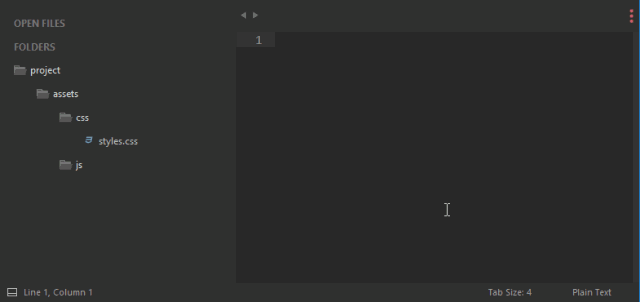
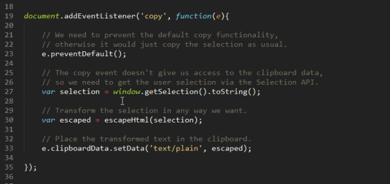

Sublime

    1. wget -qO - https://download.sublimetext.com/sublimehq-pub.gpg | sudo apt-key add -

    2.sudo apt-get install apt-transport-https

    3.echo "deb https://download.sublimetext.com/ apt/stable/" | sudo tee /etc/apt/sources.list.d/sublime-text.list

    4.sudo apt-get update

    5.sudo apt-get install sublime-text

**Linux 版本安装：**
1、下载：https://www.sublimetext.com/3
2、安装package control :
ctrl + `
输入：import urllib.request,os,hashlib;
h = '6f4c264a24d933ce70df5dedcf1dcaee' + 'ebe013ee18cced0ef93d5f746d80ef60';
pf = 'Package Control.sublime-package';
ipp = sublime.installed_packages_path();

urllib.request.install_opener( urllib.request.build_opener( urllib.request.ProxyHandler()) );

by = urllib.request.urlopen( 'http://packagecontrol.io/' + pf.replace(' ', '%20')).read();

dh = hashlib.sha256(by).hexdigest();

print('Error validating download (got %s instead of %s), please try manual install' % (dh, h)) if dh != h else open(os.path.join( ipp, pf), 'wb' ).write(by)

3、安装完成后，重启sublime

***问题：***
**1、Deepin 下面安装sublime不能输入中文**
**（参考：**https://bbs.deepin.org/forum.php?mod=viewthread&tid=32753**）：**
1、先去下载sublime-text-imfix(  https://github.com/lyfeyaj/sublime-text-imfix)
2、可以直接使用他编译好的so库，也可以自己利用他的源码重新编译，重新编译需要安装libgtk2.0-dev。
     sudo apt-get install libgtk2.0-dev

     gcc -shared -o libsublime-imfix.so sublime_imfix.c `pkg-config --libs --cflags gtk+-2.0` -fPIC

3、拷贝so库到/opt/sublime_text（这个文件夹在安装sublime时应该有用到。）
    cp libsublime-imfix.so /opt/sublime_text/
4、修改启动文件/usr/bin/subl，修改为如下：
     #!/bin/sh
     cd /opt/sublime_text/
     LD_PRELOAD=./libsublime-imfix.so /opt/sublime_text/sublime_text "$@"

     **使用 cd 和相对路径，而不是绝对路径，是因为使用绝对路径后，sublime 菜单中的 Preferences—Browse Packages会无法使用，目前原因未知

5、修改桌面文件/usr/share/applications/sublime-text.desktop
将含有Exec的三条替换为：
     Exec=subl %F
     Exec=subl -n
     Exec=subl --command new_file

**2、中文显示乱码：**
Sublime Text 默认的编码格式为 UTF-8，GBK 格式打开就会中文乱码，安装插件ConvertToUTF8 和Codecs33。

打开install package（ctrl + shift + p），输入install package，再分别输入ConvertToUTF8 和Codecs33回车即可。

**3、Sublime左侧显示文件夹详情：**
View->Side Bar -> show Side Bar

***插件安装：***
**ctrl + shift +p  然后选择 install package ，安装以下包：**

**1、Advanced New File**

这个牛X的软件包可以快速创建新文件。你无需浏览文件件或点击菜单，只要打开 win+alt+n 提示，然后将路径写给新文件即可。该插件能自动创建路径中不存在的目录，还能自动补全文件名称。

**2、Git**

在 Sublime Text 的命令行面板上，Git 集成可以直接进行工作。这个包提供了快速访问大量 Git 的常用命令，它允许开发者直接添加文件，提交或者打开 Git 日志，而不需要离开 Sublime。使用：ctrl +shift + p ，输入git

**3、GitGutter**

这是非常有用的扩展，它标记了源代码的每一行，告诉你，它的 Git 状态，还给出了你一个发生了的变更梗概。GitGutter 还可以将，git 的HEAD，origin，你选择的分支，或者甚至是某一次的提交与你的文件进行比较。

**4、Side Bar Enhancement**

你正在 Sublime Text 中处理的项目工程可以在左侧的面板中进行概览。尽管它给你提供了一些操作文件的选项，但是可选的操作相当有限。该插件通过向右键菜单增加了超过20多个选项来改变了这一现状, 其中就包括了在浏览器中打开（*Open in browser）*,复制（*duplicate）*, 以及许多其它的实用功能。

**5、DocBlockr**
DocBlockr 可轻松为函数生成描述，包括它们所运用的参数，返回的值和变量类型。非常适合那些喜欢给函数定义添加详细描述的用户。

**6、SublimeCodeIntel**
代码智能插件会对你的源代码文件进行索引，让你能快速的找到并跳转到函数的声明。该扩展对于流行较广以及不那么流行的编程语言都比较适用。

**7、Sublime Linter**

这个包让代码编辑器能够对语法错误，不好的编码实践以及其它一些开发人员可能会犯的错误进行检查。SublimeLinter 本身所扮演的只是一个检查功能的基础框架，所以针对你所使用的每种语言，还需要安装单独的插件。

## 8、 选中一行
Ctrl + L

## 9、恢复关闭的标签页面
Ctrl + shift + T

