Sublime Text 插件推荐

Package Control

  

**链接:**

**packagecontrol.io/packages/Package%20Control**

这是 Sublime 的插件管理器，可以为安装和删除软件包带来方便。如果你尚未安装此插件，建议先安装，以便于试用文中提及的其他插件。

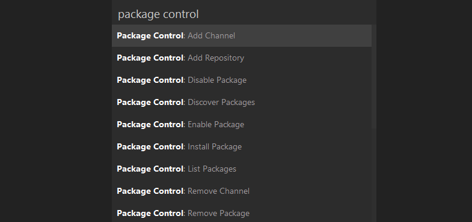

JavaScript & NodeJS Snippets

  

**链接****:**

**packagecontrol.io/packages/JavaScript%20%26%20NodeJS%20Snippets**

这是用以编写常见 JavaScript 表达式的快捷方式集合。不用编写 document.querySelector('selector')，你只需键入 qs，按下 Tab 键，Sublime 就能帮你完成其余的工作。

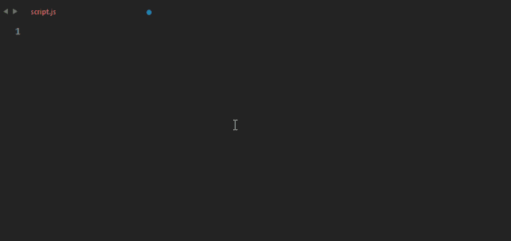

Emment

  

**链接****:packagecontrol.io/packages/Emmet**

与前面提到的插件类似，这是一组专门用来提高书写代码速度的便利工具，不同之处在于 Emmet 适用于 HTML 和 CSS 。将它整合进文本编辑器，可以提供一些功能和快捷方式，加快开发速度。它提供包括 Eclipse、IDEA、UltraEdit、SlickEdit 等的插件。

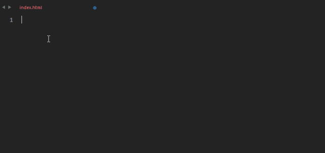

Advanced New File

  

**链接:packagecontrol.io/packages/AdvancedNewFile**

这个牛X的软件包可以快速创建新文件。你无需浏览文件件或点击菜单，只要打开 super+alt+n 提示，然后将路径写给新文件即可。该插件能自动创建路径中不存在的目录，还能自动补全文件名称。

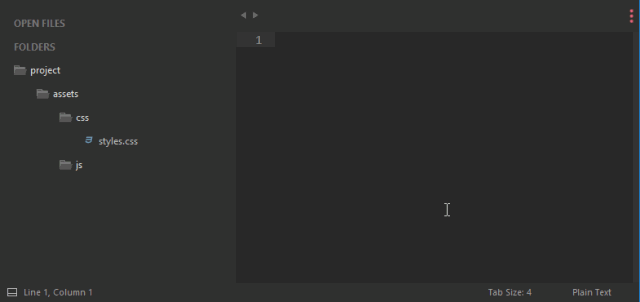

Git

******链接****:packagecontrol.io/packages/Git**

在 Sublime Text 的命令行面板上，Git 集成可以直接进行工作。这个包提供了快速访问大量 Git 的常用命令，它允许开发者直接添加文件，提交或者打开 Git 日志，而不需要离开 Sublime。

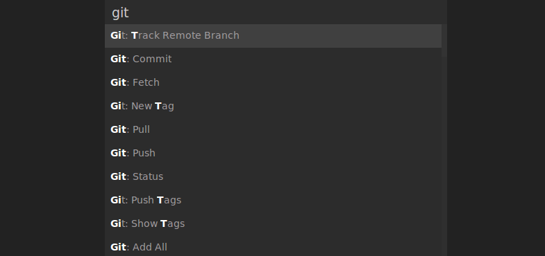

GitGutter

******链接****:packagecontrol.io/packages/GitGutter**

这是非常有用的扩展，它标记了源代码的每一行，告诉你，它的 Git 状态，还给出了你一个发生了的变更梗概。GitGutter 还可以将，git 的HEAD，origin，你选择的分支，或者甚至是某一次的提交与你的文件进行比较。

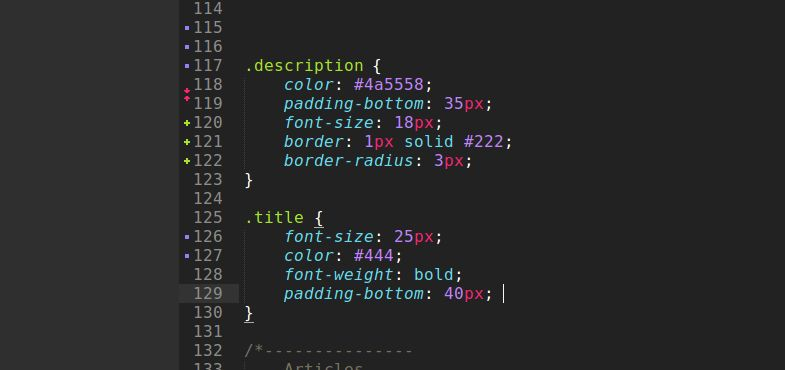

Side Bar Enhancement

********链接******:**

**packagecontrol.io/packages/SideBarEnhancements**

你正在 Sublime Text 中处理的项目工程可以在左侧的面板中进行概览。尽管它给你提供了一些操作文件的选项，但是可选的操作相当有限。该插件通过向右键菜单增加了超过20多个选项来改变了这一现状, 其中就包括了在浏览器中打开（*Open in browser）*,复制（*duplicate）*, 以及许多其它的实用功能。

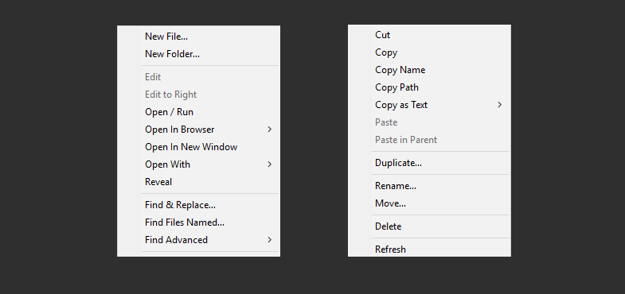

ColorPicker

  

********链接******:packagecontrol.io/packages/ColorPicker**

这是一个小巧实用的颜色拾取器，很容易上手，非常适合用来快速地抓取颜色的16进制值。插件会打开一个独立的窗口，你可以从一个调色板上选择一种颜色，或者使用滴管直接从屏幕上的任何位置拾取颜色。

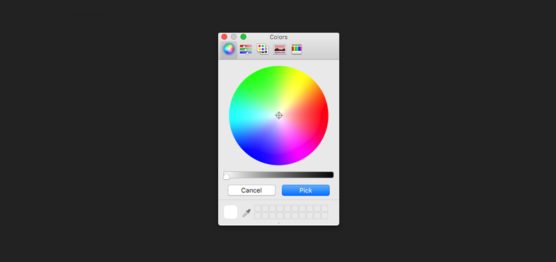

DocBlockr

  

**链接:packagecontrol.io/packages/DocBlockr**

DocBlockr 可轻松为函数生成描述，包括它们所运用的参数，返回的值和变量类型。非常适合那些喜欢给函数定义添加详细描述的用户。

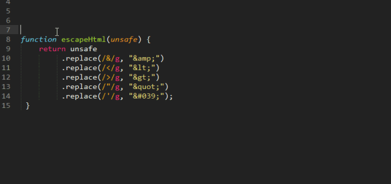

SublimeCodeIntel

  

**链接****:packagecontrol.io/packages/SublimeCodeIntel**

代码智能插件会对你的源代码文件进行索引，让你能快速的找到并跳转到函数的声明。该扩展对于流行较广以及不那么流行的编程语言都比较适用。

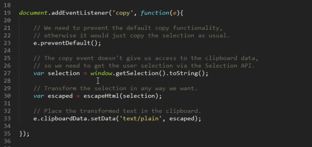

Sublime Linter

  

**链接****:packagecontrol.io/packages/SublimeLinter**

这个包让代码编辑器能够对语法错误，不好的编码实践以及其它一些开发人员可能会犯的错误进行检查。SublimeLinter 本身所扮演的只是一个检查功能的基础框架，所以针对你所使用的每种语言，还需要安装单独的插件。

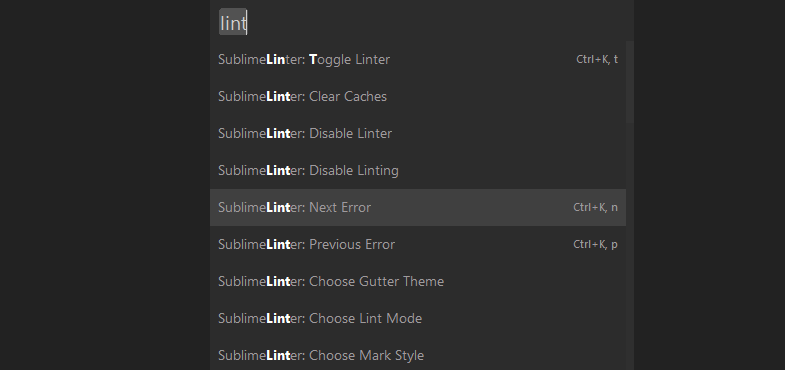

Color Highlighter

  

******链接****:https://www.mathcha.io/editor**

这是一项你可以在许多其它的IDE或者文本编辑器中看到的功能, 但是 Sublime 里面却没有, 它就是着色预览功能。使用 Color Highlighter 扩展，你就能在 ST 中启用该功能了, 然后就可以直接在样式表中看到十六进制和 RGBA 值是如何被转成颜色的。

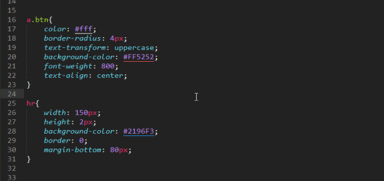
