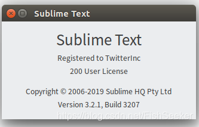

破解sublime


[FishSeeker](https://blog.csdn.net/FishSeeker) 2019-06-03 11:10:23 2240 <a id="blog_detail_zk_collection"></a>收藏 6 

最后发布:2019-06-03 11:10:23首次发布:2019-06-03 11:10:23

版权声明：本文为博主原创文章，遵循 [CC 4.0 BY-SA](http://creativecommons.org/licenses/by-sa/4.0/) 版权协议，转载请附上原文出处链接和本声明。

最近这几个月都在忙论文的事，基本上没有写博客，今天终于差不多整完了，开始修电脑。前阵子sublime总是有一些稀奇古怪的问题，所以今天就更新一下，主要是解决注册的问题。我们的sublime版本是version3.2.1 build 3207  
从 [https://www.abbeyok.com/archives/337](https://www.abbeyok.com/archives/337) 这里学的，并另外解决了一些小问题

[http://www.sublimetext.com/](http://www.sublimetext.com/) 当然是从官方网站下载对应的版本了，我们这里选择ubuntu，然后会有一些教程教你怎么用apt装，ubuntu的主要命令如下，其他的自行学习

```
wget -qO - https://download.sublimetext.com/sublimehq-pub.gpg | sudo apt-key add -
sudo apt-get install apt-transport-https
echo "deb https://download.sublimetext.com/ apt/stable/" | sudo tee /etc/apt/sources.list.d/sublime-text.list
sudo apt-get update
sudo apt-get install sublime-text

```

这样直接`subl` 启动就可以了，但是需要注册。

以前的话只需要修改hosts就可以了，现在新版不太行了，需要以下操作

## <a id="t3"></a><a id="t3"></a><a id="_22"></a>修改可执行文件

1.  进入：[https://hexed.it/](https://www.abbeyok.com/go/?url=https://hexed.it/)
2.  点击“Open file”，然后选择“sublime_text”这个可执行文件（如果用apt装的应该在`/opt/sublime_text` 下）
3.  选择右侧的“Search”，然后在“Search for”框输入“97 94 0D”，点击“Search Now”
4.  下面就会出现一个搜索结果
5.  然后点击搜索结果定位到那一行，把“97 94 0D”改成“00 00 00”
6.  然后点选上方的"Export"再次输出成二进制文件
7.  然后用这个修改过的文件替换原来文件夹里的那个sublime_text文件
8.  输入`sudo chmod 755 sublime_text` ，否则会报什么权限错误。

## <a id="t4"></a><a id="t4"></a><a id="hosts_33"></a>修改hosts

```
127.0.0.1 www.sublimetext.com
127.0.0.1 sublimetext.com
127.0.0.1 sublimehq.com
127.0.0.1 telemetry.sublimehq.com
127.0.0.1 license.sublimehq.com
127.0.0.1 45.55.255.55
127.0.0.1 45.55.41.223
0.0.0.0 license.sublimehq.com
0.0.0.0 45.55.255.55
0.0.0.0 45.55.41.223

```

把以上内容复制到`/etc/hosts` 的最后，为了防止sublime验证

## <a id="t5"></a><a id="t5"></a><a id="_50"></a>注册

```
----- BEGIN LICENSE -----
TwitterInc
200 User License
EA7E-890007
1D77F72E 390CDD93 4DCBA022 FAF60790
61AA12C0 A37081C5 D0316412 4584D136
94D7F7D4 95BC8C1C 527DA828 560BB037
D1EDDD8C AE7B379F 50C9D69D B35179EF
2FE898C4 8E4277A8 555CE714 E1FB0E43
D5D52613 C3D12E98 BC49967F 7652EED2
9D2D2E61 67610860 6D338B72 5CF95C69
E36B85CC 84991F19 7575D828 470A92AB
------ END LICENSE ------

```

这里大概随便的注册码都可以了，所以就复制上面的然后注册就好啦

有图有真相：  
