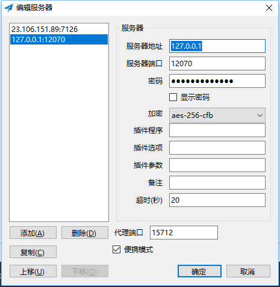

租赁vps 安装vpn

ip：69.171.79.229
port:26526
password:C8pCM5gSxayk

[TOC]

# 服务端
1. vps安装系统
2. 远程登录ssh，如果以前有保留VPS登录信息，需要
rm /home/sun/.ssh/known_hosts
3. 登录上去之后需要 passwd 修改密码，修改完之后修改本地保存的密码
4. 安装VPS，[参考](https://github.com/shadowsocks/shadowsocks/wiki/Shadowsocks-%E4%BD%BF%E7%94%A8%E8%AF%B4%E6%98%8E#%E6%9C%8D%E5%8A%A1%E5%99%A8%E6%90%AD%E5%BB%BA)

- Debian / Ubuntu
    ```
    apt-get install python-pip
    pip install shadowsocks
    ```
- CentOs:
    ```
    yum install python-setuptools && easy_install pip
    pip install shadowsocks
    ```
   
5. 启动：
- 直接启动方式（-d start 表示后台运行）：
`sudo ssserver -p 443 -k password -m rc4-md5 --user nobody -d start`

- 使用配置文件
先生成shadowsocks的配置文件：/etc/shadowsocks.json
    ```json
    {
        "server":"服务器IP",
        "server_port":15712,
        "local_address": "127.0.0.1",
        "local_port":1080,
        "password":"mypassword",
        "timeout":300,
        "method":"aes-256-cfb",
        "fast_open": false
    }
    ```
- 再利用配置文件打开时，使用命令：
    - 前台打开：
        `ssserver -c /etc/shadowsocks.json`
    - 后台打开
        `ssserver -c /etc/shadowsocks.json -d start`
        `ssserver -c /etc/shadowsocks.json -d stop`


*这个也打不开，只有部分机型能打开这个功能
安装时注意启动TCP Fast Open
1、设置上面的/etc/shadowsocks.json 中的fast_open 为true
2、echo 3 > /proc/sys/net/ipv4/tcp_fastopen（没有这个文件就是不适用这个功能）*

**到这边服务端就搭建完成了**

# 查询链接用户数：
```
netstat -anp | grep 'ESTABLISHED'| grep 'python'|grep 'tcp' |awk '{print $5}'|awk -F ":" '{print $1}' | sort -u
```


# 客户端的配置：
## deepin（Ubuntu）
1. `pip install shadowsocks`（`Ubuntu`下也可能是`sudo apt install shadowsocks`）
2. `vim /home/sun/shadowsocks.json`
```
{
"server":"服务器IP ",
"local_address": "127.0.0.1",
"local_port":1080,
"server_port":15712,
"password":"mypassword",
"timeout":300,
"method":"aes-256-cfb"
}
```
3. 启动 `sudo sslocal -c shadowsocks.json -d start`
*如果出现错误：*
```
AttributeError: /usr/lib/x86_64-linux-gnu/libcrypto.so.1.1: undefined symbol: EVP_CIPHER_CTX_cleanup
```
*修改如下：*
修改文件`/usr/local/lib/python2.7/dist-packages/shadowsocks/crypto/openssl.py`
修改
`libcrypto.EVP_CIPHER_CTX_cleanup.argtypes = (c_void_p,)`
为
`libcrypto.EVP_CIPHER_CTX_reset.argtypes = (c_void_p,)`

修改
`libcrypto.EVP_CIPHER_CTX_cleanup`
为
`libcrypto.EVP_CIPHER_CTX_reset`

参考：
[安装shadowsocks客户端](http://www.jeyzhang.com/how-to-install-and-setup-shadowsocks-client-in-different-os.html)

4、开启全局代理

下面的一定要改，否则无效
```
127.0.0.1
[::1]
localhost
```
# 浏览器使用

## 应用商店下载SwitchyOmega。
1. 左侧新建情景模式（不确定保存的地方，可以点击右上角的更改名称，再选择应用选项。***注意代理协议***）

2. 设置auto_switch模式


# windows 10
1. 下载 [shadowsocks](https://github.com/shadowsocks/shadowsocks-windows/releases)

2. 安装

3. 配置


# Android Studio配置


# Android 设备安装
[参考shadowsocks android设备安装](https://github.com/shadowsocks/shadowsocks-android/releases)

# Linux 无界面安装（全局代理）
`privoxy`做全局代理，会将所有的请求转发给`shadowsocks`或者`SSR`。需要用到环境变量`http_proxy`和`https_proxy`。

## ubuntu
1. sudo apt intall shadowsocks
2. 配置参考上面的deepin的配置
3. `/usr/bin/sslocal -c /etc/shadowsocks/shadowsocks.json -d start`
4. `sudo apt install privoxy`
5. `vim /etc/privoxy/config`
需要有如下几个配置，其中前两行已有，请确认
```
listen-address  127.0.0.1:8118
listen-address  [::1]:8118
forward-socks5t   /               127.0.0.1:7126 .
forward-socks5    /               127.0.0.1:7126 .
```
6. `service privoxy start`
7. `vim /etc/profile` 加上如下两行（`/etc/profile`通常写入需要开机初始化的环境变量）
```
export http_proxy=http://127.0.0.1:8118
export https_proxy=http://127.0.0.1:8118
```
8. 使其生效
`source /etc/profile`
9. 测试是否生效
`curl www.google.com`
或者
`curl ip.gs`

## MAC
1. 下载客户端，https://github.com/shadowsocks/ShadowsocksX-NG/releases
2. 配置客户端，下图右边的服务器中配置服务器，左侧图中的高级中，配置本地接口
3. 命令行中使用VPN，使用http代理
```
export http_proxy=http://127.0.0.1:1207;
export https_proxy=http://127.0.0.1:1207;
//取消代理
unset http_proxy
unset https_proxy
```


其中端口可以在如下中找到


# kcptun 加速
## 服务端：

kcptun服务端设置的端口是1207
1. 安装服务端`kcptun`及配置相关信息
```
wget https://raw.githubusercontent.com/kuoruan/kcptun_installer/master/kcptun.sh
chmod +x ./kcptun.sh
./kcptun.sh
```
服务端配置文件路径：`/usr/local/kcptun/server-config.json`

## 客户端
1. windows客户端
    - 安装：
        [KCP 下载链接](https://github.com/xtaci/kcptun/releases)
    
    - 安装客户端管理配置
        [KCP 管理配置下载链接](https://github.com/dfdragon/kcptun_gclient/releases)
    - 配置
    ```
    {
        "listen": ":12071",
        "target": "服务器ip:端口",
        "key": "mypassword",
        "crypt": "aes-128",
        "mode": "fast2",
        "mtu": 1024,
        "sndwnd": 1024,
        "rcvwnd": 1024,
        "datashard": 10,
        "parityshard": 3,
        "dscp": 1,
        "nocomp": true,
        "quiet": false,
        "pprof": true
    }
    ```
    - 配置 kcptun配置管理工具：

    - 配置shadowsocks


**为降低实际消耗流量参考下面的配置，主要修改sndwnd和rcvwnd的值**


2. [路由器刷kcptun](https://cyhour.com/479/)（待测试）
3. 安装[kcptun-android](https://github.com/shadowsocks/kcptun-android) **注意：这边只是安装了kcptun插件！！没有界面化的东西
配置**
    - 点击shadowsocks右上角的+号，以添加配置，选择手动设置
    - 拉到最下，插件选择kcptun
    - 修改最下面的配置（具体值对应到kcptun服务端的设置）：
```
dscp=46;parityshard=2;key=*********;mode=normal;remoteaddr=ip:port;nocomp;mtu=1400;datashard=10;rcvwnd=1024;sndwnd=341;crypt=aes-128
```

中间如果出了什么问题，查日志，分析！！！别他妈傻逼似的瞎碰！！！
服务端日志，kcptun:/var/log/kcptun/server.log   shaowsocks:/var/log/shadowsocks.log

如果突然出现问题，可以尝试更换shadowsocks监听的端口

Linux停止客户端
```
ps -ef | grep sslocal | awk ‘{print $2}’ | xargs kill -9
```

# SSR 服务端
## 一键解决方式：
https://github.com/ToyoDAdoubi/doubi#ssrsh

## 加速
### 魔版BBR：
```
wget --no-check-certificate -qO 'BBR.sh' 'https://moeclub.org/attachment/LinuxShell/BBR.sh' && chmod a+x BBR.sh && bash BBR.sh -f

wget --no-check-certificate -qO 'BBR_POWERED.sh' 'https://moeclub.org/attachment/LinuxShell/BBR_POWERED.sh' && chmod a+x BBR_POWERED.sh && bash BBR_POWERED.sh
```
地方封锁严重的，如校园网、企业网，推荐使用的协议：`auth_aes128_md5`或`auth_aes128_sha1`。混淆值：`http_simple`与`tls1.2_ticket_auth`

## ssr配置：
`/root/ssrmu.sh`
[参考](https://www.zfl9.com/ssr.html)

# SSR 客户端
## Ubuntu
> ** 慎用！！！这个副作用会自动创建虚拟网桥，会让那个虚拟网桥ip下面的机器不能使用网络。**
```
# 删除网桥的方式
# 查看ip
ifconfig -a
# 查看网桥
brctl show
# 关闭网桥(virbr0是为上面网桥名称)
ifconfig down virbr0
# 禁止libvirtd 开机启动
systemctl disable libvirtd.service
sudo apt-get remove --purge dnsmasq-base
```
### [界面版本--good](https://github.com/judasn/Linux-Tutorial/blob/master/markdown-file/SSR-Client-Ubuntu.md)
1. 开启全局代理后，ubuntu系统设置->网络->选择手动：
    
    
2. 开启pac代理之后，ubuntu系统设置->网络->选择自动：
url设置为：`http://127.0.0.1:2333/proxy.pac`

3. 以上设置提到的端口都是在该软件中设置
右键图标->配置->选项配置，其中
    1. pac端口设置的是2中的端口，
    2. http代理端口设置是1中的前三个端口
    3. 本地监听端口设置是Socks主机端口
下图的配置对应了上图中手动设置：
    
以上配置，都会在软件重新启动时自动更新。

**以上配置对终端还是不起作用，终端代理还需要使用下面的命令**
```
export http_proxy=http://127.0.0.1:1207;
export https_proxy=http://127.0.0.1:1207;
//取消代理
unset http_proxy
unset https_proxy
```
## 配置ubuntu 终端，使在终端访问外网
参考上文（Linux 无界面安装（全局代理））


*使用`curl ip.gs`查看使用vpn之后IP的比较*


## 使chrome能够访问外网，参考上文（浏览器使用）


